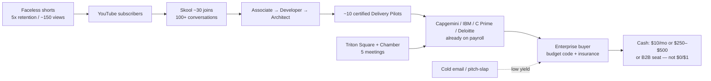

# 🎙️ AI Cohort Session 10: Follow the Money, B2C→B2B, and Simplicity Report

**Report Version:** 1.0.0  
**Date:** 2026-08-30  
**Source Artifacts:** `3_Simulation/Cohorts/cohort 10 Summary.pdf`, `3_Simulation/Cohorts/formatted transcript  cohort 10.pdf`  
**Participants:** Rifat Erdem Sahin (Founder/Host), Mariana (Enterprise Testing Lead & Researcher), Chidi (first named Skool student; Goldman Sachs colleague; AWS-certified practitioner)  
**Mentioned off-call:** Ilker (Google/YouTube community builder, B2C→B2B language), Faruk (ops must-haves), Samit (Clayton Hotel / incubator follow-up)  
**Related Hypotheses:** [H2](../5_Symbols/hypotheses/hyp-h2.html), [H4](../5_Symbols/hypotheses/hyp-h4.html), [H5](../5_Symbols/hypotheses/hyp-h5.html), [H8](../5_Symbols/hypotheses/hyp-h8.html), [H12](../5_Symbols/hypotheses/hyp-h12.html), [H22](../5_Symbols/hypotheses/hyp-h22.html), [H24](../5_Symbols/hypotheses/hyp-h24.html), [H25](../5_Symbols/hypotheses/hyp-h25.html), [H29](../5_Symbols/hypotheses/hyp-h29.html), [H30](../5_Symbols/hypotheses/hyp-h30.html)

**OCR note:** The formatted transcript PDF splits words and mislabels speakers. Corrected in this report: *Adam* → Rifat, *school* → Skool, *Entropic* → Anthropic, *cloth* → Claude, *Ilhar/Ilkhar* → Ilker. Quotes below are cleaned for readability, not invented.

Not a paid enrollment. $0 Peek / $1 Sit In do not count toward H5/H9.

---

## 1. Executive Summary

Session 10 ran as a thin Sunday room (founder opened with “nobody joined,” then Mariana and Chidi carried the call). The content was not another architecture demo. It was a **money-path interrogation**.

### Key Takeaways
1. **Faceless shorts are working as a Skool top-of-funnel ([H2](../5_Symbols/hypotheses/hyp-h2.html), [H4](../5_Symbols/hypotheses/hyp-h4.html), [H5](../5_Symbols/hypotheses/hyp-h5.html)):** Summary PDF: ~**5× viewer retention**. Founder: one core-message short ~150 views; “30 times more” vs prior; **~30 people joined Skool**; **100+ conversations on Skool** that YouTube comments never produced. Goal is students into Delivery Pilot, not YouTube ad monetization. Chidi’s January watch-hours gate (4,000 → 8,000) is explicitly not the KPI.
2. **B2C→B2B is named, not operationalized ([H12](../5_Symbols/hypotheses/hyp-h12.html), [H22](../5_Symbols/hypotheses/hyp-h22.html), [H30](../5_Symbols/hypotheses/hyp-h30.html)):** Ilker’s language: this is not a B2C business; people certify, become Delivery Pilots / independent contractors, then get positioned into enterprises (AstraZeneca named as *example*, not a live deal). Chidi walked the value stream: *who is the purchasing person, who has the budget code, how do we get on the books?* C Prime’s sales function is described as weak. Capgemini / IBM / Deloitte already sit on payroll systems. Cold email is low-yield.
3. **Complexity is still the founder’s bottleneck ([H24](../5_Symbols/hypotheses/hyp-h24.html), [H29](../5_Symbols/hypotheses/hyp-h29.html)):** Mariana: *“Your main obstacle is complexity. Go to the simplicity.”* Chidi: *“You’re a Ferrari, I’m just a golf… fire hose.”* Founder feasibility agent scored 35 → 50 → **48** as more ideas were added.
4. **Cert ladder is live in the community ([H8](../5_Symbols/hypotheses/hyp-h8.html), [H25](../5_Symbols/hypotheses/hyp-h25.html)):** People are **not** jumping to Architect Professional. Associate (prompting) → Developer (working MCP server) → Architect. Founder pipeline: 7 days → ~70 minutes to assemble the architect toolchain.
5. **UK enterprise access is networking, not pitch-slap ([H12](../5_Symbols/hypotheses/hyp-h12.html)):** Mariana: emails do not work; meet people **at least five times**; British Chamber of Commerce; Anthropic / Venture Café at Triton Square; Deloitte incubator / Samit near Clayton Hotel.

---

## 2. Participant Profiles & Discovery Signals

| Participant | Persona | Core friction | Proposed path | Hypothesis |
| :--- | :--- | :--- | :--- | :--- |
| **Mariana** | Enterprise testing lead; 10+ years training (Ukraine); first Skool student in founder’s telling | Founder enjoys complexity; pain-led websites do not attract; UK buyers buy from personal networks | One-page simplicity; education-based sales (light); chamber / community presence | H24, H29, H12 |
| **Chidi** | First named Skool student; Goldman Sachs colleague; AWS 5-cert early adopter; faceless-shorts advocate | B2B placement is a slogan until payroll, insurance, budget codes, and partner sales are mapped | Next Sunday topic = **how we make money**; Toyota Corolla / Uber-license metaphor | H12, H22, H30, H5 |
| **Rifat** | Founder / FDE contractor | Firehose pace; idea-stack lowers feasibility score; Sunday room thin this week | Play *into* partners (C Prime / Capgemini / IBM) with ~10 certified people as a BD unlock; keep shorts shipping | H4, H5, H29, H30 |

### Listen:speak (H29)

Cleaned transcript word counts: **Rifat ~42%**, **Chidi ~42%**, **Mariana ~16%**. Founder did not dominate the room because Chidi ran a structured interrogation. Still below the 2:1 listen:speak target, and Chidi had to say “slow down” more than once.

---

## 3. Verbatim Voice of Customer

**Mariana — simplicity**
> “The main your main obstacle is to complexity. Go to the simplicity. Be as simple as possible. This is your task… Adam do simple things.”

**Mariana — UK networking**
> “In the UK, networking and personal communication is the key… you have to go and to meet them at least five times. Before there is a probability that they will listen to your idea.”

**Mariana — communities vs email**
> “Emails, they don’t work anymore… Communities give you the access to personality… if you want to get to biggest enterprises, you can go to British Chamber of Commerce.”

**Mariana — technical fun vs business result**
> “Technical people… have so much of fun enjoying their knowledge and their ability to do complicated things that they don’t remember about the reality… The main fear of businesses is just to get a real result.”

**Chidi — end goal**
> “What’s the aim? Is the aim to build a community and teach them how to make money with AI, or build a community and get people to be able to be employable in the marketplace? What’s the end goal?”

**Chidi — fire hose**
> “Slow down, slow down, slow down, Rifat. You know how fast you go. You’re a Ferrari, I’m just a golf… You know when you drink water from the fire hose, they’ll just be overwhelmed.”

**Chidi — payroll reality**
> “The challenge now is going to be to get onto the payroll systems of these big organizations. They want insurance. They want accounts. They want all those kind of indemnities… That’s why Cap Gemini and all those guys, they’re already on the system.”

**Chidi — follow the money (next Sunday)**
> “Next weekend, let the topic please… how we make money… If I have a brand new Toyota Corolla outside, it is the vehicle, that’s AI. But unless I go and get my Uber license and go out and get customers, no money will come in.”

**Rifat — B2C to B (Ilker)**
> “This is not a B2C business. This is B2C to B business… people come in here, they understand the importance of certification, they create a community, then we use those killers, we use those delivery pilots… convert them from C to B.”

**Rifat — Skool vs YouTube**
> “I got conversations into 100 plus conversations. I was unable to get the conversations on YouTube… On school, I started to get interaction with the people.”

---

## 4. Architecture of the Money Path (as debated)

Chidi’s kill test: until the partner / payroll / budget-code step is a written procedure, the Toyota is parked. Session 10 does **not** validate H12 or H22. It names the missing procedure.

---

## 5. Master Action Items & To-Do Checklist

Copied from the summary PDF and the live interrogation. Tracked on `5_Symbols/dashboard/todo.html`.

### Strategy & business model
- [ ] **Map direct B2B monetization pathways:** mechanics, pricing, and offer for placing certified candidates with enterprise clients or channel partners (H12 / H22). Not a paid enrollment until cash hits $10/mo or $250–$500.
- [ ] **Name the four Anthropic tracks on one page:** Associate, Developer, Architect Foundations, Architect Professional — with who starts where (H8 / H25).
- [ ] **Simplify the core value proposition to ROI:** operational efficiency and a business result, not frameworks (H24). One sheet of paper, per Mariana.

### Outreach & networking
- [ ] **Follow up Deloitte incubator / Samit (Clayton Hotel, Station Road):** scheduled contact, not another idea (H12 / H17).
- [ ] **Keep Triton Square / Anthropic Venture Café Thursday:** face-to-face core message, then listen (H5 / H29).
- [ ] **Add British Chamber of Commerce and HR/exec forums** to watering holes (Mariana). Meet five times before the pitch.

### Content & next Sunday
- [ ] **Keep the faceless-shorts schedule** as Skool acquisition, not YouTube ads (H2 / H4).
- [ ] **Next live topic = how we make money:** Chidi’s Corolla / Uber-license walkthrough. Cap 60 minutes (Session 9). Sunday 13:30–14:30 UK.
- [ ] **Write the partner value stream one-pager:** who we call, what they buy, what insurance / payroll they require, what we bring (10 certified people as BD unlock). Collaborative — do not send the founder away to “go find answers.”

---

## 6. Hypothesis Linkages

- **H2 / H4 / H10 / H28:** Faceless shorts show lift (summary 5× retention; founder 150-view short; Skool conversations). Not 1,000× subs. Not paid conversion.
- **H5:** ~30 Skool joins and a thin Sunday room can be true at once. Joins are not $10/mo. Next invite still Saturday LinkedIn + WhatsApp 10:00–12:00 UK.
- **H8 / H25:** Community is starting Associate, not Architect Professional. Developer needs a working MCP server. Matches Charles MCP vocabulary win.
- **H12 / H22:** Practitioner (Chidi) **falsifies the shortcut**. Partner payroll and sales capacity are the gate. Status stays ⚪ Planned.
- **H24 / H29:** Firehose + complexity quotes continue Session 9 / Mariana first-principles. Founder listened more this week because Chidi forced it.
- **H30:** B2C→B2B Delivery Pilot placement is the intended 2B engine. No named placement. AstraZeneca is an example, not a contract.

Interactive page: `5_Symbols/cd/cohort-session-10-analysis.html`.
