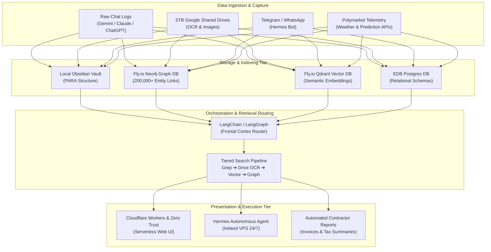

# 🎙️ AI Cohort Session 8: Customer Discovery, Architecture & Community Simulation Report

**Report Version:** 1.0.0  
**Date:** 2026-08-17  
**Source Artifacts:** `3_Simulation/Cohorts/session8_AI_Cohort_Summary_and_References.pdf`, `3_Simulation/Cohorts/session8_AI_Cohort_Transcript.pdf`, `3_Simulation/Cohorts/readme.md`  
**Participants:** Rifat Erdem Sahin (Founder/Host), Bora (AI Practitioner / Algorithmic Trader), Sude (Learner & Serverless Builder), Marianna (Enterprise & Longevity Researcher)  
**Related Hypotheses:** [H5 (Second Brain PKM)](../5_Symbols/hypotheses/hyp-h5.html), [H8 (Live Cohort PMF)](../5_Symbols/hypotheses/hyp-h8.html), [H20 (MAOT Referral & Delight)](../5_Symbols/hypotheses/hyp-h20.html), [H26 (Dual Persona)](../5_Symbols/hypotheses/hyp-h26.html), [H29 (Listen More Than Speak)](../5_Symbols/hypotheses/hyp-h29.html), [H30 (Delivery Pilot Transformation & Contractor Synergy)](../5_Symbols/hypotheses/hyp-h30.html)

---

## 1. Executive Summary

AI Cohort Session 8 represents a major validation milestone in the Customer Development journey. The session demonstrated the practical transition from a traditional one-way lecture into an **interactive, collaborative "party" format** where participants actively screen-shared working technical implementations, autonomous agent pipelines, and personal knowledge management (PKM) architectures.

### Key Takeaways
1. **Validation of the "Lecture &rarr; Party" Format Pivot ([H29](../5_Symbols/hypotheses/hyp-h29.html), [Golden Rule 1](../5_Symbols/product/skool-community-golden-rules.html)):** By facilitating discussion and prompting attendees to present their own builds rather than delivering a continuous monologue, attendee engagement and perceived learning velocity surged.
2. **Multi-Tiered Second Brain Solves the Context Window Bottleneck ([H5](../5_Symbols/hypotheses/hyp-h5.html)):** As knowledge bases scale to 100,000+ files (~100 GB), passing raw context to LLMs causes token explosion and context dilution. The session demonstrated a 4-tier hybrid retrieval architecture: `Grep` (local) &rarr; `Full-Text / OCR` (Google Drive 5TB) &rarr; `Vector Similarity` (Qdrant on Fly.io) &rarr; `Graph Relationships` (Neo4j with 200,000+ nodes), keeping context payload tiny and precision high.
3. **Autonomous Background Agents & Serverless Simplicity:** Participants favored simple interfaces (Telegram via Hermes Agent, Cloudflare Zero Trust gated Workers) over cumbersome UI dashboards.
4. **Contractor Synergy & Real-World Utility ([H30](../5_Symbols/hypotheses/hyp-h30.html)):** Automated workflows for receipt processing, contractor day logs, and tax compliance validated the Forward Deployed Engineer (FDE) / IT contractor persona.
5. **Physical Watering Hole Bridge:** Upcoming in-person meetups at **Venture Café Cambridge** (Glass House) and **London Triton Square** (Anthropic HQ) in September establish a physical-to-digital cohort funnel.

---

## 2. Participant Profiles & Discovery Signals

| Participant | Persona & Focus | Core Problem / Friction | Implementation & Demo | Discovery Validation |
| :--- | :--- | :--- | :--- | :--- |
| **Bora** | High-Frequency & Binary Prediction Trader (Polymarket / Kalshi) | Manual folder curation fatigue; fear of bloated context windows in Obsidian/MCP servers; geographical latency restrictions | Built autonomous 24/7 Hermes trading agent on Ireland VPS; ingests weather station telemetry ahead of public market ticks (~100ms edge); uses Telegram for UI | Validates need for automated background indexing outside context window; proves appetite for hands-on, high-stakes automation |
| **Sude** | Student & Active Builder | Overwhelmed by raw chat logs and notes; need for seamless web accessibility without complex servers | Built & deployed Cloudflare Workers staging app protected by Cloudflare Zero Trust; automated sorting of chat logs into Obsidian staging vault with daily confusion reminders | Validates rapid activation (idea to production in 2 days); confirms value of serverless edge deployments for PKM |
| **Marianna** | Enterprise & Longevity Researcher | Manual processing of scientific literature and papers; chaotic contact follow-ups across personal and professional email | Longevity ecosystem paper ingestion into Claude/Obsidian pipeline; automated background email CRM extraction | Validates enterprise knowledge ingestion use-case; prefers zero-UI mobile interfaces (WhatsApp/Telegram) over complex dashboards |
| **Rifat** | Founder & Enterprise Contractor (FDE) | Managing 100,000+ documents (100 GB) and contractor administration (receipts, time logs, invoicing) | Demonstrated multi-tiered Second Brain: PARA vault + Qdrant + Neo4j (200k relationships) + Google Drive OCR + Rclone PAP sync + automated receipt extraction | Demonstrates enterprise-grade architectural blueprint; shifts facilitator posture from lecturer to conversational guide |

---

## 3. Deep-Dive: Core Technical Architectures

### Architecture Component Matrix
| Layer | Tool / Service | Operational Role | Token / Latency Impact |
| :--- | :--- | :--- | :--- |
| **Orchestrator** | **LangChain & LangGraph** | Acts as the frontal cortex router; evaluates query complexity and routes to the cheapest, fastest sub-index. | Prevents LLM context blowout by fetching only 2-5 relevant context nodes. |
| **Autonomous Agent** | **Hermes Agent** | Runs 24/7 on an Ireland VPS close to European data centers; executes automated Polymarket trades and system alerts via Telegram. | Zero frontend rendering lag; asynchronous webhook execution. |
| **Knowledge Vault** | **Obsidian (PARA)** | Local markdown store organized into Projects, Areas, Resources, and Archive. Serves as staging ground for processed concepts. | Instant local read/write; zero cloud dependency for core notes. |
| **Graph DB** | **Neo4j (Fly.io)** | Maintains 200,000+ relationships across corporate contacts, project entities, topics, and locations. | Allows sub-graph extraction for deep relationship queries without passing entire knowledge graphs. |
| **Vector DB** | **Qdrant (Fly.io)** | Computes and searches high-dimensional embeddings for unstructured document chunks and chat excerpts. | Fast semantic search (~20ms response time). |
| **Relational DB** | **EDB Postgres** | Stores verified transaction records, receipts, and structured invoices. | ACID compliance and relational schema integrity. |
| **Cloud Archive** | **Google Shared Drives (5TB)** | Long-term cold archive with built-in OCR and native image text extraction. | Offloads heavy binary storage from local disks while keeping text searchable. |
| **Data Sync** | **Rclone (PAP Pipeline)** | Automated Pull-Push-Archive script synchronizing Proxmox hypervisors, local machines, and cloud containers. | Background sync without manual intervention. |
| **Edge Hosting** | **Cloudflare Workers & Zero Trust** | Hosts serverless staging web apps behind strict Identity-Aware Proxy (IAP) policies. | Sub-50ms worldwide edge delivery with enterprise authentication. |

---

## 4. Key Methodological & Facilitation Principles

1. **Focus on Strategy Over Execution:**
   As LLM agents handle boilerplate coding, data classification, and automated execution, the human value shifts entirely to identifying market anomalies (e.g. weather telemetry delta on Polymarket), defining boundary conditions, and configuring system architectures.
2. **Tiered Search Over Massive Context Dumping:**
   Dumping a 100 GB vault or 50 chat transcripts into Claude or Gemini wastes tokens, inflates latency, and introduces hallucination. The proven pattern is:
   $$\text{Query} \xrightarrow{} \text{Grep} \xrightarrow{} \text{Google Drive OCR} \xrightarrow{} \text{Qdrant Vector} \xrightarrow{} \text{Neo4j Graph} \xrightarrow{} \text{Targeted Prompt Injection}$$
3. **Simplicity in User Interface:**
   Engineers and researchers consistently gravitate toward Telegram bots and Zero-Trust webhooks rather than complex full-stack web dashboards.

---

## 5. Physical Community & In-Person Expansion

Session 8 established a clear bridge between online live cohorts and physical networking watering holes:
* **Venture Café Cambridge Meetups:** Held weekly on Thursdays at Cambridge Glass House (CB2).
* **London Triton Square Meetups:** Anthropic UK HQ vicinity at Triton Square, London (NW1).
* **Upcoming Workshop:** A dedicated hands-on session focusing on step-by-step configuration of **LangChain, LangGraph, and Google Drive integrations**.

---

## 6. Hypothesis & Business Model Linkages

* **[H5 (Organic Cohort Sales via Community Problem Solving)](../5_Symbols/hypotheses/hyp-h5.html):** Validated. Real problem solving (Second Brain architectures and trading bots) creates immediate word-of-mouth engagement and peer advocacy.
* **[H8 (Live Interactive Cohort vs. Static Videos)](../5_Symbols/hypotheses/hyp-h8.html):** Validated. Live screen-sharing of working codebases generates dramatically higher engagement and satisfaction than static video lectures.
* **[H20 (MAOT / Member Delight & Word-of-Mouth)](../5_Symbols/hypotheses/hyp-h20.html):** Validated. Attendees expressed explicit gratitude ("Today's session was great! Covering multiple topics in a single session really broadened my perspective... pace felt much faster").
* **[H26 (Dual Persona: Pure Certification vs. Forward Deployed Engineer)](../5_Symbols/hypotheses/hyp-h26.html):** Validated. Participants care deeply about tangible deployment skills (VPS setup, Postgres/Neo4j, latency arbitrage, contractor receipts) alongside certification knowledge.
* **[H29 (Listen More Than You Speak Facilitator Posture)](../5_Symbols/hypotheses/hyp-h29.html):** Validated. Shifting from lecturer to conversational host resulted in 141 turns from Bora, 68 from Sude, and 65 from Marianna, creating a vibrant peer learning environment.
* **[H30 (Delivery Pilot Roadmap & IT Contractor Alliance)](../5_Symbols/hypotheses/hyp-h30.html):** Validated. Real contractor administrative pain points (receipt automation, expense categorisation) resonate directly with the £500–£1,000/day contractor community.
