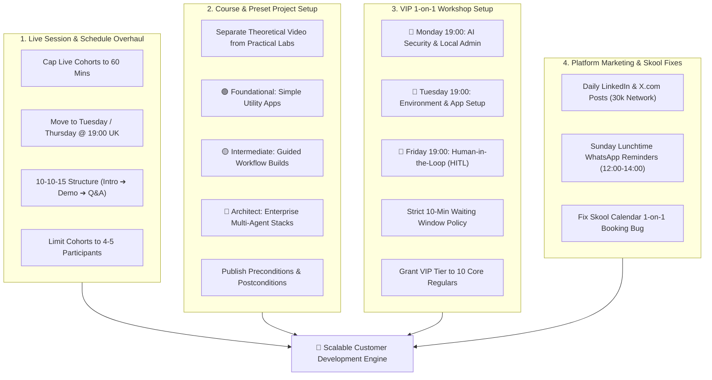

# 🎙️ AI Cohort Session 9: Customer Discovery, Schedule & Pedagogical Overhaul Report

**Report Version:** 1.0.0  
**Date:** 2026-08-23  
**Source Artifacts:** `3_Simulation/Cohorts/Cohort 9 Action Items Todo List .pdf`, `3_Simulation/Cohorts/Cohort 9 Meeting Transcript.pdf`  
**Participants:** Rifat Erdem Sahin (Founder/Host), Mariana (Enterprise Testing Lead & Researcher), Brian (Enterprise Systems & Architecture Lead), Anna (UWISE Cambridge Founder & Educational Lead, via feedback conveyed by Mariana)  
**Related Hypotheses:** [H4 (Conversion Funnel)](../5_Symbols/hypotheses/hyp-h4.html), [H5 (Skool Platform & Schedule)](../5_Symbols/hypotheses/hyp-h5.html), [H8 (Live Cohort PMF & VIP 1-on-1)](../5_Symbols/hypotheses/hyp-h8.html), [H24 (Cognitive Fatigue & Intimidation Barrier)](../5_Symbols/hypotheses/hyp-h24.html), [H29 (Listen More Than Speak / Customer Co-Creation)](../5_Symbols/hypotheses/hyp-h29.html), [H30 (Delivery Pilot Practical App-Building)](../5_Symbols/hypotheses/hyp-h30.html)

---

## 1. Executive Summary

AI Cohort Session 9 delivered profound, high-impact qualitative Customer Discovery insights that fundamentally reshape the community's live event strategy, course architecture, and VIP offering. The session featured frank feedback from core community members **Mariana** and **Brian**, incorporating direct educational critiques from **Anna** (UWISE Cambridge).

### Key Takeaways
1. **The Intimidation Barrier & Cognitive Overload ([H24](../5_Symbols/hypotheses/hyp-h24.html), [H29](../5_Symbols/hypotheses/hyp-h29.html)):** 
   - Unstructured, open-ended high-level discussions caused non-expert participants to feel "unprofessional" and overwhelmed (*"You are feeding them with information that makes them feel that they know more... they got scared and didn't come back"*).
   - Sunday late evening (9:00 PM – 11:00 PM UK) is cognitively draining for working professionals starting their work week the next morning.
2. **The 60-Minute Cap & 10-10-15 Pedagogical Structure ([H5](../5_Symbols/hypotheses/hyp-h5.html), [H8](../5_Symbols/hypotheses/hyp-h8.html)):**
   - Live group sessions must be strictly capped at **60 minutes** (or 30–45 min core).
   - Test the structured **10-10-15 framework**: 5–10 min introduction/topic, 10 min live demo/lab, 15 min structured Q&A.
   - Recommended live community cohort timing: **Tuesday or Thursday at 7:00 PM UK**.
   - Cohort sizes capped at **4–5 participants** to guarantee active participation.
3. **3-Tier Preset Project Levels ([H8](../5_Symbols/hypotheses/hyp-h8.html), [H30](../5_Symbols/hypotheses/hyp-h30.html)):**
   - Separate theoretical recorded lectures from interactive practical labs.
   - Introduce 3 clear project tiers: 🟢 **Foundational Level** (starter apps, e.g. utility clock), 🟡 **Intermediate Level** (guided workflows, LinkedIn/Obsidian setups), and 🔴 **Architect Level** (multi-agent, enterprise security, cloud infrastructure).
4. **Preconditions, Goal, Postconditions Transparency:**
   - Every module and live lab must clearly document: 📋 **Preconditions** (what to install/know), 🎯 **Session Goal** (what will be built in the hour), and 🚀 **Postconditions** (what the learner can independently do afterwards).
5. **VIP 1-on-1 Hands-On Workshop Calendar Setup:**
   - Strong willingness-to-commit for 1-on-1 environment setup on the learner's own machine.
   - Fixed weekday evening calendar slots established (19:00–21:00 UK):
     - **Monday:** 🔒 AI Security & Local Admin Protocols
     - **Tuesday:** 🛠 Environment Setup (Obsidian, Azure Foundry, RAG)
     - **Friday:** 👤 Human-in-the-Loop (HITL) Workflows
   - Implement a strict **10-minute waiting policy** before going offline.
   - Upgrade initial 10 core members (including Brian, Mariana, Sude) to complimentary VIP 1-on-1 access.

---

## 2. Participant Profiles & Discovery Signals

| Participant | Persona & Professional Context | Core Feedback & Friction Points | Proposed Architectural Solution | Discovery Validation |
| :--- | :--- | :--- | :--- | :--- |
| **Mariana** | Enterprise Testing Lead & Longevity Researcher | 2 hours on Sunday evening is exhausting; learners feel lost and unconfident without a clear curriculum (*"They want to feel smart... if they feel lost, the discomfort is so painful they won't return"*). | Shift talks to Tuesday/Thursday 7:00 PM UK; implement 1-hour cap; enforce Preconditions, Session Goals, and Postconditions. | Validates high demand for structured 1-on-1 personalized problem solving; highlights retention blocker of open-ended discussions. |
| **Brian** | Enterprise Systems Architect (Taking TOGAF certification) | Governance vs. delivery mindset gap; attendees get overwhelmed by architect jargon before mastering basic handles and terminology. | Define 3-tier preset project ladder (Foundational, Intermediate, Architect); differentiate "Service" (build for me) from "Learning" (build together). | Validates step-by-step laddering; proves experienced professionals appreciate modular, finite 6-7 week structures over infinite loops. |
| **Anna** *(via Mariana)* | Founder of UWISE Cambridge & Academic Educator | Sunday session was too complicated, too much information at once; lacked structured takeaways for non-technical users. | Recommended 10-10-15 sprint format (5–10 min intro, 10 min demo, 15 min Q&A), capped at 3 tasks per session. | Direct validation of [H24 (Cognitive Overload)](../5_Symbols/hypotheses/hyp-h24.html) and [H29 (Audience Co-Creation)](../5_Symbols/hypotheses/hyp-h29.html). |
| **Rifat** | Founder & Enterprise Contractor (FDE) | Currently operating daily LinkedIn (30k network) and Sunday WhatsApp promotion, launching multi-tiered Skool courses. | Implements 1-hour weekday talk slots, 3-tier project ladder, and scheduled Monday/Tuesday/Friday VIP 1-on-1 calendar slots. | Adapts founder bandwidth; refines Skool booking workflow and platform calendar integration. |

---

## 3. The 4-Pillar Action Plan for Founder

---

## 4. Master Action Items & To-Do Checklist

### 1. 🗓 Live Session & Schedule Overhaul
- [ ] **Cap Live Cohorts to 1 Hour:** Reduce standard live sessions from 2 hours to 60 minutes to maintain focus and beat information overload.
- [ ] **Move Sunday Cohorts to Weekdays:** Shift general community talks to Tuesday or Thursday at 7:00 PM UK time.
- [ ] **Implement 10-10-15 Structure:** Test the recommended format: 5–10 min introduction/topic, 10 min live demo, 15 min Q&A.
- [ ] **Limit Cohort Sizes:** Keep interactive group cohorts to 4–5 participants max to ensure everyone can speak.

### 2. 🎯 Course & Preset Project Setup (Skool Platform)
- [ ] **Separate Content Streams:** Keep high-level theoretical lectures completely separate from practical 1-on-1 labs.
- [ ] **Define 3-Tier Project Levels:**
  - [ ] 🟢 **Foundational Level:** Basic starter setups (e.g., simple clock/utility apps).
  - [ ] 🟡 **Intermediate Level:** Guided workflow builds (e.g., custom LinkedIn automation, basic Obsidian setup).
  - [ ] 🔴 **Architect Level:** Enterprise security, multi-agent frameworks, and complex infrastructure.
- [ ] **Add Preconditions & Postconditions:** Publish clear prerequisites (what to install/read before) and outcomes (what will be built after) for every module.

### 3. ⚙ VIP 1-on-1 Workshop Setup
- [ ] **Set Up Booking Calendar Slots (7:00 PM – 9:00 PM Weekdays):**
  - [ ] **Monday:** 🔒 AI Security & Local Admin Protocols
  - [ ] **Tuesday:** 🛠 Environment & App Setup (Mac/Windows environments, Obsidian, Azure Foundry, RAG)
  - [ ] **Friday:** 👤 Human-in-the-Loop (HITL) Workflows
- [ ] **Grant VIP Access:** Upgrade initial 10 core community members (including Brian, Mariana, Sude) to the VIP tier for complimentary 1-on-1 access.
- [ ] **Set 10-Minute Waiting Window:** Implement a strict 10-minute wait policy for booked 1-on-1 sessions before going offline.

### 4. 📢 Platform Marketing & Outreach
- [ ] **LinkedIn & X.com Promotion:** Post daily updates on LinkedIn reaching 30,000-person network and X.com promoting free cohort access.
- [ ] **Sunday Lunchtime WhatsApp Broadcast:** Send direct weekly links and agendas (12:00–14:00 UK) to existing WhatsApp contacts and study groups.
- [ ] **Fix Skool Booking Bug:** Resolve the calendar display setting so members can officially book 1-on-1 slots directly on the platform without incurring the $99/mo webinar upgrade fee.

---

## 5. Hypothesis Linkages

- **[H5 (Skool Platform & Sunday Cohorts)](../5_Symbols/hypotheses/hyp-h5.html):** Cohort 9 evidence demonstrates that infinite 2-hour late Sunday sessions lead to fatigue; shifting to 60-minute weekday slots (Tuesday/Thursday 19:00 UK) and structured 1-on-1 VIP workshops preserves member retention.
- **[H8 (Live Cohort PMF)](../5_Symbols/hypotheses/hyp-h8.html):** Validates that practical 1-on-1 environment setup and 3-tiered preset projects solve the "intimidation gap" for non-expert attendees.
- **[H24 (Cognitive Fatigue & Intimidation Barrier)](../5_Symbols/hypotheses/hyp-h24.html):** Verbatim quotes from Mariana and Anna confirm that unstructured expert discussions intimidate learners. Enforcing Preconditions & Postconditions restores psychological safety.
- **[H29 (Listen More Than Speak / Customer Co-Creation)](../5_Symbols/hypotheses/hyp-h29.html):** Direct embodiment of listening to attendees: founder immediately pivots session format, calendar slots, and course tiering based on participant feedback.
- **[H30 (Delivery Pilot Roadmap)](../5_Symbols/hypotheses/hyp-h30.html):** Differentiating theoretical lectures from hands-on delivery builds aligns with the Forward Deployed Engineer (FDE) transformation path.
