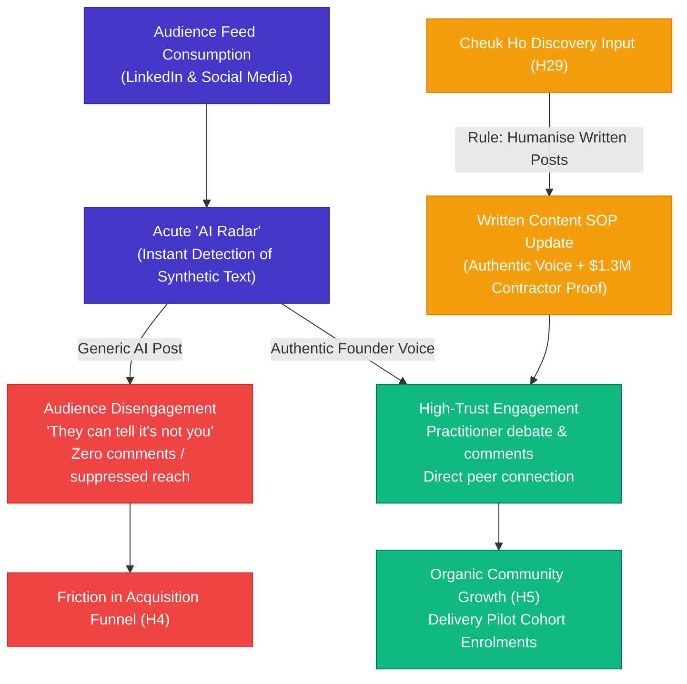

# Customer Discovery Report: Cheuk Ho Interview — AI-Generated Content Fatigue, Engagement Friction & The Founder Voice Mandate for Social Posts

**Report Version:** v1.0.0  
**Date:** 2026-08-26  
**Interview Source:** `3_Simulation/Interviews/interview_cheuk_ho_2026-08-26.md`  
**Candidate:** Cheuk Ho (Technical Lead / Senior Engineer at National Grid, Enterprise Peer & Content Critic)  
**Channel:** Direct Message / LinkedIn & WhatsApp Discovery Exchange  
**Tracked Hypotheses Mapped:** [H2 (Animated Video & Micro-Format)](../5_Symbols/hypotheses/hyp-h2.html), [H4 (Acquisition Funnel & Conversion)](../5_Symbols/hypotheses/hyp-h4.html), [H5 (Skool Freemium & Cohort Operations)](../5_Symbols/hypotheses/hyp-h5.html), [H10 (Content Quality Floor)](../5_Symbols/hypotheses/hyp-h10.html), [H24 (Cognitive Load & Trust Barriers)](../5_Symbols/hypotheses/hyp-h24.html), [H28 (YouTube & Social Media Engagement Benchmark)](../5_Symbols/hypotheses/hyp-h28.html), [H29 (Listen > Speak & Feedback Integration)](../5_Symbols/hypotheses/hyp-h29.html), [H30 (Delivery Pilot FDE Roadmap & Practitioner Proof)](../5_Symbols/hypotheses/hyp-h30.html)

---

## 1. Executive Summary & Strategic Context

In a direct customer discovery exchange on August 26, 2026, enterprise engineer and technical peer **Cheuk Ho** (Technical Lead at National Grid, who previously provided the pivotal discovery evidence regarding Pearson VUE Claude certification partner gating) delivered a critical critique regarding social media marketing and audience engagement:

1. **AI Content Fatigue & The "AI Radar" (H28 / H24):**
   - Technical audiences, senior developers, and enterprise peers possess an acute filter for generic LLM-generated text.
   - When posts exhibit typical synthetic markers (generic bullet structures, excessive emojis, robotic thought-leadership platitudes), readers instantly identify that *"it's not you"*.

2. **Engagement Barrier & Disconnection (H4 / H5):**
   - Verbatim critique: **"Your posts are too AI generated - most people may not want to engage with they can tell it's not you."**
   - When audience members detect automated or AI-penned prose, their willingness to comment, share, or engage drops precipitously. Synthetic copy feels transactional, eroding the personal rapport essential for converting followers into Delivery Pilot community members.

3. **Broadening the Founder Voice SOP Beyond Video (H29 / H10 / H2):**
   - On 2026-08-19, viewer feedback established that while AI voiceover can teach technical concepts, the Skool and cohort calls-to-action must be spoken by founder Rifat Erdem Sahin (`5_Symbols/growth/founder-voice-skool-cta.html`).
   - Cheuk Ho's feedback extends this principle into **all written social media communications, LinkedIn posts, and community announcements**: AI may draft structures or code examples, but the narrative voice, tone, personal anecdotes, and contrarian perspectives must be unmistakably Rifat's.

4. **Authenticity as the Ultimate Marketing Moat (H30 / H29):**
   - Rifat Erdem Sahin's genuine $1.3M+ enterprise IT contractor background and hands-on battle scars are the primary differentiator against faceless educational content mills. Hiding behind synthetic AI prose dilutes this competitive advantage.

---

## 2. Customer Discovery Qualitative Breakdown

### Profile & Intake Data
* **Candidate:** Cheuk Ho
* **Role / Background:** Technical Lead / Senior Engineer at National Grid, Long-time Technical Colleague
* **Channel:** Direct Message / LinkedIn & WhatsApp Discovery Exchange
* **Primary Media Habit:** Daily LinkedIn browsing, enterprise tech discourse, AI architecture discussions
* **Tagged Hypotheses:** H2, H4, H5, H10, H24, H28, H29, H30

| Discovery Dimension | Verbatim / Captured Evidence | Practitioner & Business Reality |
| :--- | :--- | :--- |
| **1. Verbatim Discovery Critique (H29 / H28)** | *"Your posts are too AI generated - most people may not want to engage with they can tell it's not you"* | Audiences develop immediate fatigue toward synthetic text; lack of human authenticity directly suppresses likes, comments, and meaningful engagement. |
| **2. Cognitive Filter & AI Radar (H24)** | High sensitivity to generic LLM tone and robotic bullet structures across professional networks. | Practitioners scroll past generic AI summaries; they demand authentic battle scars and lived contractor insights. |
| **3. Brand Dilution & Trust Friction (H4 / H5)** | Over-reliance on generic AI post templates hides the founder's unique enterprise contracting pedigree. | Prospective community members need personal conviction and authentic leadership to join Sunday live cohort sessions. |
| **4. Operational Voice SOP Expansion (H10 / H2)** | Founder voice must govern both spoken video CTAs and written social posts. | AI acts as a research assistant, but the final published text must reflect the founder's distinct, contrarian voice. |

---

## 3. Strategic Business & Hypothesis Alignment

### A. Impact on H28 (Engagement Rate Benchmark) & H29 (Listen > Speak)
* **Immediate Feedback Loop:** In accordance with H29 (listening to customer feedback and adapting immediately), this critique prompts an instant revision to the social media content generation pipeline.
* **Engagement Recovery:** Moving away from sanitized AI copy toward raw, opinionated, first-person contractor experiences will boost comment-to-impression ratios and foster genuine two-way conversations.

### B. Synergy with H10 (Quality Floor) & The Voice SOP
* **The Dual-Engine Content SOP:**
  1. **Video:** AI voiceover teaches technical concepts; founder records the outro and community call-to-action.
  2. **Written Copy:** AI generates research outlines and draft scaffolding; founder injects personal voice, edits cadence, and ensures the tone sounds authentic and human.

---

## 4. Concrete Action Items & Content Generation SOP

1. **Eliminate Generic LLM Post Formatting:**
   - Remove robotic introductory hooks, generic emoji bullet lists, and corporate motivational endings from LinkedIn drafts.
2. **Inject Personal Contractor Perspective:**
   - Frame posts around real client situations (e.g. CI/CD pipeline crashes, £1,000/day contract negotiations, Pearson VUE exam quirks, Claude MCP implementations).
3. **Founder Voice Filter Before Publishing:**
   - Run every post through a human voice test: *"Does this sound like Rifat speaking to a friend over coffee, or does it sound like a generic AI bot?"*
4. **Update Discovery Workspace & Transcripts:**
   - Log Cheuk Ho Session 2 in `5_Symbols/cd/archived-interview-transcripts.html`, `cd-interview-recording.html`, and `cd-interview-pdf.html`.

---
*Report Generated by AI Certification Helper — Customer Discovery Workspace*
