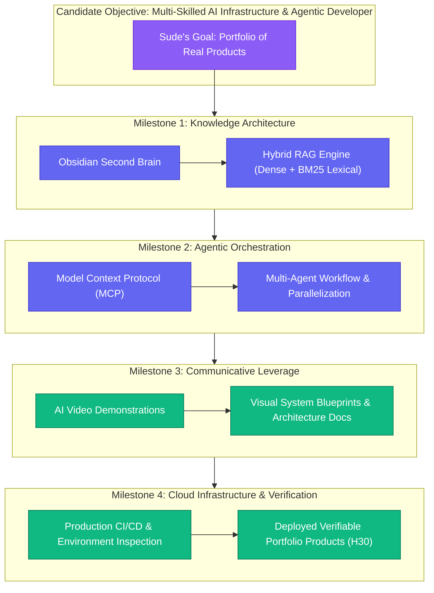

# Customer Discovery Report: Sude — Becoming a Multi-Skilled Developer, Agentic AI Infrastructure & Real Product Portfolio

**Report Version:** v1.2.0  
**Date:** 2026-09-01  
**Interview Sources:** `3_Simulation/Interviews/interview_sude_2026-09-01.md`, `3_Simulation/Interviews/interview_sude_unal_2026-08-31.md`, & `3_Simulation/Interviews/interview_sude_unal_2026-08-27.md`  
**Candidate:** Sude (Founding Cohort Member, AI & Software Practitioner; strictly first-name only per privacy guardrail)  
**Channel:** Skool Community / Direct Message Feedback  
**Tracked Hypotheses Mapped:** [H1 (Rising AI Skills Demand)](../5_Symbols/hypotheses/hyp-h1.html), [H2 (Animated Video Format)](../5_Symbols/hypotheses/hyp-h2.html), [H8 (Exam-Ready PMF & Hands-on Labs)](../5_Symbols/hypotheses/hyp-h8.html), [H10 (MVP Video Quality & Watch Retention)](../5_Symbols/hypotheses/hyp-h10.html), [H25 (Certification Value Bifurcation vs. Real Products)](../5_Symbols/hypotheses/hyp-h25.html), [H29 (Listen > Speak & Co-Creation)](../5_Symbols/hypotheses/hyp-h29.html), [H30 (Delivery Pilot FDE Roadmap & Portfolio Engineering)](../5_Symbols/hypotheses/hyp-h30.html)

---

## 1. Executive Summary & Strategic Context

On September 1, 2026, founding cohort member **Sude** provided pivotal qualitative discovery feedback connecting course content with personal career transformation:

1. **Rejection of Pure Syntax/Badges for Real Product Portfolios (H1 / H25):**
   - Sude articulated her central objective: *"Through this course, I want to demonstrate that I can build agentic AI systems and engineer AI infrastructure, backing up my claims with a strong portfolio of real products."*
   - She rejects the notion of being a passive spectator or memorizing theoretical multiple-choice answers; she demands verifiable, sovereign proof-of-work.

2. **Video & AI Media Creation as a Catalyst for Multi-Skilling (H2 / H10):**
   - Watching the founder produce AI-driven animated educational videos triggered a strategic realization: modern developers must become multi-skilled professionals who can both architect complex systems and visually demonstrate/communicate their value.

3. **Explicit Co-Creation Request for a Step-by-Step Milestone Roadmap (H29 / H30):**
   - Sude asked: *"what specific steps should I take to become a multi-skilled developer tailored to this exact objective?"*
   - This provides the exact customer-led requirement to codify the **Delivery Pilot Transformation Roadmap (H30)** into 4 verifiable portfolio milestones.

---

## 2. Customer Discovery Qualitative Breakdown

### Profile & Intake Data
* **Candidate:** Sude
* **Role / Persona:** Founding Cohort Member, AI & Software Practitioner (Persona 2 & 4: Practitioner & Forward Deployed Engineer)
* **Channel:** Skool Community / Direct Message
* **Tagged Hypotheses:** H1, H2, H8, H10, H25, H29, H30

| Discovery Dimension | Verbatim Evidence | Practitioner & Business Reality |
| :--- | :--- | :--- |
| **1. Multi-Skilled Professional & AI Media Leverage (H2 / H10)** | *"Also, when you mention becoming a multi-skilled professional by creating videos with AI, it got me thinking about how I can apply that to my own goals."* | Proves that the founder's multi-skill video workflow (scripts + AI animation + architecture) inspires learners to adopt full-stack communicative and engineering agility rather than remaining single-discipline coders. |
| **2. Agentic Systems & AI Infrastructure Ambition (H1 / H30)** | *"...Through this course, I want to demonstrate that I can build agentic AI systems and engineer AI infrastructure..."* | Validates that target cohort members are ambitious builders seeking mastery over complex agent orchestration, Model Context Protocol (MCP), and production AI infrastructure. |
| **3. Portfolio of Real Products vs Paper Badges (H25)** | *"...backing up my claims with a strong portfolio of real products."* | Strongly confirms H25: enterprise credibility requires public, working GitHub repositories and deployed products, rendering paper badges secondary without proof-of-work. |
| **4. Demand for Specific Tactical Steps (H29 / H30)** | *"As I was watching, I wondered: what specific steps should I take to become a multi-skilled developer tailored to this exact objective?"* | Clear demand for a structured, milestone-driven curriculum that removes ambiguity and provides a guided track from concept to deployed portfolio. |

---

## 3. Transformation Architecture: The 4-Milestone Multi-Skilled Developer Roadmap

---

## 4. Strategic Business & Growth Implications

1. **Curriculum Structuring (H30 & H8):**
   - Structure the Skool classroom into clear project-based tracks where each module outputs a concrete portfolio piece rather than theoretical quiz scores.
   - Package the 4-milestone roadmap as a core deliverable of the Delivery Pilot program.

2. **Multi-Skilled Narrative as Core Differentiator (H1 & H2):**
   - The narrative that AI video creation and communication elevates an engineer's market value resonates directly with ambitious practitioners.
   - Use this insight to highlight the multi-skill advantage in upcoming YouTube shorts and LinkedIn posts.

3. **Customer-Led Co-Creation (H29):**
   - By addressing Sude's explicit question directly in the cohort and curriculum, the founder maintains tight feedback loops that increase retention and student advocacy.

---
*Generated by AI Certification Helper — Customer Discovery Workspace*
