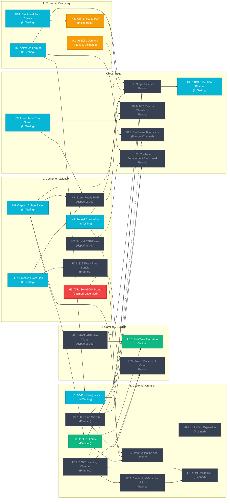

# Hypothesis Tracker — AI Certification Helper

**Version:** 1.110.0
**Date:** 2026-08-15
**Purpose:** Consolidate every hypothesis stated across the site's stage/component pages into a single premise → conclusion → status record, so progress toward validating (or killing) each one can be tracked in one place. Cross-referenced against `reports/acidity-check-report-v1.3.0.md` (supersedes v1.2.0), `reports/market-validation-argument-v1.0.md`, `reports/ai-adoption-and-skills-gap-v1.0.md`, `reports/exam-prep-market-and-student-behavior-v1.6.0.md` (supersedes v1.5.0), `reports/skool-founder-posting-sanity-check-v1.0.md`, `reports/skool-workshop-upload-sanity-check-v1.0.md`, `reports/raise-validation-perplexity-v1.0.0.md`, `reports/skool-pricing-feedback-v1.0.0.md` (founder-confirmed live Freemium entitlements on Delivery Pilot), `reports/score-fluctuation-analysis-v1.0.0.md` (explaining confidence score moves between v1.9.28 and v1.9.31), and `reports/business-model-confidence-v1.9.33.md` (a versioned, numeric confidence score computed over every hypothesis below, plus a whole-site integrity check — see `confidence-report.html`) where a status claim is not backed by evidence in the repo, or has since been resolved or changed by new research or a founder decision. Operationally mapped to the conversion tactics blueprint on `5_Symbols/growth/conversion-strategy.html`, video conversion mechanics on `5_Symbols/growth/video-conversion-tactics.html`, visual asset system on `5_Symbols/growth/youtube-banner.html`, pricing evolution roadmap on `5_Symbols/growth/pricing-change-strategy.html`, competitive benchmarking on `5_Symbols/strategy/competitive-analysis.html`, community benchmarking on `5_Symbols/product/skool-similar-communities.html`, traffic growth framework on `5_Symbols/product/grow-skool-traffic.html`, LinkedIn profile CTA evaluation on `5_Symbols/growth/linkedin-premium-decision.html`, affiliate milestone timeline on `5_Symbols/growth/skool-affiliate-roadmap.html`, monetization architecture on `5_Symbols/product/skool-monetization.html`, offer design ideas on `5_Symbols/product/skool-offer-ideas.html`, student bandwidth guardrails on `5_Symbols/product/member-bandwidth-guardrails.html`, churn reduction framework on `5_Symbols/growth/skool-churn-retention.html`, common retention patterns on `5_Symbols/growth/skool-common-patterns.html`, community management garden playbook on `5_Symbols/product/skool-community-management.html`, community rules & deletions/bans policy on `5_Symbols/product/community-rules-enforcement.html`, reading and learning guardrails on `5_Symbols/strategy/reading-and-learning-guardrails.html`, and external tooling directory on `5_Symbols/product/resources.html`.

## Visual Pipeline & Dependency Map



**Status legend:**
- ✅ **Validated** — supported by cited evidence
- 🟡 **In Testing** — experiment defined and running
- ⚪ **Planned** — experiment defined, not yet started
- ⚠️ **Claimed, unverified** — labeled Validated/complete in source doc, but no evidence found in the repo

---

## Stage 1: Customer Discovery

### H1 — Rising AI skills expectations
- **Source:** `comp-problem-solution.html`, `5_Symbols/strategy/skills-gap.html`, `product/idea.html`, `5_Symbols/strategy/raise.html` (named starting-point framing: **R.A.I.S.E.** — Rapid Artificial Intelligence Increases Skills Expectations), `5_Symbols/hypotheses/h1-not-connected.html` (why this node has no arrows on the tracker), `reports/raise-validation-perplexity-v1.0.0.md`, `5_Symbols/strategy/leverages.html` (IT experience)
- **Named framing:** R.A.I.S.E. is the founder origin for this hypothesis: Rifat Erdem Sahin's past profession is Information Technology; his past pain is learning systems that cannot keep pace; as complexity increases, sitting a proctored exam is the path he can authentically teach because he pushes AI to its limits for his own self-learning.
- **Depends on:** None — foundational premise. No upstream hypothesis is cited in the text. Isolation on the live SVG is a documentation pattern (foundational, uncited gap), not a business unused-bet. Leave H1 operationally alone this week; write explicit Feeds citations later. Full read: `5_Symbols/hypotheses/h1-not-connected.html`.
- **Premise 1:** Rapid AI advancement is reshaping job roles and technical expectations.
- **Premise 2:** Employers now expect staff to build agentic chains, configure guardrails, and audit LLM architectures (directionally true, but concentrated in advanced teams; certs act as screens rather than proof).
- **Conclusion:** Demand for AI/LLM skills is structurally rising; certifications are growing as a signaling and L&D mechanism, but they are complements to, not substitutes for, demonstrable ability (refined from "Demand for AI/LLM certification is structurally rising, not a fad").
- **Experiment:** Search volume and job-description scrapes for certification terms.
- **Target metric:** Steady monthly search growth.
- **Status:** 🟡 **Partially validated (upgraded 2026-08-01, further corroborated 2026-08-14)** — the repo still contains no search-volume/job-scrape dataset backing the original "Validated" label, but independent research now corroborates the underlying claim from three directions: (1) Anthropic's Claude Partner Network ties consulting-firm partner tiers to certified-practitioner headcounts (10 for Select, 100 for Preferred, 1,000 for Global Premier — mirroring AWS Partner Network's identical mechanic), and 2026 compensation data shows 30–40% pay premiums for generative-AI skills at firms like Accenture and TCS (`reports/market-validation-argument-v1.0.md`); (2) a full 2020–2026 timeline shows AI/big data skill demand rising 17 percentage points since 2023, 63% of employers naming the skills gap their top transformation barrier, and 75% reporting no formal in-house AI training (`reports/ai-adoption-and-skills-gap-v1.0.md`); (3) **new 2026-08-04:** three well-resourced vendors have independently shipped or expanded competing AI certification programs within months of each other — Anthropic's Claude Certified Architect (live since March 2026, backed by a $100M Claude Partner Network investment, now three role tracks and four proctored exams via Pearson VUE/OnVUE as of July 2026), Google's Gemini certifications, and Microsoft's Azure AI credentials. Multiple independent, well-capitalized companies racing into the same certification category in the same year is itself corroborating evidence that employer demand for provable AI/LLM skills is structurally real, not this site's niche bet — see `competitive-analysis.html` for the resulting competitive-positioning implications. **New (2026-08-05):** added a live [Google Trends link — "ai certification," worldwide, all time](https://trends.google.com/explore?q=ai%20certification&date=all&geo=Worldwide) as the first concrete pointer toward this hypothesis's own named Experiment (search volume for certification terms). **Founder read (2026-08-05):** the chart shows **growth** in "ai certification" search interest over the full available time range — a real, if informal (not yet a logged CSV/numeric export), positive data point supporting the Target metric of steady monthly search growth. Referenced in `evidence-map.html`. Still short of full validation (no exported numeric series logged yet), but no longer just a placeholder link. **New open risk (2026-08-10):** the Charles Andrews LinkedIn evidence (see H8, H12) shows his exam prep came via an *employer-sponsored* Anthropic Partner Network course, raising an unverified but potentially serious question — is the certification genuinely open to individual, non-Partner-affiliated candidates, or does meaningful access run through employer sponsorship? If the latter, the addressable market this hypothesis assumes (individual technical professionals studying independently) may be smaller or differently-shaped than assumed. Logged as acidity check Finding F12 (`reports/acidity-check-report-v1.3.0.md`) and a new row on `risk-analysis.html`'s Risk Register — not yet resolved either way. **New (2026-08-10):** Corporate discovery interview confirms that practitioners view certification as vital for long-term career growth, and that leadership shows strong enthusiasm (GPU and Palantir investments), though team-level adoption is slow. See `reports/exam-prep-market-and-student-behavior-v1.3.0.md`. **New (2026-08-11):** Tuncer's qualitative discovery interview confirms senior self-learning career boosting, but warns of severe time/energy loss when AI is implemented in the wrong version or configuration. See `reports/exam-prep-market-and-student-behavior-v1.3.0.md`. **New (2026-08-14):** Independent Perplexity research validation (`reports/raise-validation-perplexity-v1.0.0.md`) confirms that the R.A.I.S.E. framing is internally consistent and aligns with observable market signals. The research supports Premise 1 with job-market data (share of AI job postings up from 0.5% in 2010 to 1.7% in 2024; AI education market at $16.2B in 2024), but adds nuance to Premise 2 and the Conclusion: while AI skills demand is rising structurally, certifications serve as filters/screens rather than proof of competence, and hiring managers place heavier weight on demonstrable skill and role-specific evaluations. **New (2026-08-14) — Mehmet:** immigrant talent is poorly vetted; the old hiring check is no longer valid; proctored exams rise in value for institutional hires; governments employing MSPs should staff certified people to attract the best talent. One named voice supporting Premise 2 (certs as screens). Status tier unchanged. See `reports/exam-prep-market-and-student-behavior-v1.6.0.md` and `5_Symbols/cd/archived-interview-transcripts.html`.

### H2 — Audience prefers animated summaries over dry materials
- **Source:** `comp-problem-solution.html`, `comp-mvp.html`, `growth/content-format.html`, `product/skool-workshop-upload.html`, `5_Symbols/strategy/leverages.html` (YouTube video reach)
- **Depends on:** None — foundational Stage 1 content-format premise. Feeds H10 (H10's catalog-wide retention metric extends this hypothesis's single-video proof).
- **Premise 1:** Standard cert-prep material (500-page manuals, 40-hour courses) causes cognitive fatigue and low completion.
- **Premise 2:** Animated, visually distilled explanations increase retention.
- **Conclusion:** An animated video format will outperform standard formats on watch retention.
- **Experiment:** A/B test animated explanation vs. standard slide deck.
- **Target metric:** >40% watch retention on the animated version.
- **Design Plan:** Detailed visual design guidelines, storyboards, and asset templates are mapped out on the [Canva Animation Design & Planning](https://www.canva.com/design/DAHRZe5KBoA/OJU0sL318CozUaTBpkdT2g/edit) board.
- **Status:** 🟡 **In Testing — first real data point (upgraded 2026-08-04):** a produced animated short-form video scored **68.5% average view retention** on YouTube Studio Analytics, comfortably clearing the >40% target. This is a single video, not yet the full-catalog average that H10 requires, and no formal A/B test against a standard slide-deck format has been run — but it is the first concrete, measured proof that the animated format itself can hold attention at this level. See `content-analysis.html` for where this and future per-video retention numbers are tracked going forward.

### H3 — Audience will pay for certification prep
- **Source:** `comp-problem-solution.html`, `strategy/alex-hormozi-agent.html` (Hormozi read: catalog vs Grand Slam Offer; value-equation likelihood is the conversion leak), `5_Symbols/strategy/leverages.html` (Location/Luck: London Venture Coffee)
- **Depends on:** None — foundational Stage 1 premise. Feeds H19 (Discovery-stage exit condition).
- **Premise 1:** Viewers who complete free content have expressed problem-level need.
- **Premise 2:** A subset of highly engaged viewers will convert to paying customers if offered a low-friction next step.
- **Conclusion:** Newsletter signup with visible pricing will surface real purchase intent.
- **Experiment:** Newsletter signup with a pricing-details page on the main site.
- **Target metric:** >5% email signup conversion.
- **Status:** 🟡 In Progress (upgraded 2026-08-04). The email newsletter signup is now being built — live at [rifaterdemsahin.github.io/email-newsletter](https://rifaterdemsahin.github.io/email-newsletter/). **Dual capture points (added 2026-08-04):** there are two separate signup entry points feeding this same email list — one linked from LinkedIn posts, one linked from YouTube video descriptions — reaching two different audiences (Rifat's LinkedIn professional network vs. organic YouTube search traffic) and acting as backups for each other if one channel's link or traffic underperforms. See `comp-funnel.html` and `sales-pipeline.html` for where this is reflected in the funnel. The >5% signup conversion target is not yet measured (no pricing page traffic routed to it yet); tracked as an in-progress task — see `todo.html`. **New (2026-08-05):** first direct problem-level-need signals arrived outside the newsletter funnel — Charles reached out directly asking for exam-prep help, and Baris set up a dedicated WhatsApp channel through which **5 discovery calls with 5 working professionals** about exam prep have now been completed. Real Premise 1 evidence (expressed problem-level need), but a separate signal from the newsletter's own unmeasured >5% conversion target. **New (2026-08-10):** Discovery interview reveals exam price elasticity: practitioners are planning to pursue Developer certification next at a higher cost (£125 Developer vs. £75 Associate), indicating intent to pay more for advanced tiers. See `reports/exam-prep-market-and-student-behavior-v1.3.0.md`.

### H24 — AI certification interest is primarily driven by emotional factors (greed, fear, insecurity)
- **Source:** `5_Symbols/strategy/pain-points.html`
- **Depends on:** None — foundational Stage 1 premise. Feeds H3 (Willingness to Pay).
- **Premise 1:** Preparing for professional exams is high-friction, stressful, and expensive; happy and content professionals rarely volunteer for this.
- **Premise 2:** Candidates are driven by fear of obsolescence, greed for pay premiums/leverage, or insecurity (imposter syndrome).
- **Conclusion:** Marketing and product design must target anxiety relief, career security, and status/financial shortcuts rather than just dry academic information.
- **Experiment:** Qualitative discovery interviews logging core motivations of participants.
- **Target metric:** >80% of interviewed candidates cite greed, fear, or insecurity as their primary driver for certification.
- **Status:** 🟡 **In Testing (new, 2026-08-11)** — qualitative discovery interviews confirm high motivation based on career boosting and time/configuration anxiety. See `reports/exam-prep-market-and-student-behavior-v1.3.0.md` and `5_Symbols/strategy/pain-points.html`.

---

## Stage 2: Customer Validation

### H4 — The YouTube funnel converts to paid membership at ~1%
- **Source:** `comp-business-model.html`, `product/skool-vs-youtube.html`, `product/youtube-skool-handoff.html`, `growth/youtube-titles-skool-mapping.html`, `growth/content-format.html`, `strategy/alex-hormozi-agent.html` (Core Four: posted content needs one CTA into one offer)
- **Depends on:** None — foundational Stage 2 funnel premise (numerically unreconciled with peer hypothesis H7 — see Finding F5). Feeds H16 (organic-funnel CAC benchmark) and H19 (production-pace baseline).
- **Premise 1:** Free YouTube content builds trust and traffic at scale.
- **Premise 2:** A fraction of viewers will value the $10/mo community enough to subscribe.
- **Conclusion:** Out of every 1,000 free-course views, at least 10 viewers will join the $10/mo membership.
- **Status:** 🟡 **In Testing (upgraded 2026-08-02)** — no longer untested: a free weekly cohort has run for 8 consecutive weeks (June–July 2026) with a steady audience of ~4 attendees per session. This validates that free content converts into repeat live engagement; the specific 1% view→paid-membership conversion figure is still unmeasured. **Production capacity decision (added 2026-08-04):** the funnel's top-of-funnel input is gated by content volume, so the founder has set a baseline goal of **3 animated videos produced per week** and has reallocated the time he previously spent watching video content toward creating animations instead, to grow the number of views feeding this funnel. Tracked as a recurring weekly task on `5_Symbols/dashboard/todo.html` (not a one-off backlog item). **New (2026-08-05):** the free Sunday cohort's audience is now growing beyond the original ~4/session baseline recorded above — an updated exact headcount has not yet been logged, so this is tracked as a directional trend to confirm with a real number at the next session, not yet a revised figure for the ~1% conversion target itself.

### H5 — Cohorts sell out organically without paid ads
- **Source:** `comp-business-model.html`, `product/skool-lms-integration.html`, `product/skool-vs-youtube.html`, `product/youtube-skool-handoff.html`, `product/skool-posting-sanity-check.html`, `product/skool-workshop-upload.html`, `product/skool-founding-members.html`, `product/skool-community-golden-rules.html`, `product/skool-delivery-pilot-offer.html` (live Skool checkout rewrite: Peek $0 / Sit In $1 / Share Screen $250/year), `reports/skool-pricing-feedback-v1.0.0.md` (founder-confirmed Freemium entitlements: Standard $0 / Premium $1 / VIP $250/year), `product/skool-about.html` (live About-tab copy — replaces the “get certified” listing line; maps each block to system pages), `product/skool-discoverability-keywords.html` (recommended discoverability keywords to index the group in Skool directory), `product/skool-visibility.html` (how to set Private vs Public; recommend Public so strangers can read the board and Discovery/keywords work), `strategy/listen-more-than-you-speak.html` (H29 founder listening role — retention mechanic, not paid enrollments), `growth/youtube-titles-skool-mapping.html`, `reports/skool-founder-posting-sanity-check-v1.0.md`, `reports/skool-workshop-upload-sanity-check-v1.0.md`, `product/vc-feedback.html` (VF3 — free-cohort attendance is discovery, not traction), `strategy/alex-hormozi-agent.html` (Sunday live is a discovery magnet, not the Grand Slam)
- **Depends on:** None — foundational Stage 2 cohort premise. Feeds H9 (explicit — this is the literal revenue basis of the $10k gate), H8 (Premise 4/5's free-cohort mechanics are cited as live peer-accountability evidence), and H16 (the organic-acquisition baseline any paid-ad CAC would be benchmarked against).
- **Premise 1:** Cohort announcements reach an engaged audience via video callouts and the newsletter list.
- **Premise 2 (revised 2026-08-01):** That audience is willing to pay $250–500 for live-streamed, real-time problem-solving sessions, community membership, and the discipline/network that comes with them — **not** for a promised exam outcome. The founder has explicitly clarified: "we do not grant the passing of the exam, the certification" — that is issued solely by Anthropic via Pearson VUE.
- **Premise 3 (delivery model defined, 2026-08-02; revised 2026-08-07):** The $10/mo membership tier includes access to **recorded** cohort replays (async, self-paced). The $250–$500 range is **not** a single-event bootcamp price — it is two live-cohort membership durations, both of which include everything in the $10/mo membership plus live attendance with the ability to share their screen: **$250 buys a 3-month cohort join**, **$500 buys a yearly (12-month) cohort join**. The earlier "day-long session with scheduled breaks" framing describes the cadence of live sessions *within* either duration tier, not the offer itself.
- **Premise 4 (channel mechanics, added 2026-08-04):** The current cohort (still the free tier, ahead of any paid launch) runs live every **Sunday at 9pm** and is marketed with **$0 ad spend via WhatsApp and face-to-face outreach**, not paid channels. The founder reports this free cohort format directly helps build content and collect feedback, and increases his own confidence in the offer ahead of a paid launch.
- **Premise 5 (weekly prep loop, added 2026-08-04):** The cohort is not just the single live session — during the week leading up to it, the founder shares an install list (tools/SDKs/accounts needed) and a preview of upcoming content over **WhatsApp and Discord**, so attendees arrive already set up and spend the live time hands-on rather than on setup. See `cohort-prep.html`.
- **Premise 6 (referral growth, added 2026-08-05; named pair 2026-08-13):** Beyond the founder's own direct outreach (Premise 4), existing attendees are starting to bring other people into the cohort themselves — a genuine word-of-mouth loop, not just founder-driven invitation. **Named pair (2026-08-13):** Sude was invited by Bihar — the first named referrer→invitee pair in this loop. Founder read: genuine connection is more important than mass marketing at this stage (ads stay gated by H16). See `hyp-h5.html`.
- **Premise 7 (meetup-driven motivation, non-product evidence, added 2026-08-07; corrected & de-anonymized 2026-08-12):** Charles Andrews (the same named contact already cited in H3, H8, H12, H21) passed the Claude Certified Associate Foundations exam (**917/1000**, vs. a 720 pass threshold) after **2 weeks** of prep, having gotten involved and inspired purely through in-person conversations at meetups (Thursday Venture Coffee/Triton Square, Cambridge Bradmore Centre) — **not** through any of our paid products. Their primary study resource was the official Anthropic Partner Network materials via Skilljar, not our videos, cohort, or the $29 bundle. This is evidence the meetup/conversation channel converts strangers into people who actually sit and pass the exam — but explicitly **not** evidence our study product itself works, since they never used it. **Correction (2026-08-12):** this candidate was originally logged anonymized and treated as a separate individual from the Charles Andrews LinkedIn/Capgemini citation elsewhere on the site (see H12, H8) — they are the same person; his discovery-interview transcript had also recorded an interim score of 705/1000, since corrected to the confirmed official 917/1000. He separately noted he felt his **existing knowledge alone could likely have passed** even without the 2 weeks of dedicated study. Full write-up: `exam-performance-evidence.html`; interview correction: `5_Symbols/cd/archived-interview-transcripts.html`.
- **Premise 8 (Skool platform live, added 2026-08-11):** The `skool-lms-integration.html`-specified LMS is no longer just a plan — the founder has deployed the community on **skool.com**, migrated all 8 recorded sessions from the free Sunday cohort into the Classroom, configured membership **levels** (gamification tiers), and added his founder bio. The invite link has been shared through the existing channels (WhatsApp/YouTube/LinkedIn). This is the first time the actual mechanism this hypothesis's conclusion depends on — a real, shareable cohort/membership storefront — has existed and been used, rather than being described.
- **Premise 9 (Skool checkout preview ramp, added 2026-08-14; entitlements confirmed 2026-08-14):** The live Delivery Pilot join page is **Freemium** and bills three plans — **$0/month Standard, $1/month Premium, $250/year VIP**. Founder-confirmed entitlements: Standard = posts, learning materials, welcome interactions; Premium = additional recorded workshops + listen-only Sunday live; VIP = screen-share, personal architecture assistance, founder setup reviews. That ladder is being rewritten as a Hormozi preview ramp, not as a replacement of Premise 3's $10/mo + $250 (3-month) / $500 (year) revenue model: **Peek ($0)** = see the room (lead magnet; one sample, not the whole Classroom); **Sit In ($1/mo)** = listen-only Sunday (tripwire, not the cohort); **Share Screen ($250/year)** = live screen-share seat (the offer — Sunday in the room, not unbounded 1:1). The $1 plan must not own the word "cohort." $0 and $1 joins remain community signups; only a cleared $250 Share Screen payment counts toward this hypothesis's paid-enrollment conclusion. Spec and paste-ready copy: `product/skool-delivery-pilot-offer.html`. Feedback grade and VIP-bandwidth cap: `reports/skool-pricing-feedback-v1.0.0.md`. **About tab (added 2026-08-14):** the live listing line still says “get certified as a Claude Architect.” Paste-ready replacement — and a block-by-block map back to system pages — is `product/skool-about.html` (https://www.skool.com/delivery-pilot-8938/about). About copy is not a paid-enrollment signal.
- **Premise 10 (Skool discoverability keywords, added 2026-08-14):** In order for Skool search and directory crawlers to index and match the group to searchers seeking Claude certification help, discoverability keywords must be configured under Group Settings. The core set of keywords is defined on `product/skool-discoverability-keywords.html` (e.g. `Claude Certified Architect`, `Anthropic Claude`, `AI Certification`, `AI Engineering`, etc.) to target both primary certification searchers and broader technical AI-practitioner queries. Discoverability settings do not represent paid enrollments.
- **Premise 11 (Skool visibility Public vs Private, added 2026-08-14; confirmed Public 2026-08-14; availability tested 2026-08-14):** Delivery Pilot is **Public** (“Anyone can see what's inside. Only members can post.”) rather than **Private** (“Only members can see what's inside.”). Founder confirmed the live toggle on 2026-08-14. A logged-out availability check (`5_Symbols/toolbox/skool_availability_check.py`, `reports/skool-availability-v1.0.0.md`) fetched https://www.skool.com/delivery-pilot-8938 with no cookie and passed 11/11 gates: HTTP 200, `currentGroup.public = True`, `metadata.privacy = 0`, **11 members**, **14 posts** readable by a stranger. Public lets a stranger read the community board before joining, keeps Classroom / Sunday / Share Screen gated by plan, and is the prerequisite for Premise 10's keywords and Skool Discovery. Private would hide the board and take the group out of search. How-to: `product/skool-visibility.html`. Test page: `product/skool-availability.html`. Setting Public is not a paid enrollment.
- **Conclusion:** 20–40 premium students will enroll per cohort launch with $0 paid ad spend, buying live community access and structured practice rather than a pass guarantee.
- **Status:** 🟡 **In Testing (upgraded 2026-08-11, updated 2026-08-14)** — no longer purely hypothesized: **8 people have signed up** on the newly live Skool platform (Premise 8), the first real, measured signups against this hypothesis's conclusion. This is a genuine, non-zero data point on the same real-world mechanism the 20–40-per-launch target is stated against (following the same evidentiary bar that upgraded H4: real, repeated engagement counts as "In Testing" even before the target number is hit) — but it is explicitly **not yet confirmation of the conclusion itself**: these are Skool community joins via the shared link, not confirmed $250–$500 paid cohort enrollments or $10/mo paying memberships, and the founder has not reported which billing tier (free vs. the $99/mo paid Skool plan) is currently active. The specific 20–40-enrollments-per-launch and $10k revenue-gate targets (see H9) remain unmeasured. The two-tier delivery model (recorded replay vs. live day-long screen-share session) is now defined as of 2026-08-02, and the free-tier channel mechanics (Sunday 9pm, WhatsApp/face-to-face, $0 ad spend) are now documented as of 2026-08-04 — see `evidence-map.html`. The weekly WhatsApp/Discord install-list and content-preview prep loop is documented at `cohort-prep.html`. **New (2026-08-05):** the first referral/word-of-mouth signal has appeared — existing attendees are bringing others into the cohort organically (Brian and Sude are named examples), rather than every attendee arriving through direct founder outreach. Small-sample so far, but a live sign of the $0-ad-spend organic growth loop the conclusion depends on. **New (2026-08-07):** Premise 7's non-product candidate pass is a second, independent confirmation that the meetup channel itself motivates real action (not just attendance) — but it also sharpens an open gap: motivation-to-attempt-the-exam and adoption-of-our-specific-study-product are two distinct, unproven conversion steps, not one. **New (2026-08-10):** Brian's qualitative feedback from the Sunday cohort (attending for the 3rd time) confirms time constraints as his main challenge for completing installs, yet he still sees high value in the training and plans to do setup at a slower pace. This validates cohort value-perception and long-term engagement, but highlights setup friction and cognitive load as active customer constraints (supports Premise 5 prep-loop context & Premise 6 referral engagement). **New (2026-08-10):** Discovery interview with two technical practitioners shows they prefer hands-on certifications, but find associate levels PM-heavy and "50/50" passability with common sense alone. This supports targeting hands-on cohorts for Developer tracks, while keeping Associate as a lower-tier entry product. See `reports/exam-prep-market-and-student-behavior-v1.3.0.md`. **New (2026-08-10):** Sude's qualitative interview confirms she is highly motivated by the Sunday cohort's content, self-generating new tool integration ideas, representing a highly active customer segment (supports Premise 6 referral growth). **New (2026-08-12):** Sude followed up on WhatsApp two days later with a working vault — sample chats in a staging folder, extracted concepts in a Concepts folder, trained from one chat history — and a planned routine to auto-pull pinned chats plus a daily reminder of what she was confused about. Mid-week, self-directed activation after a free Sunday session (still not a paid-enrollment signal). Full thread: `5_Symbols/cd/archived-interview-transcripts.html`. **New (2026-08-11):** Tuncer's qualitative discovery interview confirms senior self-learning career boosting, but warns of severe time/energy loss when AI is implemented in the wrong version or configuration. See `reports/exam-prep-market-and-student-behavior-v1.3.0.md`. **Open question:** removing the "guarantee" framing (previously used in `comp-business-model.html` and `comp-funnel.html`, corrected 2026-08-01) may change willingness to pay — this has not been tested and is worth watching at the first real paid launch. **New (2026-08-12):** the curriculum this conclusion depends on is no longer just a plan — the founder has configured **7 cohort classrooms in Skool** (Foundations → Agentic Architectures → Multi-Agent Patterns → Claude Code CLI & Personal Automation → Certification/RAG/Guardrails → Forward Deployed Engineering → Second Brain), giving the $250–$500 cohort offer concrete content to sell against for the first time. Full sequencing and funnel mapping at `sales-marketing-roadmap.html`. Enrollment/conversion data against this curriculum is still unmeasured. **New (2026-08-12) — founder board seeding:** Delivery Pilot community posts are currently founder-authored only (welcome, app install, assessments, glossary, Claude official course, Obsidian, Grok CLI, model comparison) with **no cold-email campaign** — board-first community ops. Sanity check (`skool-posting-sanity-check.html`, `reports/skool-founder-posting-sanity-check-v1.0.md`) verdict: **correct for Stage 2 activation/retention**, incomplete as acquisition; warm invite of free-cohort/WhatsApp members into Skool is the missing layer before low board engagement can be read as a product signal. Status tier unchanged (still no paid enrollments). **New (2026-08-13) — 2-hour workshop upload:** sanity check (`skool-workshop-upload.html`, `reports/skool-workshop-upload-sanity-check-v1.0.md`) operationalizes Premise 3 — the Sunday recording is uploaded native to Skool Classroom the same night with timestamps as the $10/mo replay archive. It is not the course, not a public YouTube video, and not a recut. Status tier unchanged (still no paid enrollments). **New (2026-08-13) — founding members:** `skool-founding-members.html` maps Skool's 9-step community course onto this business and names **Marianna, Sude, and Bayo** as the first 3 founding-member invites (Step 4). This is the warm-invite layer the posting sanity check said was missing. Invites are named, not yet confirmed as joined, and are explicitly **not** paid $10/mo or $250–$500 enrollments — status tier unchanged. **New (2026-08-13) — golden rules:** `skool-community-golden-rules.html` maps Skool's 3 community-course rules (don't lecture, build friendships, curate culture) onto Delivery Pilot. That is a retention/activation playbook for the founding seats, not a paid-enrollment signal — status tier unchanged. **New (2026-08-13) — Bihar invited Sude:** Premise 6 now has a named chain, not just named attendees. Sude arrived because Bihar invited her — a genuine personal connection, not a mass-marketing or paid-ad touch. Founder read: genuine connection beats mass marketing while H5 is still being tested. Still a free-cohort / discovery signal, not a paid $10/mo or $250–$500 enrollment — status tier unchanged. See `hyp-h5.html`. **New (2026-08-14):** Customer discovery feedback with Bora validates the need for background log-capture automation (Obsidian sync/MCP) over manual clippers, but raises context-capacity concerns during chats. Supported by Rifat's multi-source hybrid database stack POC. See `reports/exam-prep-market-and-student-behavior-v1.5.0.md`. **New (2026-08-14) — Skool checkout rewrite:** Premise 9 documents the live Standard / Premium / VIP plans as a Hormozi preview ramp (Peek $0 / Sit In $1 / Share Screen $250/year) on `skool-delivery-pilot-offer.html`. Copy and unlocks are the experiment; $0 and $1 joins still do not count as paid enrollments. Status tier unchanged. **New (2026-08-14) — live Freemium entitlements confirmed:** the founder set the community model to Freemium and stated the three-tier unlocks (Standard = posts / learning materials / welcome; Premium $1/mo = recorded workshops + listen-only Sunday; VIP $250/year = screen-share + personal architecture assistance + founder setup reviews). Feedback (`reports/skool-pricing-feedback-v1.0.0.md`) keeps the prices, rejects the names, and caps VIP as Sunday-in-the-room rather than on-demand 1:1. Still not a paid-enrollment signal — status tier unchanged. **New (2026-08-14) — visibility set to Public:** founder confirmed Delivery Pilot is Public (Premise 11). Strangers can read the board; only members post. Not a paid-enrollment signal — status tier unchanged. See `product/skool-visibility.html`. **New (2026-08-14) — logged-out availability test:** `skool_availability_check.py` PASS 11/11 against the live URL. Public flag true, 11 members, 14 posts visible (including one Sude thread). Listing line still says “get certified.” Not a paid-enrollment signal — status tier unchanged. See `reports/skool-availability-v1.0.0.md`.

### H6 — Market is large enough to sustain the business
- **Source:** `comp-market.html`, `product/idea.html`, `product/vc-feedback.html` (VF4 — top-down TAM will get discounted)
- **Depends on:** None — foundational market-sizing premise. Logically underlies the channel-expansion hypotheses (H12, H14, H16, H18) — a market too small couldn't sustain them — but no hypothesis text explicitly cross-cites H6; flagged here as a gap worth an explicit link in a future revision.
- **Premise 1:** ~25M developers worldwide must adapt to AI-driven engineering (TAM).
- **Premise 2:** ~3M of them are actively seeking cloud/ML/LLM certifications (SAM).
- **Conclusion:** ~50,000 developers are reachable via Rifat's specific channels within 3 years (SOM).
- **Status:** ⚠️ **Claimed, unverified, now partially grounded** — the exact 25M/3M/50k figures are still uncited, but `reports/ai-adoption-and-skills-gap-v1.0.md` now anchors the TAM/SAM/SOM formula (published in `comp-market.html`) against dated, sourced proxies: WEF's 2025 Future of Jobs data for TAM direction, the existing ~70% cloud-certification adoption rate for SAM, and Anthropic's own 10/100/1,000 partner-tier practitioner quotas for a bottom-up SOM estimate. **New SAM evidence (2026-08-04):** the "Forward Deployed Engineer" (FDE) role — an on-the-ground, client-embedded engineer configuring and operationalizing LLM/agent deployments — is a concrete, named embodiment of this SAM segment, and it is growing explosively: FDE job postings rose over 700–800% year-over-year through early-to-mid 2026, with demand projected to surge roughly 2,100% by year-end; the share of companies planning to hire FDEs jumped from 5–10% to 70% within two quarters; and Google, Deloitte, Salesforce, OpenAI, and Anthropic are all named as fast-growing hirers (average base salary ~$171,911, senior AI-lab packages reaching $400k–$500k with equity). Treat the specific TAM/SAM/SOM numbers as a working assumption pending a dedicated sizing study, but the FDE trend is real, sourced, current-year data pointing in the same direction as the SAM claim. **Independent verification, layer by layer (2026-08-05):** `reports/tam-sam-som-verification-v1.0.md` — an independent Perplexity research pass — checked TAM, SAM, and SOM separately rather than scoring H6 as one claim, and returns a formal **"Partially Verified"** verdict: TAM (⚠️ unverified directional proxy) and SOM (⚠️ unverified internal projection) remain working assumptions, but SAM (✅ verified market signal) is empirically grounded — it independently corroborates the FDE data above with more precise figures (US postings up 729% YoY, 643→5,330 April 2025→April 2026, per Indeed; Christian & Timbers projects ~2,100% enterprise demand growth by end of 2026; compensation $170k base to $385k–$600k+ total comp). This sharpens which part of H6 is grounded without changing the hypothesis's own tracked status — the conclusion's specific SOM figure (~50k) is still explicitly unverified per this same research, so the tier stays ⚠️. `comp-market.html` now frames its TAM/SAM/SOM diagram as an "Order-of-Magnitude Working Model" per this report's recommendation. **New (2026-08-05):** `hyp-h6.html` now carries a long-form write-up of all three layers (TAM, SAM, SOM) — one full paragraph each, expanding the summary bullets above into the full reasoning chain, sourcing, and verification confidence per layer, cross-linked back to `comp-market.html` and the verification report.

### H7 — The YouTube acquisition funnel performs at stated rates
- **Source:** `comp-funnel.html`, `product/skool-vs-youtube.html`, `product/youtube-skool-handoff.html`, `growth/youtube-titles-skool-mapping.html`, `growth/content-format.html`
- **Depends on:** None — foundational Stage 2 funnel premise (numerically unreconciled with peer hypothesis H4 — see Finding F5). Feeds H16 (organic-funnel CAC benchmark).
- **Premise 1:** Structured "YouTube Course" playlists rank higher for educational search intent than unstructured video.
- **Premise 2:** That ranking advantage translates into a predictable click/conversion funnel.
- **Conclusion:** 10% of video viewers click through to the newsletter; 2% of newsletter subscribers convert to a cohort purchase.
- **Status:** ⚪ Hypothesized. **Note:** this funnel model does not numerically reconcile with H4's "1% of views" claim — the two describe different conversion paths to different offers and haven't been unified into one funnel model (flagged in the acidity check, Finding F5). **Scope clarified (2026-08-02):** funnel targeting and all content produced are scoped specifically to exam-prep search intent, not general AI education. **Next step (added 2026-08-04):** measuring how individual animated videos actually perform (retention, not just clicks) is a prerequisite to reconciling this funnel model — tracked as an open task in `todo.html` and given its own page at `content-analysis.html`. **New (2026-08-05):** the LinkedIn-side capture point (see H3's dual capture points) is now a real, live artifact — a [LinkedIn Newsletter](https://www.linkedin.com/newsletters/7490354292390940672/) has been created to carry this funnel's top-of-funnel traffic. No click-through or conversion numbers are logged against it yet, so the 10%/2% targets remain unmeasured — this is funnel infrastructure now existing to measure against, not a result.

### H21 — $29 Exam Prep Bundle is a viable low-friction entry SKU (new, 2026-08-07)
- **Source:** `exam-prep-product.html`, `bmc-revenue-streams.html`, `product/skool-lms-integration.html`, `growth/youtube-titles-skool-mapping.html`, `strategy/alex-hormozi-agent.html` ($29 is a tripwire, not a lead magnet; unfinished until H27 ships)
- **Depends on:** H27 (explicit — H27's practice-exam gap is the value-blocker this SKU solves).
- **Premise 1:** Some prospects want a fast, self-paced way to test the offer before committing to the $10/mo membership or the $250–$500 live cohort.
- **Premise 2:** Memory cards + a prep exam + a mock exam, bundled as one $29 one-time purchase, covers a distinct, lower-commitment use case that neither existing tier serves directly.
- **Premise 3:** This is additive, not a replacement — it should not cannibalize live-cohort or membership revenue if positioned correctly as an entry product. **Clarified 2026-08-07:** the bundle's content is not exclusive material — it is already included within both the $10/mo membership and the $250–$500 live cohort. The $29 price exists purely for prospects who want only this piece without subscribing or booking a live seat, so cannibalization risk is structurally low: anyone who'd value the fuller offer still has every reason to pay more for it.
- **Premise 4 (behavior evidence, added 2026-08-07):** Real discovery-call evidence — Charles among the named contacts already cited in H3 and H8 — shows candidates typically book their real Pearson VUE exam slot roughly 3 weeks in advance and study hard against that fixed deadline. The mock exam specifically is the moment that converts anxiety into confidence: candidates report feeling relaxed and exam-ready right after passing it, not gradually over weeks. This is the direct product rationale for packaging the bundle to be immediately usable with no onboarding, and for the mock exam being the centerpiece component rather than an afterthought. See `target-audience.html`'s "Real Behavior Pattern: The Mock-Exam Confidence Loop" section. **Correction note (2026-08-12):** Charles's own confirmed prep window for the exam he actually sat was 2 weeks, not 3 — this premise's ~3-week figure is a general pattern drawn from multiple candidates and is not specifically Charles's own timeline; flagged here so the two numbers aren't read as the same data point.
- **Conclusion:** Offering the $29 bundle alongside the existing tiers will convert a segment of prospects who wouldn't have purchased the higher-commitment options, without materially cannibalizing them.
- **Status:** ⚪ Planned — a newly proposed SKU; not yet built, priced, or sold. No conversion or cannibalization data exists yet, though Premise 4's behavior pattern is real, observed evidence supporting the underlying customer need. See `hyp-h21.html`, `exam-prep-product.html`, and `self-assessment.html` (the quiz that routes prospects toward this or another tier). **New (2026-08-10):** Discovery interview confirms the Associate exam is perceived as workflow/PM-heavy, with a "50/50" pass rate via common sense alone. This confirms that candidates seek low-friction, lower-commitment entry prep SKUs (like the $29 Mock Exam bundle) for Associate, while saving high-ticket cohorts for hands-on Developer tiers. See `reports/exam-prep-market-and-student-behavior-v1.3.0.md`.

### H27 — Lacking blueprint-mapped practice exams & question banks is a critical value blocker for buyers (new, 2026-08-11)
- **Source:** `5_Symbols/strategy/practice-exams-gap.html`, `5_Symbols/strategy/risk-analysis.html`, `strategy/alex-hormozi-agent.html` (practice bank is the value-equation likelihood term)
- **Depends on:** None — foundational Stage 2 product value risk. Feeds H8, H21.
- **Premise 1:** Candidates book Pearson VUE exams roughly 3 weeks out and shift study behavior from theory to retrieval practice.
- **Premise 2:** Standard mock exams and question banks are the single most critical asset that anxious buyers seek during this phase.
- **Conclusion:** Without official blueprint-mapped practice exams/question banks, the customer development value proposition is incomplete and conversions will stall.
- **Experiment:** Launch a pilot question bank on Skool/WhatsApp mapped to official blueprint domains and track attendee demand.
- **Status:** 🟡 **In Testing (new, 2026-08-11)** — Sunday live cohorts are actively piloting hands-on architectural problem-solving sessions, and the $29 Exam Prep Bundle includes mock tests to address this gap. See `5_Symbols/strategy/practice-exams-gap.html`. **New (2026-08-12):** production of the question bank itself has started — animated exam-prep questions are now being authored directly inside the [Delivery Pilot Skool classroom](https://www.skool.com/delivery-pilot-8938/classroom/b0a02d54?md=775d1af784984bfdb7fed0bba78a0503), with 2 of a targeted 60 questions published so far. This is the first concrete production evidence against the Experiment above (still far from a measurable attendee-demand signal at 2/60, but no longer just a planned pilot).

### H8 — Product-Market Fit (PMF): the cohort program gets students certified
- **Source:** `comp-pmf.html`, `product/skool-lms-integration.html`, `product/skool-vs-youtube.html`, `product/youtube-skool-handoff.html`, `product/skool-posting-sanity-check.html`, `product/skool-workshop-upload.html`, `product/skool-founding-members.html`, `product/skool-community-golden-rules.html` (party-not-lecture playbook for starting non-founder threads), `strategy/listen-more-than-you-speak.html` (H29 — a lecture hall falsifies peer accountability), `product/skool-10-true-regulars.html` (10 un-poked regulars is the first Skool-side community metric; not exam-pass evidence), `reports/skool-founder-posting-sanity-check-v1.0.md`, `reports/skool-workshop-upload-sanity-check-v1.0.md`, `5_Symbols/strategy/leverages.html` (IT experience)
- **PMF stands for:** Product-Market Fit — the point at which an offer satisfies real, strong market demand well enough that customers seek it out, get value from it, and recommend it on their own, without being sold.
- **Depends on:** H5 (Premises 4–5's free-cohort mechanics — the Sunday session and its WhatsApp community — are the live evidence cited for Premise 2's peer-accountability claim), H27 (explicit — H27's identified practice-exam gap informs the cohort's curriculum pivot). Related to H10 (both were touched by the 2026-08-01 no-guarantee clarification, not a strict dependency).
- **Premise 1:** The cohort curriculum covers the full scope of the target certification (model orchestration, latency config, multi-agent design, prompt caching, enterprise security), delivered through live-streamed sessions where the community solves real problems together in real time.
- **Premise 2:** Structured live instruction and peer accountability outperform self-study for exam readiness.
- **Premise 3 (added 2026-08-01):** The company does not grant, administer, or guarantee the certification itself — Anthropic alone issues it via a Pearson VUE-proctored exam. ">80% pass rate," "NPS >50," and "LinkedIn badge sharing" are internal metrics the company tracks to judge its own program quality, not promises made to students.
- **Conclusion:** Cohort graduates who engage with the live sessions will pass the target exam at a high rate and recommend the program to peers — but this is a hoped-for outcome the program is designed to support, not a guarantee.
- **Target metrics:** >80% pass rate; NPS >50; organic LinkedIn badge sharing (all internal, non-promised).
- **Status:** ⚪ Hypothesized — the certification-existence blocker is cleared (acidity check Finding F1, now **resolved**: Anthropic officially launched the Claude Certification Program in 2026, including "Claude Certified Architect – Professional," $175 via Pearson VUE, a near-exact match to this site's target — see `reports/market-validation-argument-v1.0.md`). Separately, acidity check **Finding F8 (exam-pass-guarantee liability) is now resolved**: the founder has explicitly removed all "guarantee"/"guaranteed" language from `comp-business-model.html` and `comp-funnel.html` and clarified the cohort's actual value proposition is live streaming, community, and real-time problem-solving practice — not a promised outcome. **New peer-accountability evidence (2026-08-04):** the free Sunday 9pm cohort audience is already communicating with each other on WhatsApp between sessions and has organically formed a self-help community — a live, tested signal (not just a hoped-for design goal) that structured live instruction plus peer accountability (Premise 2) is actually happening, ahead of any paid cohort launch. **New credibility-pull evidence (2026-08-05):** people (Charles among them) are calling the founder directly, at the same Sunday 9pm cohort slot, specifically because Erdem himself passed the target certification exam with a high score in a short time — they value his first-hand experience over generic self-study material. A second, distinct angle on Premise 2: demand pulled by the instructor's own demonstrated result, not just curriculum structure. **New mock-exam confidence evidence (2026-08-07):** the same discovery-call contacts (Charles among them) show a specific behavior pattern beyond the initial credibility pull — they book their real exam roughly 3 weeks out and use a mock exam as the concrete signal that turns exam anxiety into confidence, reporting feeling relaxed right after passing it. This is now tracked as H21 Premise 4 and is the direct product rationale behind the $29 Exam Prep Bundle's mock exam component — see `target-audience.html`. **New (2026-08-07):** the "organic LinkedIn badge sharing" target metric describes a real, observed phenomenon, not a hoped-for one — Charles Andrews publicly posted on LinkedIn about passing his (Capgemini-sponsored, non-our-program) Anthropic certification, thanking the sponsor and stating intent to pursue the next certificate. This isn't our own program's graduate promoting us specifically, but it confirms the underlying behavior this target metric depends on — certified people do organically self-promote on LinkedIn — is real and already happening in this exact market. See `exam-performance-evidence.html` and H12's matching update. **New (2026-08-10):** Discovery interview confirms a massive "theory gap": practitioners have theoretical AI knowledge but urgently lack hands-on practice, demanding setup guides for local MCP, RAG, and vector databases (Qdrant, chunking). This directly validates the cohort value prop of hands-on environment builds over pure self-study. See `reports/exam-prep-market-and-student-behavior-v1.3.0.md`. **New (2026-08-10):** Sude's interview confirms that local Second Brain setups (Obsidian) integrated with AI chats represent a highly desired learning and review guide workflow, but she struggles with setup details like PARA method, Cloudflare hosting, and background worker execution. This validates that hands-on cohorts provide high value by resolving technical implementation friction points (supporting Premise 2). **New (2026-08-12):** Sude's follow-up moves this from stated intent to independent implementation — she stood up staging + Concepts, trained the vault from one chat, and is designing an automation + daily-confusion reminder loop. PARA/Cloudflare/background-worker friction did not block a first working version. See `5_Symbols/cd/archived-interview-transcripts.html` and `reports/exam-prep-market-and-student-behavior-v1.5.0.md`. Status tier unchanged (no exam-pass or paid-NPS data). **New (2026-08-11):** Tuncer's qualitative discovery interview confirms senior self-learning career boosting, but warns of severe time/energy loss when AI is implemented in the wrong version or configuration. See `reports/exam-prep-market-and-student-behavior-v1.3.0.md`. **New (2026-08-12):** Premise 1 ("the cohort curriculum covers the full scope of the target certification") now has a concrete, live artifact behind it — 7 cohort classrooms configured in Skool, sequenced from foundational AI-market/certification content through to Forward Deployed Engineering and Second Brain. This is real curriculum-scope evidence, not yet completion-rate or pass-rate evidence — see `sales-marketing-roadmap.html` and `product/skool-lms-integration.html`. **New (2026-08-12) — founder-seeded forum, not yet peer forum:** the Delivery Pilot board is active with founder posts (welcome + tooling + study links) but near-zero non-founder conversation. That is expected cold-start noise, not a Premise 2 falsification — peer accountability remains live on WhatsApp for the free Sunday cohort. The operational boundary is documented in `skool-posting-sanity-check.html`: invite warm members in, dual-post prep for 2–4 weeks, then re-measure non-founder threads on Skool. Status tier unchanged. **New (2026-08-13):** a Classroom vault of 2-hour Sunday replays (`skool-workshop-upload.html`) is the $10/mo archive, not PMF evidence — completions, non-founder threads, and later exam attempts remain the H8 signals. **New (2026-08-13) — golden rules:** `skool-community-golden-rules.html` is the operating playbook for turning the founder-seeded board into a party (questions, 1:1s, public praise). Following it is not H8 evidence; the first counted signal remains 10 un-poked regulars (`skool-10-true-regulars.html`). Status tier unchanged. **New (2026-08-14):** Customer discovery feedback with Bora validates the need for background log-capture automation (Obsidian sync/MCP) over manual clippers, but raises context-capacity concerns during chats. Supported by Rifat's multi-source hybrid database stack POC. See `reports/exam-prep-market-and-student-behavior-v1.5.0.md`.

---

## Stage 3: Customer Creation

### H9 — $10,000 in Stage 2 revenue is the sole gate into Customer Creation (revised 2026-08-01)
- **Source:** `comp-creation-validation.html`, `stage-customer-creation.html`, `gemini.md`, `motivation.html`, `business-overview.html`, `product/vc-feedback.html` (VF1 — do not raise until this gate clears), `strategy/signal-versus-noise.html` (attention filter: field evidence and current-stage gates are signal until this $10k gate clears)
- **Depends on:** H5 (explicit — H5's cohort enrollment/revenue is the literal basis of this gate). Feeds H15 (precedent decision scope), H16 (the "Stage 2 gate clears" premise), and H19 (Validation-stage exit date).
- **Premise 1:** Revenue is the strongest signal of real customer validation (stronger than survey or interest signals).
- **Premise 2:** Customer Validation (Stage 2) must independently produce $10,000 worth of validated, paying customers before any Customer Creation or Company Building activity begins.
- **Premise 3 (new):** This validation work is done solely by the founder, with no hires, specifically to keep the loop cheap and agile.
- **Conclusion (revised):** Hitting $10,000 in Stage 2 revenue is the exit gate into Stage 3 — it does **not** trigger a full-time transition. The founder has explicitly decided to keep his primary job and run this project as an ongoing second job indefinitely, scaling time investment as demand justifies it rather than making an all-or-nothing leap.
- **Currency note:** the founder referred to this target as both "$10,000" and "£10,000" in conversation. All existing site documents (comp-business-model.html, comp-creation-validation.html, etc.) use USD, so this tracker treats **$10,000 USD** as the working figure. GBP vs. USD is roughly a 25–30% difference — **this should be explicitly confirmed**, since it changes how hard the gate is to clear.
- **Status:** ⚪ Hypothesized/Decided — **revised 2026-08-04:** the gate now requires **2 consecutive cohort launches combining to $10,000** (not a single launch) before Stage 2→3 transition, specifically to close acidity check Finding F6 (a one-time launch is inflated by warm personal-network intros and is a false-positive risk for a decision this consequential). Full mechanics in the new `validation-repeat-gate.html`. The "no full-time transition, second job instead" and "solo founder for agility" points remain founder decisions, not hypotheses to be tested. **Founder reconfirmation (2026-08-04):** the founder independently re-stated this same requirement in his own words — that the business model must be shown working **twice**, not once, before going all in on Customer Creation — which this tracker treats as a second, independent confirmation of the 2-launch repeat gate already recorded above, not a new decision. **New (2026-08-05) — the Growing Beard Challenge:** the founder has committed to a public, visible accountability device tied directly to this gate — he will only cut his beard once the $10,000 milestone (both cohort launches) is actually reached. A personal, self-imposed commitment mechanism, not a customer-facing promise, but a concrete day-to-day tracker for this specific milestone.

### H10 — >40% average video retention proves video quality, confirmed as the MVP metric (confirmed by founder 2026-08-01)
- **Source:** `comp-creation-validation.html`, `comp-mvp.html`, `growth/content-format.html`, `product/skool-workshop-upload.html`
- **Depends on:** H2 (explicit — needs the catalog-wide extension of H2's first single-video retention data point). Superseded by H13 as the primary Stage 3 gate metric; kept as the MVP-stage quality floor.
- **Premise 1:** Viewers who stay engaged past the first 30 seconds are absorbing the material, not just sampling it.
- **Premise 2:** Sustained retention across the full catalog (not just one video) reflects consistent video quality, not a one-off hit.
- **Premise 3 (founder-confirmed):** "Forty percent retention is the target focus for the video quality... we know the videos have a high quality and not confusing the customer market." The MVP is deliberately focused on one problem only — helping the customer pass their certification exam — and 40% retention is the metric that proves the video content serves that single problem clearly, without confusing the audience.
- **Conclusion:** >40% average percentage viewed across all published certification guides confirms video-quality/clarity. This is explicitly **the MVP metric**, not the Customer Creation (Stage 3) gate — the founder has confirmed this demotion (previously flagged as an overloaded metric in acidity check Finding F10). See H13 for the metric Stage 3 is actually managed against, and H8 Premise 3 for the related clarification that no exam-pass outcome is promised.
- **Status:** 🟡 In Testing — Confirmed scope (2026-08-01): MVP-only, video-quality signal. No retention data has been reported yet in the repo. **Scope fence (2026-08-13):** 2-hour Sunday workshop replays uploaded to Skool (`skool-workshop-upload.html`) are explicitly **out of this catalog** — H10 measures published certification *guides* (the YouTube animated / course catalog), not live-room archives. Scoring replay watch-through against the >40% floor would falsify the metric. Status tier unchanged.

### H13 — 1,000x subscriber growth per video is the Customer Creation success metric (new, 2026-08-01)
- **Source:** `comp-creation-validation.html`, `stage-customer-creation.html`
- **Depends on:** None — new Stage 3 primary metric (replaces H10 in that role; H10 continues independently as an MVP quality floor). Feeds H19 (Creation-stage uncertainty band).
- **Premise 1:** Customer Creation (Stage 3) is about demand generation and audience growth, not just content quality or one-time revenue.
- **Premise 2:** Channel subscriber growth is a directly observable, compounding signal of demand creation working — each new video should pull the channel meaningfully closer to 1,000x its starting subscriber count.
- **Conclusion:** Each published video is expected to move the channel toward 1,000x its baseline subscriber count; this is the metric Stage 3 is being managed against going forward.
- **Baseline:** approximately 30 subscribers on the channel as of 2026-08-01 (channel name given verbally and not confirmed in writing — please confirm the exact channel/handle so this tracker and the site can reference it precisely).
- **Target:** ~30,000 subscribers (1,000x the ~30 baseline), tracked incrementally per video rather than as a single pass/fail gate.
- **Status:** ⚪ Planned — no subscriber-growth data has been reported yet against this target. Recommended next step: log subscriber count at each video publish date to start building a real growth curve against the 1,000x target.

### H12 — IT consulting/government-contractor firms are a viable B2B demand channel (moved here from the Stage 2 addendum, 2026-08-02)
- **Source:** `reports/market-validation-argument-v1.0.md`, `marketing-tactics.html`, `5_Symbols/strategy/claude-partner-strategy.html`, `5_Symbols/strategy/market-reality-check.html`, `product/vc-feedback.html` (VF8 — B2B partner-quota is the real venture path), `5_Symbols/strategy/leverages.html` (Venture Coffee & London networking)
- **Depends on:** None — independent new Stage 3 channel hypothesis. Feeds H17 (gets its first real-world pilot test via the Marianna partnership) and H18 (extended geographically).
- **Premise 1:** Anthropic's Claude Partner Network gates consulting-firm tier status on certified-practitioner headcount (10 for Select, 100 for Preferred, 1,000 for Global Premier), the same mechanic AWS uses in its own Partner Network.
- **Premise 2:** Large government-facing IT consultancies (e.g., Capgemini, DXC) are already named Anthropic ecosystem partners, already reimburse cloud certification costs generally, and operate in a government-contracting world (see DoD Directive 8140) where mandated staff certification is already normal practice.
- **Conclusion:** These firms have a structural, revenue-linked, bulk-purchase incentive to pay for staff Claude certification prep — a potentially larger and more predictable channel than the individual YouTube funnel this business model currently relies on exclusively.
- **Status:** ⚪ Planned — this is a new, untested hypothesis. No firm has been asked directly whether it would pay for bulk cohort seats to hit its practitioner quota. Recommended first experiment: contact 3–5 Claude Partner Network "Registered"-tier firms and ask directly (see market-validation-argument-v1.0.md, Section 6). **Reclassified 2026-08-02:** this is corporate bulk-sales demand generation, which belongs alongside Stage 3's other Customer Creation metrics (H10, H13) rather than as a Stage 2 addendum. **New third-party confirmation (2026-08-07):** Premise 2's named example — Capgemini — is no longer speculative. Charles Andrews, Senior Consultant at Capgemini Invent (a real, named discovery-call contact already cited in H3/H5/H8/H21), publicly posted on LinkedIn about passing his (Capgemini-sponsored, non-our-program) Anthropic certification, thanking the sponsor and stating intent to pursue the next certificate. This is a real, on-the-record instance of exactly the employer-sponsored bulk-certification mechanic Premise 2 describes — not evidence this specific business captured any of that spend, but strong confirmation the mechanic itself is real and active today, not a hypothetical. Source: [LinkedIn post](https://www.linkedin.com/feed/update/urn:li:activity:7491458332940046336/). See `exam-performance-evidence.html`. **New (2026-08-14) — Mehmet:** governments employing MSPs should require certified people rather than a workforce selected only by immigration intent, because immigrant talent is not vetted well and the old talent check is no longer valid. That is qualitative buyer-side demand for this channel (public buyer → MSP → certified staff). One named voice. Not a paid enrollment, not a government RFP. Status tier unchanged. See `reports/exam-prep-market-and-student-behavior-v1.6.0.md`.

### H14 — Multi-certification market expansion focusing on AI certifications increases paid market reach (updated 2026-08-09)
- **Source:** Founder note via Workspace Notes; `stage-customer-creation.html`, `comp-creation-validation.html`
- **Depends on:** None — independent, untested Stage 3 hypothesis. No other hypothesis cites or is cited by H14 in the text.
- **Premise 1:** The Claude Certified Architect audience alone caps total addressable reach at one vendor's certification ecosystem.
- **Premise 2:** Developers pursuing AI/cloud certification broadly also seek Nvidia, Microsoft (Azure), and Google (Gemini) credentials, not just Anthropic's.
- **Conclusion:** Expanding the content catalog to cover Nvidia, Microsoft, and Google AI certifications alongside Claude will decrease dependency on Claude and increase Stage 3 (Customer Creation) paid market reach.
- **Status:** ⚪ Planned — no multi-vendor content has been produced yet; this is a new, untested hypothesis. **New (2026-08-10):** Discovery interview shows active practitioner interest in pursuing Red Hat AI certification next, driven by local UK deployment/compliance constraints and a desire to avoid external API dependencies, confirming B2B/IT interest in multi-vendor AI certifications. See `reports/exam-prep-market-and-student-behavior-v1.3.0.md`. **New (2026-08-12):** the 7-cohort Skool curriculum now live broadens topic scope well beyond a single certification (agentic architecture, multi-agent patterns, Forward Deployed Engineering, personal automation, Second Brain) — real evidence of catalog expansion — but it remains entirely Anthropic/Claude-ecosystem content. Premise 2's specific claim (Nvidia, Microsoft, Google AI certification content) is still unbuilt and untested. See `sales-marketing-roadmap.html`.

### H16 — Paid advertisement is viable only post-validation, gated by a sustainability check (new, 2026-08-02)
- **Source:** `stage-customer-creation.html`, `advertisement.html`, `when-to-advertise.html`, `strategy/alex-hormozi-agent.html` (Core Four: paid ads stay last until the offer converts)
- **Depends on:** H9 (explicit — Premise 2 requires the Stage 2 revenue gate to have cleared), H4 and H7 (explicit — status line: "depends on H4/H7 producing real organic-funnel data first," needed as the CAC benchmark), H5 (Premise 1 — the $0-ad-spend organic model this sits atop). The most heavily-gated hypothesis on the site.
- **Premise 1:** Through Customer Validation (Stage 2), acquisition is deliberately $0-ad-spend organic (see H5, `focus.html`) so that content quality — not budget — is the variable being tested.
- **Premise 2:** Once the Stage 2 revenue gate clears, real organic funnel data (H4, H7) exists to benchmark a paid channel's CAC against.
- **Conclusion:** Paid advertisement (YouTube Ads, Google Search Ads, LinkedIn Ads, Reddit Ads, developer newsletter/podcast sponsorships, X Ads) becomes an *option* in Stage 3, but only if a capped test on a single channel shows CAC staying below the $10/mo membership + $250–$500 cohort lifetime value (LTV). It never replaces organic as the primary channel.
- **Status:** ⚪ Planned — no paid channel has been tested; the CAC/LTV sustainability check itself has no hard numbers yet since it depends on H4/H7 producing real organic-funnel data first.

### H17 — Onsite Cambridge lessons and a corporate onsite pilot with Marianna diversify delivery and validate B2B demand (new, 2026-08-04)
- **Source:** Founder note; `risk-analysis.html`, `single-founder-bandwidth.html`, `product/skool-founding-members.html`, `product/partners.html`, `5_Symbols/strategy/leverages.html` (Venture Coffee meetings)
- **Depends on:** H12 (explicit — this pilot exists specifically to give H12's B2B channel hypothesis its first concrete, real-world test). Feeds H18 (explicit — H18 is "downstream of H17," gated by this pilot's confidence score before international expansion).
- **Premise 1:** In-person delivery may increase perceived value and commitment relative to a purely online cohort.
- **Premise 2:** A named corporate partner (Marianna) gives H12's B2B/consulting-firm channel hypothesis its first concrete, real-world test rather than remaining a cold-outreach plan.
- **Premise 3:** Both pilots are also a direct mitigation for acidity check Finding F3 (single-founder, single-platform point of failure) — they add a second delivery format and, in the corporate case, a second person to the delivery chain.
- **Conclusion:** Piloting onsite Cambridge sessions and a corporate onsite training product with Marianna will (a) test whether in-person delivery outperforms or complements the online Sunday cohort, and (b) produce the first real signal on H12's B2B channel, ahead of any dedicated outreach campaign.
- **Status:** ⚪ Planned — no pilot has run yet. See `risk-analysis.html`'s Active Mitigations Underway section and `single-founder-bandwidth.html` for the bandwidth context this responds to. **New (2026-08-13):** Marianna is named as one of three Skool founding members (`skool-founding-members.html`). A founding seat is a listening channel inside the existing community, not the onsite pilot itself — status tier unchanged.

### H18 — International onsite delivery (UK, Europe, USA) is a viable Stage 3 channel for corporate customers (new, 2026-08-04)
- **Source:** Founder note; builds on H17 and H12, `5_Symbols/strategy/leverages.html` (Venture Coffee & Triton Square networking)
- **Depends on:** H17 (explicit — "downstream of H17"; the Cambridge/UK pilot's confidence score must clear before a second country is evaluated), H12 (explicit — extends the same B2B buyer thesis geographically).
- **Premise 1:** The Cambridge/UK onsite pilot and the corporate onsite pilot with Marianna (H17) are the first concrete test of in-person delivery; if that format works, the same model is not inherently limited to one country.
- **Premise 2:** Corporate/B2B buyers (H12) — consulting firms and enterprise IT departments in Europe and the USA, not just the UK — are a larger addressable channel than the UK alone, and many already run onsite/in-house technical training as a normal procurement pattern.
- **Premise 3:** Initial dialogues with Marianna are being used as a **listening and feedback loop**, not a sales pitch — the founder is gathering her direct input on what corporate buyers actually need, and using it to iteratively refine a **confidence score**: an internal, founder-tracked measure of how ready the onsite corporate offer is to expand beyond the single Cambridge/UK pilot into new geographies.
- **Conclusion:** Once the UK/Cambridge onsite pilot with Marianna produces a high enough confidence score, the same onsite corporate training format should be extended as additional Stage 3 channels into Europe and the USA, adding geographic reach to the B2B channel alongside the existing YouTube/LinkedIn organic funnel.
- **Status:** ⚪ Planned — this is downstream of H17: no UK pilot session has run yet, so there is no data yet to raise the confidence score or justify expansion. Recommended first step: complete the H17 Cambridge/Marianna pilot, log Marianna's feedback against a defined confidence-score rubric, and only then evaluate a second country.

---

## Stage 4: Company Building

### H11 — $100,000 ARR triggers hiring for weekday cohorts run by TAs (updated 2026-08-09)
- **Source:** `comp-scale-organization.html`, `stage-company-building.html`
- **Depends on:** None — foundational Stage 4 hiring premise. Structurally follows Stage 3 revenue growth (H13), though no hypothesis text explicitly ties H11's figure to a specific Stage 3 result. Feeds H15 (explicit — the $100k ARR trigger for the founder's full-time transition) and H19 (Company Building start date).
- **Premise 1:** Founder-led teaching, support, and video production caps total capacity at scale.
- **Premise 2:** Hires (coordinator to manage multiple cohorts on weekday schedules, and TAs to run weekday cohorts independently of founder time) can scale operations without degrading student experience.
- **Conclusion:** Hitting $100k ARR triggers hiring video editors, support coordinators, and TAs to run weekday cohorts independently of Rifat Erdem Sahin's active time.
- **Status:** ⚪ Hypothesized (updated 2026-08-09 to reflect weekday cohort management by TAs independently of Rifat's time).

### H15 — Founder transitions to full-time at the Stage 4 threshold (new, 2026-08-02)
- **Source:** Founder note via Workspace Notes; `stage-company-building.html`
- **Depends on:** H9 (explicit — Premise 1 references the H9 gate/decision as the precedent this one extends and departs from), H11 (explicit — Premise 2 and the status line both tie this decision to the $100k ARR trigger). Feeds H19 (Company Building's open-ended start).
- **Premise 1:** At the Stage 2→3 gate (H9), the founder deliberately kept his contract job and ran this as an ongoing second job — that decision was explicitly scoped to the $10k gate, not the whole business's lifetime.
- **Premise 2:** $100k ARR (H11) represents revenue large enough to justify leaving the contract role entirely.
- **Conclusion:** Unlike the Stage 3 entry gate, reaching Stage 4 ($100k ARR) is the point where Rifat Erdem Sahin goes all-in and runs AI Certification Helper as his full-time job.
- **Status:** ⚪ Hypothesized/Decided — this is a firm founder decision tied to the $100k ARR hiring trigger (H11), not yet reached. No cost-of-living/runway model has been checked against this transition yet.

### H22 — Certified-talent delivery placement (Forward Deployed Engineer model) is a Stage 4 vision (new, 2026-08-07)
- **Source:** `vc-deck.html`, `stage-company-building.html`, `product/vc-feedback.html` (VF2 — current model is not venture-scale; H22 is the only VC-shaped option)
- **Depends on:** H12 (explicit — extends the same B2B/enterprise buyer thesis into a staffing offer), H6 (explicit — the Forward Deployed Engineer hiring-trend evidence is the market validation cited), H13 (explicit — draws its talent pool from the community Customer Creation's subscriber-growth metric builds). Feeds nothing yet — a new terminal vision node, not yet built into any nearer-term plan.
- **Premise 1:** Customer Creation (Stage 3) builds a large, certified community/audience through content and cohorts.
- **Premise 2:** That same certified community can be piloted as a workforce-placement pool for enterprises needing embedded AI/agent practitioners — the "Forward Deployed Engineer" role already growing 700–800%+ YoY (H6), with average base salary ~$171,911 and senior packages reaching $400k–$500k.
- **Premise 3:** This repositions the long-term company from a content/education business into a certified-talent placement and recruiting company built around its own community — a materially different, higher-value model, and one framed as VC-ready once the underlying community is proven.
- **Conclusion:** In Company Building (Stage 4), after Customer Creation validates the community, the company should pilot "delivery placements" — placing certified graduates with enterprises as embedded talent — as a new revenue line and strategic direction.
- **Status:** ⚪ Planned — explicitly a later-stage vision, out of scope for Discovery, Validation, and Customer Creation. No pilot placement has been attempted; this is a founder-articulated long-term direction captured for the VC deck, not a near-term commitment. See `hyp-h22.html`.

---

## Cross-Stage

### H19 — Stage timeline estimates (new, 2026-08-05)
- **Source:** Founder request; `stage-timelines.html`, `calendar.html`, `quality-gates.html`, `single-founder-bandwidth.html`, `90-day-execution-plan.html`, `product/skool-10-true-regulars.html` (named Q3–Q4 2026 community milestone on the calendar)
- **Depends on:** H2 and H3 (Discovery exit conditions), H4 (pace/production baseline), H9 (Validation exit gate — explicit), H13 (Creation-stage uncertainty band — explicit), H11 and H15 (Company Building start — explicit, "per H11/H15"). The most dependent single node in the tracker — it synthesizes six other hypotheses' own dates/metrics into one timeline rather than introducing new evidence of its own.
- **Premise 1:** The founder's single-person, second-job bandwidth (see `single-founder-bandwidth.html`) puts a hard ceiling on how fast any of the four stages can move, independent of demand.
- **Premise 2:** Pace already observed elsewhere in this tracker — the 8-week free cohort (H4), the 3-videos/week production baseline (H4) — can be projected forward into a rough per-stage start/exit date range.
- **Premise 3:** The stages do not run strictly sequentially: Discovery interviews continue inside the same free Sunday cohort that is also testing Validation, so their estimated date ranges overlap rather than chain end-to-end.
- **Conclusion:** Discovery is estimated to exit ~Q4 2026 (newsletter live with a measured signup rate, H3; catalog-wide retention data, H2). Validation is estimated to exit ~Q2 2027, once 2 consecutive paid cohort launches combine to $10,000 (H9's repeat gate, see `validation-repeat-gate.html`). Creation is estimated to run from ~Q2 2027 through a wide uncertainty band into 2029, since the 1,000x subscriber-growth target (H13, ~30 &rarr; ~30,000) has no historical compounding rate to project from yet. Company Building is estimated to start ~2028, matching the Hire 1 (video editor) target already documented in `stage-company-building.html`, and stays open-ended once reached (a structural transition, not a fixed end date, per H11/H15).
- **Status:** ⚪ Planned/estimated — this is a founder-requested projection, not a measured outcome. No real date has been logged against any of these targets yet; the estimates are explicitly due for revision at each real milestone (first paid cohort launch, $10k gate clearance, first subscriber-growth data point, first hire). See `stage-timelines.html` for the full table and timeline diagram, `calendar.html` for the same estimates expanded into 19 named, dated events (including the 10-true-regulars Skool community milestone) on one chronological timeline, and `90-day-execution-plan.html` for the near-term slice (2026-08-09 to 2026-11-06) of this same estimate broken into 3 dated execution phases, a recurring weekly cadence, a milestone checklist, and a full day-by-day calendar — all three pages' own Sanity Check sections flag the open question of whether actuals should be logged in place as milestones land.

### H20 — MAOT: crossing the Minimum Awesome Outcome Threshold predicts organic referral (new, 2026-08-07)
- **Source:** `maot.html`, `product/skool-community-golden-rules.html` (member-to-member intros are the unscalable seed of later referral), `strategy/listen-more-than-you-speak.html` (H29 — people refer a room they helped build)
- **Depends on:** H5 (Premise 6's referral evidence is the live proof-point cited), H8 (the credibility-pull evidence is a second angle on the same underlying signal).
- **Premise 1:** MVP proves the product functions; it doesn't prove customers will evangelize it to others.
- **Premise 2:** A distinct, higher delight threshold (MAOT) exists beyond MVP, past which customers refer others without being asked — the customer-development companion concept to MVP's "does it work" bar.
- **Premise 3:** Early referral signals (Brian bringing others; **Bihar invited Sude** — first named pair, H5 Premise 6) and credibility-pull evidence (Charles reaching out directly because of the founder's own exam result, H8) suggest some attendees have already crossed this threshold.
- **Conclusion:** Tracking referral count and NPS per cohort cycle as a MAOT proxy will show whether the program reliably crosses the delight threshold, not just the functional MVP bar.
- **Status:** ⚪ Planned — the concept is newly defined; no formal referral-count/NPS tracking exists yet. First step: log referral counts per cohort cycle once a paid launch runs. See `hyp-h20.html`. **New (2026-08-12):** Sude's follow-up is a stronger delight/activation precursor than the 10 Aug thank-you — she independently stood up a staging + Concepts Second Brain and is designing a daily reminder of topics she was confused about. That is customization of the stack, not yet a counted referral. Still no formal MAOT metric. Thread: `5_Symbols/cd/archived-interview-transcripts.html`. **New (2026-08-13):** `skool-community-golden-rules.html` names member-to-member intros as the unscalable seed of later referral. Not a counted MAOT event — status tier unchanged. **New (2026-08-13):** first named referrer→invitee pair logged — Bihar invited Sude (H5 Premise 6). That is one counted personal invite, not yet a formal referral-count/NPS series — status tier unchanged.

### H23 — 4DX Weekly Accountable Rhythm (new, 2026-08-09)
- **Source:** `5_Symbols/execution/4dx-execution-crisis.html`
- **Depends on:** H9 (Stage 2 Exit Gate), H11 (Stage 4 Hiring Trigger), H19 (Stage Timeline Estimates).
- **Premise 1:** A single founder running a startup as a second job has very limited bandwidth and is easily consumed by the "whirlwind" of their primary day job.
- **Premise 2:** Narrowing focus to 1-2 Wildly Important Goals (WIGs) and tracking weekly predictive lead measures rather than lagging indicators provides early visibility into whether gates will be met.
- **Premise 3:** A weekly 10-15 minute accountability review (commitments and roadblock clearing) maintains strategic momentum despite the bandwidth ceiling.
- **Conclusion:** Adhering to the 4DX rhythm will enable the founder to achieve Stage 1 and Stage 2 gates within the timelines estimated in `stage-timelines.html` without burning out.
- **Experiment:** Track weekly lead-measure metrics and log commitments on the 4DX dashboard, maintaining compliance >=80%.
- **Target metric:** 80% weekly review compliance and on-schedule completion of validation milestones.
- **Status:** 🟡 **In Testing (new, 2026-08-09)** — The 4DX pages and tracking templates are created and active; the founder is initiating the weekly cadence. See `4dx-execution-crisis.html` and `hyp-h23.html`.

### H25 — Certification value is bifurcating: judgement-verifying certs rise, memorization/trivia certs decline (new, 2026-08-11)
- **Source:** Founder note; `5_Symbols/strategy/cert-value-ai-era.html`
- **Depends on:** None — independent new hypothesis. Related to H1 (rising AI skills expectations) and H12 (procurement/partner-tier credentialing machinery) as supporting context, and to H14 (multi-certification expansion) as a positioning input, but doesn't require any of them to resolve first.
- **Premise 1:** Certifications that test memorized facts or tool syntax can now be substituted almost instantly by an AI assistant open in another tab — eroding the signal value of pure-recall, multiple-choice credentials to employers.
- **Premise 2:** As AI-generated code, architecture diagrams, and plausible-sounding output become abundant and cheap to produce, the scarce and valuable skill shifts to evaluating, debugging, and taking accountability for that output — especially in regulated or safety-critical domains (energy, medicine, civil engineering) where a wrong call has real consequences.
- **Premise 3:** Procurement, security-clearance, and compliance frameworks (e.g. the DoD Directive 8140 mandated-certification pattern already cited in H12) still gate hiring and vendor status on named credentials, and this machinery changes slowly — so certifications remain a practical gate-opener for the next several years regardless of how the underlying skill they test is shifting.
- **Conclusion:** Proctored, scenario-based, judgement-heavy certifications — including the Claude Certified Architect track this business is built around — are rising in relative market value, while multiple-choice, trivia-style certs are quietly deflating. This is a structural tailwind for a program built on live problem-solving, debugging, and accountability rather than memorization drills, and a reason to prioritize judgement-heavy formats first if/when H14's multi-certification expansion happens.
- **Experiment:** Track the question-format mix (scenario-based/practical vs. multiple-choice recall) across major vendor certification launches and revisions (Anthropic, AWS, Microsoft, Google, Nvidia) over time; watch for public employer statements about which certification formats they do or don't trust post-AI.
- **Target metric:** A majority of newly launched or revised AI/cloud vendor certifications shift toward proctored, scenario-based formats within the observed tracking period, while pure-recall MCQ certs show declining employer-trust signals (job postings, LinkedIn commentary).
- **Status:** ⚪ **Planned/Claimed (new, 2026-08-11)** — this is a founder thesis argued in full on the new page, not yet backed by a tracked dataset of certification-format changes over time. It is consistent with existing evidence already in this tracker: Anthropic's Claude Certified Architect exam is proctored and scenario-based via Pearson VUE (H1, H8), DoD Directive 8140 and the Claude Partner Network's practitioner-headcount quotas show credentialing machinery changing slowly (H12), and the "theory gap" discovery-interview evidence (H1, H8) already shows candidates value hands-on judgement over theoretical recall. No format-mix dataset has been collected yet — tracked as an open task. See `5_Symbols/strategy/cert-value-ai-era.html` and `hyp-h25.html`. **New (2026-08-14) — Mehmet:** the old talent check is no longer valid; proctored exams and certifications increase in value specifically for institutional hires (including government MSP staffing). Qualitative support for Premise 1–3 and the conclusion. One named voice. Status tier unchanged. See `reports/exam-prep-market-and-student-behavior-v1.6.0.md`.

### H28 — YouTube engagement rate benchmark (new, 2026-08-12)
- **Source:** `5_Symbols/growth/youtube-channel-metrics.html`, `growth/content-format.html`
- **Depends on:** H2 (watch-time proof point), H7 (existing CTR target), H10 (catalog-wide quality metric), H13 (subscriber-growth target) — this hypothesis fills the one channel-health dimension none of the four cover: likes, comments, and shares.
- **Premise 1:** The site tracks watch-time retention, view/subscriber growth, and description-link CTR, but has no target for likes, comments, or shares — the standard third leg of YouTube channel health.
- **Premise 2:** Education-niche YouTube channels typically see a like rate around 4% of views, a comment rate around 0.5% of views, and combined engagement (likes + comments + shares) around 5% of views.
- **Conclusion:** Carry &ge;4% like rate, &ge;0.5% comment rate, and &ge;5% total engagement rate as expected-rate planning targets until real per-video engagement data replaces the estimate.
- **Experiment:** Log like/comment/share counts alongside the existing per-video retention log at `content-analysis.html` as new videos publish.
- **Target metric:** &ge;4% like rate, &ge;0.5% comment rate, &ge;5% total engagement rate.
- **Status:** ⚪ **Planned / Claimed-unverified (new, 2026-08-12)** — zero videos have engagement data logged; the rates above are industry-typical estimates, not measured against this channel. See `youtube-channel-metrics.html` and `hyp-h28.html`.

### H29 — Listen more than you speak: founder-as-listener and audience cocreation (new, 2026-08-13)
- **Source:** `5_Symbols/strategy/listen-more-than-you-speak.html`, `5_Symbols/strategy/reading-and-learning-guardrails.html`, `product/skool-community-golden-rules.html`, `dashboard/todo.html` (recurring loop: daily Skool answers + weekly YouTube/LinkedIn comment batch; Sunday cohort is the live listen slot), `bmc/bmc-customer-relationships.html`, `cd/cd-interview-guide.html`
- **Depends on:** None — foundational Stage 1–2 founder-role premise. Feeds H8 (a lecture hall falsifies peer accountability) and H20 (people refer a room they helped build).
- **Premise 1:** People already in the room (Sunday regulars, discovery-call contacts, founding members) know which exam gaps hurt and which explanations land — knowledge the founder cannot invent at a desk.
- **Premise 2:** Founder monologue (thought-leader posts, two-hour lectures, defensive comment replies) trains the audience to consume, not contribute. A lecture board already showed this on Skool.
- **Premise 3:** Customer Development requires getting out of the building. For a second-job founder, that means Sunday, discovery calls, weekly comment batches, and Skool replies — not a second live hour.
- **Conclusion:** Rifat Erdem Sahin's Stage 1–2 role is to collect feedback, listen more than he speaks, and let the audience cocreate the next shipped change, credited by name.
- **Experiment:** After each Sunday, jot a listen:speak estimate. On Skool, count founder replies vs founder posts for the week. When a product change ships from a named request, log the person and the change.
- **Target metric:** Sunday listen:speak ≥ 2:1. Skool founder replies > founder posts. ≥ 1 audience-originated change shipped and credited by name per month.
- **Status:** 🟡 **In Testing (new, 2026-08-13)** — discovery interviews (Charles, Sude, Tuncer, Brian) and the Sunday room already collect qualitative feedback; the Golden Rules already say reply more than you post. What is not yet logged as a series: Sunday listen:speak ratio, founder replies vs posts on Skool, and a credited shipped change per month. See `listen-more-than-you-speak.html` and `hyp-h29.html`. **New (2026-08-14):** a daily hello / connect / notification pass is now the operating loop on `dashboard/todo.html` against the live [Delivery Pilot members list](https://www.skool.com/delivery-pilot-8938/-/members). Public member count is 10 (1 admin); names and the notification bell stay behind a logged-in Skool session. **Same day, later:** that pass is now one row of a four-loop Recurring Tasks section on the same page — weekly video production, Sunday cohort, Skool answers, YouTube comment batch. Status tier unchanged — this is the listen practice, not a new listen:speak series.

---

## Summary Table

| ID | Hypothesis | Status |
|----|------------|--------|
| H1 | Rising AI skills expectations | 🟡 Partially validated |
| H2 | Animated content beats standard formats | 🟡 In Testing |
| H3 | Audience will pay for cert prep | 🟡 In Progress |
| H4 | YouTube funnel → 1% paid membership conversion | 🟡 In Testing |
| H5 | Cohorts sell out organically (live streaming/community, not a guarantee) | 🟡 In Testing |
| H6 | TAM/SAM/SOM market sizing | ⚠️ Claimed, unverified, now partially grounded |
| H7 | Funnel CTR/conversion rates | ⚪ Hypothesized |
| H8 | Cohort delivers exam-ready PMF (no outcome guaranteed) | ⚪ Hypothesized (both blockers cleared — cert confirmed real, guarantee liability resolved) |
| H9 | $10k Stage 2 exit gate, now a 2-launch repeat gate → second job, not full-time (revised) | ⚪ Hypothesized/Decided |
| H10 | >40% retention = MVP video-quality metric (confirmed) | 🟡 In Testing |
| H11 | $100k ARR → hiring threshold | ⚪ Hypothesized |
| H12 | IT consulting/gov-contractor firms as B2B channel (now under Stage 3) | ⚪ Planned |
| H13 | 1,000x subscriber growth per video (new, Stage 3 primary metric) | ⚪ Planned |
| H14 | Multi-certification market expansion (Nvidia/Azure/AWS) (new) | ⚪ Planned |
| H15 | Founder transitions to full-time at Stage 4 (new) | ⚪ Hypothesized/Decided |
| H16 | Paid advertisement viable only post-validation, CAC/LTV-gated (new) | ⚪ Planned |
| H17 | Onsite Cambridge + corporate pilot with Marianna (new) | ⚪ Planned |
| H18 | International onsite delivery (UK/Europe/USA) for corporate customers (new) | ⚪ Planned |
| H19 | Stage timeline estimates, cross-stage (new) | ⚪ Planned |
| H20 | MAOT: crossing the delight threshold predicts organic referral (new) | ⚪ Planned |
| H21 | $29 Exam Prep Bundle is a viable entry SKU (new) | ⚪ Planned |
| H22 | Certified-talent delivery placement (FDE model), Stage 4 vision (new) | ⚪ Planned |
| H23 | 4DX weekly accountable rhythm overcomes whirlwind (new) | 🟡 In Testing |
| H24 | Emotional pain drivers (fear, greed, insecurity) behind cert interest | 🟡 In Testing |
| H25 | Cert value bifurcation: judgement-verifying certs rise, trivia certs decline (new) | ⚪ Planned/Claimed |
| H27 | Practice exam & question bank gap is a critical value blocker | 🟡 In Testing |
| H28 | YouTube engagement rate benchmark (likes/comments/shares) (new) | ⚪ Planned |
| H29 | Listen more than you speak: founder-as-listener and audience cocreation (new) | 🟡 In Testing |

**Overall:** 0 of 28 hypotheses (H26 intentionally unused — see the H27/H28 renumbering note in the Change Log below) are fully validated with cited evidence, 1 is partially validated, and 1 (TAM/SAM/SOM sizing) is still marked complete in a source page with only partial external grounding. As of v1.60.0 this tracker merges two independently-diverged branches: one added H25 (Cert Value Bifurcation) and a Site Map page, the other added H27 (Practice Exam Gap), H28 (YouTube Engagement Benchmark), and the Skool cohort curriculum / Sales & Marketing Roadmap work — H26 was skipped during renumbering to avoid an ID collision between the two branches' independently-added hypotheses. H2 has its first real single-video data point (68.5% retention, well above the 40% target); H1 and H6 have new external corroboration (competing vendor certifications, the Forward Deployed Engineer hiring trend); H5 and H8 have new field evidence from the free Sunday cohort's actual channel mechanics and organic WhatsApp community; and H9's 2-launch repeat gate has been independently reconfirmed by the founder. The certification-existence blocker on H8 has been cleared by external research (v1.1.0). As of v1.2.0, the founder has made two explicit decisions rather than pending hypotheses: (1) the $10k Stage 2 gate is executed solo for agility and does **not** trigger a full-time transition — it stays an ongoing second job — and (2) the primary Stage 3 success metric is now 1,000x subscriber growth per video (H13), not the 40% retention figure (H10, demoted to a quality floor). As of v1.4.0: H4 has real supporting data (an 8-week, ~4-attendee free weekly cohort) and is upgraded to In Testing; H12 moved from a Stage 2 addendum into Stage 3 as a Customer Creation-scale channel; and two new Stage 3/4 hypotheses were added — H14 (multi-certification expansion) and H15 (founder goes full-time at the $100k ARR / Stage 4 threshold, explicitly distinct from the H9 decision to stay part-time at the Stage 3 gate). As of v1.5.0: added H16, opening a conditional, CAC/LTV-gated path to paid advertisement in Stage 3 — organic stays primary through Stage 2 by design (H5, `focus.html`), and paid spend is never a default. As of v1.6.0: added H17 (onsite Cambridge + corporate pilot with Marianna); revised H9 into a 2-launch repeat gate closing acidity Finding F6; and cross-linked a batch of new supporting pages (competitive analysis, funnel math, unit economics, cost-side model, evidence map, test plan, single-founder bandwidth, validation repeat gate) that collectively address acidity Findings F3, F4, F5, F6, and F7. As of v1.9.0: added H18, an international extension of H17/H12 proposing UK/Europe/USA onsite corporate channels once the Cambridge pilot's founder-tracked confidence score, built from iterative feedback dialogues with Marianna, clears a bar for expansion. As of v1.20.0: added H20 (MAOT — the delight threshold beyond MVP where organic referral starts, `maot.html`) and H21 (a new $29 one-time Exam Prep Bundle SKU, `exam-prep-product.html`), alongside a batch of 13 new audience-specific pages (investor, prospect, and partner-facing) built on top of the existing strategy/business-model content. As of v1.28.0: refactored all HTML files under 5_Symbols/ with resolved relative links and updated nav.js prefix, added four new pages (bmc-capital-relationships.html, surplus-value.html, organic-growth.html, latest-pages.html), and published the v1.2.0 confidence report (overall score 44/100). As of v1.29.0–v1.30.0: added `5_Symbols/product/one-pager.html` (a plain-text copy-paste business summary for external validation sites) and published the v1.3.0 confidence report. As of v1.34.0: added H23 (4DX Weekly Accountable Rhythm) and its associated overview and discipline pages under `5_Symbols/execution/`.

---

## Dependency Map

Added 2026-08-05 (v1.16.0): each hypothesis above now carries its own **Depends on:** line. This table rolls all 19 of those up into one place — "Depends on" is a blocking or explicitly-cited upstream prerequisite; "Feeds" is the reverse edge (downstream hypotheses this one's result or premise feeds into). See `hypothesis-connectivity.html` for a plain-English explainer of what it means when a row has no Depends on and/or no Feeds — the three patterns (fully isolated, foundational-uncited gap, terminal leaf) are not the same thing.

| ID | Depends on (upstream) | Feeds (downstream) |
|----|------------------------|---------------------|
| H1 | None — foundational | (no explicit cross-citation found; logically underlies H3, H6, H8, H12, H14 — see gap note below; full isolation read: `h1-not-connected.html`) |
| H2 | None — foundational | H10, H19 |
| H3 | None — foundational | H19 |
| H4 | None — foundational (unreconciled with peer H7) | H16, H19 |
| H5 | None — foundational | H8, H9, H16 |
| H6 | None — foundational | (no explicit cross-citation found; logically underlies H12, H14, H16, H18 — see gap note below) |
| H7 | None — foundational (unreconciled with peer H4) | H16 |
| H8 | H5, H27 | — |
| H9 | H5 | H15, H16, H19 |
| H10 | H2 | — (superseded by H13 as primary Stage 3 gate) |
| H11 | None — foundational | H15, H19 |
| H12 | None — foundational | H17, H18 |
| H13 | None — foundational (supersedes H10) | H19 |
| H14 | None — independent, untested | — |
| H15 | H9, H11 | H19 |
| H16 | H4, H5, H7, H9 | — (most heavily-gated hypothesis) |
| H17 | H12 | H18 |
| H18 | H12, H17 | — |
| H19 | H2, H3, H4, H9, H11, H13, H15 | — (most dependent single node — a synthesis, not new evidence) |
| H20 | H5, H8 | — |
| H21 | H27 | — |
| H22 | H6, H12, H13 | — |
| H23 | H9, H11, H19 | — |
| H24 | None — foundational | H3 |
| H25 | None — independent, new (informed by H1, H12; informs H14 positioning) | — |
| H27 | None — foundational | H8, H21 |
| H28 | H2, H7, H10, H13 | — |
| H29 | None — foundational founder role | H8, H20 |

**Notes:**
- **Peer conflict, not a dependency:** H4 and H7 describe two different, numerically unreconciled conversion funnels to the same destination (acidity check Finding F5) — see `funnel-math.html`.
- **Supersession, not a dependency:** H13 replaced H10 as the primary Stage 3 gate metric (H10 continues as an MVP-stage quality floor only).
- **Coverage gap flagged, not filled:** H1 (skills-gap premise) and H6 (market sizing) are the two most-foundational hypotheses on the site, and both logically underlie several Stage 3 channel hypotheses (H12, H14, H16, H18) — but no hypothesis text explicitly cross-cites either one. Worth an explicit link in a future revision rather than assumed here. **H1-specific read (v1.78.0):** do not treat the missing arrows as a reason to pause Sunday or the $10k gate. Leave H1 operationally alone this week; the real H1 business risk is Partner-Network / individual exam access (F12), not the SVG. See `5_Symbols/hypotheses/h1-not-connected.html`.
- **Most-depended-upon nodes:** H5 (feeds H8, H9, H16) and H9 (feeds H15, H16, H19) are the two hypotheses the rest of the tracker leans on most — a failure or major downgrade in either would ripple furthest.
- **Roll-up node:** H19 depends on more hypotheses (7) than any other and originates none of its own new evidence — it exists purely to synthesize dates/metrics already tracked elsewhere.

---

## Change Log

- **v1.92.0** (2026-08-14): Added Mehmet's discovery feedback — immigrant talent is poorly vetted; the old hiring check is no longer valid; proctored certifications rise in value for institutional hires; governments employing MSPs should use certified people to attract the best talent. Logged on `archived-interview-transcripts.html`. Published `reports/exam-prep-market-and-student-behavior-v1.6.0.md` (supersedes v1.5.0). Annotated H1, H12, H25 (status tiers unchanged). Re-ran confidence report → `business-model-confidence-v1.9.33.md`.
- **v1.91.0** (2026-08-14): Created the `reports/score-fluctuation-analysis-v1.0.0.md` report explaining the score change dynamics (up to 46, down to 43) due to uncommitted work deductions (-10) in Site Integrity. Registered the report in `nav.js` dropdown menu and search index. Bumps version tracker to v1.91.0.
- **v1.90.0** (2026-08-14): Added logged-out availability test `5_Symbols/toolbox/skool_availability_check.py` against https://www.skool.com/delivery-pilot-8938. First run PASS 11/11 gates (`reports/skool-availability-v1.0.0.md`, `product/skool-availability.html`): Public, 11 members, 14 posts readable without joining. H5 Premise 11 annotated. Status tier unchanged (🟡 In Testing — not a paid enrollment). Re-ran confidence report → `business-model-confidence-v1.9.32.md`.
- **v1.89.0** (2026-08-14): Founder confirmed Delivery Pilot visibility is **Public**. H5 Premise 11 updated from recommendation to live setting. `skool-visibility.html` status is now ✅ Public (2026-08-14). Next action is logged-out verify + paste keywords. Status tier unchanged (🟡 In Testing — not a paid enrollment). Re-ran confidence report → `business-model-confidence-v1.9.31.md`.
- **v1.88.0** (2026-08-14): Added `5_Symbols/product/skool-visibility.html` — how to set Skool group visibility. Recommend **Public** (anyone can see inside; only members can post) so Peek preview and discoverability keywords work; Private hides the board and kills Discovery. Added H5 Premise 11. Status tier unchanged (🟡 In Testing — not a paid enrollment). Cross-linked from `nav.js`, `index.html`, `latest-pages.html`, `skool-discoverability-keywords.html`, `skool-about.html`, `hyp-h5.html`, and `dictionary.html`. Re-ran confidence report → `business-model-confidence-v1.9.30.md`.
- **v1.87.0** (2026-08-14): Added `5_Symbols/product/skool-discoverability-keywords.html` defining the recommended tags and keywords strategy for Skool group settings to improve organic discoverability and search traffic. Added H5 Premise 10 (Skool discoverability keywords). Status tier unchanged (🟡 In Testing). Cross-linked from `nav.js`, `index.html`, `latest-pages.html`, and `skool-about.html`. Re-ran confidence report → `business-model-confidence-v1.9.29.md`.
- **v1.86.0** (2026-08-14): Founder confirmed the live Delivery Pilot checkout as **Freemium** with entitlements — Standard $0 (posts, learning materials, welcome), Premium $1/mo (recorded workshops + listen-only Sunday), VIP $250/year (screen-share, personal architecture assistance, founder setup reviews). Versioned feedback: `reports/skool-pricing-feedback-v1.0.0.md` (keep the prices, rename to Peek / Sit In / Share Screen, cap VIP 1:1). H5 Premise 9 annotated; status tier unchanged (🟡 In Testing — not a paid enrollment). Cross-linked from `skool-delivery-pilot-offer.html`, `hyp-h5.html`, `hypothesis.html`, `bmc-revenue-streams.html`, `dictionary.html`, `nav.js`, `index.html`, and `latest-pages.html`. Re-ran confidence report → `business-model-confidence-v1.9.28.md`.
- **v1.85.0** (2026-08-14): Added `5_Symbols/product/skool-about.html` — paste-ready Skool About copy for https://www.skool.com/delivery-pilot-8938/about. Replaces the live “get certified as a Claude Architect” listing line with the Sunday practice-room sentence (Peek / Sit In / Share Screen). Each About block maps to an existing system page (offer, LMS, cohort prep, Golden Rules, H5, H8, H29). Not a paid-enrollment signal. H5 Premise 9 annotated; status tier unchanged (🟡 In Testing). Cross-linked from `nav.js`, `index.html`, `skool-delivery-pilot-offer.html`, `skool-lms-integration.html`, `hyp-h5.html`, `dictionary.html`, and `latest-pages.html`. Re-ran confidence report → `business-model-confidence-v1.9.27.md`.
- **v1.84.0** (2026-08-14): Added `5_Symbols/product/skool-delivery-pilot-offer.html` — Hormozi rewrite of the live Delivery Pilot Skool plans page. Repositions Standard / Premium / VIP as **Peek ($0) / Sit In ($1) / Share Screen ($250/year)** so a stranger can preview the Sunday room before buying the live-share seat. New H5 Premise 9 (checkout preview ramp; does not replace Premise 3's $10/mo + $250–$500 model; $0/$1 joins are not paid enrollments). Status tier unchanged (🟡 In Testing). Cross-linked from `nav.js`, `index.html`, `skool-lms-integration.html`, `hyp-h5.html`, `dictionary.html`, `bmc-revenue-streams.html`, `alex-hormozi-agent.html`, and `latest-pages.html`. Re-ran confidence report → `business-model-confidence-v1.9.26.md`.
- **v1.83.0** (2026-08-14): Created the new `5_Symbols/strategy/leverages.html` page documenting founder leverages (IT experience, YouTube reach, and Venture Coffee meetups) using Ali Abdaal's MILES framework and Alex Hormozi's leverage insights. Added Strategy dropdown navigation and search index registration. Cross-linked from `index.html`, `focus.html`, and `moat.html`. Refined H1, H2, H3, H8, H12, H17, and H18 sources. Re-ran confidence report.
- **v1.82.0** (2026-08-14): Promoted the weekly operating loop on `5_Symbols/dashboard/todo.html` into a first-class Recurring Tasks section: weekly video production (≥3 animated shorts), Sunday live cohort + midweek prep, Skool community answers (daily hello/connect/bell plus weekly board replies), and a weekly YouTube comment batch (LinkedIn rides the same cycle). One-off backlog stays below. No new hypothesis; H4 and H29 Source/status notes now cite the recurring loop rather than treating 3-videos/week as an open task. Re-ran confidence report → `business-model-confidence-v1.9.24.md`.
- **v1.81.0** (2026-08-14): Added the daily Skool community pass — say hello to new joiners, send a connect note, and clear the notification bell — on `5_Symbols/dashboard/todo.html`, with the public Delivery Pilot count logged at **10 members**. Wired into `skool-community-golden-rules.html` (Rule 2 + playbook row D), `listen-more-than-you-speak.html` (members + bell channel), and `hyp-h29.html`. Not a new hypothesis; H29 stays 🟡 In Testing (the pass is the listen loop, not a logged listen:speak series). Member names remain behind Skool login. Re-ran confidence report → `business-model-confidence-v1.9.23.md`.
- **v1.80.0** (2026-08-14): Incorporated qualitative customer discovery feedback from Bora and architectural stack requirements on Obsidian background automation, taxonomy structure, and context window capacity. Added the evidence to H5 and H8 (status tiers unchanged). Published `reports/exam-prep-market-and-student-behavior-v1.5.0.md` (supersedes v1.4.0). Re-ran confidence report → `business-model-confidence-v1.9.22.md`.
- **v1.79.0** (2026-08-14): Incorporated Perplexity market-feedback sanity check (`reports/raise-validation-perplexity-v1.0.0.md`) validating the R.A.I.S.E. framing and founder origin story, while adding nuance to Premise 2 and the Conclusion of H1. Refined H1's conclusion to reflect that certifications are complementary to, not substitutes for, demonstrable skills and act as filters/screens. Updated H1's Source list, Conclusion, and Status. Updated `5_Symbols/strategy/raise.html` with a Market Validation and Nuance section. Re-ran confidence report → `business-model-confidence-v1.9.21.md`.
- **v1.78.0** (2026-08-14): Added `5_Symbols/hypotheses/h1-not-connected.html` — why H1 has no arrows on the tracker (SVG draws only explicit Feeds; downstream bets were written as peers; the only mermaid edge `H1 -.-> H25` is off-canvas). Verdict: foundational uncited gap, not H14-style isolation. Leave H1 operationally alone this week; write citations later; chase F12 (individual exam access) if touching H1 at all. Not a new hypothesis; H1 status unchanged (🟡 Partially validated). Cross-linked from `hypothesis.html`, `hyp-h1.html`, `hypothesis-connectivity.html`, `nav.js`, `index.html`, and `latest-pages.html`. Re-ran confidence report → `business-model-confidence-v1.9.20.md`.
- **v1.77.0** (2026-08-13): H5 Premise 6 named-pair update — **Bihar invited Sude**. First named referrer→invitee pair in the free Sunday cohort. Founder read: genuine connection is more important than mass marketing at this stage (ads stay gated by H16). Not a paid-enrollment signal; H5 stays 🟡 In Testing, H20 stays ⚪ Planned. Logged on `hyp-h5.html` (new named-referral section), `hyp-h20.html`, `hypothesis.html`, `skool-founding-members.html`, `maot.html`, `organic-growth.html`, `market-fit-channels.html`, `metrics-dashboard.html`, `evidence-map.html`, and `latest-pages.html`. Re-ran confidence report → `business-model-confidence-v1.9.19.md`.
- **v1.76.0** (2026-08-13): Added H29 (listen more than you speak) and `5_Symbols/strategy/listen-more-than-you-speak.html` — Rifat Erdem Sahin's Stage 1–2 role is to collect feedback, listen, and let the audience cocreate the next shipped change. Status 🟡 In Testing (interviews and Sunday are live; listen:speak ratio and a credited ship are not yet a logged series). Cross-linked from `nav.js`, `index.html`, `latest-pages.html`, `dictionary.html` (Listen:Speak, Cocreate), `skool-community-golden-rules.html`, `bmc-customer-relationships.html`, `conversation-starters.html`, `single-founder-bandwidth.html`, `hyp-h5.html`, `hyp-h8.html`, `hyp-h20.html`, `hypothesis.html`, and `hyp-h29.html`. Re-ran confidence report → `business-model-confidence-v1.9.18.md`.
- **v1.75.0** (2026-08-13): Added `5_Symbols/product/skool-community-golden-rules.html` — Skool's 3 golden rules (don't lecture, build friendships, curate culture) mapped onto Delivery Pilot as the operating playbook from founding members to 10 true regulars. Not a new hypothesis; not paid enrollment. Source/status notes on H5, H8, and H20 (status tiers unchanged). Cross-linked from `nav.js`, `index.html`, `skool-lms-integration.html`, `skool-founding-members.html`, `skool-posting-sanity-check.html`, `skool-10-true-regulars.html`, `bmc-customer-relationships.html`, `dictionary.html`, `latest-pages.html`, `signal-versus-noise.html`, `hyp-h5.html`, `hyp-h8.html`, and `hyp-h20.html`. Re-ran confidence report → `business-model-confidence-v1.9.17.md`.
- **v1.74.0** (2026-08-13): Added `5_Symbols/product/skool-10-true-regulars.html` — named Stage 2 community milestone: 10 people who post or attend Sunday for four weeks without a founder poke. Rationale (Skool Step 5, room vs group-chat, signups ≠ regulars, second-job bandwidth). Not a new hypothesis; not paid enrollment; not the $10k gate. Logged on `calendar.html` as ⚪ ~Q3–Q4 2026 (est.). Source lines on H8 and H19. Cross-linked from `nav.js`, `index.html`, `skool-founding-members.html`, `dictionary.html`, `latest-pages.html`, `quality-gates.html`. Re-ran confidence report → `business-model-confidence-v1.9.16.md`.
- **v1.73.0** (2026-08-13): Added `5_Symbols/strategy/alex-hormozi-agent.html` — a Hormozi-voice offer + leads audit applying *$100M Offers* (Value Equation, Grand Slam stack, process guarantee) and *$100M Leads* (Core Four, lead magnet vs tripwire, Rule of 100) to this business's real SKUs. Not a new hypothesis; not affiliated with Acquisition.com. Cites H3, H4, H5, H9, H14, H16, H21, H27. Cross-linked from `nav.js`, `index.html`, `latest-pages.html`, `dictionary.html`, `value-proposition.html`, `marketing-tactics.html`, `when-to-advertise.html`, and `focus.html`. Re-ran confidence report → `business-model-confidence-v1.9.15.md`.
- **v1.72.0** (2026-08-13): Added `5_Symbols/product/skool-founding-members.html` — Skool's 9 community-course steps mapped onto this business, with **Marianna, Sude, and Bayo** named as the first 3 founding-member invites (Step 4). Not a new hypothesis; not a paid-enrollment signal. Source/status notes added on H5, H8, and H17 (status tiers unchanged). Cross-linked from `nav.js`, `index.html`, `skool-lms-integration.html`, `skool-posting-sanity-check.html`, `partners.html`, `dictionary.html`, `latest-pages.html`, `hyp-h5.html`, `hyp-h8.html`, and `hyp-h17.html`. Re-ran confidence report → `business-model-confidence-v1.9.14.md`.
- **v1.71.0** (2026-08-13): Added `5_Symbols/strategy/signal-versus-noise.html` — scores every HTML page and current report on Signal (would this change a founder decision this week?) vs Noise (does this burn attention without changing one?), sorted by net = signal − noise. Filter is H9: until two consecutive paid cohorts combine to $10,000, field evidence and current-stage gates are signal; Stage 3/4 theater, unverified TAM, and duplicate restatements are noise. Not a new hypothesis — cites H9, H3, H5, H6, H10. Cross-linked from `nav.js`, `index.html`, `focus.html`, `evidence-map.html`, `sitemap.html`, `latest-pages.html`, `dictionary.html`, and H9's Source line. Re-ran confidence report → `business-model-confidence-v1.9.13.md`.
- **v1.70.0** (2026-08-13): Added `5_Symbols/growth/when-to-advertise.html` — the timing gate for H16: default is do not advertise; lists what to do instead (organic YouTube/LinkedIn, Sunday cohort, funnel measurement, watering holes); states when ads stay forbidden (unproven offer, open $10k gate, weak retention, unfinished landing, maxed founder bandwidth); and lists the all-must-be-true conditions for a capped Stage 3 test. Not a new hypothesis — cites H4, H7, H9, H10, H11, H13, H16. Cross-linked from `advertisement.html`, `organic-growth.html`, `focus.html`, `quality-gates.html`, `bmc-channels.html`, `stage-customer-creation.html`, `hyp-h16.html`, `hypothesis.html`, `calendar.html`, `competitive-analysis.html`, `marketing-tactics.html`, `motivation.html`, `dictionary.html`, `index.html`, and `nav.js`. Re-ran confidence report → `business-model-confidence-v1.9.12.md` (42/100; Validation holds at 31.3, Integrity drops 77.5 → 67.5 on this uncommitted batch).
- **v1.69.0** (2026-08-13): Merged PR #9 (`claude/skool-setup-signups-6w38wa`) into current `main`. The PR's unique evidence — Skool LMS deployed live on skool.com, 8 free-cohort recordings uploaded to Classroom, membership levels + founder bio configured, invite link shared, **8 real signups** — upgrades H5 from ⚪ Hypothesized to 🟡 In Testing (new Premise 8). Later `main` evidence is kept in full: Charles Andrews Premise 7 correction, Sude 2026-08-12 vault follow-up, 7 Skool classrooms, founder board-seeding sanity check, and the 2-hour workshop-upload rule. The 20–40 paid-enrollment and $10k (H9) targets remain unmeasured. Historical confidence-report filenames stay on `main`'s version chain (`v1.7.1` / `v1.8.0` / `v1.9.0`). Re-ran the `business-model-sanity-check` skill → `business-model-confidence-v1.9.11.md` / `confidence-report.html` v1.9.11. **Overall score rises 41 → 45/100** (Hypothesis Validation 30.0 → 31.3 on H5's upgrade; Site Integrity 67.5 → 77.5 as the workshop-upload uncommitted-work deduction clears).
- **v1.68.0** (2026-08-13): Added `5_Symbols/product/skool-workshop-upload.html` and `reports/skool-workshop-upload-sanity-check-v1.0.md` — verdict: upload the Sunday 2-hour workshop to Skool Classroom the same night as the $10/mo replay archive (H5 Premise 3); do not recut it into a course; do not list it on public YouTube; do not score it against H10's >40% guide-retention floor. Not a new hypothesis. Source lines updated on H5, H8, H10. Cross-linked from `content-format.html`, `skool-lms-integration.html`, `skool-posting-sanity-check.html`, `youtube-skool-handoff.html`, `skool-vs-youtube.html`, `organic-growth.html`, `cohort-prep.html`, `single-founder-bandwidth.html`, `hyp-h5.html` / `hyp-h8.html` / `hyp-h10.html`, `index.html`, and `nav.js`. Re-ran confidence report → `business-model-confidence-v1.9.10.md` (41/100, holds flat).
- **v1.67.0** (2026-08-13): Added `5_Symbols/growth/content-format.html` — placement rules for short form vs long form across YouTube, LinkedIn, and Skool, and where animated videos, live workshops, and course-based videos belong. Not a new hypothesis — cites H2, H3, H4, H5, H7, H8, H10, H21, H27, H28. Cross-linked from `youtube-skool-handoff.html`, `youtube-titles-skool-mapping.html`, `skool-vs-youtube.html`, `organic-growth.html`, `content-analysis.html`, `index.html`, and `nav.js`. Re-ran confidence report → `business-model-confidence-v1.9.9.md` (41/100, holds flat).
- **v1.66.0** (2026-08-13): Added `5_Symbols/product/vc-feedback.html` — the inversion of the VC deck: a constructive partner memo (VF1–VF8) with cited rationale (Graham default-alive, Andreessen PMF, Gurley revenue quality, Sequoia bottom-up TAM, Thiel/NFX moat, CB Insights team risk, Christensen JTBD, Blank Customer Development) mapped onto this business's actual numbers and a close-the-note checklist. Not a new hypothesis — cites H5, H6, H9, H12, H22 (and H1/H3/H8/H11/H14/H16/H21/H27). Cross-linked from `vc-deck.html`, `pitch-deck.html`, `risk-analysis.html`, `moat.html`, `hyp-h22.html`, `dictionary.html` (new Default Alive and VC entries), `index.html`, and `nav.js`. Re-ran confidence report → `business-model-confidence-v1.9.8.md` (41/100, holds flat).
- **v1.65.0** (2026-08-13): Named **R.A.I.S.E.** (Rapid Artificial Intelligence Increases Skills Expectations) as the starting-point framing for H1 and the founder origin story. Created `5_Symbols/strategy/raise.html` covering Rifat Erdem Sahin's IT background, past pain with learning systems, proctored exams as complexity rises, and authentic AI self-learning. Cross-linked from `motivation.html`, `why-certification.html`, `cert-value-ai-era.html`, `skills-gap.html`, `pain-points.html`, `idea.html`, `hyp-h1.html`, `hypothesis.html`, `evidence-map.html`, `dictionary.html`, `index.html`, and `nav.js`. Status tier on H1 unchanged (still 🟡 Partially validated). Re-ran confidence report → `business-model-confidence-v1.9.7.md` (41/100, holds flat).
- **v1.64.0** (2026-08-12): Archived Sude's 2026-08-12 WhatsApp follow-up on `5_Symbols/cd/archived-interview-transcripts.html` (focus entry): she moved from 10 Aug intent to a working staging + Concepts Second Brain trained on one chat, with a planned pinned-chat automation and daily confusion/reminder loop. Added the evidence to H5, H8, and H20 (status tiers unchanged). Published `reports/exam-prep-market-and-student-behavior-v1.4.0.md` (supersedes v1.3.0). Re-ran confidence report → `business-model-confidence-v1.9.6.md`.
- **v1.63.0** (2026-08-12): Added `5_Symbols/product/youtube-skool-handoff.html` — documents the fixed order YouTube/LinkedIn (acquisition) → CTA/warm invite (handoff) → Skool (Stage 2 delivery: Classroom, forum, calendar, billing). No new hypothesis; Source lines on H4, H5, H7, H8. Re-ran confidence report → `business-model-confidence-v1.9.5.md`.
- **v1.62.0** (2026-08-12): Founder-only Skool board seeding sanity check. Created `reports/skool-founder-posting-sanity-check-v1.0.md` and `5_Symbols/product/skool-posting-sanity-check.html` with verdict: founder Classroom + board posts are correct Stage 2 work; board-only without warm invites is incomplete acquisition. Added operational evidence to H5 and H8 (status tiers unchanged). Dual-post prep note on `cohort-prep.html`. Re-ran confidence report → `business-model-confidence-v1.9.4.md`.
- **v1.61.0** (2026-08-12): Merged `origin/main`'s post-H25 work — the YouTube Titles → Skool Content Mapping page (`youtube-titles-skool-mapping.html`, published via PR #11 with confidence report `v1.8.1`) — into this branch's H27/H28 reconciliation. No new hypothesis; Source lines on H4/H5/H7/H21 already cite the mapping page. Kept current confidence report as `v1.9.3` (27 hypotheses) pending a fresh full re-scan. Fixed header cross-ref to point at `business-model-confidence-v1.9.3.md` (not the non-existent v1.10.0 filename from an earlier draft).
- **v1.60.0** (2026-08-12): Merged this branch (H27 Practice Exam Gap, H28 YouTube Engagement Benchmark, the Skool 7-cohort curriculum / Sales & Marketing Roadmap, and the Charles Andrews exam-record correction) with `origin/main` (which had independently shipped H25 Cert Value Bifurcation and a Site Map page). Renumbered this branch's local H25/H26 to H27/H28 to resolve an ID collision with `origin/main`'s own, unrelated H25, and renumbered this branch's `business-model-confidence-v1.7.x` report files to `v1.9.x` to resolve a filename collision with `origin/main`'s own `v1.7.0.md`/`v1.8.0.md` reports (different content, same version numbers, because each branch incremented independently from the same starting point). Renumbered this branch's own post-divergence changelog entries (previously v1.51.0–v1.56.0) to v1.54.0–v1.59.0 below so they no longer collide with `origin/main`'s own v1.51.0–v1.53.0 entries. Re-ran the `business-model-sanity-check` skill fresh against the fully-merged state (27 hypotheses, H26 intentionally unused) and published `reports/business-model-confidence-v1.9.3.md` / `confidence-report.html` v1.9.3.
- **v1.59.0** (2026-08-12): Corrected Charles Andrews's Claude Certified Associate Foundations exam record: confirmed official score is **917/1000** (not the 705/1000 interim figure originally logged from his 2026-08-10 discovery interview), after **2 weeks** of prep (not the 3 weeks originally logged in H5 Premise 7). De-anonymized and merged two previously-separate site records that turn out to describe the same person — the anonymized "meetup candidate" evidence in H5 Premise 7 / `exam-performance-evidence.html`, and the named Charles Andrews LinkedIn/Capgemini citation in H8 and H12. Also logged a new detail: Charles felt his existing knowledge alone could likely have passed even without the 2 weeks of dedicated study. Updated `HYPOTHESIS.md` (H5 Premise 7, H21 Premise 4 correction note), `exam-performance-evidence.html`, `5_Symbols/cd/archived-interview-transcripts.html`, and `5_Symbols/cd/cd-interview-recording.html`.
- **v1.58.0** (2026-08-12): Re-ran the `business-model-sanity-check` skill and published `reports/business-model-confidence-v1.9.2.md` / `confidence-report.html` v1.9.2 — **overall score recovers from 37 to 42/100** (Site Integrity 52.5→67.5 after fixing the 2 broken-link targets v1.9.1 surfaced; Hypothesis Validation dips slightly, 30.8→30.4, purely from H28 joining the 26-hypothesis average). Also logged H27's first production evidence: animated exam-prep question authoring has started in the [Delivery Pilot Skool classroom](https://www.skool.com/delivery-pilot-8938/classroom/b0a02d54?md=775d1af784984bfdb7fed0bba78a0503), 2 of a targeted 60 questions published so far.
- **v1.57.0** (2026-08-12): Added H28 (YouTube engagement rate benchmark) — expected like/comment/total-engagement rates for an education-niche channel, filling the one channel-health dimension none of H2/H7/H10/H13 cover. Created `5_Symbols/growth/youtube-channel-metrics.html`, a unified watch-time/views/engagement rollup page, and its `hyp-h28.html` detail page. Registered both in `nav.js` (Growth dropdown + search index).
- **v1.56.0** (2026-08-12): Re-ran the `business-model-sanity-check` skill and published `reports/business-model-confidence-v1.9.1.md` / `confidence-report.html` v1.9.1. **Overall score is 37/100, down from 42/100** — Hypothesis Validation holds flat at 30.8% (31/100, no hypothesis crossed a status tier this run); Site Integrity drops from 67.5 to 52.5 as a full-repo link scan surfaced 2 pre-existing broken-link targets (`hyp-h19.html` referenced from `hyp-h23.html` and `evidence-map.html`; a missing path prefix on `idea.html`'s `target-audience.html` link) that earlier report versions had incorrectly scored as 0 broken links, plus the usual temporary −10 uncommitted-work deduction for this batch (clears once committed).
- **v1.55.0** (2026-08-12): Founder configured 7 live cohort classrooms in Skool (Foundations → Agentic Architectures → Multi-Agent Patterns → Claude Code CLI & Personal Automation → Certification/RAG/Guardrails → Forward Deployed Engineering → Second Brain). Created `5_Symbols/growth/sales-marketing-roadmap.html` mapping the sequence to funnel stages, offers, and open items. Updated `skool-lms-integration.html` and `skool-vs-youtube.html` with the curriculum and cross-links. Updated H5, H8, and H14 with the new curriculum-scope evidence.
- **v1.54.0** (2026-08-11): Added H27 (Blueprint-mapped Practice Exam Gap) as a critical product risk and value blocker, and created the corresponding strategy detail page `5_Symbols/strategy/practice-exams-gap.html`.
- **v1.53.5** (2026-08-11, origin/main history): Re-ran the `business-model-sanity-check` skill against the three-way-merged origin/main state (Site Map + H25/cert-value-ai-era + YouTube Titles → Skool Content Mapping) and published `reports/business-model-confidence-v1.8.1.md`. **Overall score on that branch rose to 44/100** (25 hypotheses at the time). Folded into this branch in v1.61.0 above.
- **v1.53.4** (2026-08-11, origin/main history): Origin/main merged the YouTube Titles → Skool Content Mapping page (`youtube-titles-skool-mapping.html`) into the Site Map + H25 state. Source-line additions to H4, H5, H7, and H21. Folded into this branch in v1.61.0 above.
- **v1.53.0** (2026-08-11): Merged `main` (which had independently shipped v1.51.0's Site Map page while this work was in flight) into this branch and reconciled both sides' `business-model-sanity-check` runs, which had collided on the same `v1.7.0` report filename with two different scores (41 vs. 38) because each was computed against a different snapshot of the repo. Republished as **`reports/business-model-confidence-v1.8.0.md`** / `confidence-report.html` v1.8.0, scored fresh against the fully-merged state (25 hypotheses, Site Map, and Cert Value in the AI Era all present together). The `main` branch's run had found the same 3 broken links and the same H24 Summary Table omission this branch already fixed in v1.52.0, but had left them flagged rather than fixed (out of scope for that batch) — since this branch's fixes touch the actual affected files (`hyp-h23.html`, `evidence-map.html`, `idea.html`, this file's own Summary Table) and `main`'s changes didn't overlap them, the merge carries the fixes forward automatically. **Overall score: 41/100** (Hypothesis Validation 29.4/100 — 25 hypotheses, unaffected by the hypothesis-free Site Map addition; Site Integrity 67.5/100 — same as v1.7.0's fixed state, uncommitted-work deduction still applies until this merge commit lands).
- **v1.52.0** (2026-08-11): Added H25 — certification value is bifurcating: memorization/tool-syntax certs are losing employer trust as AI substitutes recall instantly, while proctored, scenario-based, judgement-verifying certs (including the Claude Certified Architect track this business targets) are rising in value, especially in regulated/safety-critical domains. Procurement/compliance credentialing machinery (DoD Directive 8140, Claude Partner Network tiers) still gates on named credentials, so certs stay a practical gate-opener regardless of this shift. Published the new page `5_Symbols/strategy/cert-value-ai-era.html` (with a conceptual trend-line SVG illustration, a memorization×judgement / general×regulated 2x2 diagram, and a References section citing H1, H6, H8, H12) and `5_Symbols/hypotheses/hyp-h25.html`, cross-linked bidirectionally from `why-certification.html`, `moat.html`-adjacent references, and `claude-partner-strategy.html`. Registered both new pages in `nav.js`'s Strategy dropdown, Hypothesis Detail search entries, and search index. Also fixed a pre-existing staleness bug: H24 was missing from the Summary Table, the Dependency Map, and the "23 tracked hypotheses" hero stat on `hypothesis.html` despite being added in v1.45.0 — both H24 and H25 are now reflected consistently, and counts moved to 25.
- **v1.51.0** (2026-08-11): Added `5_Symbols/dashboard/sitemap.html` — a Site Map page listing every page on the site (144 total), with a live search box and two sort modes: Logical (13 sections matching the site's real information architecture) and A&ndash;Z (flat alphabetical, letter-grouped). Reads `nav.js`'s own `groups`/`searchIndex` data live via a new `window.__siteMapData` global rather than hand-duplicating the page list. No new hypothesis — pure navigation infrastructure, same category as `latest-pages.html`. Registered in `nav.js`'s Docs dropdown and search index; cross-linked from `index.html` and `latest-pages.html`. Verified in-browser with Playwright. (Merged into this branch in v1.53.0 above; its own `business-model-confidence-v1.7.0.md` / 38-100 run is superseded by v1.8.0's fully-merged rescore.)
- **v1.50.5** (2026-08-11, this branch, pre-merge): Added `5_Symbols/growth/youtube-titles-skool-mapping.html` — maps 8 YouTube title ideas (drawn from `marketing-tactics.html`'s swipe file plus new ones) to one of four Skool landing destinations (free community feed, $10/mo membership Classroom, $29 Exam Prep Bundle, $250&ndash;$500 live cohort), each with a stated rationale grounded in existing hypothesis evidence rather than new claims. No new hypothesis &mdash; cites H4, H5, H7, and H21, added to each of their Source lines above. Explicitly flags that Skool itself remains "Planned / Hypothesized" per `skool-lms-integration.html`, so none of the four destinations are live pages yet &mdash; this is a design spec to build toward, not working links today. Registered in `nav.js`'s Growth dropdown and search index, added to `latest-pages.html`'s curated recent-pages list, and cross-linked bidirectionally from `marketing-tactics.html`. (Originally numbered v1.52.0 on this branch before the version numbers above were reconciled with `main`'s own v1.51.0&ndash;v1.53.0 history during the merge.)
- **v1.50.0** (2026-08-11): Added 'Your Market Reality Check' page (`5_Symbols/strategy/market-reality-check.html`) detailing the real job-to-be-done, unspoken market insights, individual vs corporate value chain dynamics, category table stakes, and Vonos.ai progress tracking/expensing visual reference. Cross-linked it to H12 and updated the Version to v1.50.0.
- **v1.49.0** (2026-08-11): Added 'Tell Us About Your Idea' page (`5_Symbols/product/idea.html`) explaining the elevator pitch, product ecosystem, AI skills gap problem, differentiator strategy, ideal customer, and TAM/SAM/SOM opportunity size. Cross-linked it to the Business Plan Summary and registered it in the Strategy dropdown menu and search index. Bumps version tracker to v1.49.0.
- **v1.48.0** (2026-08-11): Added Skool vs. YouTube comparison page (`skool-vs-youtube.html`) and cross-linked it to H4, H5, H7, and H8. Bumps version tracker to v1.48.0.
- **v1.47.0** (2026-08-11): Created Claude Partner Strategy page (`claude-partner-strategy.html`) detailing CPN Services Program (Select Tier) benefits and mapping them to Steve Blank's Customer Development stages, cross-linking to H12, H1, H6, and H17. Bumps version tracker to v1.47.0.
- **v1.46.0** (2026-08-11): Added Skool LMS & Community Integration page (`skool-lms-integration.html`) and cross-linked it to H5, H8, and H21 as the platform delivery hub. Bumps version tracker to v1.46.0.
- **v1.45.0** (2026-08-11): Added dedicated Customer Pain Points strategy page (`pain-points.html`) and H24 (Emotional Pain Drivers) detailed card content to trace greed, fear, and insecurity drivers. Bumps version tracker to v1.45.0.
- **v1.44.0** (2026-08-11): Incorporated qualitative customer discovery interview insights from Tuncer (dated 2026-08-11) into H1, H3, H5, H8, H14, and H21, validating career boosting and version configuration risks. Published `reports/exam-prep-market-and-student-behavior-v1.3.0.md` (supersedes v1.2.0). Bumps version tracker to v1.44.0.
- **v1.43.0** (2026-08-11): Added Enterprise AI Skills Gap page (`skills-gap.html`), updated `target-audience.html` with Digital Immigrants as Delivery Pilots, and added stage focuses, Skool integration timelines, student badges, and cohort live-sample assessments to Stage 3 & 4 pages. Bumps version tracker to v1.43.0.
- **v1.42.0** (2026-08-11): Updated `5_Symbols/bmc/bmc-channels.html` to explain the volunteer & free customer discovery strategy, and added a stage comparison table comparing no-code/free tools for individual non-tech learners to paid tools for enterprise customers in Company Building stage. Bumps version tracker to v1.42.0.
- **v1.38.0** (2026-08-10): Added a new founder-flagged risk to `risk-analysis.html`'s Risk Register: certification exam/prep access may be gated to Anthropic Partner Network firms, unverified. Published `reports/acidity-check-report-v1.3.0.md` (supersedes v1.2.0) with the corresponding **F12** finding, marked 🔴 STILL OPEN and the new top-priority recommended action — direct confirmation with Anthropic/Pearson VUE on whether individual, non-Partner-affiliated registration is possible. Cross-linked from H1's status (this bears directly on the addressable-market assumption H1/H6 rely on) and from `risk-analysis.html` to both the new acidity report and `confidence-report.html`.
- **v1.37.0** (2026-08-09): Created the "4 Disciplines of Execution" (4DX) section under `5_Symbols/execution/`, adding 5 new pages: `4dx-execution-crisis.html` (overview), `4dx-discipline-1.html` (focus/WIGs), `4dx-discipline-2.html` (lead measures), `4dx-discipline-3.html` (scoreboard), and `4dx-discipline-4.html` (cadence of accountability). Added H23 to track the execution rhythm's effect on single-founder progress, and created `hyp-h23.html` detail page. Updated `nav.js` and `index.html` to integrate these pages. Resolved the duplicate orphaned file `5_Symbols/markdown_renderer.html` by deleting it and modifying `smoke_test.py` and `nav_sync.py` to point to the root `markdown_renderer.html` with unified menu fallbacks.
- **v1.36.0** (2026-08-09): Appended a Day-by-Day Calendar to `5_Symbols/growth/90-day-execution-plan.html` — all 90 individual dates, grouped into 3 tables by phase, each row marked as a Cohort day (Sundays) or a Production/prep day, with the 3 phase-exit checkpoints (Day 30, 60, 90) called out. While generating it, found and corrected a date off-by-one in the page's originally published range: the plan's end date is **2026-11-06**, not 2026-11-07 (Day 1 = Aug 9, so Day 90 = Aug 9 + 89 days = Nov 6; the 13-Sunday-cohort count is unaffected since Nov 7 was never a Sunday). No new hypothesis — this is a presentation/correctness update to the same H19-derived estimate. Re-ran the `business-model-sanity-check` skill and published `reports/business-model-confidence-v1.4.3.md` / `confidence-report.html` v1.4.3 — score holds flat at 40/100 (the calendar adds 0 new links, so 0 new broken links, and doesn't change orphan-page status).
- **v1.41.0** (2026-08-10): Incorporated Sude's qualitative customer discovery interview transcript from 2026-08-10 into H5, H8, H20, and H21, validating Second Brain hooks, spaced repetition review needs (within 3 days), and highlighting implementation friction points (PARA, Cloudflare, background worker). Published `reports/exam-prep-market-and-student-behavior-v1.2.0.md` (supersedes v1.1.0). Bumps version tracker to v1.41.0.
- **v1.40.0** (2026-08-10): Incorporated qualitative customer discovery interview insights (Speaker 1 and Speaker 2) from 2026-08-10 into H1, H3, H5, H8, H14, and H21, validating theoretical-vs-hands-on gaps, pricing/elasticity, local LLM/Red Hat AI interest, and Associate passability. Published `reports/exam-prep-market-and-student-behavior-v1.1.0.md` (supersedes v1.0.0). Bumps version tracker to v1.40.0.
- **v1.39.0** (2026-08-10): Added new qualitative candidate feedback from Brian (3rd-time Sunday cohort attendee) as evidence for H5 (Premises 5 & 6) and H20. He notes AI has a steep learning curve and time constraints have blocked setup, but still values the sessions. Bumps version tracker to v1.39.0.
- **v1.35.0** (2026-08-09): Re-ran the `business-model-sanity-check` skill and published `reports/business-model-confidence-v1.4.2.md` / `confidence-report.html` v1.4.2. **Overall score holds flat at 40/100.** Hypothesis Validation unchanged at 27.5 (28/100) — the new `90-day-execution-plan.html` cites existing hypotheses rather than asserting a new one. Site Integrity unchanged at 67.5 — the new page adds 0 broken links and was confirmed not orphaned (registered in `nav.js`, reachable via 5 inbound links); the pre-existing `5_Symbols/markdown_renderer.html` orphan finding (−15) and the 2 still-open / 3 partially-addressed acidity findings are unchanged; this run's own uncommitted batch clears as it is committed alongside this report.
- **v1.34.0** (2026-08-09): Added `5_Symbols/growth/90-day-execution-plan.html` — a dated 2026-08-09 to 2026-11-07 execution plan operationalizing H19's Discovery-exit and early-Validation estimates into 3 phases (Foundation & Instrumentation, Waitlist & Discovery Exit Push, Launch Readiness Decision), a recurring weekly cadence drawn unchanged from `single-founder-bandwidth.html`, and a milestone checklist. No new hypothesis — it cites H2, H3, H4, H5, H7, H13, and H19 for its targets and is added to H19's Source line as a fourth companion page alongside `stage-timelines.html`, `calendar.html`, and `quality-gates.html`. Registered in `nav.js`'s Growth dropdown and search index, cross-linked bidirectionally from `stage-timelines.html`, `calendar.html`, `test-plan.html`, and `todo.html`. Re-ran the `business-model-sanity-check` skill and published a new versioned confidence report per the CLAUDE.md mandate.
- **v1.33.0** (2026-08-09): Added an "External Review: Grok Feedback on the One-Pager" section to `5_Symbols/strategy/evidence-map.html`, logging a third-party AI-model reviewer's qualitative read of `5_Symbols/product/one-pager.html`, dated and mapped to H1/H6/H8/H9/H16. Re-ran the `business-model-sanity-check` skill and published `reports/business-model-confidence-v1.4.1.md` / `confidence-report.html` v1.4.1. **Overall score is 40/100, down from 41/100** — Hypothesis Validation holds flat at 27.5 (28/100); Site Integrity moves from 72.5 to 67.5 as the temporary −10 uncommitted-work deduction clears (this batch is committed) but a newly discovered orphaned page, `5_Symbols/markdown_renderer.html` (a stray duplicate of the root `markdown_renderer.html`, unreferenced anywhere, left over from the 5_Symbols/ refactor), adds a fresh −15 deduction, net −5.
- **v1.32.0** (2026-08-09): Updated H14 (focusing on Nvidia, Microsoft, and Google AI certifications to expand reach and decrease dependency on Claude) and H11 (managing multiple cohorts on weekdays independently of founder time, facilitated by TAs). Synchronized changes across stages, components, and memory files.
- **v1.31.0** (2026-08-09): Added a "Moat" glossary entry to `5_Symbols/product/dictionary.html` (distinct from the similarly-named "MAOT" entry), defining the term as used on `5_Symbols/product/one-pager.html` and cross-linking to the full `5_Symbols/strategy/moat.html` page. No new hypothesis — restates existing H8/H12-sourced moat claims. Also fixed `dictionary.html` itself being missing from `nav.js`'s Strategy dropdown and search index (it existed as an orphan page reachable only by direct link since v1.30.0's link-fix pass); it is now registered in both.
- **v1.30.0** (2026-08-09): Re-ran the `business-model-sanity-check` skill and published `reports/business-model-confidence-v1.3.0.md` / `confidence-report.html` v1.3.0. **Overall score is 41/100, down from 44/100** — Hypothesis Validation holds flat at 27.5 (28/100, no hypothesis crossed a status tier); Site Integrity drops from 82.5 to 72.5 purely from a temporary uncommitted-work deduction (this batch of changes was still uncommitted at scan time — same pattern as v1.0.0→v1.0.1, expected to clear once committed). The real finding this run: a full-repo link scan uncovered **75 real broken links** that v1.2.0's report had incorrectly scored as "0 broken links" — a regression from the `03b7d85` 5_Symbols/ refactor commit, concentrated in root-level `motivation.html` (40 broken links) and `exam-topics.html` (5), plus 7 `dictionary.html` references from sibling directories missing the `../product/` prefix, and smaller cases across 15 other files. All 75 were fixed in place across 21 files and verified at 0 remaining in this same session.
- **v1.110.0** (2026-08-15): Added `5_Symbols/product/community-rules-enforcement.html` — a dedicated Community Rules: Deletions, Suspensions & Bans Policy. Formulates the 3-tier moderation hierarchy (Tier 1: Post Deletion & Warnings for self-promo, NDA exam dumps, slop, and snark; Tier 2: 7–30 Day Account Suspension for repeated violations and unsolicited DM pitching; Tier 3: Permanent Ban & Blacklist with zero refund for harassment, scraping, cheating, and fraud), 3-strike escalation ladder, and fast-track immediate expulsion criteria. Cross-linked to `skool-community-golden-rules.html`, `skool-community-management.html`, and registered in `nav.js`.
- **v1.109.0** (2026-08-15): Added `5_Symbols/strategy/reading-and-learning-guardrails.html` — a dedicated Reading & Learning Guardrails specification. Formulates the Steve Blank customer discovery mandate (customer discovery begins with listening and reading, not channel posting/broadcasting), creates 5 operational guardrails including the 4:1 reading-to-posting ratio (80% deep reading/learning, 20% synthesis), strict channel posting throttle (&le;1 video/week, batch comments), and quantifiable listening metrics (&ge;6–8 hrs reading, &ge;5 discovery quotes/wk, &ge;2:1 live listening ratio). Cross-linked to H29, `listen-more-than-you-speak.html`, `cd-interview-guide.html`, `todo.html`, and registered in `nav.js`.
- **v1.108.0** (2026-08-15): Added `5_Symbols/product/skool-community-management.html` — a dedicated Community Management Garden Playbook. Outlines the 3 laws of the community garden (remove weeds / broken window theory, add water, leave room for culture), the daily 5-minute care routine (clearing DMs/notifications, liking wins, deleting bad vibes, pinning stars), and strict moderation protocols for trouble members (instant ban + delete 7 days for spam, 3-strike escalation for negativity/bullying). Updated `todo.html` Daily Pass with the weed-pruning step. Registered in `nav.js`.
- **v1.107.0** (2026-08-15): Added `5_Symbols/growth/skool-common-patterns.html` — a dedicated Common Retention Patterns specification detailing the 6 battle-tested creator retention archetypes (Nick Saraev daily care, Evelyn/Skate IQ lower tier downsells, Al Jack deletion/anti-overload, weekly calls + replays, annual discount passes, 1-on-1 relationships/culture) and their operational mappings to our Delivery Pilot model. Registered in `nav.js`.
- **v1.106.0** (2026-08-15): Added `5_Symbols/product/member-bandwidth-guardrails.html` — an anti-overload curriculum design specification. Formulates the student weekly time budget: **3 to 4 hours/week maximum sweet spot** (2h Sunday live practice room + 30m micro-lesson + 30m quiz sprint + 30m community board), establishing 4 strict founder guardrails ("delete before adding" Al Jack law, &le;15-min bite-sized modules, single weekly WIG call-to-action, synchronized founder/member bandwidth) to prevent overload churn (&gt;5h/wk danger zone). Registered in `nav.js`.
- **v1.105.0** (2026-08-15): Added `5_Symbols/growth/skool-churn-retention.html` — a dedicated Churn Reduction & Community Retention playbook based on community video training (Leaky Bucket analogy, <5% good churn benchmarks, 30-day cohort retention curve stabilization, and 5 tactical retention levers: immediate wins, Sunday live rituals, study buddies, gamified level locks, and case studies). Registered in `nav.js`.
- **v1.104.0** (2026-08-15): Added `5_Symbols/product/skool-offer-ideas.html` — a dedicated product offer innovation catalog inspired by top Skool Games winners (Stephen G. Pope, Nick Saraev). Synthesizes 4 core delivery pillars (modular blueprints, Sunday build labs, gamified level unlockables, VIP masterminds) and 10 specific product ideas tailored for AI certification test-takers, including the XP gamification retention engine. Registered in `nav.js`.
- **v1.103.0** (2026-08-14): Added `5_Symbols/product/skool-monetization.html` — a dedicated Skool Monetization architecture specification based on industry benchmarks (100k+ creators earning >$1B/year, $500–$350k/mo incomes, $1–$10k/mo pricing). Details the 6 Skool Business Models (Free, Subscription, Freemium, Tiers, 1-Time, Custom Combo) and maps the 4 Stages of Community Evolution (Stage 1: Free figure-it-out → Stage 2: Freemium willingness-to-pay [current active] → Stage 3: Subscription paid-only filtering → Stage 4: Tiers 3-level ladder). Registered in `nav.js` and cross-linked from `skool-delivery-pilot-offer.html`.
- **v1.102.0** (2026-08-14): Added `5_Symbols/growth/skool-affiliate-roadmap.html` — a dedicated 4-stage milestone activation roadmap and timeline for opening the Skool Affiliate & Referral Program. Formulates the Steve Blank postponement rationale (preventing vanity traffic from distorting problem-solution fit signals) across 4 milestone gates: G1 (10 True Regulars — closed), G2 (50 Paid Members — private beta credits), **G3 ($10,000 Revenue Gate clearance — full public launch @ 30% recurring on $10/mo & 20% on $250 cohorts)**, and G4 ($100k ARR Scale — super-affiliate network). Cross-linked from `stage-timelines.html` and registered in `nav.js`.
- **v1.101.0** (2026-08-14): Added `5_Symbols/growth/linkedin-premium-decision.html` and updated `5_Symbols/dashboard/todo.html` with a Stage 3 Customer Creation task to reactivate LinkedIn Premium. Evaluated the three subscription tiers: Career (£14.99/mo), **Business (£29.99/mo, target for top profile CTA button & InMails)**, and Sales Navigator Core (£79.99/mo). Added an explicit postponement notice to `todo.html` and `linkedin-premium-decision.html`: **all Customer Creation (Stage 3) and Company Building (Stage 4) tasks are strictly postponed** until Stage 2 Customer Validation clears the $10,000 repeat cohort revenue gate (H9). Registered in `nav.js`.
- **v1.100.0** (2026-08-14): Added `5_Symbols/product/grow-skool-traffic.html` — a structured traffic generation playbook outlining the 3 core rules (link in bio, post and share, consistency cadence), a multi-channel inventory (social: YouTube/LinkedIn/IG/FB/TikTok; traditional: email/website/podcasts/CAC-gated ads; Skool network effects: affiliates & discovery ranking), and concrete conversion benchmarks: **20% for free groups** vs **4% for paid groups**. Registered in `nav.js` and cross-linked from `skool-delivery-pilot-offer.html`.
- **v1.99.0** (2026-08-14): Added `5_Symbols/product/skool-similar-communities.html` — a dedicated market benchmark analyzing Stephen G. Pope's **AI Architects** Skool community ($97/mo, 214 members, ~$20.7k MRR, Skool Games winner). Evaluates course offerings (AI Engineering/Claude Code, Business Clarity, Live Builds, Roundtables, Direct Access) against our Delivery Pilot model. Demonstrates willingness-to-pay elasticity for AI builder cohorts (H5, H3), and reinforces our strategic wedge: proctored Pearson VUE certifications (H1) and public $0/$1 discovery tripwires vs closed $97 paywalls. Integrated into `5_Symbols/strategy/competitive-analysis.html`, `5_Symbols/product/resources.html`, and registered in `nav.js`.
- **v1.98.0** (2026-08-14): Added Nick Saraev (@nicksaraev) as an explicit creator-led business benchmark in `5_Symbols/strategy/competitive-analysis.html` and `5_Symbols/product/resources.html`. Documents how top-tier YouTube AI automation creators leverage high-production coding tutorials to funnel into Skool communities, contrasting their general workflow focus against our proctored, vendor-certified curriculum differentiation.
- **v1.97.0** (2026-08-14): Added `5_Symbols/growth/video-conversion-tactics.html` — a dedicated video-level tactical conversion blueprint. Specifies the placement of the dedicated Skool community onboarding video as the primary End-Screen Video Card (last 0:20s) across all catalog lessons, mid-video blurred cheat sheet reveals, controversial scenario discussion traps in pinned comments, and community tab screenshot teasers. Registered in `nav.js` and cross-linked from `conversion-strategy.html`.
- **v1.96.0** (2026-08-14): Added `5_Symbols/product/resources.html` — a centralized External Resources & Tooling Directory consolidating all live outside assets: Canva YouTube Banner design project, Canva Animation Planning board, Skool Delivery Pilot community & About tabs, dual email/LinkedIn newsletter signup points, Anthropic certification portals, and Google Trends market indices. Updated `youtube-banner.html` to link directly into the live Canva editor.
- **v1.95.0** (2026-08-14): Added `5_Symbols/growth/pricing-change-strategy.html` — a structured Pricing Change Strategy & Milestone Roadmap detailing the evolution of Tier 2: Sit In ($1/mo → $10/mo) and Tier 3: Share Screen ($250/yr → $1,000/yr). Features 4 objective stage-gate milestones (10 True Regulars → 50 Paid Members → $10k Repeat Validation Gate → $100k ARR Delegation Trigger), a permanent grandfathering rule for early members, and high-urgency swipe copy for YouTube/Skool/LinkedIn. Registered in `nav.js` and cross-linked from `skool-delivery-pilot-offer.html` and `conversion-strategy.html`.
- **v1.94.0** (2026-08-14): Added `5_Symbols/growth/youtube-banner.html` — a dedicated visual brand asset and prompt engineering page for the YouTube channel top header. Features a 3-part transformation mockup (No Experience → Split-Brain Synthesis → Get Certified in 90 Days), an enhanced Midjourney/AI art prompt with cinematic lighting and typography constraints, channel link positioning, and bidirectional cross-links to `conversion-strategy.html`.
- **v1.93.0** (2026-08-14): Added `5_Symbols/growth/conversion-strategy.html` — a systematic Conversion Strategy & Tactics blueprint scanning conversion choke points across YouTube, LinkedIn, Skool, and Cohort offers. Synthesizes Alex Hormozi's Value Equation (maximizing perceived likelihood of passing) and Samuel Leeds' urgency formulas into actionable tactics, includes founder workload management advice (Thursday comment batching & Sunday live focus), and embeds an interactive dynamic revenue projection simulator. Registered in `nav.js` and cross-linked from `sales-pipeline.html`.
- **v1.29.0** (2026-08-09): Added `5_Symbols/product/one-pager.html` — a single plain-text, copy-paste business analysis summary (one-line pitch, problem, solution, who it's for, market sizing, traction, unit economics, moat, risks, milestones, and the self-assessed 28/100 confidence score) distilled from every page on the site, sized for pasting into external idea-validation forums and sites rather than for browsing in-site. Not a new hypothesis — it restates existing claims from H1, H2, H5, H6, H9, H12, H13 and the confidence report, each linked back to its source in a "Where Each Claim Comes From" section. Registered in `nav.js`'s Strategy dropdown and search index, linked bidirectionally from `business-plan-summary.html` and `business-overview.html`.
- **v1.27.0** (2026-08-07): Added real third-party confirmation to H12 and H8: Charles Andrews (Senior Consultant at Capgemini Invent, a real named discovery-call contact already cited in H3/H5/H8/H21) publicly posted on LinkedIn that Capgemini Invent sponsored his Anthropic Partner Network certification and training, and that he's pursuing the Developer certificate next. This upgrades H12 Premise 2's previously speculative "Capgemini already reimburses certification costs" citation to a real, on-the-record example, and confirms H8's "organic LinkedIn badge sharing" target metric describes a real, already-happening behavior in this market (not our own program's graduate, but the underlying mechanic proven real). Propagated to `hyp-h12.html`, `hyp-h8.html`, and a new section on `exam-performance-evidence.html`. Post content summarized rather than reproduced verbatim (copyright); linked directly instead.
- **v1.26.0** (2026-08-07): Added `exam-topics.html` — the full official topic blueprint for both Claude certification tracks: Associate/Foundations (19 topics, annotated with real per-topic mastery percentages from `exam-performance-evidence.html`'s candidate result, including the confirmed 0%-mastery gap) and Architect/Professional (30 topics, no mastery data yet, grouped into 7 curriculum-sequencing clusters). This is a content-planning artifact, not a new hypothesis — it doesn't change H10's retention target or H13's Stage 3 metric. Clarified on `focus.html` that covering both tiers of Claude's own certification ladder is not the multi-vendor expansion that page's "out of scope" list refers to. Cross-linked from `requirements.html`, `focus.html`, and `exam-performance-evidence.html`.
- **v1.25.0** (2026-08-07): Added H5 Premise 7 and a new `exam-performance-evidence.html` page: a real, anonymized candidate passed the Claude Certified Associate Foundations exam (917/1000) after being motivated purely through meetup conversations (Thursday Venture Coffee/Triton Square, Cambridge Bradmore Centre) — explicitly logged as evidence the motivational/meetup channel works, and just as explicitly logged as **not** evidence our study product works, since the candidate used official Anthropic Skilljar materials, never our videos/cohort/bundle. Also captured a specific curriculum opportunity from the candidate's 0%-mastery domain gap (output-format/UI-feature routing — Artifacts vs. Chat vs. Projects), and a second independent data point for H21 Premise 4's 3-week exam-booking pattern. Registered in `nav.js` and cross-linked from `evidence-map.html`, `cd-watering-holes.html`, and `hyp-h5.html`'s originating pages.
- **v1.24.0** (2026-08-07): Two fixes, no new hypothesis. (1) `markdown_renderer.html`'s dependency-free markdown parser had no table support (pipe rows rendered as garbled paragraph text) and no Mermaid library loaded (fenced ` ```mermaid ` blocks showed as plain code text) — this page renders this very file, whose own mermaid diagram and 2 tables were affected. Added GFM-style table parsing and conditional Mermaid loading (CDN loaded only when a document actually contains a mermaid block, preserving offline-capability for every other doc); mermaid source is applied via `textContent` rather than `innerHTML` so literal `<br>` in node labels survives correctly for Mermaid's own parser. Added matching table/mermaid styles to `style.css`. (2) Corrected `evidence-map.html`'s claim that the 10–15 discovery interviews are collected "rather than as a separate outreach effort" — they are, in fact, also run through in-person intercepts at the Thursday Venture Coffee meetup (Triton Square, London) and the Cambridge Bradmore Centre meetup, with attendees invited into the free Sunday cohort and given produced videos as study material up front. Propagated the real venue names to `cd-watering-holes.html`, replacing the previously generic placeholder venues.
- **v1.23.0** (2026-08-07): Added H22 — a Stage 4 (Company Building) long-term vision, explicitly out of scope for Discovery/Validation/Customer Creation: once the certified community built in Customer Creation is proven, pilot placing certified graduates with enterprises as embedded talent ("Forward Deployed Engineer" pattern, H6), evolving the company from content/education into a certified-talent placement and recruiting business. Founder-articulated for investor conversations, captured as a new slide on `vc-deck.html` and a "Long-Term Vision" section on `stage-company-building.html`. Added `hyp-h22.html` detail page.
- **v1.22.0** (2026-08-07): Added the "mock-exam confidence loop" behavior pattern as new evidence (H21 Premise 4, cross-referenced from H8's existing Charles citation): real discovery-call contacts book their exam ~3 weeks out and use the mock exam specifically as the moment that converts anxiety into confidence — the direct product rationale for the $29 Exam Prep Bundle's packaging (immediately usable, no onboarding) and for the mock exam being its centerpiece component. Added a new "Real Behavior Pattern" section to `target-audience.html` and a "Why This Works" section to `exam-prep-product.html`, both citing this pattern.
- **v1.21.0** (2026-08-07): Re-ran the `business-model-sanity-check` skill and published `reports/business-model-confidence-v1.1.0.md` / `confidence-report.html` v1.1.0. **Overall score held at 44/100, but both sub-scores moved for real, opposite-direction reasons this time:** Hypothesis Validation dropped 29→28 (adding H20 and H21, both honestly ⚪ Planned, pulled the 21-hypothesis average down slightly) while Site Integrity rose 80→82.5 (acidity check Finding F9 — the pricing-ladder gap — upgraded from STILL OPEN to PARTIALLY ADDRESSED now that the $29 Exam Prep Bundle exists to bridge it; see the new `reports/acidity-check-report-v1.2.0.md`, which supersedes v1.1.0). `confidence-report.html` now includes an explicit "Expected Evidence to Improve Each Component" section naming the specific evidence (not just more pages/research) needed to move each sub-score further, per founder request.
- **v1.20.0** (2026-08-07): Added a batch of 13 new audience-specific pages on top of existing strategy/business-model content, plus two new hypotheses: **H20** (MAOT — Minimum Awesome Outcome Threshold, the delight bar beyond MVP where organic referral starts, `maot.html`) and **H21** (a new $29 one-time Exam Prep Bundle SKU — memory cards + prep exam + mock exam — additive alongside the $10/mo membership and $250–$500 live cohort, `exam-prep-product.html`). New pages: `metrics-dashboard.html` (unified decision-maker KPI rollup), `vc-deck.html` (interactive investor slide deck) and `pitch-deck.html` (5-minute single-scroll executive summary), `why-certification.html` and `self-assessment.html` (prospect-facing case + interactive routing quiz), `market-fit-channels.html` (customer-facing traction/channel demonstration), `discovery-journey.html` (prospect-facing plain-language discovery-call guide), `moat.html` (honest investor-facing defensive-capabilities page, including where the moat is thin), `partners.html` (outward-facing partnership invitation), `ai-demo.html` (interactive concept demo of adaptive AI-driven practice, explicitly labeled prototype/not production), `exam-prep-product.html`, `conversation-starters.html` (event networking swipe file with role-play scripts), and detail pages `hyp-h20.html`/`hyp-h21.html`. Reworked three existing pages in place rather than duplicating them: `risk-analysis.html` gained a "For Stakeholders" methodology + risk-bucket-count section, `competitive-analysis.html` gained a 3-phase Go-To-Market Strategy section, and `value-proposition.html` gained a Component-by-Component Breakdown section. All new pages registered in `nav.js` (Strategy/Business Model/Growth groups + search index) and linked from a new "Investor, Prospect & Partner Pages" grid on `index.html`.
- **v1.19.0** (2026-08-05): Added a floating Guided Tour & Related Concepts helper widget globally via `nav.js` and `style.css`. The helper acts as an interactive walkthrough of the 15 primary pages/stages of the customer development site, calculating progress, providing context, and displaying dynamic semantic links for related concepts to enable easy scanning.
- **v1.19.2** (2026-08-06): Added `cd-hypothesis-interview-questions.html` — maps 2 concrete, past-behavior-oriented interview questions (plus a "listen for" validate/kill cue) onto every one of H1-H19, grouped by stage to match this tracker's own structure. Distinct from `cd-interview-guide.html` (general open-ended pains/gains playbook, not tied to specific hypotheses) — this page is the bridge between that general guide and the per-hypothesis status tracking on `hypothesis.html`/`evidence-map.html`. H15, H19 are marked not customer-testable (founder decisions / internal pacing estimates). Registered in `nav.js`'s Discovery Process dropdown (right after Interview Recording & Tracker) and search index; cross-linked bidirectionally with `cd-interview-guide.html`, `cd-interview-recording.html`, and `hypothesis.html`. Also fixed a stale "0 of 18" hypothesis count on `hypothesis.html`'s hero stat to "0 of 19" (H19 was added in v1.11.0 but this stat was never updated).
- **v1.19.1** (2026-08-06): Added `business-overview.html` — a plain-language one-page reference ("what this business does") distinct from `business-plan-summary.html`'s structured Steve Blank framing, created to seed a new top-level "References" nav group in `nav.js`. Covers the elevator pitch, target audience, revenue streams, current stage, and the four headline milestone numbers (the $10k gate H9, 1,000x growth H13, $100k ARR H11, >40% retention floor H10), each cited back to its hypothesis. Registered in `nav.js`'s new References dropdown and search index, linked from `index.html`'s Business Planning & Growth grid and bidirectionally from `business-plan-summary.html`. Added `business-overview.html` to H9's Source line as the primary "what is this business" reference page.
- **v1.18.0** (2026-08-05): Added `hypothesis-connectivity.html` — a plain-English explainer of what it means when a hypothesis has no Depends on and/or no Feeds edge in the Dependency Map. Classifies all 19 hypotheses into three patterns: fully isolated (H14 — no upstream, no downstream, a self-contained bet), foundational-uncited gap (H1, H6 — logically underlie other hypotheses but no text cross-cites them, an open to-do already flagged in the Dependency Map's own notes), and terminal leaf (H8, H10, H16, H18, H19 — have an upstream dependency but nothing depends on them back, which is structurally normal, not a gap). Registered in `nav.js`'s Strategy dropdown and search index, linked bidirectionally from `hypothesis.html`'s hero card and this Dependency Map section.
- **v1.17.1** (2026-08-05): Added the [Canva Animation Design & Planning](https://www.canva.com/design/DAHRZe5KBoA/OJU0sL318CozUaTBpkdT2g/edit) board link to H2 and all related pages to centralize the design plan and storyboarding guidelines.
- **v1.17.0** (2026-08-05): Scanned all 19 hypotheses and added a visual Mermaid pipeline infographic at the top of the tracker explaining the stages, dependencies, and validation statuses of each hypothesis.
- **v1.16.0** (2026-08-05): Completed a full dependency scan across all 19 hypotheses — every H1–H19 entry now carries its own **Depends on:** line naming explicit upstream prerequisites, and a new **Dependency Map** section rolls all of them up into one Depends-on/Feeds table plus notes on the two peer conflicts (H4↔H7), one supersession (H10→H13), and two flagged coverage gaps (H1 and H6 logically underlie several Stage 3 hypotheses without an explicit textual cross-citation). Also: added a "Related Tasks" section to `hyp-h7.html` surfacing its three open `todo.html` action items (per-video performance test, routing traffic to the new LinkedIn Newsletter, reconciling H4/H7's funnel models), and added `sortable-table` click-to-sort column headers to both tables on `confidence-report.html`.
- **v1.15.8** (2026-08-05): Logged the founder's own read of the H1 Google Trends chart added in v1.15.2 — "ai certification" search interest **shows growth** over the full worldwide, all-time range. Updated `hyp-h1.html` and H1's status text accordingly, and added the link as a formal reference in `evidence-map.html`'s Hypothesis → Evidence Matrix row for H1. Still informal (no exported numeric series logged), so H1 stays 🟡 Partially validated rather than upgrading to ✅ Validated.
- **v1.15.7** (2026-08-05): Added the "Growing Beard Challenge" to H9 — a personal, self-imposed accountability device where the founder will only cut his beard once the $10,000 / 2-launch milestone is reached. Not a customer-facing promise; a concrete day-to-day tracker for the gate. Status tier unchanged (still ✅ Decided). Propagated to `hyp-h9.html`.
- **v1.15.6** (2026-08-05): Spelled out "PMF" (Product-Market Fit) explicitly in H8's own heading and added a one-line definition, since the acronym was previously used without expansion. Added new credibility-pull evidence to H8: people (Charles among them) are calling the founder directly at the same Sunday 9pm cohort slot specifically because he passed the target exam himself with a high score in a short time — a second, distinct angle on Premise 2 (demand pulled by the instructor's demonstrated result, not just curriculum design). H8's status tier is unchanged (still ⚪ Hypothesized). Propagated to `hyp-h8.html`.
- **v1.15.5** (2026-08-05): Added the newly created [LinkedIn Newsletter](https://www.linkedin.com/newsletters/7490354292390940672/) to H7 as the now-live LinkedIn-side capture point referenced in H3's dual capture points — funnel infrastructure now exists to measure the 10% CTR / 2% conversion targets against, but no numbers are logged yet. H7's status tier is unchanged (still ⚪ Hypothesized). Propagated to `hyp-h7.html`.
- **v1.15.4** (2026-08-05): Expanded `hyp-h6.html` with a long-form write-up of TAM, SAM, and SOM — one full paragraph per layer, walking through what each claims, its sourcing, and its independent-verification confidence (TAM ⚠️ directional proxy, SAM ✅ empirically verified via FDE hiring data, SOM ⚠️ internal projection), expanding on the short bullet summary already in `comp-market.html` and `reports/tam-sam-som-verification-v1.0.md`. No status-tier or figure change — H6 stays ⚠️ Claimed, unverified, now partially grounded.
- **v1.15.3** (2026-08-05): Incorporated three founder field-evidence updates via Workspace Notes. H3: added the first direct problem-level-need signals outside the newsletter funnel — Charles reached out directly for exam-prep help, and Baris set up a WhatsApp channel through which 5 discovery calls with 5 working professionals have been completed. H4: noted the free Sunday cohort's audience is growing beyond the original ~4/session baseline (exact updated headcount not yet logged). H5: added Premise 6 — a first referral/word-of-mouth signal, with existing attendees (Brian, Sude cited as examples) bringing others into the cohort organically, beyond the founder's own direct outreach. None of these cross a status tier on their own (H3 stays In Progress, H4 stays In Testing, H5 stays Hypothesized) since none hit their own hypothesis's target metric yet — propagated to `hyp-h3.html`, `hyp-h4.html`, `hyp-h5.html`.
- **v1.15.2** (2026-08-05): Added a live [Google Trends link — "ai certification," worldwide, all time](https://trends.google.com/explore?q=ai%20certification&date=all&geo=Worldwide) to H1 as the first concrete pointer toward this hypothesis's own named Experiment (search volume for certification terms). The chart is JS-rendered and not machine-readable, so no trend direction or number is logged yet — flagged as needing a manual founder read before it counts as a completed search-volume experiment. Propagated to `hyp-h1.html`'s Full Detail spec-box. H1's status tier is unchanged (still 🟡 Partially validated).
- **v1.15.1** (2026-08-05): Re-ran the `business-model-sanity-check` skill and published `reports/business-model-confidence-v1.0.3.md` / `confidence-report.html` v1.0.3. **The score held flat at 44/100 for a third consecutive run** (Hypothesis Validation 29/100, Site Integrity 80/100 — both unchanged from v1.0.1/v1.0.2). This run's trigger was the H6 TAM/SAM/SOM Perplexity verification added in v1.15.0 — the SAM layer got independently verified via FDE hiring data, but H6's own conclusion (the SOM ~50k figure) stayed explicitly unverified, so H6's tracked status stayed ⚠️ and the score didn't move. Site integrity re-scanned clean (0 broken links, 0 orphans, clean git tree, same 3 STILL OPEN / 2 PARTIALLY ADDRESSED acidity findings).
- **v1.15.0** (2026-08-05): Added `reports/tam-sam-som-verification-v1.0.md` — an independent Perplexity research pass that verifies H6's TAM/SAM/SOM claim layer by layer instead of as one number. Verdict: **Partially Verified** — TAM and SOM remain unverified working assumptions, but SAM is empirically grounded via Forward Deployed Engineer (FDE) hiring data (US postings up 729% YoY, 643→5,330 April 2025→April 2026 per Indeed; Christian & Timbers projects ~2,100% enterprise demand growth by end of 2026; compensation $170k–$600k+ total comp), independently corroborating the FDE evidence already in H6 with more precise figures. H6's tracked status stays ⚠️ (unchanged) since the conclusion's SOM figure is still explicitly unverified per this same research — the report sharpens *which layer* is grounded, it doesn't upgrade the hypothesis. Updated `comp-market.html` with a new "Independent Verification: Order-of-Magnitude Working Model" section (the layer-by-layer table plus the FDE Proof-of-Intent callout, per the report's own recommendation), `hyp-h6.html` with a matching spec-box and cross-link, and registered the report in `nav.js`'s Docs group.
- **v1.14.0** (2026-08-05): Re-ran the `business-model-sanity-check` skill and published `reports/business-model-confidence-v1.0.2.md` / `confidence-report.html` v1.0.2. **The Business Model Confidence Score held flat at 44/100** (Hypothesis Validation 29/100, Site Integrity 80/100 — both unchanged from v1.0.1) despite this tracker growing from 18 to 19 hypotheses (H19 added) and 16 new supporting pages shipping since v1.0.1. Reason the score didn't move: no existing hypothesis's own Status line crossed a status tier (⚠️→⚪→🟡→✅) — new material (H1's competing-certification evidence, H5's prep-loop premise, H6's FDE data, H8's WhatsApp community signal, H9's founder reconfirmation) all corroborated statuses already held, and H19 (⚪ Planned/estimated, scored 20) landed close enough to the existing 29-average to round to the same integer. Site integrity re-scanned clean across 100 pages (zero real broken links, zero orphaned pages, clean git tree, same 3 STILL OPEN / 2 PARTIALLY ADDRESSED acidity findings as v1.1.0, since no new acidity-check version has been published). This is presented as a genuine "no change" result, not a stale re-run — see the new report for the full audit trail.
- **v1.13.0** (2026-08-05): Added `marketing-tactics.html` — an 8-headline copywriting swipe file built on a "hard number + contrarian claim + deadline + cost of silence" formula (inspired by UK property educator Samuel Leeds' title style), applied to cert-prep marketing. Each headline is priced with a gain/loss ledger and tagged to the persuasion angle it uses (Fear, Proof, Contrarian, Deadline, Challenge, ROI, Social Proof, Pattern-Interrupt), with deployment recommendations tying the ROI-angle headline to H12's B2B channel and the deadline-angle headline to H3's newsletter capture points. Carries an explicit no-guaranteed-exam-pass compliance rule referencing H8 Premise 3, since the page's own tone is more aggressive than the rest of the site's copy. Registered in `nav.js`'s Growth dropdown and search index, linked from `index.html`'s Growth card, and cross-linked bidirectionally with `motivation.html`. Added `marketing-tactics.html` to H12's Source line. Also added the generated infographic (`motivation-infographic.png`) to `motivation.html`'s Infographic Prompt section, embedding the image the prompt was written to produce.
- **v1.12.0** (2026-08-05): Scanned all 94 existing HTML pages and added `motivation.html` — a single "why this exists and how it makes money" synthesis page, tying the founder's motivation (H1, H2, H3, H8) to the three revenue streams (`bmc-revenue-streams.html`), the three ICP personas (`target-audience.html`, `bmc-customer-segments.html`), TAM/SAM/SOM sizing (H6), and the funnel arithmetic connecting views to the $10k gate (H4, H7, H9, H13). Also cites H11, H12, H15, H16, H17, H18. Registered in `nav.js`'s Strategy dropdown and search index, linked from `index.html`'s Strategy card, and cross-linked bidirectionally with `bmc-revenue-streams.html` and `target-audience.html`. Added `motivation.html` to H9's Source line as the primary money-gate hypothesis this page is built around. Includes a ready-to-use image-generation prompt for an infographic version of the ICP→funnel→revenue flow.
- **v1.11.1** (2026-08-05): Added `calendar.html` — a chronological Milestone Calendar expanding H19's stage-level estimates into 17 individual named, dated events (5 already done, a "today" marker, and 11 estimated/date-TBD milestones spanning Discovery through Company Building). Registered in `nav.js`'s Growth dropdown and search index, linked from `index.html`, and cross-linked bidirectionally with `stage-timelines.html`. Updated H19's Source line to include the new page.
- **v1.11.0** (2026-08-05): Added H19 (Cross-Stage) — founder-requested estimated start/exit date ranges for all four Customer Development stages, built from the single-founder bandwidth ceiling and pace already observed (8-week free cohort, 3-videos/week baseline). Created the new `stage-timelines.html` page (a table, an SVG horizontal timeline, and an explicit "estimates not commitments" caveat section), registered in `nav.js`'s Growth dropdown and search index, linked from `index.html`, and cross-linked bidirectionally with `quality-gates.html` and `single-founder-bandwidth.html`. Also documented on `stage-company-building.html` that the weekly audience follow-up / cohort-prep install reminders currently run manually by the founder (see `cohort-prep.html`) are a delegable task that moves to the Hire 2 Cohort Support Coordinator role — extends H11's existing coordinator-role premise, cross-linked bidirectionally with `cohort-prep.html`.
- **v1.10.1** (2026-08-04): Re-ran the `business-model-sanity-check` skill and published `reports/business-model-confidence-v1.0.1.md` / `confidence-report.html` v1.0.1 — the Business Model Confidence Score rose from 38 to **44/100** (Site Integrity 60→80) after the 58-file uncommitted-work risk flagged in v1.0.0 was resolved: commit `ee6fc5f` committed all 58 files plus the newly added `cohort-prep.html` together. Hypothesis Validation Score is unchanged at 29/100 — no hypothesis status moved, only the site-integrity fix did. This demonstrates the versioning mechanism working as intended: re-run after a real change, publish a new version, never edit the prior one's numbers.
- **v1.10.0** (2026-08-04): Added H5 Premise 5 and a matching status note: during the week between live Sunday sessions, the founder shares an install list and a preview of upcoming content over WhatsApp/Discord so attendees arrive ready for hands-on work rather than losing live time to setup. Created the new `cohort-prep.html` page documenting this loop and linked it bidirectionally from `hyp-h5.html`, `hyp-h8.html`, `requirements.html` (Cohort Platform Must-Have), `bmc-customer-relationships.html` (High-Touch Cohort Community), `test-plan.html`, and `single-founder-bandwidth.html`. Registered in `nav.js`'s Growth dropdown and search index.
- **v1.9.2** (2026-08-04): Added the `business-model-sanity-check` skill (`.claude/skills/business-model-sanity-check/SKILL.md`) and published its first output, `reports/business-model-confidence-v1.0.0.md` / `confidence-report.html` — a versioned, numeric Business Model Confidence Score (38/100, Low-moderate) computed from a 70/30 blend of a Hypothesis Validation Score (29/100, averaged across all 18 hypotheses' own Status lines) and a Site Integrity Score (60/100, whole-site scan for broken links, orphaned content, and internal contradictions). The scan found and fixed two stale-data inconsistencies in place: this file's own H3 Summary Table row (said "⚪ Planned", contradicted its own entry's "🟡 In Progress") and `hypothesis.html`'s hero stat (said "17 tracked hypotheses" / "0 of 17", stale since H18 was added in v1.9.0). It also confirmed the 18 `hyp-h1.html`–`hyp-h18.html` per-hypothesis detail pages are real, fully cross-linked content (not orphaned), but flagged a bigger data-safety risk: those 18 new pages plus **40 existing pages modified** to link to them (58 files total, one coherent feature) are all sitting uncommitted in git — a `git clean` or `git checkout .` before this is committed would destroy completed, working content. Re-run this skill after future site changes to publish a new version rather than editing v1.0.0's numbers in place.
- **v1.9.1** (2026-08-04): Documented H3's dual newsletter capture points — a LinkedIn-linked signup and a YouTube-linked signup, both feeding the same live email list and acting as backups for each other while reaching different audiences. Propagated to `comp-funnel.html`, `sales-pipeline.html`, `funnel-math.html`, and `hypothesis.html`.
- **v1.9.0** (2026-08-04): Added H18 — international onsite delivery in the UK, Europe, and USA as an additional Stage 3 (Customer Creation) channel supporting corporate customers, extending H17's Cambridge/Marianna pilot and H12's B2B channel thesis. Documents that initial dialogues with Marianna are being used as a listening/feedback loop to iterate on a founder-tracked confidence score that gates expansion beyond the single UK pilot. Propagated to `stage-customer-creation.html` and `hypothesis.html`.
- **v1.8.0** (2026-08-04): Upgraded H3 from ⚪ Planned to 🟡 In Progress — the email newsletter signup build is underway and live at [rifaterdemsahin.github.io/email-newsletter](https://rifaterdemsahin.github.io/email-newsletter/). The >5% signup conversion target is still unmeasured (no pricing-page traffic routed to it yet). Propagated to `todo.html`, `hypothesis.html`, and `evidence-map.html`.
- **v1.9.0** (2026-08-04): Incorporated a new batch of founder notes captured via the site's Workspace Notes feature, matched 1:1 to the H1–H9 cards as they appear on `hypothesis.html`. H1: added evidence that Anthropic, Google, and Microsoft have all independently shipped/expanded AI certification programs in 2026, corroborating the underlying skills-gap trend. H2: added the first real single-video data point — 68.5% average view retention on a produced animated short, well above the 40% MVP target. H3: linked the planned email-newsletter-signup work to the new `todo.html`. H4: documented the founder's 3-animations-per-week production baseline and his reallocation of time from watching video to creating it, also tracked in `todo.html`. H5: documented the free cohort's actual channel mechanics (Sundays 9pm, $0-spend WhatsApp/face-to-face marketing) and its stated benefit of building content and founder confidence ahead of a paid launch. H6: added Forward Deployed Engineer (FDE) hiring-trend data as concrete, current-year SAM evidence (700–800%+ YoY job-posting growth, ~2,100% projected by year-end). H7: linked the funnel-reconciliation gap to a new content-performance testing task and page. H8: added evidence that the free cohort audience is already self-organizing via WhatsApp between sessions, a live peer-accountability signal. H9: recorded the founder's independent reconfirmation of the 2-launch double-validation gate. Created two new pages, `todo.html` (task list) and `content-analysis.html` (video content performance tracking), registered in `nav.js` and cross-linked from `hypothesis.html` and `evidence-map.html`.
- **v1.6.0** (2026-08-04): Added H17 (onsite Cambridge lessons + corporate onsite pilot with partner Marianna, testing H12's B2B channel and mitigating acidity Finding F3). Revised H9 to require 2 consecutive cohort launches combining to $10,000, rather than a single launch, directly closing acidity Finding F6 — see the new `validation-repeat-gate.html`. Added seven new supporting pages: `competitive-analysis.html` (F4), `funnel-math.html` (F5), `unit-economics.html` and `cost-side-model.html` (F7), `evidence-map.html`, `test-plan.html`, and `single-founder-bandwidth.html` (F3) — all registered in `nav.js` and cross-linked bidirectionally from `hypothesis.html`, `risk-analysis.html`, `stage-customer-validation.html`, `quality-gates.html`, `comp-market.html`, `comp-funnel.html`, `comp-business-model.html`, `bmc-revenue-streams.html`, `bmc-cost-structure.html`, `comp-creation-validation.html`, `test-metrics.html`, and `cd-hyp-competitive.html`. Documented that the acidity check's recommended 10–15 discovery interviews are being run inside the existing free weekly Sunday 9–11pm cohort rather than as separate outreach (see `evidence-map.html`). Superseded `reports/acidity-check-report-v1.0.md` with `reports/acidity-check-report-v1.1.0.md`, marking F1/F3/F4/F5/F6/F7/F8 resolved or addressed in place.
- **v1.5.0** (2026-08-02): Added H16 — paid advertisement (YouTube Ads, Google Search Ads, LinkedIn Ads, Reddit Ads, developer newsletter/podcast sponsorships, X Ads) becomes an option in Customer Creation (Stage 3) only after the Stage 2 validation gate clears and a capped-test sustainability check shows paid CAC staying below the $10/mo membership + $250–$500 cohort LTV — it is conditional, never a default, and organic YouTube/LinkedIn remain primary throughout. Added a matching spec-box to `stage-customer-creation.html` and created the new `advertisement.html` page (registered in `nav.js`'s Growth dropdown and search index, linked bidirectionally from `bmc-channels.html`) covering the gate, the sustainability check, and candidate ad venues.
- **v1.4.0** (2026-08-02): Incorporated founder notes captured via the site's Workspace Notes feature. Upgraded H4 to In Testing on the strength of an 8-week (Jun–Jul 2026) free weekly cohort averaging ~4 attendees per session. Defined H5's two-tier delivery model: $10/mo members get recorded cohort replays, the $250 package buys live attendance with screen-share participation across a day-long session with breaks. Clarified H7's funnel scope as exam-prep-specific. Moved H12 (B2B/consulting channel) from the Stage 2 addendum into Stage 3, reflecting that it's a Customer Creation-scale demand channel. Added H14 (multi-certification market expansion — Nvidia/Azure/AWS AI certs, alongside Claude) and H15 (founder transitions to full-time at the $100k ARR / Stage 4 threshold, distinct from and later than the H9 decision to stay part-time at the Stage 2→3 gate). Propagated all of the above into `hypothesis.html` (also split its combined "Stage 3 & Stage 4" section into two separately-headed sections for visual clarity) and `stage-company-building.html`.
- **v1.3.0** (2026-08-01): Founder clarified the cohort's actual value proposition and corrected an overloaded metric. Removed all "exam pass guarantee"/"guaranteed cert preparation" language from `comp-business-model.html` and `comp-funnel.html` (acidity check Finding F8, now resolved) — replaced with an accurate description of live-streamed sessions, community membership, and real-time problem-solving that builds discipline and a peer network, with an explicit disclaimer that Anthropic alone grants the certification. Added the same disclaimer to `comp-pmf.html`'s PMF Validation Gates. Confirmed (H10) that >40% video retention is specifically the MVP-stage video-quality metric — proving content is clear and not confusing, tied to the single MVP problem focus of helping customers pass their exam — updated `comp-mvp.html` accordingly. Updated H5 and H8 to reflect the no-guarantee clarification.
- **v1.2.0** (2026-08-01): Incorporated `reports/ai-adoption-and-skills-gap-v1.0.md` and `reports/exam-prep-market-and-student-behavior-v1.0.md` (further grounding H1 and H6). Revised H9 to reflect two founder decisions: the $10k gate is executed solo for agility and applies strictly as the Stage 2→3 exit criterion, and does not trigger a full-time transition — the project continues indefinitely as an ongoing second job (flagged an unresolved USD-vs-GBP currency ambiguity in the $10k figure). Demoted H10 (>40% retention) from primary Stage 3 gate to a secondary content-quality floor. Added H13: 1,000x per-video subscriber growth (baseline ~30 subscribers) as the new primary Stage 3 metric. Propagated all of the above into `comp-creation-validation.html`, `stage-customer-creation.html`, and `gemini.md`, and folded the skills-gap research into the TAM/SAM/SOM formula in `comp-market.html`.
- **v1.1.0** (2026-08-01): Incorporated `reports/market-validation-argument-v1.0.md`. Upgraded H1 to Partially Validated, cleared the certification-existence blocker on H8, and added H12 (IT consulting/government-contractor firms as a new B2B demand channel).
- **v1.0.0** (2026-08-01): Initial consolidation of all hypotheses from the site's stage/component pages, cross-referenced against `reports/acidity-check-report-v1.0.md`.
