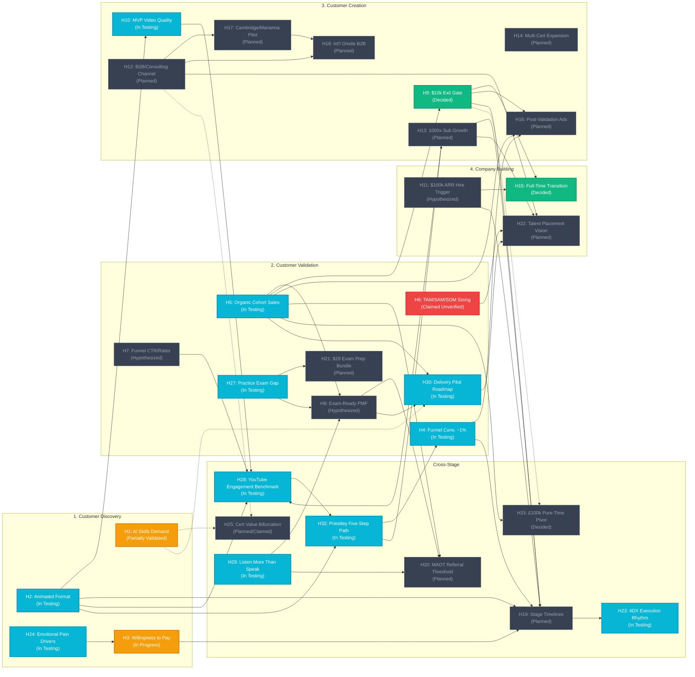

# Hypothesis Tracker — AI Certification Helper

**Version:** 1.279.0
**Date:** 2026-08-30
**Purpose:** Consolidate every hypothesis stated across the site's stage/component pages into a single premise → conclusion → status record, so progress toward validating (or killing) each one can be tracked in one place. Cross-referenced against `5_Symbols/product/community-timeline-roadmap.html` (Community Timeline & Member Roadmap: mapping the dual pathways from fast Pearson VUE certification graduates to elite Delivery Pilots accessing the private `deliverypilot.net` backend secret society across H5, H8, H20, H30), `5_Symbols/strategy/being-useful-for-the-other.html` (Master operational blueprint on How Can This Business Be Genuinely Useful for the Audience — establishing the 6 Pillars of Genuine Utility [pedagogical empathy & making learners feel smart, dual-engine value, Gary Stevenson passion, 60-min turnkey presets, high-touch empathy, economic freedom & tender alliances] and the 6-question Pre-Creation Litmus Scorecard across H24, H25, H29, H30, H33, H5), `5_Symbols/strategy/intentionality-digital-minimalism.html` (Cal Newport Digital Minimalism strategy blueprint auditing repository ideas, ruthlessly eliminating cognitive noise [doom-scrolling, 500 uncurated repos, fragmented announcement spam], and channeling 65h weekly single-founder bandwidth into high-leverage transformation signals across H23, H29, H30, H33, H5, H9), `5_Symbols/growth/inspirational-youtubers.html` and `5_Symbols/strategy/positive-ai-skills-message.html` (Gary Stevenson @garyseconomics creator benchmark on electrifying raw conviction, direct-to-lens eye contact, $1.3M+ enterprise insider authority, and relentless focus on the core positive AI skills elevation message in every YouTube video across H2, H10, H13, H24, H28, H30), `reports/customer-discovery-ilker-marianna-b2c2b-v1.0.0.md`, `3_Simulation/Interviews/interview_ilker_marianna_b2c2b_2026-08-28.md`, `5_Symbols/strategy/b2c2b-business-model.html`, `5_Symbols/strategy/positive-ai-skills-message.html`, and `5_Symbols/product/what-community-gets.html` (Ilker &amp; Marianna Customer Discovery and advisory session on the B2C2B business model engine, progressive 2B rollout through agile SME pilots pivoting to large enterprise talent sourcing and Forward Deployed Engineers, relentlessly positive AI skills messaging as a 10x capability multiplier, and dual-engine community value balancing proctored Pearson VUE credentials with custom personal AI applications across H1, H5, H8, H12, H22, H24, H25, H29, H30), `reports/customer-discovery-sude-unal-interview-v1.0.0.md` and `3_Simulation/Interviews/interview_sude_unal_2026-08-27.md` (Sude Ünal Customer Discovery interview on asynchronous session review, explicit demand for weekday live application calls, Obsidian Second Brain hybrid search RAG, multi-stage parallelization workflows, and environment inspection post-action verification across H4, H5, H8, H10, H24, H29, H30), `reports/customer-discovery-marianna-pedagogy-first-principles-v1.0.0.md` and `3_Simulation/Interviews/interview_marianna_2026-08-26_first_principles_glossary.md` (Marianna Customer Discovery interview on Curse of Knowledge, Associate certification entry baseline, sub-60s first-principles glossary shorts, and audience empowerment — *"It is not good to make them feel stupid; they should feel smart after watching the content"* — across H2, H10, H24, H25, H29, H30, H1, H8), `reports/customer-discovery-private-quiz-lead-magnet-v1.0.0.md`, `5_Symbols/growth/private-quiz-lead-magnet-tactic.html`, and `3_Simulation/Interviews/interview_feedback_private_quiz_assessment_2026-08-26.md` (Brian & Marianna Customer Discovery feedback on Private Quiz Assessment Lead Magnet Video Tactic & CIA Persuasion Engineering — deploying 7 psychological levers in 60s Roger Rabbit videos routing to interactive `self-assessment.html` across H2, H4, H5, H10, H21, H24, H29, H30), `reports/customer-discovery-marianna-voice-roger-rabbit-v1.0.0.md` and `3_Simulation/Interviews/interview_marianna_2026-08-26.md` (Marianna Customer Discovery interview on combining Founder AI Voice Clone with Dalinea / Roger Rabbit signature animation style for high audience memorability, and shipping the Fal.ai ElevenLabs Studio client repository `https://rifaterdemsahin.github.io/elevenlabs/` across H2, H10, H17, H28, H29, H30), `reports/customer-discovery-cheuk-ho-interview-v1.0.0.md` and `3_Simulation/Interviews/interview_cheuk_ho_2026-08-26.md` (Cheuk Ho National Grid Customer Discovery interview on AI-generated post fatigue, audience engagement drop, and written authentic founder voice SOP H2, H4, H5, H10, H24, H28, H29, H30), `5_Symbols/product/chatgpt-investor-feedback.html` and `reports/chatgpt-narrative-and-investor-feedback-v1.0.0.md` (ChatGPT Web Version narrative and investor readiness review: concept 8/10, market logic 8/10, investor readiness 6/10, 4 rewritten core cards, secret insight on 5-minute visual AI learning, 6-step cohort value stack, and external research citations from GOV.UK 2025, Research & Markets 2026, and Pearson VUE 2026 H1, H2, H3, H5, H6, H8, H12, H21), `reports/customer-discovery-mehmet-interview-v1.0.0.md` (Mehmet Customer Discovery interview on "1k Short vs. 3dk Course", reverse response marketing, and £1,000 corporate vs D2C pricing H2, H3, H5, H10, H12, H21, H24, H28, H29, H30), `5_Symbols/strategy/business-plan-summary.html` (Master Business Plan Summary: 4-Stage CustDev Engine — Discovery, Validation, Creation, and Company Building via `deliverypilot.net` — with audience transformation matrix turning syntax memorizers into £500–£1,000+/day Forward Deployed AI Engineers H30, H9, H13, H11, H1, H5, H8), `5_Symbols/strategy/what-does-delivery-pilot-mean.html` (What Does "Delivery Pilot" Mean?: deconstructing the nomenclature — delivering turn-key enterprise solutions from Point A to Point B, piloting AI swarms and agentic cockpits as Forward Deployed Engineers, and building a community rooted in tangible transformation over passive chatter H30), `5_Symbols/growth/monetization-to-value-creation.html` (Monetization to Value Creation: The $10,000 Small Business Self-Sustaining Community Engine — Coursera 60% take-rate arbitrage [$2k SME + $2k manager vs $6k platform], delivering $10k institutional course value upfront to an owned Skool community, and validating the business model via the Reversed Beard Promise when $10k returns directly H9, H1, H3, H5, H8, H10, H30), `5_Symbols/growth/lead-qualification.html` (Dedicated Lead Qualification Engine & Candidate Scorecard: interactive 100-point qualification calculator, 4-tier triage rubric, Hormozi anti-admittance gates, channel playbooks for Skool, LinkedIn, YouTube, and Enterprise B2B, and empirical candidate case studies H5, H8, H24, H29, H30), `5_Symbols/growth/course-curriculum-learning-objectives.html` (AI Course Curriculum, 5-Minute Modular Video Blueprints with Learning Objectives [LOs], Key Results [KRs], and Community Flywheel Retention Engine paired with the external Content Locator across Certified Associate Foundations, Developer Track, Certified Architect Foundations, and Claude Certified Architect Professional H2, H4, H5, H10, H29, H30), `5_Symbols/growth/course-value-and-free-skool-package.html` ($10,000 Course Market Value & Free YouTube Engine: Coursera $2k instructor + $2k Starweaver production with 3x revenue multiplier, releasing full $10k curriculum free on YouTube, and packaging live presets/support in Skool to power the £500–£1,000/day contractor transformation with Mehmet's founding believer signal H1, H3, H5, H8, H29, H30), `5_Symbols/growth/lead-qualification-system.html` (Lead Qualification & Anti-Admittance System: Alex Hormozi gatekeeping doctrine, 4-tier qualification filter, and turning away low-commitment spectators H5, H30), `5_Symbols/growth/truth-in-marketing-evidence.html` (Truth in Marketing: empirical input/output matrix, publishing only verifiable proctored Credly badges and public code while strictly protecting candidate privacy and B. anonymization H5, H8, H29, H30), `5_Symbols/growth/free-youtube-jab-jab-package.html` (Free YouTube Course Engine: 100% free unredacted YouTube modules as Jabs and the Delivery Pilot Roadmap/Community as the Left Hook package to shatter perceived value limits H2, H5, H10, H30), `5_Symbols/product/skool-gamification-levels.html` (Skool Gamification Levels: meritocratic Level 8 Delivery Pilot graduation gate and Level 9 alumni mentor flywheel H5, H8, H20, H30), `5_Symbols/strategy/enterprise-demanded-certifications.html` (Enterprise Demanded Certifications & Job Spec Breakdown: empirical analysis of real-world 18-month M365 Copilot Solution Architect contract spec requiring MS-102, SC-401, AB-900, AB-100, AB-730, and the mandatory 2+ certification screening gate for enterprise AI solution architects and Forward Deployed Engineers H1, H14, H25, H30), `5_Symbols/product/skool-audience-emails-and-event-triggers.html` (Skool Audience Emails & Automated Event Triggers: real-world screenshots of 24h transactional event reminder emails, London timezone auto-localization, and Skool member directory administration / VIP tier settings H5, H8, H29, H30), `5_Symbols/strategy/1-1-presets-pivot.html` (1-1 Session Presets: Turning 500 Repos into Curriculum — resolving Elon Musk's inventory waste critique and Alan Watts' hungry ghost ego trap by refactoring 500 personal repositories into a 4-tier live 1-on-1 workshop preset menu and starter scaffolding H30, H29, H5, H8), `5_Symbols/strategy/being-useful-for-the-other.html` (Being Useful for the Other vs. Building Content for Yourself: empirical sanity checks on customer problem-driven curriculum expansion [adding Associate/Foundations courses alongside Architect H25, H1] and refactoring 450 repos into 1-1 VIP preset solution menus [AI Security, Environment, HITL H30, H5, H29, H24]), `5_Symbols/product/free-vip.html` (Free VIP Status: Founder Pledge & Entitlement Logic — Rifat Erdem Sahin's skin-in-the-game beard growth commitment until $10,000 in real value is delivered together, auto VIP for first 3 founding members [Marianna, Sude, B.], and earned VIP for first 10 true audience regulars H5, H8, H9, H30), `reports/customer-discovery-brian-interview-v1.1.0.md` and `3_Simulation/Interviews/interview_brian_2026-08-24.md` (Brian multi-timezone India IST & US EST/PST 1-1 coordination, study slot scarcity forcing function, and failure-triggered course enrollment H5, H8, H24, H25, H29, H30, H1, H3), `reports/customer-discovery-jamal-interview-v1.0.0.md`, `3_Simulation/Interviews/interview_jamal_2026-08-24.md`, `5_Symbols/cd/archived-interview-transcripts.html`, and `5_Symbols/product/exam-performance-evidence.html` (Jamal IT consultant Claude Architect Foundations exam score 644/1000, study material deficit, and enterprise consulting Accenture/IBM/Capgemini $100 pass bonus & voucher reimbursement H12, H27, H8, H21, H25, H1, H3, H30), `5_Symbols/stages/stage-scoring-roadmap.html` (Customer Development Stage Scores & Master Roadmap: comprehensive quantitative scoring of all four Steve Blank stages — Discovery 85/100, Validation 45/100, Creation 15/100, Company Building 05/100 — with active founder position marker, 5-dimension rubrics, and Now/Next/Later execution pipeline across H1–H30), `reports/customer-discovery-b-interview-v1.0.0.md` and `3_Simulation/Interviews/interview_b_2026-08-24.md` (B. Customer Discovery WhatsApp video feedback on acute cognitive burnout, work struggle, voluntary redundancy / exit as catalyst for Forward Deployed Engineer pivot, unshakable Anthropic qualification intent, and async video replays H24, H29, H1, H5, H8, H25, H30), `5_Symbols/product/skool-about-promo-video-script.html` (Skool About Promo Video Script & 8s Scene Animations: 64s Roger Rabbit mixed-reality storyboard, founder voiceover teleprompter, interactive player, and freemium tier positioning H5, H8, H29, H30), `5_Symbols/strategy/why-ai-cert-agentic-dev.html` (Why AI-Certification-Customer-Development as an Agentic Operating System with Antigravity and Grok: multi-agent triad architecture, deterministic git grounding, real-time adversarial red-teaming, 10x discovery synthesis, and pros/cons analysis H23, H29, H30, H5, H8), `5_Symbols/cd/interview-hcl-devops-screen.html` and `reports/customer-discovery-hcl-devops-interview-v1.0.0.md` (HCL SRE & DevOps technical screen customer discovery on enterprise "Pre-AI Era" manual execution mandate, certification irrelevance vs hands-on cluster mastery H25/H1, enterprise AI fear H24, active client listening H29, and dual-track contractor operations H30), `reports/customer-discovery-tomiwa-interview-v1.1.0.md` (Tomiwa Customer Discovery interview v1.1 on 2-day Associate pass, skipping developer, contractor upskilling ROI, 5-person AI team compression, 2-year obsolescence window, and Delivery Pilot FDE contractor alignment H25, H1, H8, H21, H24, H29, H30), `5_Symbols/dashboard/todo.html` and `5_Symbols/product/skool-about.html` (Bulldog Mindset John Sonmez Promise Logic benchmark `https://www.skool.com/bulldog-mindset/about`: demanding a mutual promise/commitment in the orientation video and About copy to replace passive consumption with practitioner work H8, H5, H29, H30), `5_Symbols/strategy/single-founder-bandwidth.html` (Single-Founder Bandwidth ledger and ~65h weekly workload breakdown: 40h day contract + 4–6h contractor marketing, recruiter calls, LinkedIn DMs, future job apps + 7.5h Skool live VIP/cohort calls + 11h YouTube video creation H5, H9, H29, H30), `5_Symbols/product/skool-10-true-regulars.html` and `5_Symbols/product/skool-manual-member-invites.html` (First 10 active members VIP upgrade policy giving full 1-1 access on `https://www.skool.com/delivery-pilot-8938/calendar`: Today 11am–1pm AI Security VIP, Tomorrow 11am–1pm Environment VIP, Fri 11am–1pm HITL VIP, Sun 1pm–2pm Cohort Meeting, Mon 11am–1pm AI Security VIP H8, H5, H29, H30), `5_Symbols/strategy/single-founder-bandwidth.html` and `5_Symbols/strategy/one-vs-many-live.html` (Single-Founder Bandwidth ledger and Live Skool Delivery Pilot call workload: 21 members, 1 online, 1 admin, Monday/Tuesday/Friday 2-hour 1-1 VIP workshops 11am–1pm + Sunday Cohort meeting 1pm–2pm, 7–8 live call hours/week H5, H9, H29, H30), `5_Symbols/product/skool-about.html` (Delivery Pilot Skool About Page: 64s orientation video specification, teleprompter script, Canva assembly link `DAHTHTyS6UU`, and Fal.ai ElevenLabs voiceover asset H5, H8, H29), `5_Symbols/cd/cohort-session-9-analysis.html` (AI Cohort Session 9 Customer Discovery Analysis: 60-min cap, 10-10-15 structure, 3-tier preset project ladder, and VIP 1-on-1 scheduled slots H5, H8, H24, H29, H30), `reports/cohort-session-9-analysis-v1.0.0.md`, `5_Symbols/growth/daily-community-promotion-templates.html` (Daily LinkedIn and X.com Marketing Templates swipe file with 7-day thematic AI customization/self-learning post copy, copy buttons, and Sunday lunchtime WhatsApp broadcast protocol H4, H5, H29, H30), `5_Symbols/strategy/one-vs-many-live.html` (1-1 vs one packed Sunday: fill the live class, cap 1-1 as VIP, H5/H9), `5_Symbols/product/skool-orientation-video-script.html` (Skool Orientation Onboarding Video Script: 64s Roger Rabbit storyboard across 8 scenes of 8s each, founder voiceover teleprompter, and Day-1 activation engine H5, H8, H29, H30), `5_Symbols/strategy/structure-transformation-leadership.html` (Structure, Transformation & Leadership: triadic dynamics connecting lean operational rails, irreversible £500–£1,000/day FDE practitioner leaps, and authentic founder stewardship H30, H23, H29, H8, H5), `5_Symbols/growth/turn-community-to-movement.html` (Turn Community to Movement: 5-stage evolution ladder from audience lurkers to autonomous Forward Deployed Engineer contractor alliance co-bidding on enterprise tenders H30, H29, H5, H8, H11), `5_Symbols/strategy/make-it-about-them.html` (Make It About Them, Not About You: founder failure post-mortem on self-centricity vs customer-led value creation, Hormozi value equations, and operational channel protocols H29, H24, H30, H5, H8), `5_Symbols/strategy/second-brain.html` (AI at the Core: Second Brain Implementation & Niche Research on 4-tier hybrid retrieval, Sude/Bora customer discovery signals, and PARA Obsidian architecture H8, H5, H20, H30), `5_Symbols/strategy/when-to-pivot.html` (When to Pivot: explicit failure triggers, timeout windows, and strategic pivot vectors across H1, H2, H24, H3, H5, H4, H27, H21, H7, H8, H6), `5_Symbols/product/skool-similar-communities.html` and `5_Symbols/strategy/competitive-analysis.html` (RoboNuggets Jay E Agentic OS & Claude automation $97/mo Skool benchmark H5, H1, H8, H30), `reports/customer-discovery-charles-interview-v1.0.0.md` (Charles customer discovery interview on "cooking steak: low and slow" learning philosophy, absence of AI urgency for personal projects without time pressure, and market bifurcation), `5_Symbols/growth/inspirational-youtubers.html` (Inspirational YouTubers & Creator Benchmarks analyzing Ali Abdaal, NetworkChuck, and TechWorld with Nana H2, H10, H13, H28), `5_Symbols/strategy/the-castle-complexity-kills.html` (Franz Kafka's The Castle on systemic inertia and lean autonomous architectures H23, H29, H30), `5_Symbols/strategy/the-bed-of-procrustes.html` (Camil Petrescu's The Bed of Procrustes on subjective reality and branding as perception in the customer's mind H24, H29, H25), `5_Symbols/strategy/the-brothers-karamazov.html` (Fyodor Dostoevsky's The Brothers Karamazov on irrational human nature and emotions moving money H24, H3, H30), `reports/customer-discovery-apo-interview-v1.0.0.md` (Apo customer discovery interview on business revenue uplift over paper credentials, Amazon FBA automation with Claude, and eliminating 100-tab noise), `reports/customer-discovery-anna-interview-v1.0.0.md` (Anna customer discovery interview on 5-10-5 pacing methodology, session duration caps, and cognitive overload guardrails), `reports/customer-discovery-marianna-interview-v1.0.0.md` (Marianna customer discovery interview on Sunday AI Brain labs, practical workshops programme co-creation, and flipped classroom pre-session micro-videos), `5_Symbols/product/skool-static-posts.html` (Skool Static Posts Living Hubs architecture, anti-spam guidelines, copy-paste post rewrites for community resources, and comment-stream curation workflows), `reports/customer-discovery-brian-interview-v1.0.0.md` (Brian customer discovery interview on "skills pay the bills", complex Kubernetes & CI/CD infrastructure, reducing disposability, and client guide demand), `5_Symbols/product/skool-roadmap.html` (Skool 4-Phase Community & Learning Roadmap: Foundation → MVP Classroom with Daily Visuals → 10 True Regulars → VIP Placement Alliance), `5_Symbols/strategy/audience-transformation.html` (Audience Transformation Input-to-Output Matrix: prompt tinkerer/unverified CV → Forward Deployed AI Engineer £500–£1,000+/day contractor), `5_Symbols/growth/audience-roadmap.html` (5-step audience transformation journey: YouTube/LinkedIn → Skool cohorts → Claude Architect MVP course & daily visuals → VIP tier → Delivery Pilot partnership network), `5_Symbols/growth/mvp-roadmap.html` (August 2026 MVP offer path: Studio → Cohorts → Claude course → deliverypilot.net → new jobs created, sourced from `3_Simulation/how_new_jobs_getting_created.jpeg`, H30), `reports/customer-discovery-baran-g-interview-v1.0.0.md` (Baran G discovery interview on tabular AI agent automation & time scarcity), `reports/cohort-session-8-analysis-v1.0.0.md` (AI Cohort Session 8 deep dive), `reports/acidity-check-report-v1.3.0.md` (supersedes v1.2.0), `reports/market-validation-argument-v1.0.md`, `reports/ai-adoption-and-skills-gap-v1.0.md`, `reports/exam-prep-market-and-student-behavior-v1.7.0.md` (supersedes v1.6.0), `reports/skool-founder-posting-sanity-check-v1.0.md`, `reports/skool-workshop-upload-sanity-check-v1.0.md`, `reports/raise-validation-perplexity-v1.0.0.md`, `reports/skool-pricing-feedback-v1.2.0.md` (supersedes v1.1.0 and v1.0.0; founder-finalized live Freemium tier copy, replays on Free, tailored classrooms on Premium, Saturday 1-1 calendar blocks, and /learn integration), `reports/score-fluctuation-analysis-v1.0.0.md` (explaining confidence score moves between v1.9.28 and v1.9.31), `5_Symbols/dashboard/how-to-move-the-score.html` (master playbook of every historical score-up event and ranked evidence levers), `5_Symbols/product/skool-4c.html` (4C community frame: Cause, Culture, Container, Calls), and `reports/business-model-confidence-v1.9.60.md` (a versioned, numeric confidence score computed over every hypothesis below, plus a whole-site integrity check — see `confidence-report.html`) where a status claim is not backed by evidence in the repo, or has since been resolved or changed by new research or a founder decision. Operationally mapped to the Decoupled MVP Architecture Spec on `5_Symbols/comp/comp-mvp.html` (resolving marketing vs product conflation), the Context Engineering Visual Storyboard live MVP app (`https://rifaterdemsahin.github.io/context-engineering/`), the MVP Product vs. Marketing Separation & Remediation Spec on `5_Symbols/comp/comp-mvp-separation.html`, Customer Discovery Interview Transcripts on `5_Symbols/cd/archived-interview-transcripts.html`, New Joiner Welcome Message & FAQ Guide on `5_Symbols/product/skool-new-joiner-welcome-and-faq.html`, Community Building & Business Model Confidence Score architecture on `5_Symbols/growth/community-building-score.html`, AI Cohort Session 8 deep dive on `5_Symbols/cd/cohort-session-8-analysis.html`, Delivery Pilot career transformation pipeline on `5_Symbols/strategy/delivery-pilot-roadmap.html`, community success stories & career transformations on `5_Symbols/strategy/success-stories.html`, free educational content engine on `5_Symbols/growth/free-educational-content-strategy.html`, Skool cost recovery & $99/mo pricing milestone on `5_Symbols/growth/skool-break-even.html`, multi-platform workflow on `5_Symbols/strategy/multi-platform-workflow.html`, student success metrics on `5_Symbols/strategy/student-success.html`, enterprise B2B partnerships on `5_Symbols/strategy/enterprise-partnerships.html`, platform relationships and payment settlement on `5_Symbols/growth/platform-relationships-and-payments.html`, Skool payout dashboard and settlement mechanics on `5_Symbols/product/skool-payout-dashboard.html`, skeptical perception of AI and Linus Torvalds practitioner analysis on `5_Symbols/strategy/perception-of-ai.html`, founder-voice vs AI-voice Skool CTA SOP on `5_Symbols/growth/founder-voice-skool-cta.html`, future sponsorships roadmap on `5_Symbols/growth/future-sponsors.html`, Hormozi Rainmaker VIP lead generation on `5_Symbols/growth/hormozi-vip-leadgen.html`, conversion tactics blueprint on `5_Symbols/growth/conversion-strategy.html`, video conversion mechanics on `5_Symbols/growth/video-conversion-tactics.html`, visual asset system on `5_Symbols/growth/youtube-banner.html`, pricing evolution roadmap on `5_Symbols/growth/pricing-change-strategy.html`, competitive benchmarking on `5_Symbols/strategy/competitive-analysis.html`, community benchmarking on `5_Symbols/product/skool-similar-communities.html`, traffic growth framework on `5_Symbols/product/grow-skool-traffic.html`, LinkedIn profile CTA evaluation on `5_Symbols/growth/linkedin-premium-decision.html`, LinkedIn 30k connection cap & Monday VIP Claude Cowork strategy on `5_Symbols/growth/linkedin-vip-cowork.html`, affiliate milestone timeline on `5_Symbols/growth/skool-affiliate-roadmap.html`, monetization architecture on `5_Symbols/product/skool-monetization.html`, offer design ideas on `5_Symbols/product/skool-offer-ideas.html`, student bandwidth guardrails on `5_Symbols/product/member-bandwidth-guardrails.html`, churn reduction framework on `5_Symbols/growth/skool-churn-retention.html`, common retention patterns on `5_Symbols/growth/skool-common-patterns.html`, community management garden playbook on `5_Symbols/product/skool-community-management.html`, community rules & deletions/bans policy on `5_Symbols/product/community-rules-enforcement.html`, Skool Level 2 posting restriction & anti-spam gate on `5_Symbols/product/skool-level-2-posting-restriction.html`, Skool onboarding checklist activation engine on `5_Symbols/product/skool-onboarding-checklist.html`, Skool manual member invites & tier assignment on `5_Symbols/product/skool-manual-member-invites.html`, Skool membership questions & customer discovery intake on `5_Symbols/product/skool-membership-questions.html`, reading and learning guardrails on `5_Symbols/strategy/reading-and-learning-guardrails.html`, milestone calendar on `5_Symbols/dashboard/calendar.html`, and external tooling directory on `5_Symbols/product/resources.html`.

## Visual Pipeline & Dependency Map



**Status legend:**
- ✅ **Validated** — supported by cited evidence
- 🟡 **In Testing** — experiment defined and running
- ⚪ **Planned** — experiment defined, not yet started
- ⚠️ **Claimed, unverified** — labeled Validated/complete in source doc, but no evidence found in the repo

---

## Stage 1: Customer Discovery

### H1 — Rising AI skills expectations
- **Source:** `comp-problem-solution.html`, `5_Symbols/strategy/skills-gap.html`, `product/idea.html`, `5_Symbols/strategy/raise.html` (named starting-point framing: **R.A.I.S.E.** — Rapid Artificial Intelligence Increases Skills Expectations), `5_Symbols/hypotheses/h1-not-connected.html` (why this node has no arrows on the tracker), `reports/raise-validation-perplexity-v1.0.0.md`, `5_Symbols/strategy/leverages.html` (IT experience)
- **Named framing:** R.A.I.S.E. is the founder origin for this hypothesis: Rifat Erdem Sahin's past profession is Information Technology; his past pain is learning systems that cannot keep pace; as complexity increases, sitting a proctored exam is the path he can authentically teach because he pushes AI to its limits for his own self-learning.
- **Depends on:** None — foundational premise. No upstream hypothesis is cited in the text. Isolation on the live SVG is a documentation pattern (foundational, uncited gap), not a business unused-bet. Leave H1 operationally alone this week; write explicit Feeds citations later. Full read: `5_Symbols/hypotheses/h1-not-connected.html`.
- **Premise 1:** Rapid AI advancement is reshaping job roles and technical expectations.
- **Premise 2:** Employers now expect staff to build agentic chains, configure guardrails, and audit LLM architectures (directionally true, but concentrated in advanced teams; certs act as screens rather than proof).
- **Conclusion:** Demand for AI/LLM skills is structurally rising; certifications are growing as a signaling and L&D mechanism, but they are complements to, not substitutes for, demonstrable ability (refined from "Demand for AI/LLM certification is structurally rising, not a fad").
- **Experiment:** Search volume and job-description scrapes for certification terms.
- **Status:** 🟡 **Partially validated (upgraded 2026-08-01, further corroborated 2026-08-14, external AI review 2026-08-25)** — the repo still contains no search-volume/job-scrape dataset backing the original "Validated" label, but independent research now corroborates the underlying claim from three directions: (1) Anthropic's Claude Partner Network ties consulting-firm partner tiers to certified-practitioner headcounts (10 for Select, 100 for Preferred, 1,000 for Global Premier — mirroring AWS Partner Network's identical mechanic), and 2026 compensation data shows 30–40% pay premiums for generative-AI skills at firms like Accenture and TCS (`reports/market-validation-argument-v1.0.md`); (2) a full 2020–2026 timeline shows AI/big data skill demand rising 17 percentage points since 2023, 63% of employers naming the skills gap their top transformation barrier, and 75% reporting no formal in-house AI training (`reports/ai-adoption-and-skills-gap-v1.0.md`); (3) **new 2026-08-04:** three well-resourced vendors have independently shipped or expanded competing AI certification programs within months of each other — Anthropic's Claude Certified Architect (live since March 2026, backed by a $100M Claude Partner Network investment, now three role tracks and four proctored exams via Pearson VUE/OnVUE as of July 2026), Google's Gemini certifications, and Microsoft's Azure AI credentials. Multiple independent, well-capitalized companies racing into the same certification category in the same year is itself corroborating evidence that employer demand for provable AI/LLM skills is structurally real, not this site's niche bet — see `competitive-analysis.html` for the resulting competitive-positioning implications. **New (2026-08-05):** added a live [Google Trends link — "ai certification," worldwide, all time](https://trends.google.com/explore?q=ai%20certification&date=all&geo=Worldwide) as the first concrete pointer toward this hypothesis's own named Experiment (search volume for certification terms). **Founder read (2026-08-05):** the chart shows **growth** in "ai certification" search interest over the full available time range — a real, if informal (not yet a logged CSV/numeric export), positive data point supporting the Target metric of steady monthly search growth. Referenced in `evidence-map.html`. Still short of full validation (no exported numeric series logged yet), but no longer just a placeholder link. **New open risk (2026-08-10):** the Charles LinkedIn evidence (see H8, H12) shows his exam prep came via an *employer-sponsored* Anthropic Partner Network course, raising an unverified but potentially serious question — is the certification genuinely open to individual, non-Partner-affiliated candidates, or does meaningful access run through employer sponsorship? If the latter, the addressable market this hypothesis assumes (individual technical professionals studying independently) may be smaller or differently-shaped than assumed. Logged as acidity check Finding F12 (`reports/acidity-check-report-v1.3.0.md`) and a new row on `risk-analysis.html`'s Risk Register — not yet resolved either way. **New (2026-08-10):** Corporate discovery interview confirms that practitioners view certification as vital for long-term career growth, and that leadership shows strong enthusiasm (GPU and Palantir investments), though team-level adoption is slow. See `reports/exam-prep-market-and-student-behavior-v1.3.0.md`. **New (2026-08-11):** Tuncer's qualitative discovery interview confirms senior self-learning career boosting, but warns of severe time/energy loss when AI is implemented in the wrong version or configuration. See `reports/exam-prep-market-and-student-behavior-v1.3.0.md`. **New (2026-08-14):** Independent Perplexity research validation (`reports/raise-validation-perplexity-v1.0.0.md`) confirms that the R.A.I.S.E. framing is internally consistent and aligns with observable market signals. The research supports Premise 1 with job-market data (share of AI job postings up from 0.5% in 2010 to 1.7% in 2024; AI education market at $16.2B in 2024), but adds nuance to Premise 2 and the Conclusion: while AI skills demand is rising structurally, certifications serve as filters/screens rather than proof of competence, and hiring managers place heavier weight on demonstrable skill and role-specific evaluations. **New (2026-08-14) — Mehmet:** immigrant talent is poorly vetted; the old hiring check is no longer valid; proctored exams rise in value for institutional hires; governments employing MSPs should staff certified people to attract the best talent. One named voice supporting Premise 2 (certs as screens). Status tier unchanged. See `reports/exam-prep-market-and-student-behavior-v1.6.0.md` and `5_Symbols/cd/archived-interview-transcripts.html`. **Recovered onto main (2026-08-19) from leftover branch `claude/business-overview-references-kxwhhz`:** Hitesh, a 20-person telco IT business owner introduced via Rakesh, independently asked his own team to learn Claude — SME-scale employer-driven demand, not Partner-Network validation. Status tier unchanged. **New (2026-08-19) — Cheuk (National Grid), first name only:** tried to enroll and could not. *“You know only enterprise partners with Claude has access to these certifications. I triend looking up how I can enroll and I can't sign up yet.”* Walk-up individual TAM is partner-gated. Founder-confirmed mitigation: two partner companies in the system help and enroll people. F12 🟡 PARTIALLY ADDRESSED. See `5_Symbols/cd/archived-interview-transcripts.html` and `reports/acidity-check-report-v1.4.0.md`. **New (2026-08-19) — Bulent (Indian SI & TCS Workforce Vetting):** Indian IT services giants (like TCS) need certified professionals to vet massive candidate pools at scale and enforce an objective standard of quality across their workforce. Direct industry confirmation of Premise 1 and Premise 2 (certs as workforce quality baseline filters). Status tier unchanged. See `5_Symbols/cd/archived-interview-transcripts.html` and `5_Symbols/strategy/enterprise-partnerships.html`. **New (2026-08-24) — HCL SRE/DevOps Technical Screen:** Enterprise technical panel (Vidya Sagar) confirms that cloud certifications are secondary filters compared to hands-on cluster and IaC track record (*"No, certification is not needed if you have hands-on expertise handling clusters"*). Confirms Premise 2 nuance: enterprise hiring values production architecture over paper badges. See `5_Symbols/cd/interview-hcl-devops-screen.html` and `reports/customer-discovery-hcl-devops-interview-v1.0.0.md`. **New (2026-08-29) — Charles WhatsApp (MCP omitted from Associate):** Named Associate-certified practitioner (917/1000) : *“even after the associate exam the mcp term is not there having a commong language matters.”* Skills bar now includes Model Context Protocol vocabulary the official exam never names. See `reports/customer-discovery-charles-interview-v1.1.0.md` and `5_Symbols/product/dictionary.html#mcp`. Status tier unchanged (🟡 Partially Validated). **New (2026-08-30) — Charles (Claude Cowork daily status report):** While learning certification course content: *“We need Claude CoWork for the daily status report.”* Skills bar includes Anthropic Claude Cowork as the lab that ships Monday’s report — distinct from Monday VIP recruiter sessions. Curriculum: Associate Video 2.4 on `course-curriculum-learning-objectives.html`. See `reports/customer-discovery-charles-interview-v1.2.0.md` and `5_Symbols/product/dictionary.html#claude-cowork`. Status tier unchanged (🟡 Partially Validated). **New (2026-08-25) — External ChatGPT Investor Review:** External review graded concept 8/10 and market logic 8/10, confirming the core thesis that AI reshapes technical roles faster than traditional training can adapt. Sourced external reports: GOV.UK AI Labour Market Survey 2025 (`gov.uk`), Research & Markets 2026 AI Certification Courses (`researchandmarkets.com`), and Pearson VUE 2026 Value of IT Certification (`pearsonvue.com`). See `reports/chatgpt-narrative-and-investor-feedback-v1.0.0.md` and `5_Symbols/product/chatgpt-investor-feedback.html`. Status tier unchanged (🟡 Partially Validated). **New (2026-08-30) — Faruk (CEO):** AI is mostly used in marketing; operations is not; hired ops juniors miss must-haves and business demand; he does not see the AI↔ops-junior connect. Skills bar a CEO measures is ops execution of must-haves, not marketing AI fluency. See `reports/customer-discovery-faruk-interview-v1.0.0.md`. Status tier unchanged (🟡 Partially Validated).

### H2 — Audience prefers animated summaries over dry materials
- **Source:** `comp-problem-solution.html`, `comp-mvp.html`, `comp-mvp-separation.html`, `growth/content-format.html`, `growth/marketing-tactics.html`, `growth/instagram-marketing-pipeline.html`, `product/skool-workshop-upload.html`, `5_Symbols/strategy/leverages.html` (YouTube video reach)
- **Depends on:** None — foundational Stage 1 content-format premise. Feeds H10 (H10's catalog-wide retention metric extends this hypothesis's single-video proof).
- **Premise 1:** Standard cert-prep material (500-page manuals, 40-hour courses) causes cognitive fatigue and low completion.
- **Premise 2:** Animated, visually distilled explanations increase retention.
- **Conclusion:** An animated video format will outperform standard formats on watch retention.
- **Experiment:** A/B test animated explanation vs. standard slide deck.
- **Target metric:** >40% watch retention on the animated version.
- **Design Plan:** Detailed visual design guidelines, storyboards, and asset templates are mapped out on the [Canva Animation Design & Planning](https://www.canva.com/design/DAHRZe5KBoA/OJU0sL318CozUaTBpkdT2g/edit) board.
- **Active MVP Iteration Repo (2026-08-17, current workspace 2026-08-30):** [aug-video-animation-6-core-message](https://github.com/rifaterdemsahin/aug-video-animation-6-core-message) (live [Pages](https://rifaterdemsahin.github.io/aug-video-animation-6-core-message/), [tools-and-timelines.html](https://rifaterdemsahin.github.io/aug-video-animation-6-core-message/tools-and-timelines.html)) is the current per-video production workspace. Pattern: one GitHub repo + Jules-scaffolded Pages board per short. `aug-video-animation-2` remains the original shared engine. SOP: `5_Symbols/growth/animation-shorts-pipeline.html`. Operationalizes "Reverse Response Marketing": tracking popular YouTube topics, reversing the mainstream consensus, injecting controversial practitioner perspectives (enterprise contractor/FDE realities), and repackaging as animated video assets.
- **Live MVP Interactive Visual Storyboard (2026-08-18):** [Context Engineering for Dummies](https://rifaterdemsahin.github.io/context-engineering/) (`https://rifaterdemsahin.github.io/context-engineering/`) &mdash; bridges marketing and product via interactive sequential storyboard analogies. Direct customer feedback from Bora (2026-08-18) validates: *"The visualization reinforced the analogy even further. In my opinion, this is more effective than storyboard-style, AI-generated infographics... Infographics are visually appealing, but sometimes instead of simplifying complex topics, they make them even more complicated."* Confirms structured visual analogies outperform decorative AI infographics, with direct customer pull for real-life enterprise practitioner cases.
- **Status:** 🟡 **In Testing — empirical 28-day telemetry & interactive MVP validation (upgraded 2026-08-04, updated 2026-08-30):** **New (2026-08-30) — Face-to-Face Core Message complement:** founder-confirmed tactic from Chuck Keith / NetworkChuck (`https://lnkd.in/p/ezquTjde`): promote the Video 6 thesis looking at the audience, not only via animation. Does not kill H2 (animation still teaches glossary/retention). SOP: `5_Symbols/growth/face-to-face-core-message.html`. Status tier unchanged. YouTube Studio Analytics (last 28 days & real-time 48h) demonstrates that animated concept delivery and kinetic YouTube Shorts drive rapid audience discovery: **228 views in 48 hours**, led by *They Called AI a Con* (**135 views in 48h / 130 in 28d**), *How LLMs Actually Read: Tokenization* (**40 views in 48h / 93 in 28d**), and *How I Run AI Agents for $0* (**37 views in 48h / 53 in 28d**), alongside high retention shorts clearing >60–85% AVD. In contrast, 2m+ non-animated tutorials averaged 10.7%–17.9%. Combined with direct practitioner validation on the interactive visual storyboard web app (`rifaterdemsahin.github.io/context-engineering/`), this confirms concise, animated visual models outperform standard static decks and unedited long-form video. Active production continues in `aug-video-animation-6-core-message` (studio SOP) and `context-engineering`. **New (2026-08-30) — measured studio session:** 07:52–10:22 (2h 30m) shipped two Shorts (`OGB69NVn8ZU`, `omC9xa6G7u4` *Don't Blame Your Degree. Level Up Your Circle.*) plus a live Pages board. Host mix: GitHub 55, Flow 49, YouTube Studio 27, Jules 18. Does not replace the 1-hour train glossary SOP. See `5_Symbols/growth/animation-shorts-pipeline.html`, `sales-marketing-roadmap.html`, `content-analysis.html`, `youtube-channel-metrics.html`, `comp-mvp.html`, and `comp-mvp-separation.html`. **New (2026-08-19) — voice is a separate variable:** two independent viewers of `youtu.be/27jXA2V2Zio` (*AI Isn't a Bubble*) did not disagree with the content; they rejected an automated voice when the video sells Skool. Does not kill H2. SOP: AI may teach; founder speaks the ask. See `5_Symbols/growth/founder-voice-skool-cta.html`. **New (2026-08-25) — External ChatGPT Review on Visual Learning:** External AI evaluation confirmed the core secret insight: *"AI-generated visual explanations reduce learning time for complex cloud and AI concepts by turning dense technical material into 5-minute animations."* Recommends ongoing empirical testing of whether visual learning leads to measurable exam pass-rate differences over text-heavy guides. See `reports/chatgpt-narrative-and-investor-feedback-v1.0.0.md` and `5_Symbols/product/chatgpt-investor-feedback.html`. **New (2026-08-26) — Marianna (AI Voice Clone + Dalinea Roger Rabbit Signature):** Customer discovery feedback from Marianna: *"Use your AI version of the voice with the signature of the dalinea as Roger Rabbit style to make it memorable for the audience."* Directly synthesized by creating and shipping the `elevenlabs` client repo ([https://rifaterdemsahin.github.io/elevenlabs/](https://rifaterdemsahin.github.io/elevenlabs/)) powered by **fal.ai serverless GPU infrastructure** with dot-acronym formatting and emotion markers. Combines distinct visual animation with founder's acoustic identity to maximize audience memorability and channel retention. See `reports/customer-discovery-marianna-voice-roger-rabbit-v1.0.0.md` and `5_Symbols/growth/roger-rabbit-animation.html`. **New (2026-08-26) — Marianna (Curse of Knowledge, Sub-60s Glossary Shorts & Learner Empowerment):** Customer discovery feedback from Marianna: *"Something that sounds simple and nothing to Rifat is a lot for the audience to capture. Most people start with the associate certificate, and Rifat should focus on making videos that are like a glossary and shorts format where he takes it to first principles and goes over them in less than a minute. If he wants to make videos not for himself but for others, that is what the others are struggling to learn. It is not good to make them feel stupid — they should feel smart after watching the content."* Directly operationalized in `5_Symbols/growth/content-format.html`, `5_Symbols/product/dictionary.html`, and `reports/customer-discovery-marianna-pedagogy-first-principles-v1.0.0.md`. Status tier unchanged (🟡 In Testing).

### H3 — Audience will pay for certification prep
- **Source:** `comp-problem-solution.html`, `strategy/alex-hormozi-agent.html` (Hormozi read: catalog vs Grand Slam Offer; value-equation likelihood is the conversion leak), `5_Symbols/strategy/leverages.html` (Location/Luck: London Venture Coffee), `product/skool-membership-questions.html` (Intake VoC prompt: "What do you hope to get out of the group?")
- **Depends on:** None — foundational Stage 1 premise. Feeds H19 (Discovery-stage exit condition).
- **Premise 1:** Viewers who complete free content have expressed problem-level need.
- **Premise 2:** A subset of highly engaged viewers will convert to paying customers if offered a low-friction next step.
- **Conclusion:** Newsletter signup with visible pricing will surface real purchase intent.
- **Experiment:** Newsletter signup with a pricing-details page on the main site.
- **Target metric:** >5% email signup conversion.
- **Status:** 🟡 In Progress (upgraded 2026-08-04). The email newsletter signup is now being built — live at [rifaterdemsahin.github.io/email-newsletter](https://rifaterdemsahin.github.io/email-newsletter/). **Dual capture points (added 2026-08-04):** there are two separate signup entry points feeding this same email list — one linked from LinkedIn posts, one linked from YouTube video descriptions — reaching two different audiences (Rifat's LinkedIn professional network vs. organic YouTube search traffic) and acting as backups for each other if one channel's link or traffic underperforms. See `comp-funnel.html` and `sales-pipeline.html` for where this is reflected in the funnel. The >5% signup conversion target is not yet measured (no pricing page traffic routed to it yet); tracked as an in-progress task — see `todo.html`. **New (2026-08-05):** first direct problem-level-need signals arrived outside the newsletter funnel — Charles reached out directly asking for exam-prep help, and Baris set up a dedicated WhatsApp channel through which **5 discovery calls with 5 working professionals** about exam prep have now been completed. Real Premise 1 evidence (expressed problem-level need), but a separate signal from the newsletter's own unmeasured >5% conversion target. **New (2026-08-10):** Discovery interview reveals exam price elasticity: practitioners are planning to pursue Developer certification next at a higher cost (£125 Developer vs. £75 Associate), indicating intent to pay more for advanced tiers. See `reports/exam-prep-market-and-student-behavior-v1.3.0.md`. **New (2026-08-17) — Skool Membership Intake Continuous Discovery:** New applicants answer the 4 AI learning pillars and open text prompt ("What do you hope to get out of the group?"), continuously feeding verbatim customer problem statements into the discovery pipeline. See `5_Symbols/product/skool-membership-questions.html`. **New (2026-08-29) — Charles did not pay competitors:** *“Lots of competitors in your space”* / founder asked *“Did u paid them”* / *“I didn't pay them.”* Crowded awareness is not paid conversion. The unpaid gap he named is common language (MCP missing from Associate). Not a $10/mo or $250–$500 signal for us either. Status tier unchanged (🟡 In Progress). See `reports/customer-discovery-charles-interview-v1.1.0.md` and `5_Symbols/strategy/competitive-analysis.html`.

### H24 — AI certification interest is primarily driven by emotional factors (greed, fear, insecurity)
- **Source:** `5_Symbols/strategy/pain-points.html`
- **Depends on:** None — foundational Stage 1 premise. Feeds H3 (Willingness to Pay).
- **Premise 1:** Preparing for professional exams is high-friction, stressful, and expensive; happy and content professionals rarely volunteer for this.
- **Premise 2:** Candidates are driven by fear of obsolescence, greed for pay premiums/leverage, or insecurity (imposter syndrome).
- **Conclusion:** Marketing and product design must target anxiety relief, career security, and status/financial shortcuts rather than just dry academic information.
- **Experiment:** Qualitative discovery interviews logging core motivations of participants.
- **Target metric:** >80% of interviewed candidates cite greed, fear, or insecurity as their primary driver for certification.
- **Status:** 🟡 **In Testing (new, 2026-08-11)** — qualitative discovery interviews confirm high motivation based on career boosting and time/configuration anxiety. See `reports/exam-prep-market-and-student-behavior-v1.3.0.md` and `5_Symbols/strategy/pain-points.html`. **New (2026-08-24) — HCL SRE/DevOps Technical Screen (Enterprise AI Resistance & Fear):** Real-world enterprise screening confirms that large enterprises operate under extreme risk aversion regarding AI tooling in live environments (*"Please do not mention AI—focus on hands-on work from the pre-AI era... mostly manual hands-on execution"*). Validates that enterprise resistance and middle-management fear create a strict boundary: contractors must project stability on bedrock legacy systems while using AI tools in personal workflows. See `5_Symbols/cd/interview-hcl-devops-screen.html` and `reports/customer-discovery-hcl-devops-interview-v1.0.0.md`. **New (2026-08-26) — Marianna (Audience Empowerment & Psychological Safety):** Enterprise testing lead Marianna highlights the critical psychological barrier of learner intimidation: *"If he wants to make videos not for himself but for others, that is what the others are struggling to learn. It is not good to make them feel stupid — they should feel smart after watching the content."* Validates Premise 2 and Conclusion: over-indexing on dense jargon inflates imposter syndrome; pedagogical empathy and first-principles mastery deliver positive emotional reinforcement that converts anxious learners into confident community members. See `reports/customer-discovery-marianna-pedagogy-first-principles-v1.0.0.md`. **New (2026-08-30) — Faruk (CEO):** buyer-side boredom with non-value-driven AI applications. Complements candidate fear/greed: the CEO is tired of theater while ops juniors miss must-haves. See `reports/customer-discovery-faruk-interview-v1.0.0.md`. Status tier unchanged (🟡 In Testing). **New (2026-08-30) — Cohort Session 10:** Chidi fire-hose quote and Mariana “go to the simplicity” continue the intimidation/complexity pain. Status tier unchanged. See `reports/cohort-session-10-analysis-v1.0.0.md`.

---

## Stage 2: Customer Validation

### H4 — The YouTube funnel converts to paid membership at ~1%
- **Source:** `comp-business-model.html`, `product/skool-vs-youtube.html`, `product/youtube-skool-handoff.html`, `growth/youtube-titles-skool-mapping.html`, `growth/content-format.html`, `strategy/alex-hormozi-agent.html` (Core Four: posted content needs one CTA into one offer)
- **Depends on:** None — foundational Stage 2 funnel premise (numerically unreconciled with peer hypothesis H7 — see Finding F5). Feeds H16 (organic-funnel CAC benchmark) and H19 (production-pace baseline).
- **Premise 1:** Free YouTube content builds trust and traffic at scale.
- **Premise 2:** A fraction of viewers will value the $10/mo community enough to subscribe.
- **Conclusion:** Out of every 1,000 free-course views, at least 10 viewers will join the $10/mo membership.
- **Status:** 🟡 **In Testing (upgraded 2026-08-02)** — no longer untested: a free weekly cohort has run for 8 consecutive weeks (June–July 2026) with a steady audience of ~4 attendees per session. This validates that free content converts into repeat live engagement; the specific 1% view→paid-membership conversion figure is still unmeasured. **Production capacity decision (added 2026-08-04):** the funnel's top-of-funnel input is gated by content volume, so the founder has set a baseline goal of **3 animated videos produced per week** and has reallocated the time he previously spent watching video content toward creating animations instead, to grow the number of views feeding this funnel. Tracked as a recurring weekly task on `5_Symbols/dashboard/todo.html` (not a one-off backlog item). **New (2026-08-05):** the free Sunday cohort's audience is now growing beyond the original ~4/session baseline recorded above — an updated exact headcount has not yet been logged, so this is tracked as a directional trend to confirm with a real number at the next session, not yet a revised figure for the ~1% conversion target itself. **New (2026-08-19):** two independent viewers of `youtu.be/27jXA2V2Zio` flagged automated voice on the Skool ask as a conversion leak. Content accepted. Founder-voice SOP: `5_Symbols/growth/founder-voice-skool-cta.html`. Status tier unchanged. **New (2026-08-27):** glossary Short `KVKJRdkH-B8` was a **1-hour train** run of Gemini → Google Flow → Canva (`glossary-short-pipeline.html`). 3 shorts/week at that cost is ~3h, not 11h. **New (2026-08-30):** studio core-message session measured **2h 30m** (07:52–10:22) including a new per-video GitHub Pages board (`aug-video-animation-6-core-message`). That clock is for manifesto shorts, not the commute glossary. SOP: `5_Symbols/growth/animation-shorts-pipeline.html`. **Same day — H32 / Tuncer fence:** 224 channel views / 28 days and 34 views on the tokenization Short are not 1% paid conversion; a 300-video backlog is not this funnel. See `youtube-shorts.html`. Status tier unchanged — still no 1% paid conversion. **New (2026-08-30) — Cohort Session 10:** summary PDF ~5× viewer retention on faceless shorts; founder ~150-view core-message short and 100+ Skool conversations YouTube never produced. Still not 1% paid. See `reports/cohort-session-10-analysis-v1.0.0.md`.

### H5 — Cohorts sell out organically without paid ads
- **Source:** `product/skool-validation-speed-setup.html` (Stage 2 messy-room speed lever; eight founder fixes; not agency spend), `comp-business-model.html`, `product/skool-4c.html` (4C map: Calls = Sunday / Monday; Container = Skool), `product/skool-live-join.html` (Sunday join playbook: group URL before `/live/`, Tuncer 2026-08-23), `product/skool-lms-integration.html`, `product/skool-vs-youtube.html`, `product/youtube-skool-handoff.html`, `product/skool-posting-sanity-check.html`, `product/skool-workshop-upload.html`, `product/cohort-session-permissions.html` (Sunday recording consent on membership Question 3), `product/skool-founding-members.html`, `product/skool-community-golden-rules.html`, `product/skool-manual-member-invites.html` (manual email invites & complimentary tier assignment), `product/skool-delivery-pilot-offer.html` (live Skool checkout rewrite: Peek $0 / Sit In $1 / Share Screen $250/year), `reports/skool-pricing-feedback-v1.0.0.md` (founder-confirmed Freemium entitlements: Standard $0 / Premium $1 / VIP $250/year), `product/skool-about.html` (live About-tab copy — replaces the “get certified” listing line; maps each block to system pages), `product/skool-discoverability-keywords.html` (recommended discoverability keywords to index the group in Skool directory), `product/skool-visibility.html` (how to set Private vs Public; recommend Public so strangers can read the board and Discovery/keywords work), `strategy/listen-more-than-you-speak.html` (H29 founder listening role — retention mechanic, not paid enrollments), `growth/youtube-titles-skool-mapping.html`, `reports/skool-founder-posting-sanity-check-v1.0.md`, `reports/skool-workshop-upload-sanity-check-v1.0.md`, `product/vc-feedback.html` (VF3 — free-cohort attendance is discovery, not traction), `strategy/alex-hormozi-agent.html` (Sunday live is a discovery magnet, not the Grand Slam), `strategy/one-vs-many-live.html` (Hormozi delivery: fill one Sunday; cap 1-1; no extra live nights until sell-out)
- **Depends on:** None — foundational Stage 2 cohort premise. Feeds H9 (explicit — this is the literal revenue basis of the $10k gate), H8 (Premise 4/5's free-cohort mechanics are cited as live peer-accountability evidence), and H16 (the organic-acquisition baseline any paid-ad CAC would be benchmarked against).
- **Premise 1:** Cohort announcements reach an engaged audience via video callouts and the newsletter list.
- **Premise 2 (revised 2026-08-01):** That audience is willing to pay $250–500 for live-streamed, real-time problem-solving sessions, community membership, and the discipline/network that comes with them — **not** for a promised exam outcome. The founder has explicitly clarified: "we do not grant the passing of the exam, the certification" — that is issued solely by Anthropic via Pearson VUE.
- **Premise 3 (delivery model defined, 2026-08-02; revised 2026-08-07):** The $10/mo membership tier includes access to **recorded** cohort replays (async, self-paced). The $250–$500 range is **not** a single-event bootcamp price — it is two live-cohort membership durations, both of which include everything in the $10/mo membership plus live attendance with the ability to share their screen: **$250 buys a 3-month cohort join**, **$500 buys a yearly (12-month) cohort join**. The earlier "day-long session with scheduled breaks" framing describes the cadence of live sessions *within* either duration tier, not the offer itself.
- **Premise 4 (channel mechanics, added 2026-08-04; clock moved 2026-08-30):** The current cohort (still the free tier, ahead of any paid launch) runs live every **Sunday 13:30–14:30 UK** (moved from Sunday 21:00 UK) **after feedback from even the UK audience**, not only overseas timezone mapping. The same afternoon slot still overlaps **India evening (~18:00 IST)** and **US East morning (~08:30 EDT)**. Session 9 already flagged late Sunday 2-hour labs as cognitively fatiguing for UK/Cambridge attendees. Marketed with **$0 ad spend via WhatsApp, Saturday LinkedIn invitations, and face-to-face outreach**, not paid channels. WhatsApp reminders fire Sunday 10:00–12:00 UK, before the lab. **Saturday LinkedIn swipe file (2026-08-30):** eight dated invitations for 6 Sep–25 Oct 2026 (posted the Saturday before; never “Today”) live at `5_Symbols/growth/linkedin-saturday-invites.html`. The founder reports this free cohort format directly helps build content and collect feedback, and increases his own confidence in the offer ahead of a paid launch. Spec: `5_Symbols/hypotheses/hyp-h5.html`.
- **Premise 5 (weekly prep loop, added 2026-08-04):** The cohort is not just the single live session — during the week leading up to it, the founder shares an install list (tools/SDKs/accounts needed) and a preview of upcoming content over **WhatsApp and Discord**, so attendees arrive already set up and spend the live time hands-on rather than on setup. See `cohort-prep.html`.
- **Premise 6 (referral growth, added 2026-08-05; named pair 2026-08-13):** Beyond the founder's own direct outreach (Premise 4), existing attendees are starting to bring other people into the cohort themselves — a genuine word-of-mouth loop, not just founder-driven invitation. **Named pair (2026-08-13):** Sude was invited by Bihar — the first named referrer→invitee pair in this loop. Founder read: genuine connection is more important than mass marketing at this stage (ads stay gated by H16). See `hyp-h5.html`.
- **Premise 7 (meetup-driven motivation, non-product evidence, added 2026-08-07; corrected & de-anonymized 2026-08-12):** Charles (the same named contact already cited in H3, H8, H12, H21) passed the Claude Certified Associate Foundations exam (**917/1000**, vs. a 720 pass threshold) after **2 weeks** of prep, having gotten involved and inspired purely through in-person conversations at meetups (Thursday Venture Coffee/Triton Square, Cambridge Bradmore Centre) — **not** through any of our paid products. Their primary study resource was the official Anthropic Partner Network materials via Skilljar, not our videos, cohort, or the $29 bundle. This is evidence the meetup/conversation channel converts strangers into people who actually sit and pass the exam — but explicitly **not** evidence our study product itself works, since they never used it. **Correction (2026-08-12):** this candidate was originally logged anonymized and treated as a separate individual from the Charles LinkedIn/Capgemini citation elsewhere on the site (see H12, H8) — they are the same person; his discovery-interview transcript had also recorded an interim score of 705/1000, since corrected to the confirmed official 917/1000. He separately noted he felt his **existing knowledge alone could likely have passed** even without the 2 weeks of dedicated study. Full write-up: `exam-performance-evidence.html`; interview correction: `5_Symbols/cd/archived-interview-transcripts.html`.
- **Premise 8 (Skool platform live, added 2026-08-11):** The `skool-lms-integration.html`-specified LMS is no longer just a plan — the founder has deployed the community on **skool.com**, migrated all 8 recorded sessions from the free Sunday cohort into the Classroom, configured membership **levels** (gamification tiers), and added his founder bio. The invite link has been shared through the existing channels (WhatsApp/YouTube/LinkedIn). This is the first time the actual mechanism this hypothesis's conclusion depends on — a real, shareable cohort/membership storefront — has existed and been used, rather than being described.
- **Premise 9 (Skool checkout preview ramp, added 2026-08-14; entitlements confirmed 2026-08-14; About video added 2026-08-24):** The live Delivery Pilot join page is **Freemium** and bills three plans — **$0/month Standard, $1/month Premium, $250/year VIP**. Founder-confirmed entitlements: Standard = posts, learning materials, welcome interactions; Premium = additional recorded workshops + listen-only Sunday live; VIP = screen-share, personal architecture assistance, founder setup reviews. That ladder is being rewritten as a Hormozi preview ramp, not as a replacement of Premise 3's $10/mo + $250 (3-month) / $500 (year) revenue model: **Peek ($0)** = see the room (lead magnet; one sample, not the whole Classroom); **Sit In ($1/mo)** = listen-only Sunday (tripwire, not the cohort); **Share Screen ($250/year)** = live screen-share seat (the offer — Sunday in the room, not unbounded 1:1). The $1 plan must not own the word "cohort." $0 and $1 joins remain community signups; only a cleared $250 Share Screen payment counts toward this hypothesis's paid-enrollment conclusion. Spec and paste-ready copy: `product/skool-delivery-pilot-offer.html`. Feedback grade and VIP-bandwidth cap: `reports/skool-pricing-feedback-v1.0.0.md`. **About tab & video (added 2026-08-14; video added 2026-08-24):** the live listing line still says “get certified as a Claude Architect.” Paste-ready replacement — and a block-by-block map back to system pages plus 64s orientation video specification and Canva/ElevenLabs generation assets — is `product/skool-about.html` (https://www.skool.com/delivery-pilot-8938/about). About copy is not a paid-enrollment signal.
- **Premise 10 (Skool discoverability keywords, added 2026-08-14):** In order for Skool search and directory crawlers to index and match the group to searchers seeking Claude certification help, discoverability keywords must be configured under Group Settings. The core set of keywords is defined on `product/skool-discoverability-keywords.html` (e.g. `Claude Certified Architect`, `Anthropic Claude`, `AI Certification`, `AI Engineering`, etc.) to target both primary certification searchers and broader technical AI-practitioner queries. Discoverability settings do not represent paid enrollments.
- **Premise 11 (Skool visibility Public vs Private, added 2026-08-14; confirmed Public 2026-08-14; availability tested 2026-08-14):** Delivery Pilot is **Public** (“Anyone can see what's inside. Only members can post.”) rather than **Private** (“Only members can see what's inside.”). Founder confirmed the live toggle on 2026-08-14. A logged-out availability check (`5_Symbols/toolbox/skool_availability_check.py`, `reports/skool-availability-v1.0.0.md`) fetched https://www.skool.com/delivery-pilot-8938 with no cookie and passed 11/11 gates: HTTP 200, `currentGroup.public = True`, `metadata.privacy = 0`, **11 members**, **14 posts** readable by a stranger. Public lets a stranger read the community board before joining, keeps Classroom / Sunday / Share Screen gated by plan, and is the prerequisite for Premise 10's keywords and Skool Discovery. Private would hide the board and take the group out of search. How-to: `product/skool-visibility.html`. Test page: `product/skool-availability.html`. Setting Public is not a paid enrollment.
- **Premise 12 (LinkedIn 30k connection cap gating & Monday VIP Claude Cowork recruiter channel, added 2026-08-16):** Rifat Erdem Sahin's personal profile is capped at LinkedIn's hard limit of 30,000 1st-degree connections (`https://www.linkedin.com/mynetwork/grow/`). Outbound connection requests are strictly restricted to verified Skool members, leaving a dedicated connection buffer for learners. On Mondays, Rifat hosts **VIP Claude Cowork sessions** with $250/yr VIP members to collaboratively optimize their profiles and architecture portfolios using Claude AI, then promotes them directly to tech recruiters over the **Delivery Pilot LinkedIn organization network**. See `5_Symbols/growth/linkedin-vip-cowork.html`.
- **Conclusion:** 20–40 premium students will enroll per cohort launch with $0 paid ad spend, buying live community access and structured practice rather than a pass guarantee.
- **Status:** 🟡 **In Testing (upgraded 2026-08-11, updated 2026-08-17)** — **New (2026-08-30) — Cohort Session 10:** founder-stated ~30 Skool joins and 100+ Skool conversations vs YouTube silence; Sunday room was thin (“nobody joined” then Mariana + Chidi). Joins are not $10/mo. Next live topic is how we make money. See `5_Symbols/cd/cohort-session-10-analysis.html`. Status tier unchanged. **New (2026-08-30) — Saturday LinkedIn invitation swipe file:** eight unique dated posts + visuals for Sep–Oct 2026 Sunday labs at `5_Symbols/growth/linkedin-saturday-invites.html` (post Saturday; never “Today”). Organic invite, not a paid enrollment. Status tier unchanged. **New (2026-08-30) — Sunday clock moved to 13:30 UK:** founder moved the live room from 21:00 UK to **Sunday 13:30–14:30 UK after feedback from even the UK audience**, with the same slot still overlapping India evening and US East morning (Brian timezone evidence; Session 9 late-Sunday fatigue). Not a paid enrollment. Status tier unchanged. **New (2026-08-30) — Face-to-Face Core Message tactic:** founder-confirmed NetworkChuck / Chuck Keith pattern (`https://lnkd.in/p/ezquTjde`): share the Video 6 core message looking at the audience (LinkedIn talking-head, Triton Square, Sunday). Operationalizes Premise 4 $0-spend face-to-face outreach. Not a paid enrollment. SOP: `5_Symbols/growth/face-to-face-core-message.html`. Status tier unchanged. no longer purely hypothesized: **8 people have signed up** on the newly live Skool platform (Premise 8), the first real, measured signups against this hypothesis's conclusion. This is a genuine, non-zero data point on the same real-world mechanism the 20–40-per-launch target is stated against (following the same evidentiary bar that upgraded H4: real, repeated engagement counts as "In Testing" even before the target number is hit) — but it is explicitly **not yet confirmation of the conclusion itself**: these are Skool community joins via the shared link, not confirmed $250–$500 paid cohort enrollments or $10/mo paying memberships, and the founder has not reported which billing tier (free vs. the $99/mo paid Skool plan) is currently active. The specific 20–40-enrollments-per-launch and $10k revenue-gate targets (see H9) remain unmeasured. The two-tier delivery model (recorded replay vs. live day-long screen-share session) is now defined as of 2026-08-02, and the free-tier channel mechanics (Sunday 13:30 UK, WhatsApp/face-to-face, $0 ad spend) are now documented as of 2026-08-04 (clock moved 2026-08-30) — see `evidence-map.html`. The weekly WhatsApp/Discord install-list and content-preview prep loop is documented at `cohort-prep.html`. **New (2026-08-05):** the first referral/word-of-mouth signal has appeared — existing attendees are bringing others into the cohort organically (Brian and Sude are named examples), rather than every attendee arriving through direct founder outreach. Small-sample so far, but a live sign of the $0-ad-spend organic growth loop the conclusion depends on. **New (2026-08-07):** Premise 7's non-product candidate pass is a second, independent confirmation that the meetup channel itself motivates real action (not just attendance) — but it also sharpens an open gap: motivation-to-attempt-the-exam and adoption-of-our-specific-study-product are two distinct, unproven conversion steps, not one. **New (2026-08-10):** Brian's qualitative feedback from the Sunday cohort (attending for the 3rd time) confirms time constraints as his main challenge for completing installs, yet he still sees high value in the training and plans to do setup at a slower pace. This validates cohort value-perception and long-term engagement, but highlights setup friction and cognitive load as active customer constraints (supports Premise 5 prep-loop context & Premise 6 referral engagement). **New (2026-08-10):** Discovery interview with two technical practitioners shows they prefer hands-on certifications, but find associate levels PM-heavy and "50/50" passability with common sense alone. This supports targeting hands-on cohorts for Developer tracks, while keeping Associate as a lower-tier entry product. See `reports/exam-prep-market-and-student-behavior-v1.3.0.md`. **New (2026-08-10):** Sude's qualitative interview confirms she is highly motivated by the Sunday cohort's content, self-generating new tool integration ideas, representing a highly active customer segment (supports Premise 6 referral growth). **New (2026-08-12):** Sude followed up on WhatsApp two days later with a working vault — sample chats in a staging folder, extracted concepts in a Concepts folder, trained from one chat history — and a planned routine to auto-pull pinned chats plus a daily reminder of what she was confused about. Mid-week, self-directed activation after a free Sunday session (still not a paid-enrollment signal). Full thread: `5_Symbols/cd/archived-interview-transcripts.html`. **New (2026-08-11):** Tuncer's qualitative discovery interview confirms senior self-learning career boosting, but warns of severe time/energy loss when AI is implemented in the wrong version or configuration. See `reports/exam-prep-market-and-student-behavior-v1.3.0.md`. **Open question:** removing the "guarantee" framing (previously used in `comp-business-model.html` and `comp-funnel.html`, corrected 2026-08-01) may change willingness to pay — this has not been tested and is worth watching at the first real paid launch. **New (2026-08-12):** the curriculum this conclusion depends on is no longer just a plan — the founder has configured **7 cohort classrooms in Skool** (Foundations → Agentic Architectures → Multi-Agent Patterns → Claude Code CLI & Personal Automation → Certification/RAG/Guardrails → Forward Deployed Engineering → Second Brain), giving the $250–$500 cohort offer concrete content to sell against for the first time. Full sequencing and funnel mapping at `sales-marketing-roadmap.html`. Enrollment/conversion data against this curriculum is still unmeasured. **New (2026-08-12) — founder board seeding:** Delivery Pilot community posts are currently founder-authored only (welcome, app install, assessments, glossary, Claude official course, Obsidian, Grok CLI, model comparison) with **no cold-email campaign** — board-first community ops. Sanity check (`skool-posting-sanity-check.html`, `reports/skool-founder-posting-sanity-check-v1.0.md`) verdict: **correct for Stage 2 activation/retention**, incomplete as acquisition; warm invite of free-cohort/WhatsApp members into Skool is the missing layer before low board engagement can be read as a product signal. Status tier unchanged (still no paid enrollments). **New (2026-08-13) — 2-hour workshop upload:** sanity check (`skool-workshop-upload.html`, `reports/skool-workshop-upload-sanity-check-v1.0.md`) operationalizes Premise 3 — the Sunday recording is uploaded native to Skool Classroom the same night with timestamps as the $10/mo replay archive. It is not the course, not a public YouTube video, and not a recut. Status tier unchanged (still no paid enrollments). **New (2026-08-13) — founding members:** `skool-founding-members.html` maps Skool's 9-step community course onto this business and names **Marianna, Sude, and B.** as the first 3 founding-member invites (Step 4). This is the warm-invite layer the posting sanity check said was missing. Invites are named, not yet confirmed as joined, and are explicitly **not** paid $10/mo or $250–$500 enrollments — status tier unchanged. **New (2026-08-13) — golden rules:** `skool-community-golden-rules.html` maps Skool's 3 community-course rules (don't lecture, build friendships, curate culture) onto Delivery Pilot. That is a retention/activation playbook for the founding seats, not a paid-enrollment signal — status tier unchanged. **New (2026-08-13) — Bihar invited Sude:** Premise 6 now has a named chain, not just named attendees. Sude arrived because Bihar invited her — a genuine personal connection, not a mass-marketing or paid-ad touch. Founder read: genuine connection beats mass marketing while H5 is still being tested. Still a free-cohort / discovery signal, not a paid $10/mo or $250–$500 enrollment — status tier unchanged. See `hyp-h5.html`. **New (2026-08-14):** Customer discovery feedback with Bora validates the need for background log-capture automation (Obsidian sync/MCP) over manual clippers, but raises context-capacity concerns during chats. Supported by Rifat's multi-source hybrid database stack POC. See `reports/exam-prep-market-and-student-behavior-v1.5.0.md`. **New (2026-08-14) — Skool checkout rewrite:** Premise 9 documents the live Standard / Premium / VIP plans as a Hormozi preview ramp (Peek $0 / Sit In $1 / Share Screen $250/year) on `skool-delivery-pilot-offer.html`. Copy and unlocks are the experiment; $0 and $1 joins still do not count as paid enrollments. Status tier unchanged. **New (2026-08-14) — live Freemium entitlements confirmed:** the founder set the community model to Freemium and stated the three-tier unlocks (Standard = posts / learning materials / welcome; Premium $1/mo = recorded workshops + listen-only Sunday; VIP $250/year = screen-share + personal architecture assistance + founder setup reviews). Feedback (`reports/skool-pricing-feedback-v1.0.0.md`) keeps the prices, rejects the names, and caps VIP as Sunday-in-the-room rather than on-demand 1:1. Still not a paid-enrollment signal — status tier unchanged. **New (2026-08-14) — visibility set to Public:** founder confirmed Delivery Pilot is Public (Premise 11). Strangers can read the board; only members post. Not a paid-enrollment signal — status tier unchanged. See `product/skool-visibility.html`. **New (2026-08-14) — logged-out availability test:** `skool_availability_check.py` PASS 11/11 against the live URL. Public flag true, 11 members, 14 posts visible (including one Sude thread). Listing line still says “get certified.” Not a paid-enrollment signal — status tier unchanged. See `reports/skool-availability-v1.0.0.md`. **New (2026-08-16) — founder guardrail against Skool board spam:** in response to feedback, founder converted posts into evergreen living hubs (e.g. centralized 'Courses' hub containing Claude Architect rather than broadcasting one-off course threads) that are updated and nurtured in place, preventing member notification clutter. **New (2026-08-16) — LinkedIn 30k connection cap & Monday VIP Claude Cowork:** documented Premise 12 on `5_Symbols/growth/linkedin-vip-cowork.html`: Rifat only accepts Skool members on LinkedIn to preserve capacity within his 30k connection cap, and runs Monday Claude Cowork sessions with VIP members to optimize profiles and promote them to recruiters over the Delivery Pilot network. **New (2026-08-17) — manual email invites & tier switching:** documented on `5_Symbols/product/skool-manual-member-invites.html`: confirmed via Skool creator community knowledge that admins can manually invite members via email (bypassing public Stripe checkout) and subsequently switch their tier to Premium or VIP at $0 cost to onboard founding members, customer discovery interviewees, and B2B corporate teams. **New (2026-08-17) — weekly cohort invitation post completed:** executed weekly organic distribution invitation to Sunday cohorts via the official Delivery Pilot LinkedIn feed update (`https://www.linkedin.com/feed/update/urn:li:activity:7495108371751161856`), establishing a predictable weekly acquisition loop alongside Monday VIP Cowork recruiter posts. **New (2026-08-17) — Bora Session 8 follow-up discovery:** Bora validated high retention and intent to return next Sunday despite vacation noise constraints and an upcoming blue cruise boat tour, alongside committing to an async mid-week binge of past cohort recordings and Claude courses. See `5_Symbols/cd/archived-interview-transcripts.html` and `reports/exam-prep-market-and-student-behavior-v1.7.0.md`. **New (2026-08-17) — direct member tier management & tool feedback:** founder manages member tiers (Standard $0 / Premium $1 / VIP $250) on `https://www.skool.com/delivery-pilot-8938/-/members` and leverages tier transitions to conduct 1-on-1 discovery on provided tools (Second Brain vaults, Claude Code CLI scripts, vector DBs, practice questions, and contractor blueprints). See `5_Symbols/product/skool-manual-member-invites.html`. **New (2026-08-19) — founder voice on Skool CTAs:** two independent viewers of `youtu.be/27jXA2V2Zio` accepted the thesis and rejected an automated closer: *“if you're selling your school, it should be you speaking and not an automated voice.”* Premise 1 (video callouts) still holds; the voice on the callout is now founder-only. SOP: `5_Symbols/growth/founder-voice-skool-cta.html`. Status tier unchanged (🟡 In Testing). **New (2026-08-23) — recording consent:** join Question 3 on `product/cohort-session-permissions.html` collects A/B/C/D before Sunday screen-share. Status tier unchanged. **New (2026-08-23) — live URL is not a guest pass:** Tuncer (WhatsApp) could not join `https://www.skool.com/live/X2BqqpQjvZF` — prior membership forgotten password; retry with another email hit the same wall; deferred with “I’ll deal with it later.” Public group (Premise 11) does not ungated the live room. Signup required. Not a paid-enrollment signal. See `archived-interview-transcripts.html`, `product/skool-availability.html`. Status tier unchanged. **New (2026-08-26) — validation-speed setup, not agency:** `product/skool-validation-speed-setup.html` encodes the eight founder-owned Skool fixes that reduce join friction before paid launches. Clean setup is not a paid-enrollment signal and does not substitute for H9. Status tier unchanged. **New (2026-08-24) — Skool automated transactional emails & VIP member administration:** verified live system behavior via screenshot evidence showing Skool automatically dispatches 24h transactional reminder emails (`noreply@skool.com` at 10:15 AM Saturday for Sunday 9:00 PM BST call) with time-zone auto-conversion, calendar injection (Google/Apple/Outlook), and zero founder manual emailing overhead (H29), linked directly to individual member accounts (e.g. Sude @gmail.com) and VIP tier permissions. See `5_Symbols/product/skool-audience-emails-and-event-triggers.html`. Status tier unchanged (🟡 In Testing).

### H6 — Market is large enough to sustain the business
- **Source:** `comp-market.html`, `product/idea.html`, `product/vc-feedback.html` (VF4 — top-down TAM will get discounted)
- **Depends on:** None — foundational market-sizing premise. Logically underlies the channel-expansion hypotheses (H12, H14, H16, H18) — a market too small couldn't sustain them — but no hypothesis text explicitly cross-cites H6; flagged here as a gap worth an explicit link in a future revision.
- **Premise 1:** ~35M+ software & tech professionals worldwide (software developers, DevOps/SREs, QA/testing engineers, cybersecurity specialists, IT architects, and new CS/tech graduates) must adapt to AI-driven engineering and agentic workflows (TAM).
- **Premise 2:** ~3M–5M of them are actively seeking cloud/ML/LLM certifications and practical AI deployment credentials (SAM).
- **Conclusion:** ~50,000 tech practitioners are reachable via Rifat's specific channels within 3 years (SOM).
- **Status:** ⚠️ **Claimed, unverified, now partially grounded** — the exact 35M/3M–5M/50k figures are still working proxies, but `reports/ai-adoption-and-skills-gap-v1.0.md` anchors the TAM/SAM/SOM formula (published in `comp-market.html`) against dated, sourced proxies: WEF's 2025 Future of Jobs data for TAM direction, the existing ~70% cloud-certification adoption rate for SAM, and Anthropic's own 10/100/1,000 partner-tier practitioner quotas for a bottom-up SOM estimate. **TAM Scope Clarification (2026-08-24):** TAM is not restricted to pure software developers; it spans all technical practitioners impacted by AI transformation — DevOps/SREs managing model infrastructure, QA/test engineers validating LLM determinism and synthetic benchmarks, Security engineers mitigating prompt injection and data leaks, IT architects designing hybrid RAG/vector stacks, and new graduates entering a hyper-competitive junior market. **New SAM evidence (2026-08-04):** the "Forward Deployed Engineer" (FDE) role — an on-the-ground, client-embedded engineer configuring and operationalizing LLM/agent deployments — is a concrete, named embodiment of this SAM segment, and it is growing explosively: FDE job postings rose over 700–800% year-over-year through early-to-mid 2026, with demand projected to surge roughly 2,100% by year-end; the share of companies planning to hire FDEs jumped from 5–10% to 70% within two quarters; and Google, Deloitte, Salesforce, OpenAI, and Anthropic are all named as fast-growing hirers (average base salary ~$171,911, senior AI-lab packages reaching $400k–$500k with equity). Treat the specific TAM/SAM/SOM numbers as a working assumption pending a dedicated sizing study, but the FDE trend is real, sourced, current-year data pointing in the same direction as the SAM claim. **Independent verification, layer by layer (2026-08-05):** `reports/tam-sam-som-verification-v1.0.md` — an independent Perplexity research pass — checked TAM, SAM, and SOM separately rather than scoring H6 as one claim, and returns a formal **"Partially Verified"** verdict: TAM (⚠️ unverified directional proxy) and SOM (⚠️ unverified internal projection) remain working assumptions, but SAM (✅ verified market signal) is empirically grounded — it independently corroborates the FDE data above with more precise figures (US postings up 729% YoY, 643→5,330 April 2025→April 2026, per Indeed; Christian & Timbers projects ~2,100% enterprise demand growth by end of 2026; compensation $170k base to $385k–$600k+ total comp). This sharpens which part of H6 is grounded without changing the hypothesis's own tracked status — the conclusion's specific SOM figure (~50k) is still explicitly unverified per this same research, so the tier stays ⚠️. `comp-market.html` now frames its TAM/SAM/SOM diagram as an "Order-of-Magnitude Working Model" per this report's recommendation. **New (2026-08-05, updated 2026-08-24):** `hyp-h6.html` and `comp-market.html` carry a long-form write-up of all three layers (TAM, SAM, SOM) detailing the breakdown across developers, DevOps, QA, security, and new graduates. **New (2026-08-25) — External ChatGPT Market Sizing Grounding:** ChatGPT Web Version assessment specifically recommended grounding TAM/SAM in named research sources: Research and Markets Global AI Certification Courses Report 2026 (`researchandmarkets.com`), Pearson VUE 2026 Value of IT Certification study (`pearsonvue.com`), and GOV.UK AI Labour Market Survey 2025 (`gov.uk`). Sizing model now grounded in global cert market data rather than raw developer headcounts. See `reports/chatgpt-narrative-and-investor-feedback-v1.0.0.md` and `5_Symbols/product/chatgpt-investor-feedback.html`. Status tier remains ⚠️ Claimed, unverified until SOM conversions are logged.

### H7 — The YouTube acquisition funnel performs at stated rates
- **Source:** `comp-funnel.html`, `product/skool-vs-youtube.html`, `product/youtube-skool-handoff.html`, `growth/youtube-titles-skool-mapping.html`, `growth/content-format.html`
- **Depends on:** None — foundational Stage 2 funnel premise (numerically unreconciled with peer hypothesis H4 — see Finding F5). Feeds H16 (organic-funnel CAC benchmark).
- **Premise 1:** Structured "YouTube Course" playlists rank higher for educational search intent than unstructured video.
- **Premise 2:** That ranking advantage translates into a predictable click/conversion funnel.
- **Conclusion:** 10% of video viewers click through to the newsletter; 2% of newsletter subscribers convert to a cohort purchase.
- **Status:** ⚪ Hypothesized. **Note:** this funnel model does not numerically reconcile with H4's "1% of views" claim — the two describe different conversion paths to different offers and haven't been unified into one funnel model (flagged in the acidity check, Finding F5). **Scope clarified (2026-08-02):** funnel targeting and all content produced are scoped specifically to exam-prep search intent, not general AI education. **Next step (added 2026-08-04):** measuring how individual animated videos actually perform (retention, not just clicks) is a prerequisite to reconciling this funnel model — tracked as an open task in `todo.html` and given its own page at `content-analysis.html`. **New (2026-08-05):** the LinkedIn-side capture point (see H3's dual capture points) is now a real, live artifact — a [LinkedIn Newsletter](https://www.linkedin.com/newsletters/7490354292390940672/) has been created to carry this funnel's top-of-funnel traffic. No click-through or conversion numbers are logged against it yet, so the 10%/2% targets remain unmeasured — this is funnel infrastructure now existing to measure against, not a result.

### H21 — $29 Exam Prep Bundle is a viable low-friction entry SKU (new, 2026-08-07)
- **Source:** `exam-prep-product.html`, `bmc-revenue-streams.html`, `product/skool-lms-integration.html`, `growth/youtube-titles-skool-mapping.html`, `strategy/alex-hormozi-agent.html` ($29 is a tripwire, not a lead magnet; unfinished until H27 ships)
- **Depends on:** H27 (explicit — H27's practice-exam gap is the value-blocker this SKU solves).
- **Premise 1:** Some prospects want a fast, self-paced way to test the offer before committing to the $10/mo membership or the $250–$500 live cohort.
- **Premise 2:** Memory cards + a prep exam + a mock exam, bundled as one $29 one-time purchase, covers a distinct, lower-commitment use case that neither existing tier serves directly.
- **Premise 3:** This is additive, not a replacement — it should not cannibalize live-cohort or membership revenue if positioned correctly as an entry product. **Clarified 2026-08-07:** the bundle's content is not exclusive material — it is already included within both the $10/mo membership and the $250–$500 live cohort. The $29 price exists purely for prospects who want only this piece without subscribing or booking a live seat, so cannibalization risk is structurally low: anyone who'd value the fuller offer still has every reason to pay more for it.
- **Premise 4 (behavior evidence, added 2026-08-07):** Real discovery-call evidence — Charles among the named contacts already cited in H3 and H8 — shows candidates typically book their real Pearson VUE exam slot roughly 3 weeks in advance and study hard against that fixed deadline. The mock exam specifically is the moment that converts anxiety into confidence: candidates report feeling relaxed and exam-ready right after passing it, not gradually over weeks. This is the direct product rationale for packaging the bundle to be immediately usable with no onboarding, and for the mock exam being the centerpiece component rather than an afterthought. See `target-audience.html`'s "Real Behavior Pattern: The Mock-Exam Confidence Loop" section. **Correction note (2026-08-12):** Charles's own confirmed prep window for the exam he actually sat was 2 weeks, not 3 — this premise's ~3-week figure is a general pattern drawn from multiple candidates and is not specifically Charles's own timeline; flagged here so the two numbers aren't read as the same data point.
- **Conclusion:** Offering the $29 bundle alongside the existing tiers will convert a segment of prospects who wouldn't have purchased the higher-commitment options, without materially cannibalizing them.
- **Status:** ⚪ Planned — a newly proposed SKU; not yet built, priced, or sold. No conversion or cannibalization data exists yet, though Premise 4's behavior pattern is real, observed evidence supporting the underlying customer need. See `hyp-h21.html`, `exam-prep-product.html`, and `self-assessment.html` (the quiz that routes prospects toward this or another tier). **New (2026-08-10):** Discovery interview confirms the Associate exam is perceived as workflow/PM-heavy, with a "50/50" pass rate via common sense alone. This confirms that candidates seek low-friction, lower-commitment entry prep SKUs (like the $29 Mock Exam bundle) for Associate, while saving high-ticket cohorts for hands-on Developer tiers. See `reports/exam-prep-market-and-student-behavior-v1.3.0.md`. **New (2026-08-19) — Funfair Token System:** `5_Symbols/growth/funfair-tokens.html` adds a time-based engagement token mechanic (minted Sunday, expired next Sunday) that lets the audience sample Premise 2's components — Memory Cards (15 tokens), Mock Exam attempts (40), Ultimate Contractor Course intro module (100) — without devaluing the $29 cash SKU. All token values and stall prices are draft test numbers with no issuance/redemption data yet; status tier unchanged.

### H27 — Lacking blueprint-mapped practice exams & question banks is a critical value blocker for buyers (new, 2026-08-11)
- **Source:** `5_Symbols/hypotheses/hyp-h27.html`, `5_Symbols/strategy/practice-exams-gap.html`, `5_Symbols/strategy/risk-analysis.html`, `strategy/alex-hormozi-agent.html` (practice bank is the value-equation likelihood term)
- **Depends on:** None — foundational Stage 2 product value risk. Feeds H8, H21.
- **Premise 1:** Candidates book Pearson VUE exams roughly 3 weeks out and shift study behavior from theory to retrieval practice.
- **Premise 2:** Standard mock exams and question banks are the single most critical asset that anxious buyers seek during this phase.
- **Conclusion:** Without official blueprint-mapped practice exams/question banks, the customer development value proposition is incomplete and conversions will stall.
- **Experiment:** Launch a pilot question bank on Skool/WhatsApp mapped to official blueprint domains and track attendee demand.
- **Status:** 🟡 **In Testing (new, 2026-08-11)** — Sunday live cohorts are actively piloting hands-on architectural problem-solving sessions, and the $29 Exam Prep Bundle includes mock tests to address this gap. See `5_Symbols/strategy/practice-exams-gap.html`. **New (2026-08-12):** production of the question bank itself has started — animated exam-prep questions are now being authored directly inside the [Delivery Pilot Skool classroom](https://www.skool.com/delivery-pilot-8938/classroom/b0a02d54?md=775d1af784984bfdb7fed0bba78a0503), with 2 of a targeted 60 questions published so far. **New (2026-08-16) — Charles Developer Exam Postponement:** Charles provided critical qualitative customer feedback after entering the Claude Developer certification preparation cycle: *“Exam prep is terrible... Non-existent... Releases are hard. Too many rollbacks. Not enough hours in the day. I'll probably postpone the exam.”* This is direct customer validation of H27: absent realistic practice questions and structured labs, real-world developers facing demanding release cycles cannot prepare effectively and choose postponement over exam attempts. **New (2026-08-19) — Baris Discovery Study Mandate & Exam Postponement:** Baris (WhatsApp customer discovery coordinator & candidate) provided critical feedback: *“The study is a must to customer interviews... I postponed my exam to next Friday.”* Validates both that deep syllabus study is essential to conduct effective discovery calls, and provides a second independent practitioner postponement signal validating H27 / Practice Exam Gap. See `5_Symbols/strategy/practice-exams-gap.html` and `5_Symbols/cd/archived-interview-transcripts.html`. **New (2026-08-24) — Jamal Exam Failure (644/1000) & The "Studied but Not Enough" Deficit:** IT consultant Jamal studied for the Claude Certified Architect Foundations exam, but scored **644/1000** (below the 720 pass threshold). Directly validates Premise 2 and H27: standard self-study and theoretical reading are insufficient for Pearson VUE scenario questions. Candidates desperately require realistic blueprint-mapped practice exams to bridge the near-miss gap. See `reports/customer-discovery-jamal-interview-v1.0.0.md` and `5_Symbols/product/exam-performance-evidence.html`.

### H8 — Product-Market Fit (PMF): the cohort program gets students certified
- **Source:** `product/skool-validation-speed-setup.html` (incomplete room cannot be read as PMF failure), `comp-pmf.html`, `product/skool-4c.html` (Culture + Calls as the PMF room), `product/skool-lms-integration.html`, `product/skool-vs-youtube.html`, `product/youtube-skool-handoff.html`, `product/skool-posting-sanity-check.html`, `product/skool-workshop-upload.html`, `product/skool-founding-members.html`, `product/skool-community-golden-rules.html` (party-not-lecture playbook for starting non-founder threads), `product/skool-level-2-posting-restriction.html` (5-point comment engagement gate for post permissions), `strategy/listen-more-than-you-speak.html` (H29 — a lecture hall falsifies peer accountability), `product/skool-10-true-regulars.html` (10 un-poked regulars is the first Skool-side community metric; not exam-pass evidence), `reports/skool-founder-posting-sanity-check-v1.0.md`, `reports/skool-workshop-upload-sanity-check-v1.0.md`, `5_Symbols/strategy/leverages.html` (IT experience)
- **PMF stands for:** Product-Market Fit — the point at which an offer satisfies real, strong market demand well enough that customers seek it out, get value from it, and recommend it on their own, without being sold.
- **Depends on:** H5 (Premises 4–5's free-cohort mechanics — the Sunday session and its WhatsApp community — are the live evidence cited for Premise 2's peer-accountability claim), H27 (explicit — H27's identified practice-exam gap informs the cohort's curriculum pivot). Related to H10 (both were touched by the 2026-08-01 no-guarantee clarification, not a strict dependency).
- **Premise 1:** The cohort curriculum covers the full scope of the target certification (model orchestration, latency config, multi-agent design, prompt caching, enterprise security), delivered through live-streamed sessions where the community solves real problems together in real time.
- **Premise 2:** Structured live instruction and peer accountability outperform self-study for exam readiness.
- **Premise 3 (added 2026-08-01):** The company does not grant, administer, or guarantee the certification itself — Anthropic alone issues it via a Pearson VUE-proctored exam. ">80% pass rate," "NPS >50," and "LinkedIn badge sharing" are internal metrics the company tracks to judge its own program quality, not promises made to students.
- **Conclusion:** Cohort graduates who engage with the live sessions will pass the target exam at a high rate and recommend the program to peers — but this is a hoped-for outcome the program is designed to support, not a guarantee.
- **Target metrics:** >80% pass rate; NPS >50; organic LinkedIn badge sharing (all internal, non-promised).
- **Status:** ⚪ Hypothesized — the certification-existence blocker is cleared (acidity check Finding F1, now **resolved**: Anthropic officially launched the Claude Certification Program in 2026, including "Claude Certified Architect – Professional," $175 via Pearson VUE, a near-exact match to this site's target — see `reports/market-validation-argument-v1.0.md`). Separately, acidity check **Finding F8 (exam-pass-guarantee liability) is now resolved**: the founder has explicitly removed all "guarantee"/"guaranteed" language from `comp-business-model.html` and `comp-funnel.html` and clarified the cohort's actual value proposition is live streaming, community, and real-time problem-solving practice — not a promised outcome. **New peer-accountability evidence (2026-08-04):** the free Sunday 9pm cohort audience is already communicating with each other on WhatsApp between sessions and has organically formed a self-help community — a live, tested signal (not just a hoped-for design goal) that structured live instruction plus peer accountability (Premise 2) is actually happening, ahead of any paid cohort launch. **New credibility-pull evidence (2026-08-05):** people (Charles among them) are calling the founder directly, at the same Sunday 9pm cohort slot, specifically because Erdem himself passed the target certification exam with a high score in a short time — they value his first-hand experience over generic self-study material. A second, distinct angle on Premise 2: demand pulled by the instructor's own demonstrated result, not just curriculum structure. **New mock-exam confidence evidence (2026-08-07):** the same discovery-call contacts (Charles among them) show a specific behavior pattern beyond the initial credibility pull — they book their real exam roughly 3 weeks out and use a mock exam as the concrete signal that turns exam anxiety into confidence, reporting feeling relaxed right after passing it. This is now tracked as H21 Premise 4 and is the direct product rationale behind the $29 Exam Prep Bundle's mock exam component — see `target-audience.html`. **New (2026-08-07):** the "organic LinkedIn badge sharing" target metric describes a real, observed phenomenon, not a hoped-for one — Charles publicly posted on LinkedIn about passing his (Capgemini-sponsored, non-our-program) Anthropic certification, thanking the sponsor and stating intent to pursue the next certificate. This isn't our own program's graduate promoting us specifically, but it confirms the underlying behavior this target metric depends on — certified people do organically self-promote on LinkedIn — is real and already happening in this exact market. See `exam-performance-evidence.html` and H12's matching update. **New (2026-08-10):** Discovery interview confirms a massive "theory gap": practitioners have theoretical AI knowledge but urgently lack hands-on practice, demanding setup guides for local MCP, RAG, and vector databases (Qdrant, chunking). This directly validates the cohort value prop of hands-on environment builds over pure self-study. See `reports/exam-prep-market-and-student-behavior-v1.3.0.md`. **New (2026-08-10):** Sude's interview confirms that local Second Brain setups (Obsidian) integrated with AI chats represent a highly desired learning and review guide workflow, but she struggles with setup details like PARA method, Cloudflare hosting, and background worker execution. This validates that hands-on cohorts provide high value by resolving technical implementation friction points (supporting Premise 2). **New (2026-08-12):** Sude's follow-up moves this from stated intent to independent implementation — she stood up staging + Concepts, trained the vault from one chat, and is designing an automation + daily-confusion reminder loop. PARA/Cloudflare/background-worker friction did not block a first working version. See `5_Symbols/cd/archived-interview-transcripts.html` and `reports/exam-prep-market-and-student-behavior-v1.5.0.md`. Status tier unchanged (no exam-pass or paid-NPS data). **New (2026-08-11):** Tuncer's qualitative discovery interview confirms senior self-learning career boosting, but warns of severe time/energy loss when AI is implemented in the wrong version or configuration. See `reports/exam-prep-market-and-student-behavior-v1.3.0.md`. **New (2026-08-12):** Premise 1 ("the cohort curriculum covers the full scope of the target certification") now has a concrete, live artifact behind it — 7 cohort classrooms configured in Skool, sequenced from foundational AI-market/certification content through to Forward Deployed Engineering and Second Brain. This is real curriculum-scope evidence, not yet completion-rate or pass-rate evidence — see `sales-marketing-roadmap.html` and `product/skool-lms-integration.html`. **New (2026-08-12) — founder-seeded forum, not yet peer forum:** the Delivery Pilot board is active with founder posts (welcome + tooling + study links) but near-zero non-founder conversation. That is expected cold-start noise, not a Premise 2 falsification — peer accountability remains live on WhatsApp for the free Sunday cohort. The operational boundary is documented in `skool-posting-sanity-check.html`: invite warm members in, dual-post prep for 2–4 weeks, then re-measure non-founder threads on Skool. Status tier unchanged. **New (2026-08-13):** a Classroom vault of 2-hour Sunday replays (`skool-workshop-upload.html`) is the $10/mo archive, not PMF evidence — completions, non-founder threads, and later exam attempts remain the H8 signals. **New (2026-08-13) — golden rules:** `skool-community-golden-rules.html` is the operating playbook for turning the founder-seeded board into a party (questions, 1:1s, public praise). Following it is not H8 evidence; the first counted signal remains 10 un-poked regulars (`skool-10-true-regulars.html`). Status tier unchanged. **New (2026-08-14):** Customer discovery feedback with Bora validates the need for background log-capture automation (Obsidian sync/MCP) over manual clippers, but raises context-capacity concerns during chats. Supported by Rifat's multi-source hybrid database stack POC. See `reports/exam-prep-market-and-student-behavior-v1.5.0.md`. **New (2026-08-17) — Skool Level 2 Posting Restriction milestone:** The Delivery Pilot Skool community activated the native Level 2 (5 points) posting restriction plugin. Members must earn 5 points via peer likes on comments before unlocking standalone post creation. This mechanically prevents drive-by spam, solves the comment cold-start problem on founder hubs, and establishes an objective peer-validation gate directly measuring the progression toward 10 True Regulars. See `5_Symbols/product/skool-level-2-posting-restriction.html`. **New (2026-08-17) — Live Session Customer Discovery Feedback:** A live cohort attendee submitted unsolicited customer discovery feedback validating that covering multiple topics in a single live session significantly broadens perspective and accelerates the perceived learning pace compared to previous sessions ("Today’s session was great! Covering multiple topics in a single session really broadened my perspective and helped me learn so much more. At least for me, the pace of learning felt much faster..."). Directly supports Premise 2 (structured live interactive delivery velocity outperforms siloed/slow single-topic self-study). See `5_Symbols/cd/archived-interview-transcripts.html`. **New (2026-08-17) — Bora Session 8 follow-up discovery on Cognitive Fatigue & Prep Spacing:** Bora noted that watching dense architectural recordings (Second Brain setup) immediately prior to attending a 2+ hour live interactive session induces cognitive fatigue. Validates the operational rule of distributing pre-requisite prep recordings 48–72 hours prior to live workouts to optimize student energy and retention (Premise 2). See `reports/exam-prep-market-and-student-behavior-v1.7.0.md` and `5_Symbols/cd/archived-interview-transcripts.html`. **New (2026-08-17) — Student Course Progress Monitoring & Proactive Assistance Loop ("Check & Help"):** Inspection of live Skool member profiles (`delivery-pilot-8938/-/members`) showed **77% completion on the Cohorts course for Sude Ünal**, providing objective telemetry of dense video material consumption. Operationalized the recurring "Check on students & help them" loop: founder reviews course progress percentages, identifies high-engagement students, manually unblocks next-stage courses (Claude Certified Architect, Exam Prep, Become a Delivery Pilot) via `Give access to:`, and dispatches proactive 1-on-1 check-in direct messages to resolve setup friction and collect qualitative feedback. See `5_Symbols/product/skool-manual-member-invites.html` and `5_Symbols/dashboard/todo.html`. Status tier unchanged (⚪ Hypothesized / In Testing telemetry). **New (2026-08-30) — Charles (Claude Cowork daily status while on the syllabus):** *“We need Claude CoWork for the daily status report.”* Premise 1 is incomplete until the cohort/course ships that KR (Associate Video 2.4). Not exam-pass or NPS evidence. See `reports/customer-discovery-charles-interview-v1.2.0.md` and `5_Symbols/growth/course-curriculum-learning-objectives.html`. Status tier unchanged (⚪ Hypothesized). **New (2026-08-24) — Mehmet instructional-clarity warning:** *"Eğitim veriyon ama insanlar seni anlamazsa kimse sana güzel puan vermez"* → *"You're giving training, but if people don't understand you, no one will give you a good rating."* Ratings and referrals fail if delivery is incomprehensible. Tracked as R-014; mitigated by 10-10-15, 3-tier project ladder, and Check & Help. Not exam-pass or NPS evidence — H8 stays ⚪. **New (2026-08-30) — Faruk (CEO):** curriculum still incomplete until juniors can put AI on operations must-haves (Associate Video 3.4). Not exam-pass evidence. See `reports/customer-discovery-faruk-interview-v1.0.0.md`. Status tier unchanged (⚪ Hypothesized). **New (2026-08-30) — Cohort Session 10:** community is starting Associate, not Architect Professional; Developer needs a working MCP server. Aligns with Charles MCP hole. Not pass-rate evidence. See `reports/cohort-session-10-analysis-v1.0.0.md`.

---

## Stage 3: Customer Creation

### H9 — $10,000 in Stage 2 revenue is the sole gate into Customer Creation (revised 2026-08-01)
- **Source:** `product/skool-validation-speed-setup.html` (clean setup speeds the gate; does not replace two paid launches), `comp-creation-validation.html`, `stage-customer-creation.html`, `gemini.md`, `motivation.html`, `business-overview.html`, `5_Symbols/product/free-vip.html`, `5_Symbols/growth/monetization-to-value-creation.html`, `product/vc-feedback.html` (VF1 — do not raise until this gate clears), `strategy/signal-versus-noise.html` (attention filter: field evidence and current-stage gates are signal until this $10k gate clears)
- **Depends on:** H5 (explicit — H5's cohort enrollment/revenue is the literal basis of this gate). Feeds H15 (precedent decision scope), H16 (the "Stage 2 gate clears" premise), and H19 (Validation-stage exit date).
- **Premise 1:** Revenue is the strongest signal of real customer validation (stronger than survey or interest signals).
- **Premise 2:** Customer Validation (Stage 2) must independently produce $10,000 worth of validated, paying customers before any Customer Creation or Company Building activity begins.
- **Premise 3 (new):** This validation work is done solely by the founder, with no hires, specifically to keep the loop cheap and agile.
- **Premise 4 (new, 2026-08-25 — Closed-Loop Community vs. Aggregator Arbitrage):** A standard $10,000 course on aggregator platforms (Coursera) pays $2,000 to the instructor (SME) and $2,000 to production agencies (Starweaver), while Coursera extracts $6,000 (60%). In contrast, delivering $10,000 of institutional course value upfront into free public channels (YouTube) and housing students in an owned Skool community captures 100% of the value loop when $10,000 returns directly, completing an autonomous small business cycle that self-funds continuous curriculum creation without platform dependency.
- **Conclusion (revised):** Hitting $10,000 in Stage 2 revenue is the exit gate into Stage 3 — it does **not** trigger a full-time transition. The founder has explicitly decided to keep his primary job and run this project as an ongoing second job indefinitely, scaling time investment as demand justifies it rather than making an all-or-nothing leap.
- **Currency note:** the founder referred to this target as both "$10,000" and "£10,000" in conversation. All existing site documents (comp-business-model.html, comp-creation-validation.html, etc.) use USD, so this tracker treats **$10,000 USD** as the working figure. GBP vs. USD is roughly a 25–30% difference — **this should be explicitly confirmed**, since it changes how hard the gate is to clear.
- **Status:** ⚪ Hypothesized/Decided — **revised 2026-08-04:** the gate now requires **2 consecutive cohort launches combining to $10,000** (not a single launch) before Stage 2→3 transition, specifically to close acidity check Finding F6 (a one-time launch is inflated by warm personal-network intros and is a false-positive risk for a decision this consequential). Full mechanics in the new `validation-repeat-gate.html`. The "no full-time transition, second job instead" and "solo founder for agility" points remain founder decisions, not hypotheses to be tested. **Founder reconfirmation (2026-08-04):** the founder independently re-stated this same requirement in his own words — that the business model must be shown working **twice**, not once, before going all in on Customer Creation — which this tracker treats as a second, independent confirmation of the 2-launch repeat gate already recorded above, not a new decision. **Public Founder Pledge & Free VIP Entitlement (updated 2026-08-24):** The founder formalized the beard growth commitment as a public community pledge (*"One day at a time, I'm making a personal commitment to serve this community. Until we deliver $10,000 in real value together, I’m setting aside my personal comfort and letting my beard grow—even though I’m really not a fan of facial hair! It’s a daily reminder of my pledge to all of you."*), paired with the Free VIP entitlement logic: First 3 founding members auto get VIP status ✅, and the first 10 true audience regulars earn VIP status ⏳ (`5_Symbols/product/free-vip.html`). **The Reversed Beard Promise & Closed-Loop Validation (updated 2026-08-25):** The beard pledge is formally defined as an objective Value Equilibrium experiment (`5_Symbols/growth/monetization-to-value-creation.html`): founder delivers $10,000 of upfront institutional curriculum value into the community; receiving $10,000 back confirms true customer validation, proves willingness to pay, and completes the autonomous closed business cycle.

### H10 — >40% average video retention proves video quality, confirmed as the MVP metric (confirmed by founder 2026-08-01)
- **Source:** `comp-creation-validation.html`, `comp-mvp.html`, `growth/content-format.html`, `product/skool-workshop-upload.html`
- **Depends on:** H2 (explicit — needs the catalog-wide extension of H2's first single-video retention data point). Superseded by H13 as the primary Stage 3 gate metric; kept as the MVP-stage quality floor.
- **Premise 1:** Viewers who stay engaged past the first 30 seconds are absorbing the material, not just sampling it.
- **Premise 2:** Sustained retention across the full catalog (not just one video) reflects consistent video quality, not a one-off hit.
- **Premise 3 (founder-confirmed):** "Forty percent retention is the target focus for the video quality... we know the videos have a high quality and not confusing the customer market." The MVP is deliberately focused on one problem only — helping the customer pass their certification exam — and 40% retention is the metric that proves the video content serves that single problem clearly, without confusing the audience.
- **Conclusion:** >40% average percentage viewed across all published certification guides confirms video-quality/clarity. This is explicitly **the MVP metric**, not the Customer Creation (Stage 3) gate — the founder has confirmed this demotion (previously flagged as an overloaded metric in acidity check Finding F10). See H13 for the metric Stage 3 is actually managed against, and H8 Premise 3 for the related clarification that no exam-pass outcome is promised.
- **Status:** 🟡 **In Testing — empirical 28-day telemetry logged (updated 2026-08-18):** 10 videos measured on YouTube Studio Analytics with **2 animations clearing >60% retention** — *Claude AI Certification for Architects | Masterclass Intro* (0:07, **66.3% retention**, 11 views) and *Building an AI Knowledge Engine: Turn 46k Obsidian Notes into Clarity* (0:43, **62.6% retention**, 34 views), alongside the earlier 68.5% single-video proof point. Multi-minute long-form tutorials averaged 10.7%–17.9%. Demonstrates that concise animated lessons consistently hit the >40% MVP video quality floor. **Scope fence (2026-08-13):** 2-hour Sunday workshop replays uploaded to Skool (`skool-workshop-upload.html`) are explicitly **out of this catalog** — H10 measures published certification *guides* (the YouTube animated / course catalog), not live-room archives. Scoring replay watch-through against the >40% floor would falsify the metric. Status tier unchanged. See `5_Symbols/growth/content-analysis.html` and `5_Symbols/growth/youtube-channel-metrics.html`.

### H13 — 1,000x subscriber growth per video is the Customer Creation success metric (new, 2026-08-01)
- **Source:** `comp-creation-validation.html`, `stage-customer-creation.html`, `product/skool-onboarding-checklist.html` (3-step activation engine)
- **Depends on:** None — new Stage 3 primary metric (replaces H10 in that role; H10 continues independently as an MVP quality floor). Feeds H19 (Creation-stage uncertainty band).
- **Premise 1:** Customer Creation (Stage 3) is about demand generation and audience growth, not just content quality or one-time revenue.
- **Premise 2:** Channel subscriber growth is a directly observable, compounding signal of demand creation working — each new video should pull the channel meaningfully closer to 1,000x its starting subscriber count.
- **Conclusion:** Each published video is expected to move the channel toward 1,000x its baseline subscriber count; this is the metric Stage 3 is being managed against going forward.
- **Baseline:** approximately 30 subscribers on the channel as of 2026-08-01 (channel name given verbally and not confirmed in writing — please confirm the exact channel/handle so this tracker and the site can reference it precisely).
- **Target:** ~30,000 subscribers (1,000x the ~30 baseline), tracked incrementally per video rather than as a single pass/fail gate.
- **Status:** ⚪ Planned — no subscriber-growth data has been reported yet against this target. Recommended next step: log subscriber count at each video publish date to start building a real growth curve against the 1,000x target. **New (2026-08-17) — Skool Onboarding Checklist Activation milestone:** Added the 3-step pinned Onboarding Checklist widget ("Watch 60s intro video" &rarr; "Find a post you like and leave a comment" &rarr; "Download app") to drive Day-1 member activation and minimize bounce rates as acquisition ramps toward the 1,000x subscriber growth target. See `5_Symbols/product/skool-onboarding-checklist.html`. **New (2026-08-27):** last 28 days **+5 subscribers** (600% vs prior window) on a ~small channel. Not 1,000x. Tuncer’s 300-video warning belongs here as a Creation catalog, not Stage 2 conversion. See H32 and `youtube-shorts.html`.

### H12 — IT consulting/government-contractor firms are a viable B2B demand channel (moved here from the Stage 2 addendum, 2026-08-02)
- **Source:** `reports/market-validation-argument-v1.0.md`, `marketing-tactics.html`, `5_Symbols/strategy/claude-partner-strategy.html`, `5_Symbols/strategy/market-reality-check.html`, `product/vc-feedback.html` (VF8 — B2B partner-quota is the real venture path), `5_Symbols/strategy/leverages.html` (Venture Coffee & London networking)
- **Depends on:** None — independent new Stage 3 channel hypothesis. Feeds H17 (gets its first real-world pilot test via the Marianna partnership) and H18 (extended geographically).
- **Premise 1:** Anthropic's Claude Partner Network gates consulting-firm tier status on certified-practitioner headcount (10 for Select, 100 for Preferred, 1,000 for Global Premier), the same mechanic AWS uses in its own Partner Network.
- **Premise 2:** Large government-facing IT consultancies (e.g., Capgemini, DXC) are already named Anthropic ecosystem partners, already reimburse cloud certification costs generally, and operate in a government-contracting world (see DoD Directive 8140) where mandated staff certification is already normal practice.
- **Conclusion:** These firms have a structural, revenue-linked, bulk-purchase incentive to pay for staff Claude certification prep — a potentially larger and more predictable channel than the individual YouTube funnel this business model currently relies on exclusively.
- **Status:** ⚪ Planned — this is a new, untested hypothesis. No firm has been asked directly whether it would pay for bulk cohort seats to hit its practitioner quota. Recommended first experiment: contact 3–5 Claude Partner Network "Registered"-tier firms and ask directly (see market-validation-argument-v1.0.md, Section 6). **Reclassified 2026-08-02:** this is corporate bulk-sales demand generation, which belongs alongside Stage 3's other Customer Creation metrics (H10, H13) rather than as a Stage 2 addendum. **New third-party confirmation (2026-08-07):** Premise 2's named example — Capgemini — is no longer speculative. Charles, Senior Consultant at Capgemini Invent (a real, named discovery-call contact already cited in H3/H5/H8/H21), publicly posted on LinkedIn about passing his (Capgemini-sponsored, non-our-program) Anthropic certification, thanking the sponsor and stating intent to pursue the next certificate. This is a real, on-the-record instance of exactly the employer-sponsored bulk-certification mechanic Premise 2 describes — not evidence this specific business captured any of that spend, but strong confirmation the mechanic itself is real and active today, not a hypothetical. Source: [LinkedIn post](https://www.linkedin.com/feed/update/urn:li:activity:7491458332940046336/). See `exam-performance-evidence.html`. **New (2026-08-14) — Mehmet:** governments employing MSPs should require certified people rather than a workforce selected only by immigration intent, because immigrant talent is not vetted well and the old talent check is no longer valid. That is qualitative buyer-side demand for this channel (public buyer → MSP → certified staff). One named voice. Not a paid enrollment, not a government RFP. Status tier unchanged. See `reports/exam-prep-market-and-student-behavior-v1.6.0.md`. **Recovered onto main (2026-08-19):** Hitesh (20-person telco IT shop, via Rakesh) independently asked his team to learn Claude — first organic SME-scale sign that “employer mandates bulk staff training” also holds below Partner-Network firm size. Early outreach candidate, not validation of H12's consulting-firm mechanic. **New (2026-08-19) — Cheuk (National Grid), first name only:** failed self-enrollment; only Claude enterprise partners have access. Two partner companies in the system enroll people. This is the seating path H12 describes, now a live operational constraint. Status tier unchanged (still no paid bulk seats). **New (2026-08-24) — Jamal (IT Consultant):** Customer discovery confirmed that Jamal's employer covered his exam entry fee and offered a **$100 cash bonus** upon passing the Claude Certified Architect Foundations exam. Big consulting firms (**Accenture, IBM, Capgemini**) systematically provide these financial incentives to consultants to reach certified headcounts required for Claude Partner Network tier status. Directly grounds Premise 2 and confirms the enterprise bonus arbitrage mechanic ($100 bonus vs $29 prep bundle). See `reports/customer-discovery-jamal-interview-v1.0.0.md` and `5_Symbols/product/exam-performance-evidence.html`. **New (2026-08-30) — Faruk (CEO):** named buyer-side voice: AI lives in marketing; ops juniors miss must-haves; he does not see the AI↔ops-junior connect; bored with non-value-driven AI. Demand is ops junior capability, not another cert slide. No bulk seat asked. Status tier unchanged (⚪ Planned). See `reports/customer-discovery-faruk-interview-v1.0.0.md`. **New (2026-08-30) — Cohort Session 10 (Chidi):** walked the value stream — purchasing person, budget code, payroll, insurance, indemnities. C Prime sales described as unable to close for itself; Capgemini/IBM/Deloitte already on the books. Cold email is low-yield. Status stays ⚪ Planned until a named partner is asked and a procedure exists. See `reports/cohort-session-10-analysis-v1.0.0.md`.

### H14 — Multi-certification market expansion focusing on AI certifications increases paid market reach (updated 2026-08-09)
- **Source:** Founder note via Workspace Notes; `stage-customer-creation.html`, `comp-creation-validation.html`
- **Depends on:** None — independent, untested Stage 3 hypothesis. No other hypothesis cites or is cited by H14 in the text.
- **Premise 1:** The Claude Certified Architect audience alone caps total addressable reach at one vendor's certification ecosystem.
- **Premise 2:** Developers pursuing AI/cloud certification broadly also seek Nvidia, Microsoft (Azure), and Google (Gemini) credentials, not just Anthropic's.
- **Conclusion:** Expanding the content catalog to cover Nvidia, Microsoft, and Google AI certifications alongside Claude will decrease dependency on Claude and increase Stage 3 (Customer Creation) paid market reach.
- **Status:** ⚪ Planned — no multi-vendor content has been produced yet; this is a new, untested hypothesis. **New (2026-08-10):** Discovery interview shows active practitioner interest in pursuing Red Hat AI certification next, driven by local UK deployment/compliance constraints and a desire to avoid external API dependencies, confirming B2B/IT interest in multi-vendor AI certifications. See `reports/exam-prep-market-and-student-behavior-v1.3.0.md`. **New (2026-08-12):** the 7-cohort Skool curriculum now live broadens topic scope well beyond a single certification (agentic architecture, multi-agent patterns, Forward Deployed Engineering, personal automation, Second Brain) — real evidence of catalog expansion — but it remains entirely Anthropic/Claude-ecosystem content. Premise 2's specific claim (Nvidia, Microsoft, Google AI certification content) is still unbuilt and untested. See `sales-marketing-roadmap.html`. **New (2026-08-24) — Empirical Enterprise Job Spec Breakdown:** Real-world inbound enterprise requirement for an 18-month **Microsoft 365 Copilot Solution Architect** contract (UK/Ireland remote) mandates that candidates hold **at least 2 certifications** across tenant admin, security/governance, and AI agents: **MS-102** (M365 Admin), **SC-401** (Purview AI Compliance & DLP), **AB-900** (Copilot & Agentic Fundamentals), **AB-100** (Copilot Studio Agent Developer), and **AB-730** (Enterprise AI Solution Architect). Empirically proves that multi-cloud enterprise AI roles require multi-cert credentials combining technical architecture with Purview/Entra security and change management. See `5_Symbols/strategy/enterprise-demanded-certifications.html`.

### H16 — Paid advertisement is viable only post-validation, gated by a sustainability check (new, 2026-08-02)
- **Source:** `stage-customer-creation.html`, `advertisement.html`, `when-to-advertise.html`, `5_Symbols/growth/hormozi-vip-leadgen.html` (5-step speed-to-lead paid funnel architecture for VIP Tier conversions), `strategy/alex-hormozi-agent.html` (Core Four: paid ads stay last until the offer converts)
- **Depends on:** H9 (explicit — Premise 2 requires the Stage 2 revenue gate to have cleared), H4 and H7 (explicit — status line: "depends on H4/H7 producing real organic-funnel data first," needed as the CAC benchmark), H5 (Premise 1 — the $0-ad-spend organic model this sits atop). The most heavily-gated hypothesis on the site.
- **Premise 1:** Through Customer Validation (Stage 2), acquisition is deliberately $0-ad-spend organic (see H5, `focus.html`) so that content quality — not budget — is the variable being tested.
- **Premise 2:** Once the Stage 2 revenue gate clears, real organic funnel data (H4, H7) exists to benchmark a paid channel's CAC against.
- **Conclusion:** Paid advertisement (YouTube Ads, Google Search Ads, LinkedIn Ads, Reddit Ads, developer newsletter/podcast sponsorships, X Ads) becomes an *option* in Stage 3, but only if a capped test on a single channel shows CAC staying below the $10/mo membership + $250–$500 cohort lifetime value (LTV). It never replaces organic as the primary channel.
- **Status:** ⚪ Planned — no paid channel has been tested; the CAC/LTV sustainability check itself has no hard numbers yet since it depends on H4/H7 producing real organic-funnel data first. **New (2026-08-16):** Documented Alex Hormozi's Rainmaker 5-step lead generation engine (`5_Symbols/growth/hormozi-vip-leadgen.html`), translating high-intent paid lead forms, automated Zapier/Google Sheets CRM ingestion, <5 minute speed-to-lead alerts, and $250/yr VIP Tier / Sunday Screen-Share / Monday VIP Cowork onboarding into a concrete Stage 3 operational spec. Status tier remains ⚪ Planned until Stage 2 clears.

### H17 — Onsite Cambridge lessons and a corporate onsite pilot with Marianna diversify delivery and validate B2B demand (new, 2026-08-04)
- **Source:** Founder note; `risk-analysis.html`, `single-founder-bandwidth.html`, `product/skool-founding-members.html`, `product/partners.html`, `5_Symbols/strategy/leverages.html` (Venture Coffee meetings)
- **Depends on:** H12 (explicit — this pilot exists specifically to give H12's B2B channel hypothesis its first concrete, real-world test). Feeds H18 (explicit — H18 is "downstream of H17," gated by this pilot's confidence score before international expansion).
- **Premise 1:** In-person delivery may increase perceived value and commitment relative to a purely online cohort.
- **Premise 2:** A named corporate partner (Marianna) gives H12's B2B/consulting-firm channel hypothesis its first concrete, real-world test rather than remaining a cold-outreach plan.
- **Premise 3:** Both pilots are also a direct mitigation for acidity check Finding F3 (single-founder, single-platform point of failure) — they add a second delivery format and, in the corporate case, a second person to the delivery chain.
- **Conclusion:** Piloting onsite Cambridge sessions and a corporate onsite training product with Marianna will (a) test whether in-person delivery outperforms or complements the online Sunday cohort, and (b) produce the first real signal on H12's B2B channel, ahead of any dedicated outreach campaign.
- **Status:** ⚪ Planned — no onsite corporate pilot has run yet. See `risk-analysis.html`'s Active Mitigations Underway section and `single-founder-bandwidth.html` for the bandwidth context this responds to. **New (2026-08-13):** Marianna is named as one of three Skool founding members (`skool-founding-members.html`). A founding seat is a listening channel inside the existing community, not the onsite pilot itself — status tier unchanged. **New (2026-08-20 / 2026-08-21 Customer Discovery Feedback):** Marianna (Maria Testing Lead Compliance) confirmed strong resonance with the Skool community hub and short AI videos, validated the Sunday AI Brain collaborative working sessions ("I can see what is needed when we are working together"), and offered to co-create a **Practical Workshops Programme** based on Sunday sessions. She also proposed a **flipped classroom model** (2–4 min pre-session short AI videos covering tool capability, utility, installation, and dependency gotchas before Sunday class) to eliminate live setup friction. See `reports/customer-discovery-marianna-interview-v1.0.0.md` and `5_Symbols/cd/archived-interview-transcripts.html`. Status tier remains ⚪ Planned until the pilot formally launches.

### H18 — International onsite delivery (UK, Europe, USA) is a viable Stage 3 channel for corporate customers (new, 2026-08-04)
- **Source:** Founder note; builds on H17 and H12, `5_Symbols/strategy/leverages.html` (Venture Coffee & Triton Square networking)
- **Depends on:** H17 (explicit — "downstream of H17"; the Cambridge/UK pilot's confidence score must clear before a second country is evaluated), H12 (explicit — extends the same B2B buyer thesis geographically).
- **Premise 1:** The Cambridge/UK onsite pilot and the corporate onsite pilot with Marianna (H17) are the first concrete test of in-person delivery; if that format works, the same model is not inherently limited to one country.
- **Premise 2:** Corporate/B2B buyers (H12) — consulting firms and enterprise IT departments in Europe and the USA, not just the UK — are a larger addressable channel than the UK alone, and many already run onsite/in-house technical training as a normal procurement pattern.
- **Premise 3:** Initial dialogues with Marianna are being used as a **listening and feedback loop**, not a sales pitch — the founder is gathering her direct input on what corporate buyers actually need, and using it to iteratively refine a **confidence score**: an internal, founder-tracked measure of how ready the onsite corporate offer is to expand beyond the single Cambridge/UK pilot into new geographies.
- **Conclusion:** Once the UK/Cambridge onsite pilot with Marianna produces a high enough confidence score, the same onsite corporate training format should be extended as additional Stage 3 channels into Europe and the USA, adding geographic reach to the B2B channel alongside the existing YouTube/LinkedIn organic funnel.
- **Status:** ⚪ Planned — this is downstream of H17: no UK pilot session has run yet, so there is no data yet to raise the confidence score or justify expansion. Recommended first step: complete the H17 Cambridge/Marianna pilot, log Marianna's feedback against a defined confidence-score rubric, and only then evaluate a second country.

---

## Stage 4: Company Building

### H11 — $100,000 ARR triggers hiring for weekday cohorts run by TAs and Skool Moderator elevation (updated 2026-08-21)
- **Source:** `comp-scale-organization.html`, `stage-company-building.html`, `product/skool-community-management.html`
- **Depends on:** None — foundational Stage 4 hiring premise. Structurally follows Stage 3 revenue growth (H13), though no hypothesis text explicitly ties H11's figure to a specific Stage 3 result. Feeds H15 (explicit — the $100k ARR trigger for the founder's full-time transition) and H19 (Company Building start date).
- **Premise 1:** Founder-led teaching, support, and video production caps total capacity at scale.
- **Premise 2:** Hires (coordinator to manage multiple cohorts on weekday schedules, and TAs to run weekday cohorts independently of founder time) can scale operations without degrading student experience.
- **Premise 3:** Promoting top cohort alumni, 10 true regulars, and active certified members to official **Skool Community Moderators** decentralizes 24/7 community triage, new joiner onboarding, and anti-spam curation without founder bottleneck.
- **Conclusion:** Hitting $100k ARR triggers hiring video editors, support coordinators, technical TAs to run weekday cohorts, and elevating certified alumni to Skool Community Moderators to achieve self-sustaining peer governance.
- **Status:** ⚪ Hypothesized (updated 2026-08-21 to reflect Skool Community Moderator elevation milestone and weekday cohort management by TAs independently of Rifat's time).

### H15 — Founder transitions to full-time at the Stage 4 threshold (new, 2026-08-02)
- **Source:** Founder note via Workspace Notes; `stage-company-building.html`
- **Depends on:** H9 (explicit — Premise 1 references the H9 gate/decision as the precedent this one extends and departs from), H11 (explicit — Premise 2 and the status line both tie this decision to the $100k ARR trigger). Feeds H19 (Company Building's open-ended start).
- **Premise 1:** At the Stage 2→3 gate (H9), the founder deliberately kept his contract job and ran this as an ongoing second job — that decision was explicitly scoped to the $10k gate, not the whole business's lifetime.
- **Premise 2:** $100k ARR (H11) represents revenue large enough to justify leaving the contract role entirely.
- **Conclusion:** Unlike the Stage 3 entry gate, reaching Stage 4 ($100k ARR) is the point where Rifat Erdem Sahin goes all-in and runs AI Certification Helper as his full-time job.
- **Status:** ⚪ Hypothesized/Decided — this is a firm founder decision tied to the $100k ARR hiring trigger (H11), not yet reached. No cost-of-living/runway model has been checked against this transition yet.

### H22 — Certified-talent delivery placement (Forward Deployed Engineer model) is a Stage 4 vision (new, 2026-08-07)
- **Source:** `vc-deck.html`, `stage-company-building.html`, `product/vc-feedback.html` (VF2 — current model is not venture-scale; H22 is the only VC-shaped option)
- **Depends on:** H12 (explicit — extends the same B2B/enterprise buyer thesis into a staffing offer), H6 (explicit — the Forward Deployed Engineer hiring-trend evidence is the market validation cited), H13 (explicit — draws its talent pool from the community Customer Creation's subscriber-growth metric builds). Feeds nothing yet — a new terminal vision node, not yet built into any nearer-term plan.
- **Premise 1:** Customer Creation (Stage 3) builds a large, certified community/audience through content and cohorts.
- **Premise 2:** That same certified community can be piloted as a workforce-placement pool for enterprises needing embedded AI/agent practitioners — the "Forward Deployed Engineer" role already growing 700–800%+ YoY (H6), with average base salary ~$171,911 and senior packages reaching $400k–$500k.
- **Premise 3:** This repositions the long-term company from a content/education business into a certified-talent placement and recruiting company built around its own community — a materially different, higher-value model, and one framed as VC-ready once the underlying community is proven.
- **Conclusion:** In Company Building (Stage 4), after Customer Creation validates the community, the company should pilot "delivery placements" — placing certified graduates with enterprises as embedded talent — as a new revenue line and strategic direction.
- **Status:** ⚪ Planned — explicitly a later-stage vision, out of scope for Discovery, Validation, and Customer Creation. No pilot placement has been attempted; this is a founder-articulated long-term direction captured for the VC deck, not a near-term commitment. See `hyp-h22.html`. **New (2026-08-30) — Cohort Session 10:** Ilker’s B2C→B2B language was restated (Delivery Pilots into enterprises such as AstraZeneca as *example*). Chidi treated the placement path as unoperationalized until the Uber-license steps exist. Not a named placement. Status tier unchanged.

---

## Cross-Stage

### H19 — Stage timeline estimates (new, 2026-08-05)
- **Source:** Founder request; `stage-timelines.html`, `calendar.html`, `quality-gates.html`, `single-founder-bandwidth.html`, `90-day-execution-plan.html`, `product/skool-10-true-regulars.html` (named Q3–Q4 2026 community milestone on the calendar)
- **Depends on:** H2 and H3 (Discovery exit conditions), H4 (pace/production baseline), H9 (Validation exit gate — explicit), H13 (Creation-stage uncertainty band — explicit), H11 and H15 (Company Building start — explicit, "per H11/H15"). The most dependent single node in the tracker — it synthesizes six other hypotheses' own dates/metrics into one timeline rather than introducing new evidence of its own.
- **Premise 1:** The founder's single-person, second-job bandwidth (see `single-founder-bandwidth.html`) puts a hard ceiling on how fast any of the four stages can move, independent of demand.
- **Premise 2:** Pace already observed elsewhere in this tracker — the 8-week free cohort (H4), the 3-videos/week production baseline (H4) — can be projected forward into a rough per-stage start/exit date range.
- **Premise 3:** The stages do not run strictly sequentially: Discovery interviews continue inside the same free Sunday cohort that is also testing Validation, so their estimated date ranges overlap rather than chain end-to-end.
- **Conclusion:** Discovery is estimated to exit ~Q4 2026 (newsletter live with a measured signup rate, H3; catalog-wide retention data, H2). Validation is estimated to exit ~Q2 2027, once 2 consecutive paid cohort launches combine to $10,000 (H9's repeat gate, see `validation-repeat-gate.html`). Creation is estimated to run from ~Q2 2027 through a wide uncertainty band into 2029, since the 1,000x subscriber-growth target (H13, ~30 &rarr; ~30,000) has no historical compounding rate to project from yet. Company Building is estimated to start ~2028, matching the Hire 1 (video editor) target already documented in `stage-company-building.html`, and stays open-ended once reached (a structural transition, not a fixed end date, per H11/H15).
- **Status:** ⚪ Planned/estimated — this is a founder-requested projection, not a measured outcome. No real date has been logged against any of these targets yet; the estimates are explicitly due for revision at each real milestone (first paid cohort launch, $10k gate clearance, first subscriber-growth data point, first hire). See `stage-timelines.html` for the full table and timeline diagram, `calendar.html` for the same estimates expanded into 19 named, dated events (including the 10-true-regulars Skool community milestone) on one chronological timeline, and `90-day-execution-plan.html` for the near-term slice (2026-08-09 to 2026-11-06) of this same estimate broken into 3 dated execution phases, a recurring weekly cadence, a milestone checklist, and a full day-by-day calendar — all three pages' own Sanity Check sections flag the open question of whether actuals should be logged in place as milestones land.

### H20 — MAOT: crossing the Minimum Awesome Outcome Threshold predicts organic referral (new, 2026-08-07)
- **Source:** `maot.html`, `product/skool-community-golden-rules.html` (member-to-member intros are the unscalable seed of later referral), `strategy/listen-more-than-you-speak.html` (H29 — people refer a room they helped build)
- **Depends on:** H5 (Premise 6's referral evidence is the live proof-point cited), H8 (the credibility-pull evidence is a second angle on the same underlying signal).
- **Premise 1:** MVP proves the product functions; it doesn't prove customers will evangelize it to others.
- **Premise 2:** A distinct, higher delight threshold (MAOT) exists beyond MVP, past which customers refer others without being asked — the customer-development companion concept to MVP's "does it work" bar.
- **Premise 3:** Early referral signals (Brian bringing others; **Bihar invited Sude** — first named pair, H5 Premise 6) and credibility-pull evidence (Charles reaching out directly because of the founder's own exam result, H8) suggest some attendees have already crossed this threshold.
- **Conclusion:** Tracking referral count and NPS per cohort cycle as a MAOT proxy will show whether the program reliably crosses the delight threshold, not just the functional MVP bar.
- **Status:** ⚪ Planned — the concept is newly defined; no formal referral-count/NPS tracking exists yet. First step: log referral counts per cohort cycle once a paid launch runs. See `hyp-h20.html`. **New (2026-08-12):** Sude's follow-up is a stronger delight/activation precursor than the 10 Aug thank-you — she independently stood up a staging + Concepts Second Brain and is designing a daily reminder of topics she was confused about. That is customization of the stack, not yet a counted referral. Still no formal MAOT metric. Thread: `5_Symbols/cd/archived-interview-transcripts.html`. **New (2026-08-13):** `skool-community-golden-rules.html` names member-to-member intros as the unscalable seed of later referral. Not a counted MAOT event — status tier unchanged. **New (2026-08-13):** first named referrer→invitee pair logged — Bihar invited Sude (H5 Premise 6). That is one counted personal invite, not yet a formal referral-count/NPS series — status tier unchanged. **New (2026-08-17):** Spontaneous attendee delight logged from the 2026-08-17 live session ("Today’s session was great... broadened my perspective... pace of learning felt much faster... ☺️☘️"). Demonstrates emotional resonance and perceived high ROI of session time, supporting delight precursor metrics. See `5_Symbols/cd/archived-interview-transcripts.html`. **New (2026-08-17) — Bora Session 8 follow-up:** Spontaneous gratitude and strong retention signal ("It was a useful session, teacher. Thank you... if there is internet on the boat, I'd like to join again next Sunday"). High delight and loyalty despite environmental hurdles (resort noise, cruise). See `5_Symbols/cd/archived-interview-transcripts.html`.

### H23 — 4DX Weekly Accountable Rhythm (new, 2026-08-09)
- **Source:** `5_Symbols/execution/4dx-execution-crisis.html`
- **Depends on:** H9 (Stage 2 Exit Gate), H11 (Stage 4 Hiring Trigger), H19 (Stage Timeline Estimates).
- **Premise 1:** A single founder running a startup as a second job has very limited bandwidth and is easily consumed by the "whirlwind" of their primary day job.
- **Premise 2:** Narrowing focus to 1-2 Wildly Important Goals (WIGs) and tracking weekly predictive lead measures rather than lagging indicators provides early visibility into whether gates will be met.
- **Premise 3:** A weekly 10-15 minute accountability review (commitments and roadblock clearing) maintains strategic momentum despite the bandwidth ceiling.
- **Conclusion:** Adhering to the 4DX rhythm will enable the founder to achieve Stage 1 and Stage 2 gates within the timelines estimated in `stage-timelines.html` without burning out.
- **Experiment:** Track weekly lead-measure metrics and log commitments on the 4DX dashboard, maintaining compliance >=80%.
- **Target metric:** 80% weekly review compliance and on-schedule completion of validation milestones.
- **Status:** 🟡 **In Testing (new, 2026-08-09)** — The 4DX pages and tracking templates are created and active; the founder is initiating the weekly cadence. See `4dx-execution-crisis.html` and `hyp-h23.html`. **New (2026-08-27) — Gino Wickman Traction / EOS:** Full-site alignment at `5_Symbols/execution/eos-traction-alignment.html` and `reports/eos-traction-alignment-v1.0.0.md`. Organizational Checkup **49/100** (normal band; goal 80%+). EOS is the outer OS; 4DX is the inner weekly habit. Solo sequence: Accountability Chart → 3 Rocks → 45-min weekday Level 10 → 8-number Scorecard → two-page V/TO. Status tier unchanged until L10 compliance is logged.

### H25 — Certification value is bifurcating: judgement-verifying certs rise, memorization/trivia certs decline (new, 2026-08-11)
- **Source:** Founder note; `5_Symbols/strategy/cert-value-ai-era.html`, `5_Symbols/strategy/perception-of-ai.html`
- **Depends on:** None — independent new hypothesis. Related to H1 (rising AI skills expectations) and H12 (procurement/partner-tier credentialing machinery) as supporting context, and to H14 (multi-certification expansion) as a positioning input, but doesn't require any of them to resolve first.
- **Premise 1:** Certifications that test memorized facts or tool syntax can now be substituted almost instantly by an AI assistant open in another tab — eroding the signal value of pure-recall, multiple-choice credentials to employers.
- **Premise 2:** As AI-generated code, architecture diagrams, and plausible-sounding output become abundant and cheap to produce, the scarce and valuable skill shifts to evaluating, debugging, and taking accountability for that output — especially in regulated or safety-critical domains (energy, medicine, civil engineering) where a wrong call has real consequences.
- **Premise 3:** Procurement, security-clearance, and compliance frameworks (e.g. the DoD Directive 8140 mandated-certification pattern already cited in H12) still gate hiring and vendor status on named credentials, and this machinery changes slowly — so certifications remain a practical gate-opener for the next several years regardless of how the underlying skill they test is shifting.
- **Conclusion:** Proctored, scenario-based, judgement-heavy certifications — including the Claude Certified Architect track this business is built around — are rising in relative market value, while multiple-choice, trivia-style certs are quietly deflating. This is a structural tailwind for a program built on live problem-solving, debugging, and accountability rather than memorization drills, and a reason to prioritize judgement-heavy formats first if/when H14's multi-certification expansion happens.
- **Experiment:** Track the question-format mix (scenario-based/practical vs. multiple-choice recall) across major vendor certification launches and revisions (Anthropic, AWS, Microsoft, Google, Nvidia) over time; watch for public employer statements about which certification formats they do or don't trust post-AI.
- **Target metric:** A majority of newly launched or revised AI/cloud vendor certifications shift toward proctored, scenario-based formats within the observed tracking period, while pure-recall MCQ certs show declining employer-trust signals (job postings, LinkedIn commentary).
- **Status:** ⚪ **Planned/Claimed (new, 2026-08-11)** — this is a founder thesis argued in full on the new page, not yet backed by a tracked dataset of certification-format changes over time. It is consistent with existing evidence already in this tracker: Anthropic's Claude Certified Architect exam is proctored and scenario-based via Pearson VUE (H1, H8), DoD Directive 8140 and the Claude Partner Network's practitioner-headcount quotas show credentialing machinery changing slowly (H12), and the "theory gap" discovery-interview evidence (H1, H8) already shows candidates value hands-on judgement over theoretical recall. No format-mix dataset has been collected yet — tracked as an open task. See `5_Symbols/strategy/cert-value-ai-era.html` and `hyp-h25.html`. **New (2026-08-14) — Mehmet:** the old talent check is no longer valid; proctored exams and certifications increase in value specifically for institutional hires (including government MSP staffing). Qualitative support for Premise 1–3 and the conclusion. One named voice. Status tier unchanged. See `reports/exam-prep-market-and-student-behavior-v1.6.0.md`. **New (2026-08-19) — Charles (first name only, customer-interview convention):** certified candidate Charles cited Linus Torvalds at the 2026 Open Source Summit in India as qualitative support for Premise 2 — the scarce skill is reviewing, verifying, and taking accountability for AI output, not generating more of it. See `5_Symbols/strategy/perception-of-ai.html`. Status tier unchanged. **New (2026-08-24) — HCL SRE/DevOps Technical Screen:** Enterprise panel explicitly states GKE certification badge is unnecessary if candidate possesses hands-on cluster architecture and troubleshooting depth (*"No, certification is not needed if you have hands-on expertise handling clusters"*). Validates Premise 2: demonstrable production judgement outweighs paper MCQ credentials. See `5_Symbols/cd/interview-hcl-devops-screen.html`. **New (2026-08-29) — Charles (Associate omits MCP):** After a 917/1000 Associate pass: *“even after the associate exam the mcp term is not there.”* Paper cert did not transmit practitioner vocabulary. Supports first-principles Associate glossary (Marianna) with MCP as the named hole. Status tier unchanged. See `reports/customer-discovery-charles-interview-v1.1.0.md`. **New (2026-08-30) — Charles (daily status report):** The same paper/practice split: cert course content without Claude Cowork still does not produce the daily status report the job requires. See `reports/customer-discovery-charles-interview-v1.2.0.md`. Status tier unchanged. **New (2026-08-26) — Marianna (Associate Entry Ramp & Progressive Laddering):** Enterprise testing lead Marianna notes that the broad market starts with Associate certifications: *"Most people start with the associate certificate, and Rifat should focus on making videos that are like a glossary and shorts format where he takes it to first principles..."* Validates structuring a two-tier progression: Associate foundation glossaries capture broad top-of-funnel learners, while Architect Professional scenario coaching targets senior contractor conversions. See `reports/customer-discovery-marianna-pedagogy-first-principles-v1.0.0.md`. **New (2026-08-30) — Faruk (CEO):** a marketing-AI demo plus a paper badge still looks like the non-value-driven theater he is bored of. Ops must-have artifacts are the judgement proof. See `reports/customer-discovery-faruk-interview-v1.0.0.md`. Status tier unchanged. **New (2026-08-30) — Cohort Session 10:** founder: people skip Architect Professional and start Associate; Developer is the MCP-server crack. Same ladder Mariana named. Status tier unchanged.

### H28 — YouTube & Social engagement rate benchmark (new, 2026-08-12; updated 2026-08-26)
- **Source:** `5_Symbols/growth/youtube-channel-metrics.html`, `5_Symbols/growth/youtube-shorts.html`, `growth/content-format.html`, `5_Symbols/cd/archived-interview-transcripts.html`
- **Depends on:** H2 (watch-time proof point), H7 (existing CTR target), H10 (catalog-wide quality metric), H13 (subscriber-growth target) — this hypothesis fills the one channel-health dimension none of the four cover: likes, comments, and shares.
- **Premise 1:** The site tracks watch-time retention, view/subscriber growth, and description-link CTR, but has no target for likes, comments, or shares — the standard third leg of YouTube channel health.
- **Premise 2:** Education-niche YouTube channels typically see a like rate around 4% of views, a comment rate around 0.5% of views, and combined engagement (likes + comments + shares) around 5% of views.
- **Conclusion:** Carry &ge;4% like rate, &ge;0.5% comment rate, and &ge;5% total engagement rate as expected-rate planning targets until real per-video engagement data replaces the estimate.
- **Experiment:** Log like/comment/share counts alongside the existing per-video retention log at `content-analysis.html` as new videos publish.
- **Target metric:** &ge;4% like rate, &ge;0.5% comment rate, &ge;5% total engagement rate.
- **Status:** 🟡 **In Testing (upgraded 2026-08-27)** — first like/comment log on this channel: YouTube Short [`KVKJRdkH-B8`](https://youtube.com/shorts/KVKJRdkH-B8) *How LLMs Actually Read: Tokenization Explained* (46s glossary short, **1 hour on the train**, Gemini → Google Flow → Canva, idea from **Marianna** + **Meg** “AI common language library”). At ~12 hours: **30 views, 4 likes (13.3%), 1 audience comment** (Marianna: *“Great!”*). Beats ≥4% like / ≥0.5% comment / ≥5% total-engagement planning targets on this one URL. Founder pinned Skool CTA is not audience engagement. n=1; Studio now logs **0:40 (85.9%)** AVD and **34 views** in-window; does not prove H13 or paid conversion. See `youtube-shorts.html`, `youtube-channel-metrics.html`, `content-analysis.html`, `hyp-h28.html`, and `reports/customer-discovery-ai-common-language-library-short-v1.0.0.md`. **Prior (2026-08-26) — Cheuk Ho & Marianna Dual Customer Feedback:** Cheuk Ho (National Grid) flagged that synthetic, AI-generated text drives audience disengagement (*"people can tell it's not you"*); Marianna recommended pairing founder's AI-cloned voice with Dalinea / Roger Rabbit signature animation.

### H29 — Listen more than you speak: founder-as-listener and audience cocreation (new, 2026-08-13)
- **Source:** `5_Symbols/strategy/listen-more-than-you-speak.html`, `5_Symbols/strategy/one-vs-many-live.html` (capped 1-1 as the founder lab that teaches the offer and seeds Sunday — Hormozi `uWdIgftpvBI`), `5_Symbols/strategy/reading-and-learning-guardrails.html`, `product/skool-4c.html` (Culture C of the 4C frame), `product/skool-community-golden-rules.html`, `product/cohort-session-permissions.html` (first-name quotes only with join option B), `dashboard/todo.html` (recurring loop: daily Skool answers + weekly YouTube/LinkedIn comment batch; Sunday cohort is the live listen slot), `bmc/bmc-customer-relationships.html`, `cd/cd-interview-guide.html`
- **Depends on:** None — foundational Stage 1–2 founder-role premise. Feeds H8 (a lecture hall falsifies peer accountability) and H20 (people refer a room they helped build).
- **Premise 1:** People already in the room (Sunday regulars, discovery-call contacts, founding members) know which exam gaps hurt and which explanations land — knowledge the founder cannot invent at a desk.
- **Premise 2:** Founder monologue (thought-leader posts, two-hour lectures, defensive comment replies) trains the audience to consume, not contribute. A lecture board already showed this on Skool.
- **Premise 3:** Customer Development requires getting out of the building. For a second-job founder, that means Sunday, discovery calls, weekly comment batches, and Skool replies — not a second live hour.
- **Conclusion:** Rifat Erdem Sahin's Stage 1–2 role is to collect feedback, listen more than he speaks, and let the audience cocreate the next shipped change, credited by name.
- **Experiment:** After each Sunday, jot a listen:speak estimate. On Skool, count founder replies vs founder posts for the week. When a product change ships from a named request, log the person and the change.
- **Target metric:** Sunday listen:speak ≥ 2:1. Skool founder replies > founder posts. ≥ 1 audience-originated change shipped and credited by name per month.
- **Status:** 🟡 **In Testing (new, 2026-08-13)** — **New (2026-08-30) — Cohort Session 10 listen:speak:** cleaned transcript ~Rifat 42% / Chidi 42% / Mariana 16%. Better than a founder lecture because Chidi interrogated; still not 2:1. Chidi: “You’re a Ferrari… fire hose.” Mariana: “Go to the simplicity.” Credited next-Sunday topic (how we make money). Status tier unchanged. **New (2026-08-30) — Face-to-face core message then listen:** NetworkChuck-style one-line manifesto is the *open*; H29 still requires listen:speak ≥ 2:1 after it. SOP: `5_Symbols/growth/face-to-face-core-message.html`. Status tier unchanged. discovery interviews (Faruk, Charles, Sude, Tuncer, Brian) and the Sunday room already collect qualitative feedback; the Golden Rules already say reply more than you post. What is not yet logged as a series: Sunday listen:speak ratio, founder replies vs posts on Skool, and a credited shipped change per month. **New (2026-08-27) — credited ship:** Marianna + Meg asked for an AI common language library; founder shipped [`KVKJRdkH-B8`](https://youtube.com/shorts/KVKJRdkH-B8); Marianna replied “Great!”. One credited ship, not yet a monthly series — status tier unchanged. See `listen-more-than-you-speak.html` and `hyp-h29.html`. **New (2026-08-14):** a daily hello / connect / notification pass is now the operating loop on `dashboard/todo.html` against the live [Delivery Pilot members list](https://www.skool.com/delivery-pilot-8938/-/members). Public member count is 10 (1 admin); names and the notification bell stay behind a logged-in Skool session. **Same day, later:** that pass is now one row of a four-loop Recurring Tasks section on the same page — weekly video production, Sunday cohort, Skool answers, YouTube comment batch. Status tier unchanged — this is the listen practice, not a new listen:speak series. **New (2026-08-17) — Live Cohort Validation (Lecture → Party Pivot):** During the live session, Rifat Erdem Sahin executed the H29 strategy directly: deliberately moving from a monologue lecture format to a party format, changing the lead from talking to making attendees talk and share what they go through across multiple topics. Produced immediate unsolicited positive feedback validating that participant-led multi-topic synthesis dramatically accelerated learning pace and broadened perspective. See `5_Symbols/strategy/listen-more-than-you-speak.html`, `5_Symbols/product/skool-community-golden-rules.html`, and `5_Symbols/cd/archived-interview-transcripts.html`. **New (2026-08-17) — Direct Member Tier Management & Tool Feedback Loop:** The founder directly manages student tiers on `https://www.skool.com/delivery-pilot-8938/-/members` and operationalizes each tier transition (e.g. comping Premium or VIP) as an active customer discovery check-in to collect structured feedback on provided tools (Second Brain vaults, Claude Code CLI scripts, vector DBs, practice questions, and contractor blueprints). See `5_Symbols/product/skool-manual-member-invites.html`. **New (2026-08-19) — credited SOP from YouTube comments:** two unnamed independent viewers of `youtu.be/27jXA2V2Zio` asked for founder voice on Skool-selling videos. Shipped as `5_Symbols/growth/founder-voice-skool-cta.html`. Counts toward the “one audience-originated change credited per month” target; listen:speak series still unlogged. Status tier unchanged (🟡 In Testing). **New (2026-08-21) — Credited 5-10-5 Methodology from Anna (UWISE Cambridge):** Ukrainian professor & UWISE Cambridge founder Anna flagged that 2-hour sessions were too long and technical pacing too fast ("too complicated, too quickly"). She proposed the **"5-10-5" methodology** (5 min demo &rarr; 10 min lab execution &rarr; 5 min Q&amp;A) capped at 3 tasks per session (40–60 min max duration). Shipped as `reports/customer-discovery-anna-interview-v1.0.0.md` and integrated into live cohort pacing guardrails. Directly fulfills the H29 audience-originated change mandate. Status tier remains 🟡 In Testing. **New (2026-08-23) — recording consent:** named quotes from Sunday now require join option B on `product/cohort-session-permissions.html`. Status tier unchanged. **New (2026-08-23) — 1-1 as listen lab:** `strategy/one-vs-many-live.html` maps Hormozi `uWdIgftpvBI` onto H29 — capped 1-1 is how the founder learns and seeds the room; unlimited 1-1 and extra live nights still fail the listen:speak ceiling. Status tier unchanged. **New (2026-08-24) — Mehmet (Instructional Clarity & Rating Penalty Warning):** Customer discovery feedback from Mehmet: *"Eğitim veriyon ama insanlar seni anlamazsa kimse sana güzel puan vermez"* ("You're giving training, but if people don't understand you, no one will give you a good rating / positive review."). Direct warning that technical delivery lacking accessible pedagogical structure and pacing creates student comprehension friction and directly damages ratings and word-of-mouth referral. Logged as active risk **R-014** on `5_Symbols/strategy/risk-analysis.html` and mitigated via the 10-10-15 sprint structure and "Check & Help" verification loops. Status tier unchanged (🟡 In Testing). **New (2026-08-24) — HCL SRE/DevOps Technical Screen (Reading the Room):** When the panel requested pivoting away from AI (*"Please do not mention AI—focus on hands-on work from the pre-AI era"*), the candidate immediately listened and anchored on client priorities (Terraform, Backstage, LSE latency optimization). Confirms H29 in high-stakes B2B contracting. See `5_Symbols/cd/interview-hcl-devops-screen.html`. **New (2026-08-26) — Marianna Credited Shipped Toolchain Repository (`elevenlabs`):** Marianna's feedback on combining founder's AI-cloned voice with Dalinea / Roger Rabbit signature animation resulted in the immediate creation and deployment of the `elevenlabs` repository ([https://rifaterdemsahin.github.io/elevenlabs/](https://rifaterdemsahin.github.io/elevenlabs/)) powered by Fal.ai serverless GPUs. Fulfills the credited audience-originated shipped toolchain requirement under H29. See `reports/customer-discovery-marianna-voice-roger-rabbit-v1.0.0.md`. **New (2026-08-29) — Charles credited MCP common-language ask:** Founder asked if he paid competitors rather than pitching; Charles answered no and named MCP / common language. Dictionary MCP entry + next glossary Short queued. Counts toward credited listen; listen:speak series still unlogged. Status tier unchanged. See `reports/customer-discovery-charles-interview-v1.1.0.md`. **New (2026-08-30) — Charles credited Cowork lab:** *“We need Claude CoWork for the daily status report.”* Shipped as Associate Video 2.4 + dictionary `#claude-cowork`. Credited named change; listen:speak series still unlogged. See `reports/customer-discovery-charles-interview-v1.2.0.md`. Status tier unchanged. **New (2026-08-26) — Marianna Credited Pedagogical Standard (First-Principles Micro-Glossary & Audience Empowerment):** Marianna delivered direct customer feedback on founder empathy and pedagogical structuring: *"Something that sounds simple and nothing to Rifat is a lot for the audience to capture... Rifat should focus on making videos that are like a glossary and shorts format where he takes it to first principles and goes over them in less than a minute. If he wants to make videos not for himself but for others, that is what the others are struggling to learn. It is not good to make them feel stupid — they should feel smart after watching the content."* Shipped as `5_Symbols/growth/content-format.html`, `5_Symbols/product/dictionary.html`, and `reports/customer-discovery-marianna-pedagogy-first-principles-v1.0.0.md`. Directly fulfills H29 customer discovery listening and rapid pedagogical integration. Status tier unchanged (🟡 In Testing). **New (2026-08-30) — Faruk credited ops must-haves lab:** CEO feedback that AI lives in marketing, ops juniors miss must-haves, and non-value-driven apps bore him. Shipped as Associate Video 3.4. Credited named change; listen:speak series still unlogged. See `reports/customer-discovery-faruk-interview-v1.0.0.md`. Status tier unchanged.

### H30 — Delivery Pilot Career Transformation Roadmap (Training → Certification → FDE Role / IT Contractor Mastery) (new, 2026-08-16)
- **Source:** `5_Symbols/strategy/delivery-pilot-roadmap.html`, `5_Symbols/product/skool-4c.html` (Cause C of the 4C frame), `5_Symbols/growth/mvp-roadmap.html`, `5_Symbols/strategy/evidence-map.html`, `5_Symbols/strategy/target-audience.html` (Persona 4), `5_Symbols/growth/linkedin-vip-cowork.html`, `5_Symbols/product/skool-delivery-pilot-offer.html`, `5_Symbols/strategy/skills-gap.html`, `5_Symbols/bmc/value-proposition.html`, `5_Symbols/product/dictionary.html`
- **Depends on:** H1 (AI skills demand), H3 (willingness to pay), H5 (organic Skool cohort/community), H8 (exam-ready PMF) — feeds H22 (certified-talent delivery placement / FDE model).
- **Premise 1:** Audience members (engineers, architects, technical PMs, digital immigrants) join not merely for a badge or theoretical lectures, but to secure high-paying, future-proof AI roles (Forward Deployed Engineers / Delivery Pilots) and learn independent IT contracting (£500–£1,000+/day).
- **Premise 2:** Structuring the offering into a clear 4-step transformation pipeline — (1) Hands-on Training (Claude Code CLI, Agentic Architectures, Second Brains), (2) Proctored Certification (Claude Certified Architect / Developer via Pearson VUE), (3) CV Promotion & Recruiter Pitch Meetings (Monday VIP Claude Cowork & Delivery Pilot Org Network), and (4) The Ultimate IT Contractor Course (Ltd company setup, IR35 compliance, day-rate negotiation, and collective RFP tender bidding) — provides a complete career bridge that commands premium customer commitment.
- **Premise 3:** Technical professionals perceive significantly higher value in a structured "Delivery Pilot & Independent IT Contractor" roadmap than in standalone video courses, unlocking higher willingness to pay and sustainable cohort retention.
- **Premise 4 (Founder Authority):** Founder Rifat Erdem Sahin is a veteran 6-figure contractor who has earned over **$1.3M USD** in enterprise contracting across the UK and USA through his UK-registered corporate entity **Pexabo Ltd**, establishing undeniable real-world authority and operational blueprints for the contractor course curriculum.
- **Conclusion:** Framing the community around the "Delivery Pilot & Independent IT Contractor" roadmap — supported by recurring CV promotion sessions and the Ultimate IT Contractor Course (grounded in founder's $1.3M+ contracting track record via Pexabo Ltd) — increases Skool member acquisition, elevates tier conversion ($0 → $1/mo → $250/yr VIP), and drives long-term community retention.
- **Experiment:** Host weekly CV / LinkedIn optimization and recruiter pitch sessions during Monday VIP Claude Cowork and Saturday 1-1 timeblocks; deploy the 4 modules of the Ultimate IT Contractor Course in Skool Classroom; track member progression from training to certification to contractor rate quotation.
- **Target metric:** ≥50% VIP member participation in CV promotion sessions; ≥20 members completing IT contractor modules; ≥5 certified members actively quoting or landing £500–£1,000+/day contracts under the Delivery Pilot network banner.
- **Status:** 🟡 **In Testing (new, 2026-08-16)** — Delivery Pilot Skool classroom is live with 7 modules; Monday VIP Claude Cowork sessions are operational; official Delivery Pilot LinkedIn Organization page is active (`https://www.linkedin.com/company/26187296/`); founder contracting track record verified via **Pexabo Ltd** (UK registered, $1.3M+ in UK/USA contract revenue); publishing LinkedIn company posts ([actorCompanyId=26187296](https://www.linkedin.com/feed/update/urn:li:share:7494586613117677568/?actorCompanyId=26187296)) to promote VIP contractors to tech recruiters is now codified in recurring tasks (`5_Symbols/dashboard/todo.html`); Ultimate IT Contractor Course modules are deploying. See `delivery-pilot-roadmap.html`, `evidence-map.html`, `linkedin-vip-cowork.html`, and `hyp-h30.html`. **New (2026-08-23) — August MVP operating path:** founder simulation `3_Simulation/how_new_jobs_getting_created.jpeg` plus v7 Excalidraw offer path published on `5_Symbols/growth/mvp-roadmap.html` (Studio → Cohorts / phone sell → Claude course → deliverypilot.net contractor persona → new jobs). The 1,000-jobs graphic is a planning counter, not a named-job count. **New (2026-08-24) — HCL SRE/DevOps Technical Screen (Dual-Track Model):** Founder demonstrates the clean separation between enterprise contracting ($1.3M+ track record) and off-hours AI community education (*"The AI community work is mostly volunteer work... I make my living working on production systems... I stay quiet, focused, and deliver solutions without unnecessary distraction"*). Grounds the single-founder bandwidth model and FDE contractor reality. See `5_Symbols/cd/interview-hcl-devops-screen.html`. **New (2026-08-26) — Toolchain Expansion (`elevenlabs` repo via Fal.ai):** Built and deployed the `elevenlabs` client app (`https://rifaterdemsahin.github.io/elevenlabs/`) powered by Fal.ai serverless GPU synthesis to accelerate content production and provide a reusable FDE toolchain asset for Delivery Pilot contractors. **New (2026-08-27) — Sude Ünal Customer Discovery (Obsidian Second Brain Hybrid RAG & Weekday Co-Working):** Founding cohort member Sude validates async-to-live bridge, demanding weekday application calls (*"during the week calls would be useful for us to applying what we've learned from you"*), Obsidian hybrid RAG (dense + BM25 sparse search), multi-stage parallelization, and environment inspection post-action verification. Sourced into H4, H5, H8, H10, H24, H29, H30. See `3_Simulation/Interviews/interview_sude_unal_2026-08-27.md` and `reports/customer-discovery-sude-unal-interview-v1.0.0.md`. Status tier unchanged (🟡 In Testing). **New (2026-08-30) — Charles (Claude Cowork daily status as contractor connective tissue):** Named consultant: the certification course must teach Anthropic Claude Cowork so learners can ship the daily status report — the work around delivery work. Distinct from Monday VIP Claude Cowork recruiter sessions. See `reports/customer-discovery-charles-interview-v1.2.0.md` and `5_Symbols/growth/course-curriculum-learning-objectives.html`. Status tier unchanged. **New (2026-08-30) — Faruk (CEO):** the missing connect between AI and ops juniors is the Delivery Pilot who uses AI to hit must-haves. Marketing AI does not produce that person. See `reports/customer-discovery-faruk-interview-v1.0.0.md` and Associate Video 3.4. Status tier unchanged (🟡 In Testing). **New (2026-08-30) — Cohort Session 10:** B2C→B2B restated (Ilker): certified Delivery Pilots positioned into enterprises. AstraZeneca is an example, not a contract. Chidi: no placement until partner payroll exists. Status tier unchanged. See `5_Symbols/cd/cohort-session-10-analysis.html`.

### H31 — AI Job Creation Multiplier vs. Job Apocalypse (new, 2026-08-24)
- **Source:** `5_Symbols/strategy/ai-job-creation-vs-apocalypse.html`, `5_Symbols/growth/mvp-roadmap.html` (How new jobs get created model), `5_Symbols/strategy/delivery-pilot-roadmap.html`, `5_Symbols/strategy/perception-of-ai.html` (Linus Torvalds review/auditor model), `5_Symbols/hypotheses/hyp-h31.html`
- **Depends on:** H1 (skills demand), H6 (FDE market data), H30 (Delivery Pilot contractor career transformation) — feeds H22 (certified-talent delivery placement / FDE contractor collective).
- **Premise 1:** Tech CEOs of AI foundation model companies market a "job apocalypse" narrative to sell software as automated cost-cutting and inflate speculative enterprise fundraising valuations.
- **Premise 2:** Historical precedent across every technological revolution (Agricultural: 90% farm labor → 2% + urban wealth creation; Industrial: steam & textiles → global trade & logistics; Information: spreadsheets → 400% financial analyst growth & cloud engineering) proves that aggregate employment expands as human learning and system complexity increase.
- **Premise 3:** Jevons Paradox in software: dropping the unit cost of code creation by 90% multiplies total enterprise demand for custom software, agentic workflows, MCP integrations, and enterprise compliance 100x.
- **Premise 4:** Enterprises cannot deploy unmonitored AI agents due to legal liability, data governance, and hallucination risks, driving unprecedented demand for human Delivery Pilots and Reviewers.
- **Conclusion:** AI will create exponentially more high-value jobs (£500–£1,000+/day Forward Deployed Engineers, Security Architects, Delivery Pilots) than it destroys; training candidates to ride this learning curve maximizes Skool community acquisition, paid tier conversions, and contractor tender success.
- **Experiment:** Produce educational videos explaining the historical revolution precedent and Jevons paradox; run hands-on Monday VIP recruiter co-promotions and Sunday live build rooms; track member placements and contractor quotes under the Delivery Pilot alliance.
- **Target metric:** ≥100 Skool members in the 4-stage pipeline; ≥25 active in Monday recruiter co-promotions; ≥10 confirmed contractor rate quotations or placements (£500–£1,000+/day).
- **Status:** 🟡 **In Testing (new, 2026-08-24)** — FDE hiring postings up 729% YoY per Indeed/Christian & Timbers (H6); August 2026 1,000-jobs MVP simulation is live on `5_Symbols/growth/mvp-roadmap.html`; Delivery Pilot recruiter promotion network is operational on Monday VIP Claude Cowork sessions; strategy detail published on `5_Symbols/strategy/ai-job-creation-vs-apocalypse.html` and `hyp-h31.html`.

### H32 — Priestley five-step path (apprenticeship → 90-day hustle → CHAOS → four-person ramp → seven-figure KPI) (new, 2026-08-27; reworded same day from his standing-start talk)
- **Source:** `5_Symbols/hypotheses/hyp-h32.html`, `5_Symbols/dashboard/todo.html`, `5_Symbols/growth/one-minute-shorts-tasks.html`, `5_Symbols/growth/youtube-shorts.html`, `3_Simulation/Interviews/interview_tuncer_300_videos_validation_2026-08-27.md`
- **Depends on:** H2, H28 (prospects assets) — feeds H4, H5, H9 (CHAOS is conversations and cash, not views) and H13 (volume is later).
- **Premise 1:** Priestley’s method is five stages split by a line. Below: apprenticeship (commercial awareness, self-awareness, access to resources) and open-and-shut 90-day hustles. Above: CHAOS (concept, audience, offer, sales), a four-person ramp (associate KPI + sales + delivery + ops; product for prospects then core offer; Perfect Repeatable Week), then founder-as-KPI seven-figure (8–12 people, gift / prospects / core / product-for-clients, three-part year, SAND dashboard).
- **Premise 2:** This business’s apprenticeship is done ($1.3M contracting). It is in CHAOS / Blank Stage 2. Glossary Shorts, self-assessment, Peek $0, and free Sunday are **product for prospects**. Share Screen / $10/mo / $250–$500 is the **core**. 30–150 named conversations beat a content factory.
- **Premise 3:** Tuncer: ~300 videos will not convert Validation. That is skipping CHAOS. Priestley’s $10k–$100k from 30–150 meetings is the same family of proof as H9 — cash, not views.
- **Conclusion:** Stay in CHAOS until H9 clears twice. Monday 3–6 / Friday debrief. Do not hire the four-person or eight-person team yet.
- **Experiment:** Count conversations toward 30. Ship “what is an LLM” as the next prospects Short. Tick the week on Friday.
- **Target metric:** ≥30 named CHAOS conversations logged. H9 still two paid launches to $10k.
- **Status:** 🟡 **In Testing (rewritten 2026-08-27)** — apprenticeship evidence is the contracting record. CHAOS is live (Sunday, Skool, VIP 1:1) without a counted series of 30. Shorts remain prospects assets (tokenization 34 views, 85.9% AVD). **New (2026-08-29) — Charles:** next prospects Short after tokenization is **What is an MCP server?** (Associate exam never names it). Seven-figure team postponed. See `hyp-h32.html`, `todo.html`, and `reports/customer-discovery-charles-interview-v1.1.0.md`.

### H33 — £100k GBP pure-time pivot (4 courses £40k + founder time £60k) (new, 2026-08-27)
- **Source:** `5_Symbols/growth/hundred-k-opportunity-cost-pivot.html`, `5_Symbols/hypotheses/hyp-h33.html`, `5_Symbols/growth/quality-gates.html` (Kill Gate K1), `5_Symbols/dashboard/calendar.html`, `5_Symbols/strategy/when-to-pivot.html`, `5_Symbols/growth/cost-side-model.html`
- **Depends on:** H5 (Skool paid conversion), H9 (success $10k USD gate — opposite of this stop-loss) — contrasts with H11 ($100k USD ARR hire, different currency and meaning)
- **Premise 1:** The founder will put four institutional-grade courses into this experiment, booked at £10,000 each (£40,000), matching the GBP ledger twin of the $10,000 Coursera/Starweaver market-value benchmark on `course-value-and-free-skool-package.html`. Pedigree: Coursera *SonarQube*, *Secure AI Models*; Udemy *The Ultimate IT Contractor*, *Infrastructure as Code*.
- **Premise 2:** Founder second-job time is priced at the £525/day inside-IR35 contracting rate (`cost-side-model.html`). £60,000 ≈ 114 contractor-days (~914 hours / ~one year of ~18.5h/week evenings).
- **Premise 3:** Sunk cost is not a reason to stay in Discovery. If £100,000 GBP of donated course value plus time is spent and the model still cannot turn Stage 1 into Stage 2 or charge back through Skool paid checkout, the correct move is a structured pivot, not a fifth course.
- **Conclusion:** When the £100k ledger is full **and** Dual Scorecard Gate 1→2 is uncleared **and** Skool is not charging back ($10/mo or $250–$500 seats; $0 Peek / $1 Sit In do not count), pivot that week via `when-to-pivot.html`. This is **not** H11’s $100,000 USD ARR hiring trigger.
- **Experiment:** Log courses shipped into YouTube/Skool at £10k each (cap 4) and founder hours at £525/day toward £60k. At fill, run the AND test the same week. Track charge-back on Skool payouts, not Funfair tokens.
- **Target metric:** Ledger fill date recorded; at that date, either Gate 1→2 pass + paid Skool cash, or an executed pivot vector. Do not wait for H9’s $10k USD success gate to notice the experiment never charged.
- **Status:** ⚪ **Hypothesized / Decided (new, 2026-08-27)** — founder wrote the ceiling. Courses and time are being spent; the ledger is not yet full; paid Skool charge-back is still unproven (H5). See `hundred-k-opportunity-cost-pivot.html` and `hyp-h33.html`.

---

## Summary Table

| ID | Hypothesis | Status |
|----|------------|--------|
| H1 | Rising AI skills expectations | 🟡 Partially validated |
| H2 | Animated content beats standard formats | 🟡 In Testing |
| H3 | Audience will pay for cert prep | 🟡 In Progress |
| H4 | YouTube funnel → 1% paid membership conversion | 🟡 In Testing |
| H5 | Cohorts sell out organically (live streaming/community, not a guarantee) | 🟡 In Testing |
| H6 | TAM/SAM/SOM market sizing | ⚠️ Claimed, unverified, now partially grounded |
| H7 | Funnel CTR/conversion rates | ⚪ Hypothesized |
| H8 | Cohort delivers exam-ready PMF (no outcome guaranteed) | ⚪ Hypothesized (both blockers cleared — cert confirmed real, guarantee liability resolved) |
| H9 | $10k Stage 2 exit gate, now a 2-launch repeat gate → second job, not full-time (revised) | ⚪ Hypothesized/Decided |
| H10 | >40% retention = MVP video-quality metric (confirmed) | 🟡 In Testing |
| H11 | $100k ARR → hiring threshold | ⚪ Hypothesized |
| H12 | IT consulting/gov-contractor firms as B2B channel (now under Stage 3) | ⚪ Planned |
| H13 | 1,000x subscriber growth per video (new, Stage 3 primary metric) | ⚪ Planned |
| H14 | Multi-certification market expansion (Nvidia/Azure/AWS) (new) | ⚪ Planned |
| H15 | Founder transitions to full-time at Stage 4 (new) | ⚪ Hypothesized/Decided |
| H16 | Paid advertisement viable only post-validation, CAC/LTV-gated (new) | ⚪ Planned |
| H17 | Onsite Cambridge + corporate pilot with Marianna (new) | ⚪ Planned |
| H18 | International onsite delivery (UK/Europe/USA) for corporate customers (new) | ⚪ Planned |
| H19 | Stage timeline estimates, cross-stage (new) | ⚪ Planned |
| H20 | MAOT: crossing the delight threshold predicts organic referral (new) | ⚪ Planned |
| H21 | $29 Exam Prep Bundle is a viable entry SKU (new) | ⚪ Planned |
| H22 | Certified-talent delivery placement (FDE model), Stage 4 vision (new) | ⚪ Planned |
| H23 | 4DX weekly accountable rhythm overcomes whirlwind (new) | 🟡 In Testing |
| H24 | Emotional pain drivers (fear, greed, insecurity) behind cert interest | 🟡 In Testing |
| H25 | Cert value bifurcation: judgement-verifying certs rise, trivia certs decline (new) | ⚪ Planned/Claimed |
| H27 | Practice exam & question bank gap is a critical value blocker | 🟡 In Testing |
| H28 | YouTube engagement rate benchmark (likes/comments/shares) (new) | 🟡 In Testing |
| H29 | Listen more than you speak: founder-as-listener and audience cocreation (new) | 🟡 In Testing |
| H30 | Delivery Pilot Career Transformation Roadmap (Training → Cert → FDE / IT Contractor) | 🟡 In Testing |
| H31 | AI Job Creation Multiplier vs Job Apocalypse (Human Learning & Jevons Paradox) (new) | 🟡 In Testing |
| H32 | Priestley five-step path (apprenticeship → CHAOS → seven-figure KPI) (new) | 🟡 In Testing |
| H33 | £100k GBP pure-time pivot (4 courses £40k + founder time £60k; Skool charge-back or pivot) (new) | ⚪ Hypothesized/Decided |

**Overall:** 0 of 30 hypotheses (H26 intentionally unused — see the H27/H28 renumbering note in the Change Log below) are fully validated with cited evidence, 1 is partially validated, and 1 (TAM/SAM/SOM sizing) is still marked complete in a source page with only partial external grounding. As of v1.60.0 this tracker merges two independently-diverged branches: one added H25 (Cert Value Bifurcation) and a Site Map page, the other added H27 (Practice Exam Gap), H28 (YouTube Engagement Benchmark), and the Skool cohort curriculum / Sales & Marketing Roadmap work — H26 was skipped during renumbering to avoid an ID collision between the two branches' independently-added hypotheses. H2 has its first real single-video data point (68.5% retention, well above the 40% target); H1 and H6 have new external corroboration (competing vendor certifications, the Forward Deployed Engineer hiring trend); H5 and H8 have new field evidence from the free Sunday cohort's actual channel mechanics and organic WhatsApp community; and H9's 2-launch repeat gate has been independently reconfirmed by the founder. The certification-existence blocker on H8 has been cleared by external research (v1.1.0). As of v1.2.0, the founder has made two explicit decisions rather than pending hypotheses: (1) the $10k Stage 2 gate is executed solo for agility and does **not** trigger a full-time transition — it stays an ongoing second job — and (2) the primary Stage 3 success metric is now 1,000x subscriber growth per video (H13), not the 40% retention figure (H10, demoted to a quality floor). As of v1.4.0: H4 has real supporting data (an 8-week, ~4-attendee free weekly cohort) and is upgraded to In Testing; H12 moved from a Stage 2 addendum into Stage 3 as a Customer Creation-scale channel; and two new Stage 3/4 hypotheses were added — H14 (multi-certification expansion) and H15 (founder goes full-time at the $100k ARR / Stage 4 threshold, explicitly distinct from the H9 decision to stay part-time at the Stage 3 gate). As of v1.5.0: added H16, opening a conditional, CAC/LTV-gated path to paid advertisement in Stage 3 — organic stays primary through Stage 2 by design (H5, `focus.html`), and paid spend is never a default. As of v1.6.0: added H17 (onsite Cambridge + corporate pilot with Marianna); revised H9 into a 2-launch repeat gate closing acidity Finding F6; and cross-linked a batch of new supporting pages (competitive analysis, funnel math, unit economics, cost-side model, evidence map, test plan, single-founder bandwidth, validation repeat gate) that collectively address acidity Findings F3, F4, F5, F6, and F7. As of v1.9.0: added H18, an international extension of H17/H12 proposing UK/Europe/USA onsite corporate channels once the Cambridge pilot's founder-tracked confidence score, built from iterative feedback dialogues with Marianna, clears a bar for expansion. As of v1.20.0: added H20 (MAOT — the delight threshold beyond MVP where organic referral starts, `maot.html`) and H21 (a new $29 one-time Exam Prep Bundle SKU, `exam-prep-product.html`), alongside a batch of 13 new audience-specific pages (investor, prospect, and partner-facing) built on top of the existing strategy/business-model content. As of v1.28.0: refactored all HTML files under 5_Symbols/ with resolved relative links and updated nav.js prefix, added four new pages (bmc-capital-relationships.html, surplus-value.html, organic-growth.html, latest-pages.html), and published the v1.2.0 confidence report (overall score 44/100). As of v1.29.0–v1.30.0: added `5_Symbols/product/one-pager.html` (a plain-text copy-paste business summary for external validation sites) and published the v1.3.0 confidence report. As of v1.34.0: added H23 (4DX Weekly Accountable Rhythm) and its associated overview and discipline pages under `5_Symbols/execution/`.

---

## Dependency Map

Added 2026-08-05 (v1.16.0): each hypothesis above now carries its own **Depends on:** line. This table rolls all 19 of those up into one place — "Depends on" is a blocking or explicitly-cited upstream prerequisite; "Feeds" is the reverse edge (downstream hypotheses this one's result or premise feeds into). See `hypothesis-connectivity.html` for a plain-English explainer of what it means when a row has no Depends on and/or no Feeds — the three patterns (fully isolated, foundational-uncited gap, terminal leaf) are not the same thing.

| ID | Depends on (upstream) | Feeds (downstream) |
|----|------------------------|---------------------|
| H1 | None — foundational | (no explicit cross-citation found; logically underlies H3, H6, H8, H12, H14, H30, H31 — see gap note below; full isolation read: `h1-not-connected.html`) |
| H2 | None — foundational | H10, H19, H28, H32 |
| H3 | None — foundational | H19, H30 |
| H4 | None — foundational (unreconciled with peer H7); H32 Shorts CTR is not this 1% | H16, H19 |
| H5 | None — foundational | H8, H9, H16, H30 |
| H6 | None — foundational | H31 (logically underlies H12, H14, H16, H18, H31 — see gap note below) |
| H7 | None — foundational (unreconciled with peer H4) | H16 |
| H8 | H5, H27 | H30 |
| H9 | H5 | H15, H16, H19 |
| H10 | H2 | — (superseded by H13 as primary Stage 3 gate) |
| H11 | None — foundational | H15, H19 |
| H12 | None — foundational | H17, H18 |
| H13 | None — foundational (supersedes H10) | H19, H28 |
| H14 | None — independent, untested | — |
| H15 | H9, H11 | H19 |
| H16 | H4, H5, H7, H9 | — (most heavily-gated hypothesis) |
| H17 | H12 | H18 |
| H18 | H12, H17 | — |
| H19 | H2, H3, H4, H9, H11, H13, H15 | — (most dependent single node — a synthesis, not new evidence) |
| H20 | H5, H8 | — |
| H21 | H27 | — |
| H22 | H6, H12, H13, H30, H31 | — |
| H23 | H9, H11, H19 | — |
| H24 | None — foundational | H3 |
| H25 | None — independent, new (informed by H1, H12; informs H14 positioning) | — |
| H27 | None — foundational | H8, H21 |
| H28 | H2, H7, H10, H13 | H32 |
| H29 | None — foundational founder role | H8, H20 |
| H30 | H1, H3, H5, H8 | H22, H31 |
| H31 | H1, H6, H30 | H22 |
| H32 | H2, H28 | H4, H13 |
| H33 | H5, H9 | — (kill gate; contrasts with H11) |

**Notes:**
- **Peer conflict, not a dependency:** H4 and H7 describe two different, numerically unreconciled conversion funnels to the same destination (acidity check Finding F5) — see `funnel-math.html`.
- **Supersession, not a dependency:** H13 replaced H10 as the primary Stage 3 gate metric (H10 continues as an MVP-stage quality floor only).
- **Coverage gap flagged, not filled:** H1 (skills-gap premise) and H6 (market sizing) are the two most-foundational hypotheses on the site, and both logically underlie several Stage 3 channel hypotheses (H12, H14, H16, H18) — but no hypothesis text explicitly cross-cites either one. Worth an explicit link in a future revision rather than assumed here. **H1-specific read (v1.78.0):** do not treat the missing arrows as a reason to pause Sunday or the $10k gate. Leave H1 operationally alone this week; the real H1 business risk is Partner-Network / individual exam access (F12), not the SVG. See `5_Symbols/hypotheses/h1-not-connected.html`.
- **Most-depended-upon nodes:** H5 (feeds H8, H9, H16, H30) and H9 (feeds H15, H16, H19) are the two hypotheses the rest of the tracker leans on most — a failure or major downgrade in either would ripple furthest.
- **Roll-up node:** H19 depends on more hypotheses (7) than any other and originates none of its own new evidence — it exists purely to synthesize dates/metrics already tracked elsewhere.

---

## Change Log

- **v1.279.0** (2026-08-30): Re-ran `business-model-sanity-check` after Cohort Session 10 ingest. Published `reports/business-model-confidence-v1.9.79.md`. Overall **48 / 100** holds. Qualitative money-path evidence; no status-emoji change.
- **v1.278.0** (2026-08-30): Ingested **AI Cohort Session 10** (`3_Simulation/Cohorts/cohort 10 Summary.pdf`, `formatted transcript  cohort 10.pdf`, report `reports/cohort-session-10-analysis-v1.0.0.md`, page `5_Symbols/cd/cohort-session-10-analysis.html`). Mariana + Chidi: faceless shorts ~5× retention and ~30 Skool joins (not paid); B2C→B2B placement is a slogan until partner payroll/insurance is mapped; complexity is the founder bottleneck; next Sunday topic is how we make money. Annotated **H4**, **H5**, **H8**, **H12**, **H22**, **H24**, **H25**, **H29**, **H30**. Todos on `todo.html`. Status tiers unchanged.
- **v1.277.0** (2026-08-30): Re-ran `business-model-sanity-check` after Saturday LinkedIn 8-week invite swipe file. Published `reports/business-model-confidence-v1.9.78.md`. Overall **48 / 100** holds. Channel SOP, not paid conversion.
- **v1.276.0** (2026-08-30): Created `5_Symbols/growth/linkedin-saturday-invites.html` — 8-week Saturday LinkedIn invitation swipe file for Sunday 13:30–14:30 UK labs (post Sat 5 Sep–24 Oct 2026; labs Sun 6 Sep–25 Oct). Unique copy + unique visual each week; dated headers replace “Today”; live URL plus group door (`skool-live-join.html`). Annotated **H5** Premise 4. Not a paid enrollment. Status tiers unchanged.
- **v1.275.0** (2026-08-30): Re-ran `business-model-sanity-check` after Faruk CEO ingest. Published `reports/business-model-confidence-v1.9.77.md`. Overall **48 / 100** holds. Qualitative buyer-side evidence; no status-emoji change.
- **v1.274.0** (2026-08-30): Ingested CEO Faruk customer discovery (`3_Simulation/Interviews/interview_faruk_2026-08-30.md`, report `reports/customer-discovery-faruk-interview-v1.0.0.md`): AI is mostly used in marketing; operations is not; hired ops juniors miss must-haves and business demand; he does not see the connect between AI and those juniors; bored with non-value-driven AI applications. Added Associate **Video 3.4** on `course-curriculum-learning-objectives.html`, cited on `what-community-gets.html`. Annotated **H1**, **H8**, **H12**, **H24**, **H25**, **H29**, **H30**. Not a paid enrollment. Status tiers unchanged.
- **v1.273.0** (2026-08-30): Annotated H5 Premise 4: the Sunday **13:30–14:30 UK** move was made **after feedback from even the UK audience**, not only India/USA timezone mapping. Session 9 late-Sunday fatigue (Mariana, Brian, Anna) is the prior UK signal. Status tiers unchanged. Confidence `reports/business-model-confidence-v1.9.76.md`.
- **v1.272.0** (2026-08-30): Moved the live Sunday cohort from **21:00 UK** to **13:30–14:30 UK** so one unpaid slot overlaps India evening (~18:00 IST) and US East morning (~08:30 EDT). Premise 4 on H5; join/offer/About copy; WhatsApp reminders now 10:00–12:00 UK (before the lab, not during it). Status tiers unchanged (clock change is not a paid enrollment). Confidence `reports/business-model-confidence-v1.9.75.md`.
- **v1.271.0** (2026-08-30): Added Face-to-Face Core Message tactic (`5_Symbols/growth/face-to-face-core-message.html`) from Chuck Keith / NetworkChuck LinkedIn pattern (`https://lnkd.in/p/ezquTjde`): share the Video 6 core message looking at the audience (LinkedIn talking-head, Triton Square, Sunday live, founder-on-lens closer). Wired onto `marketing-tactics.html`, BMC Channels, conversation starters, watering holes, Positive AI Skills, H2/H5. Status tiers unchanged (channel SOP, not paid conversion). Confidence `reports/business-model-confidence-v1.9.74.md`.
- **v1.270.0** (2026-08-30): Re-ran `business-model-sanity-check` after Charles Claude Cowork daily-status ingest. Published `reports/business-model-confidence-v1.9.73.md`. Overall **48 / 100** holds. Qualitative curriculum evidence; no status-emoji change.
- **v1.269.0** (2026-08-30): Ingested Charles course-content feedback (`3_Simulation/Interviews/interview_charles_2026-08-30.md`, report `reports/customer-discovery-charles-interview-v1.2.0.md`): *“We need Claude CoWork for the daily status report.”* When learners study certification content they still need **Anthropic Claude Cowork** (product) to assemble the daily status report — not the Monday VIP recruiter session. Added Associate **Video 2.4** on `course-curriculum-learning-objectives.html`, dictionary `#claude-cowork`, cited on `what-community-gets.html`. Annotated **H1**, **H8**, **H25**, **H29**, **H30**. Not a paid enrollment. Status tiers unchanged.
- **v1.268.0** (2026-08-30): Created `5_Symbols/product/community-timeline-roadmap.html` documenting the complete **Community Timeline & Member Roadmap**. Maps the dual progression pathways: (1) Fast Certification Sprinters who pass Pearson VUE exams and graduate with external Credly badges; (2) Elite Delivery Pilots who journey through advanced Skool stages (Levels 8–9) to access the private **`deliverypilot.net` backend secret society** (interactive spaced repetition memory cards, automated mock exams, Ultimate IT Contractor blueprints, Anthropic partner portal seating, Monday VIP cowork, 30k LinkedIn network boost, and corporate tender co-bidding squads). Cross-linked across H5, H8, H20, H30, nav.js, and product pages.
- **v1.267.0** (2026-08-30): Ingested latest animation-shorts tools and implementation from [aug-video-animation-6-core-message/tools-and-timelines.html](https://rifaterdemsahin.github.io/aug-video-animation-6-core-message/tools-and-timelines.html). Created `5_Symbols/growth/animation-shorts-pipeline.html`. Current production workspace is a per-video GitHub repo + Jules Pages board (measured 2.5h session: Gemini, Google Flow, Canva, ElevenLabs `:8080`, YouTube Studio). Logged Short `omC9xa6G7u4` (*Don't Blame Your Degree. Level Up Your Circle.*) alongside `OGB69NVn8ZU`. Two clocks documented: 1h commute glossary vs 2.5h studio core message. Annotated **H2**, **H4**. Wired BMC Key Resources / Channels, marketing tactics, reverse-response, multi-platform workflow, comp-mvp, memory files. Confidence `reports/business-model-confidence-v1.9.72.md`. Status tiers unchanged (pipeline evidence, not paid conversion).
- **v1.266.0** (2026-08-30): Re-ran `business-model-sanity-check` after Charles MCP / competitors-unpaid ingest. Published `reports/business-model-confidence-v1.9.71.md`. Overall **48 / 100** holds. Qualitative evidence; no status-emoji change.
- **v1.265.0** (2026-08-30): Ingested Charles WhatsApp follow-up (`3_Simulation/Interviews/interview_charles_2026-08-29.md`, report `reports/customer-discovery-charles-interview-v1.1.0.md`): (1) **MCP vocabulary win (<a href="5_Symbols/hypotheses/hyp-h1.html">H1</a> / <a href="5_Symbols/hypotheses/hyp-h25.html">H25</a>):** *“nally know what an MCP server is”* — and *“even after the associate exam the mcp term is not there”*; (2) **Competitors unpaid (<a href="5_Symbols/hypotheses/hyp-h3.html">H3</a>):** *“Lots of competitors in your space”* then *“I didn't pay them”*; (3) **Common language (<a href="5_Symbols/hypotheses/hyp-h29.html">H29</a> / <a href="5_Symbols/hypotheses/hyp-h32.html">H32</a>):** *“having a commong language matters.”* Added MCP to `dictionary.html`, queued MCP glossary Short on `glossary-short-pipeline.html`, cited on `competitive-analysis.html`. Not a paid enrollment. Status tiers unchanged.
- **v1.264.0** (2026-08-30): Re-ran `business-model-sanity-check` after embedding the core-message YouTube Short (`OGB69NVn8ZU`) on `5_Symbols/strategy/positive-ai-skills-message.html`. Published `reports/business-model-confidence-v1.9.70.md`. Hypothesis Validation **35.0 / 100** and Site Integrity **80.0 / 100** hold; overall **48 / 100**. A manifesto Short is positioning evidence for H1/H24/H31, not paid conversion (H5/H9).
- **v1.263.0** (2026-08-30): Embedded and deconstructed the live **Positive AI Core Message YouTube Short Manifesto** (*"They Called AI a Con. I Walked In Anyway."* — `https://youtube.com/shorts/OGB69NVn8ZU`) onto `5_Symbols/strategy/positive-ai-skills-message.html`: (1) **Abundance as an Infrastructure Platform (<a href="5_Symbols/hypotheses/hyp-h1.html">H1</a> / <a href="5_Symbols/hypotheses/hyp-h24.html">H24</a>):** Historical analogizing comparing AI foundation models to early railways and electrical power grids — expensive to construct and met with cynicism, but unlocking exponential productivity; (2) **Noise Removal & Voice Preservation (<a href="5_Symbols/hypotheses/hyp-h2.html">H2</a> / <a href="5_Symbols/hypotheses/hyp-h29.html">H29</a>):** Autonomous agent swarms absorb syntax and administrative noise while human practitioners maintain executive architectural direction; (3) **Creation of Novel High-Value Roles (<a href="5_Symbols/hypotheses/hyp-h30.html">H30</a> / <a href="5_Symbols/hypotheses/hyp-h31.html">H31</a>):** Elevating syntax coders into Forward Deployed Engineers (FDEs) and Delivery Pilots commanding £500–£1,000+/day contractor rates rather than apocalyptic displacement; (4) **Cognitive Room to Create:** Memory palaces and Second Brains give human intellect the bandwidth to build high-leverage software without working memory overload.
- **v1.257.0** (2026-08-27): Published **1-Minute Shorts Production Tasks Board (Nana-Style First-Principles Analogies & Post-Batch Performance Reassessment Gate)** on `5_Symbols/growth/one-minute-shorts-tasks.html`. Formatted all 11 atomic plain-English AI concepts (1. Machine Learning, 2. Neural Networks & Training, 3. LLMs, 4. Tokens & Tokenization [Shipped `KVKJRdkH-B8` 34v/85.9% AVD], 5. Context Window, 6. Vectors & Embeddings, 7. Prompt Engineering, 8. RAG, 9. Fine-Tuning, 10. Hallucination & HITL, 11. AI Agents & MCP) with 60-second beat sheets, Tech with Nana everyday analogies, and clear modular course connections. Implemented the mandatory **4-Step Post-Batch Performance Reassessment Gate Protocol** (extract analytics, identify top 3 retention outliers, expand winners into 3–5 min YouTube course modules with LOs/KRs on `content-kanban-release-schedule.html`, and feature winning architecture in Sunday live build rooms) to prevent speculative backlog sprawl and enforce empirical validation before launching new batch production. Cross-linked across `nav.js`, `5_Symbols/dashboard/todo.html`, `5_Symbols/growth/youtube-shorts.html`, and `5_Symbols/growth/glossary-short-pipeline.html` across **H32** (Priestley Product for Prospects), **H28** (Engagement Floor), **H2** (Animated Pedagogical Format), and **H10** (Watch Retention).
- **v1.256.0** (2026-08-27): Updated live Skool Delivery Pilot community calendar and operational workshop schedule across `5_Symbols/dashboard/calendar.html`, `5_Symbols/growth/daily-community-promotion-templates.html`, `5_Symbols/strategy/one-vs-many-live.html`, `5_Symbols/product/skool-10-true-regulars.html`, and `5_Symbols/product/skool-manual-member-invites.html`. Replaced the previous early-bird slots with the leveled September operational schedule: (1) **1-1 Workshop for Beginners (Mon 7pm–9pm UK)**: Foundations, environment setup, Claude Code CLI; (2) **1-1 Workshop for Intermediate (Tue 7pm–9pm UK)**: MCP integrations, architecture design, RAG pipelines; (3) **1-1 Advanced Level Workshops (Fri 7pm–9pm UK)**: Agentic systems, HITL workflows, enterprise security; (4) **Meetup in Triton Square (Thu 6pm–9pm UK)**: Physical in-person watering hole near Anthropic UK HQ (London NW1); (5) **Cohort Online Meeting (Sun 1:30pm–2:30pm UK)**: Live group scenario drills & shared screen room; (6) **Delivery Pilot Promotion (Mon 11:30am–12:00pm UK)**: Contractor profile optimization and recruiter spotlight. Directly advances **H5** (Skool Platform Validation), **H8** (10 True Regulars Loop), **H29** (Listening & Feedback), and **H30** (FDE Contractor Practice).
- **v1.255.0** (2026-08-27): Added **H33** (£100k GBP pure-time pivot). Founder-decided kill gate: four courses at £40,000 institutional value plus £60,000 of founder time (114 days at £525/day). If the ledger fills and Discovery still cannot become Validation **and** Skool cannot charge back ($10/mo / $250–$500; $0/$1 do not count), pivot that week. Distinct from H11 $100,000 USD ARR hire. Milestone `5_Symbols/growth/hundred-k-opportunity-cost-pivot.html`, detail `hyp-h33.html`, Kill Gate K1 on `quality-gates.html`, calendar ledger date, Favorites + Growth nav. Confidence `business-model-confidence-v1.9.69.md` (49 → 48).
- **v1.254.0** (2026-08-27): Reworded **H32** from a shorts/course/longs content loop to Daniel Priestley’s actual five-step path (apprenticeship, 90-day hustle, CHAOS, four-person ramp, seven-figure KPI), mapped onto Blank stages. This business is in CHAOS. Todo: Monday 3–6, Friday debrief, count 30 conversations, LLM Short as product for prospects. Detail `hyp-h32.html`.
- **v1.253.0** (2026-08-27): Added **H32** (Priestley Shorts → Course → Longs flywheel). Dashboard `5_Symbols/growth/youtube-shorts.html` logs first Shorts window (224 channel views / 28d; tokenization `KVKJRdkH-B8` 34 views, 85.9% AVD) plus common-language keyword queue (next: “what is an LLM”). Tuncer 300-video fence: volume does not convert Stage 2 Skool Validation. Field note `3_Simulation/Interviews/interview_tuncer_300_videos_validation_2026-08-27.md`. Detail `hyp-h32.html`. Annotated H4, H13, H28. Confidence `business-model-confidence-v1.9.68.md` (51 → 49).
- **v1.252.0** (2026-08-27): Ingested Customer Discovery qualitative feedback from founding cohort member **Sude Ünal** (`3_Simulation/Interviews/interview_sude_unal_2026-08-27.md` and report `reports/customer-discovery-sude-unal-interview-v1.0.0.md`): (1) **Async-to-Live Bridge & Weekday Co-Working Demand (<a href="5_Symbols/hypotheses/hyp-h5.html">H5</a> / <a href="5_Symbols/hypotheses/hyp-h4.html">H4</a>):** *"Yess I've watched the session records it just finished. I think that during the week calls would be useful for us to applying what we've learned from you... I will definetly schedule my time for next weeks into weekday sessions"* — validates high replay consumption converting into demand for structured mid-week live application workshops; (2) **Obsidian Second Brain Hybrid RAG (<a href="5_Symbols/hypotheses/hyp-h30.html">H30</a>):** urgent learner goal to integrate hybrid search (dense semantic vector + sparse BM25/keyword indexing) over personal Obsidian vaults; (3) **Multi-Stage Agent Parallelization Workflow (<a href="5_Symbols/hypotheses/hyp-h10.html">H10</a> / <a href="5_Symbols/hypotheses/hyp-h30.html">H30</a>):** evolving sequential pipelines (`summarize → categorize → style → write`) into parallelized subtasks (fan-out / fan-in); (4) **Environment Inspection & Verification Loops (<a href="5_Symbols/hypotheses/hyp-h29.html">H29</a> / <a href="5_Symbols/hypotheses/hyp-h30.html">H30</a>):** embedding post-action inspection gates to verify updated files against the conversation history for clarity and formatting consistency before concluding agent turns. Sourced into **H4**, **H5**, **H8**, **H10**, **H24**, **H29**, and **H30**.
- **v1.251.0** (2026-08-27): Founder correction: `KVKJRdkH-B8` took **1 hour on the train**, not 4 hours. Pipeline is Gemini → Google Flow → Canva. Printable memorize sheet: `5_Symbols/growth/glossary-short-pipeline.html` (Term → Gemini → Flow → Canva → Post). 3 shorts/week ≈ 3h commute. Annotated H4 bandwidth. H28 status unchanged.
- **v1.250.0** (2026-08-27): Ingested Marianna + **Meg** field record: first shipped **AI common language library** short [`KVKJRdkH-B8`](https://youtube.com/shorts/KVKJRdkH-B8) (*How LLMs Actually Read: Tokenization Explained*, 46s, 4 hours to make). At ~12h: **30 views, 4 likes (13.3%), Marianna commented “Great!”**. **H28 upgraded ⚪ Planned → 🟡 In Testing**. Annotated H2, H10, H29 (credited ship). Archive + report: `3_Simulation/Interviews/interview_marianna_meg_ai_common_language_library_2026-08-27.md`, `reports/customer-discovery-ai-common-language-library-short-v1.0.0.md`, `archived-interview-transcripts.html`.
- **v1.249.0** (2026-08-27): Added `5_Symbols/execution/eos-traction-alignment.html` and `reports/eos-traction-alignment-v1.0.0.md` — Gino Wickman *Traction* (EOS) line-item map against a 272-page site scan. Organizational Checkup **49/100**. Five-tool solo sequence (Accountability Chart, 3 Rocks, weekday Level 10, Scorecard, two-page V/TO). Does not replace 4DX or Blank; does not hire an Implementer. Annotated **H23** (status tier unchanged). Wired from Execution nav, hub, 4DX overview, `todo.html`, `latest-pages.html`.
- **v1.248.0** (2026-08-26): Ingested Customer Discovery qualitative interview from founding member and enterprise testing lead **Marianna** (`3_Simulation/Interviews/interview_marianna_2026-08-26_first_principles_glossary.md`, report `reports/customer-discovery-marianna-pedagogy-first-principles-v1.0.0.md`, `5_Symbols/growth/content-format.html`, `5_Symbols/product/dictionary.html`, and `5_Symbols/cd/archived-interview-transcripts.html`): (1) **The Curse of Knowledge & Empathy Gap (<a href="5_Symbols/hypotheses/hyp-h2.html">H2</a> / <a href="5_Symbols/hypotheses/hyp-h29.html">H29</a>):** *"Something that sounds simple and nothing to Rifat is a lot for the audience to capture."* What feels second-nature to a veteran $1.3M+ contractor creates cognitive overload for learners without structured scaffolding; (2) **Associate-Level Certification Entry Baseline (<a href="5_Symbols/hypotheses/hyp-h25.html">H25</a> / <a href="5_Symbols/hypotheses/hyp-h1.html">H1</a>):** *"Most people start with the associate certificate."* Most candidates begin at the Associate foundation tier before attempting advanced Architect tracks; (3) **Sub-60s First-Principles Micro-Glossary Format (<a href="5_Symbols/growth/content-format.html">Content Format</a> / <a href="5_Symbols/hypotheses/hyp-h10.html">H10</a>):** *"Rifat should focus on making videos that are like a glossary and shorts format where he takes it to first principles and goes over them in less than a minute."* Deconstructing complex cloud/AI terms down to irreducible axioms in sub-60-second shorts maximizes retention and watch-through; (4) **Psychological Empowerment & Learner Confidence (<a href="5_Symbols/hypotheses/hyp-h24.html">H24</a> / <a href="5_Symbols/hypotheses/hyp-h8.html">H8</a> / <a href="5_Symbols/hypotheses/hyp-h30.html">H30</a>):** *"If he wants to make videos not for himself but for others, that is what the others are struggling to learn. It is not good to make them feel stupid — they should feel smart after watching the content."* Eliminating jargon intimidation and building progressive competence directly counters imposter syndrome and converts curious learners into confident community members. Sourced into **H2**, **H10**, **H24**, **H25**, **H29**, **H30**, **H1**, and **H8**.
- **v1.247.0** (2026-08-26): Created `5_Symbols/product/skool-validation-speed-setup.html` — Stage 2 response to the “messy Skool slows x2 $10k validation” pitch. Eight founder-owned setup fixes (About copy, group URL not `/live/`, onboarding widget, living hubs, welcome DM, Level 2 gate, daily garden pass, calendar + founder-voice closer). Explicitly refuses agency spend; H9 still requires two consecutive paid launches. Wired from `stage-customer-validation.html`, `validation-repeat-gate.html`, Garden Playbook, marketing tactics, `todo.html`. Annotated **H5**, **H8**, **H9**.
- **v1.222.0** (2026-08-24): Updated **H6 (TAM/SAM/SOM Market Sizing)** to explicitly expand the Total Addressable Market (TAM) beyond pure software developers. Clarified that the AI shift impacts the entire cross-functional software and IT engineering ecosystem — encompassing DevOps/SREs (model infrastructure & CI/CD evaluation), QA/Test Engineers (LLM benchmarking, agent determinism, synthetic testing), Cybersecurity/SecOps (prompt injection defense, data leakage mitigation), Enterprise IT Architects/Consultants, and New Computer Science Graduates facing entry-level hiring freezes. Sized global TAM at **~35M+ technology practitioners** (up from ~25M pure developers), SAM at **~3M–5M practitioners**, and SOM at **~50k practitioners** reachable via Rifat's specialized channels within 3 years. Updated `5_Symbols/hypotheses/hyp-h6.html`, `5_Symbols/comp/comp-market.html`, `5_Symbols/bmc/bmc-customer-segments.html`, `5_Symbols/hypotheses/hypothesis.html`, and `HYPOTHESIS.md`.
- **v1.206.0** (2026-08-23): Updated `5_Symbols/strategy/one-vs-many-live.html` with Hormozi *If I Started A Business in 2026* (`https://youtu.be/uWdIgftpvBI`): 1-1 still matters as a capped lab (learn the offer, seed the community, cash-flow the cheap door); fill one Sunday class; do not scale unlimited 1-1 or extra live nights. Embedded the video. Annotated H5 and H29.
- **v1.205.0** (2026-08-23): Created `5_Symbols/strategy/one-vs-many-live.html` — Hormozi delivery decision: fill one Sunday live class; cap 1-1 as VIP bonus; do not open extra live nights until sell-out. Cross-linked from `alex-hormozi-agent.html`, `focus.html`, `single-founder-bandwidth.html`, `nav.js`, hub. Cites H5, H9, H4, H11, H27.
- **v1.204.0** (2026-08-23): Created `5_Symbols/product/skool-orientation-video-script.html` — **Skool Platform Orientation Onboarding Video Script**. Formulates the exact 64-second, 8-scene production storyboard (8.0s per scene) powering Step 1 of the Skool Welcome Plugin (<a href="5_Symbols/product/skool-onboarding-checklist.html">Onboarding Checklist</a>). Combines Roger Rabbit mixed-reality animation overlays (cockpit hangar, glowing checklists, animated cursor navigation, 3D classroom cards, Sunday live calendar, VIP recruiter network map, Level 2 unlock, Funfair Token drops) with authentic founder voiceover by Rifat Erdem Sahin (<a href="5_Symbols/growth/founder-voice-skool-cta.html">H29 SOP</a>) and an interactive 8-second simulator. Cross-linked to **H5** (Onboarding & Activation), **H8** (PMF), **H29** (Founder Voiceover SOP), and **H30** (FDE Transformation Roadmap).
- **v1.203.0** (2026-08-23): Added `5_Symbols/strategy/structure-transformation-leadership.html` exploring the triadic relationship between Structure (lean operational rails, 5-10-5 sprint pacing, off-the-shelf LMS, and anti-bureaucracy Kafka guardrails), Transformation (irreversible career and capability leap from prompt tinkerer to £500–£1,000+/day Forward Deployed Engineer), and Leadership (authentic contractor stewardship via $1.3M+ Pexabo track record, active listening H29, and Monday VIP recruiter advocacy). Documented the pairwise interplay and failure modes when any single pillar is missing. Cross-linked to **H30** (FDE Contractor Roadmap), **H23** (4DX Lean Execution), **H29** (Listen More Than Speak), **H8** (Live Cohort PMF), and **H5** (Skool Platform Validation).
- **v1.199.0** (2026-08-23): Added `5_Symbols/dashboard/project-stats.html` — counted snapshot of HTML pages (235), search index (250), 29 hypotheses, 171 commits, 122 reports, 8 named interviews. Cites H9 ($10k gate still unhit). Status tiers unchanged.
- **v1.198.0** (2026-08-23): Shareable Sunday join playbook from Tuncer conversion feedback (`product/skool-live-join.html`): send `skool.com/delivery-pilot-8938`, not `/live/`. Wired from availability, transcripts, conversation starters, H5. Confidence `business-model-confidence-v1.9.55.md`. Status tiers unchanged.
- **v1.197.0** (2026-08-23): Tuncer WhatsApp follow-up (2026-08-23 11:03–11:05 UK): English translation of Skool live-join friction. Finding: `/live/…` requires Skool signup even when the group is Public. Logged on `archived-interview-transcripts.html` and `skool-availability.html`. Annotated H5. Status tiers unchanged.

- **v1.196.0** (2026-08-23): Added `5_Symbols/product/cohort-session-permissions.html` — audience collect approval for Sunday cohort recording (Skool Membership Question 3: A Classroom replay / B plus first-name notes / C listen-only / D no record). Wired from `skool-membership-questions.html` and `skool-workshop-upload.html`. Annotated H5 and H29. Re-ran confidence → `business-model-confidence-v1.9.54.md`. Status tiers unchanged.

- **v1.195.0** (2026-08-23): Created `5_Symbols/growth/mvp-roadmap.html` — **MVP Roadmap: How New Jobs Get Created**. Encodes the community-driven growth diagram (`3_Simulation/how_new_jobs_getting_created.jpeg`) and the August 2026 v7 offer path (Studio → Cohorts → Claude course → deliverypilot.net → new jobs). Annotated H30 (planning 1,000-job tracker; named jobs still 0). Re-ran confidence report → `business-model-confidence-v1.9.53.md`. Status tiers unchanged.

- **v1.189.0** (2026-08-22): Expanded the operational customer calendar on `5_Symbols/dashboard/calendar.html` to introduce **3 specialized 1-on-1 VIP meeting tracks** for Saturday screen-sharing support:
  1. **1-1 Environment Session VIP** (1:00 PM – 2:00 PM): Local dev environment, Docker, Claude Code CLI, MCP servers, Terraform, & API configuration.
  2. **1-1 AI Security Session VIP** (3:00 PM – 4:00 PM): Prompt injection defense, LLM guardrails, sandboxing, data leakage prevention, and enterprise compliance (leveraging founder's *Secure AI Models* course pedigree).
  3. **1-1 Human in the Loop Session** (5:00 PM – 10:00 PM): HITL agentic workflows, human review checkpoints, escalation protocols, and screen-sharing troubleshooting.
  Supported personally 1-on-1 by founder Rifat Erdem Sahin, advancing **H5** (Cohort Retention), **H8** (PMF), **H21** (VIP Tier Value), and **H30** (FDE Contractor Practice).

- **v1.188.0** (2026-08-22): Deployed current operational customer calendar (1–8 of 8 active sessions) on `5_Symbols/dashboard/calendar.html`. Incorporating audience customer discovery feedback on local environment setup friction, placed bespoke 1-1 environment and infrastructure configuration (Docker, Claude Code CLI, MCP servers, Terraform, IDE setup) as an exclusive **VIP Tier ($250/yr)** benefit supported personally 1-on-1 by founder Rifat Erdem Sahin across Saturday screen-share timeblocks (Today & Sat Aug 29 @ 1–2pm, 3–4pm, 5–10pm), alongside group Sunday live practice cohorts (Tomorrow & Sun Aug 30 @ 9–11pm). Advanced **H5** (Cohort Retention), **H8** (PMF), **H21** (VIP Tier Value), and **H30** (FDE Contractor Practice).

- **v1.187.0** (2026-08-22): Created `5_Symbols/growth/inspirational-youtubers.html` — **Inspirational YouTubers & Technical Creator Benchmarks**. Features deep-dive strategic deconstructions of three gold-standard educators:
  1. **Ali Abdaal** (5.5M+ subs): Systems-driven content flywheel, decoupled production team, free-to-cohort academy funnels ($1k–$5k PTYA), and transparent business economics.
  2. **NetworkChuck** (3.8M+ subs): High-energy 3s urgent hooks ("You NEED to learn this right now"), coffee branding, kinetic packet/terminal animations, and Roger Rabbit mixed-reality style. Detailed breakdown of his visual workflow Short (`https://youtube.com/shorts/C68pV8nExyI`).
  3. **TechWorld with Nana** (1.1M+ subs): Industry-standard clean architectural diagrams, color-coded cloud topologies, and comprehensive 2–8 hour zero-to-hero free bootcamps converting to paid DevOps bootcamps.
  Synthesizes an actionable 4-pillar blueprint for AI Certification Helper and Delivery Pilot, cross-linking H2 (Animated Format), H10 (>40% Retention Floor), H13 (1,000x Sub Growth), and H28 (Engagement Benchmarks). Registered in `nav.js` and `index.html`.

- **v1.186.0** (2026-08-22): Created 3 Strategic Literature & Mental Models pages under `5_Symbols/strategy/`:
  1. `5_Symbols/strategy/the-castle-complexity-kills.html` (Franz Kafka's *The Castle*): Systemic inertia and bureaucratic traps. Law: Complexity kills — keep onboarding, tools, and funnels lean and autonomous (H23, H29, H30).
  2. `5_Symbols/strategy/the-bed-of-procrustes.html` (Camil Petrescu's *Patul lui Procust* & Taleb): Multi-perspective subjective reality. Law: Branding is perception — brand exists exclusively in the customer's mind; do not stretch customers into arbitrary product beds (H24, H29, H25).
  3. `5_Symbols/strategy/the-brothers-karamazov.html` (Fyodor Dostoevsky's *The Brothers Karamazov*): Primal human nature and irrationality. Law: Emotions move money while logic justifies — fear of obsolescence, status elevation, and brotherhood drive tech purchases (H24, H3, H30).
  Cross-linked across `reading-and-learning-guardrails.html`, `listen-more-than-you-speak.html`, `nav.js`, `latest-pages.html`, and `index.html`.

- **v1.185.0** (2026-08-21): Ingested customer discovery interview with Apo (Face-to-Face personal connection) on business revenue uplift over paper credentials, Claude automation scripts for Amazon FBA e-commerce, and eliminating 100-tab noise. Published `reports/customer-discovery-apo-interview-v1.0.0.md` and established the new `customer-interview-analyzer` agent skill (`.agents/skills/customer-interview-analyzer/SKILL.md`) for automated single-interview markdown ingestion and hypothesis cross-linking. Annotated H1, H25, H29, and H30. Updated `cd-interview-recording.html`, `archived-interview-transcripts.html`, and `nav.js`.

- **v1.184.0** (2026-08-21): Formally established the **Skool Community Moderator Elevation & Peer Governance Milestone** in Stage 4 Company Building ($100k ARR trigger). Elevated top cohort alumni, 10 true regulars, and active certified members to official Skool Community Moderators to manage 24/7 community triage, new joiner onboarding, and anti-spam moderation (<a href="5_Symbols/product/skool-community-management.html">Garden Playbook</a>), achieving self-sustaining decentralized peer governance. Codified across `5_Symbols/stages/stage-company-building.html`, `5_Symbols/comp/comp-scale-organization.html`, `5_Symbols/product/skool-community-management.html`, `5_Symbols/dashboard/calendar.html`, `5_Symbols/dashboard/todo.html`, and H11.

- **v1.183.0** (2026-08-21): Ingested customer discovery interviews with Anna (5-10-5 pacing methodology, session duration caps, and cognitive overload guardrails) and Marianna (Sunday AI Brain labs, practical workshops programme co-creation, and flipped classroom pre-session micro-videos). Published `reports/customer-discovery-anna-interview-v1.0.0.md` and `reports/customer-discovery-marianna-interview-v1.0.0.md`. Annotated H17 and H29. Updated `cd-interview-recording.html`, `archived-interview-transcripts.html`, and `cd-interview-pdf.html`.

- **v1.170.0** (2026-08-19): Two independent viewers of [AI Isn't a Bubble](https://www.youtube.com/watch?v=27jXA2V2Zio) (`27jXA2V2Zio`) accepted the content and rejected an automated voice when the video sells Skool: *“if you're selling your school, it should be you speaking and not an automated voice.”* Names not given. New SOP page `5_Symbols/growth/founder-voice-skool-cta.html` (AI may teach; founder speaks the ask). Annotated H2, H4, H5, H29. Transcript card + `reports/founder-voice-skool-cta-v1.0.0.md`. Re-ran `business-model-sanity-check` → `reports/business-model-confidence-v1.9.48.md` (47/100, holds). Status tiers unchanged.
- **v1.169.0** (2026-08-19): On `5_Symbols/strategy/perception-of-ai.html`, cite the discovery source as **Charles** (first name only) — not Charles — matching the customer-interview convention already used for Cheuk. Updated `nav.js` search tags the same way. Annotated H25 with Charles's Linus Torvalds / verification-tax citation. Status tiers unchanged. Re-ran `business-model-sanity-check` → `reports/business-model-confidence-v1.9.47.md`.
- **v1.165.0** (2026-08-19): Cheuk (National Grid, WhatsApp, first name only) confirmed walk-up Claude certification enrollment is blocked — only enterprise partners have access. Founder-confirmed mitigation: two partner companies in the system help and enroll people. F12 🔴 STILL OPEN → 🟡 PARTIALLY ADDRESSED (`reports/acidity-check-report-v1.4.0.md`). Annotated H1 and H12. Transcript: `5_Symbols/cd/archived-interview-transcripts.html`. Re-ran confidence report → `business-model-confidence-v1.9.46.md`. Status tiers unchanged.
- **v1.164.0** (2026-08-19): Single-branch cleanup. Recovered unique Hitesh SME field evidence (employer mandating team Claude training) from leftover `origin/claude/business-overview-references-kxwhhz` onto H1 and H12. Deleted all hanging local/remote feature branches so only `main` remains. Standing rule recorded in `Agents.md`, `CLAUDE.md`, and `gemini.md`. Status tiers unchanged.
- **v1.163.0** (2026-08-19): Fixed the 9 dangling `hyp-h26.html` / `hyp-h27.html` links that drove v1.9.44's 46 → 33 drop: created dedicated `5_Symbols/hypotheses/hyp-h27.html` (H27 is a real 🟡 hypothesis), retargeted unused-ID H26 Dual-Persona/FDE citations to `hyp-h30.html`, and published the master score playbook `5_Symbols/dashboard/how-to-move-the-score.html`. Re-ran `business-model-sanity-check` → `reports/business-model-confidence-v1.9.45.md`. Overall score **33 → 49 / 100** (Integrity 22.5 → 77.5 after 0 broken links and this batch committed in the same run; Validation holds 37.1). No hypothesis status tiers changed. See H27, H9, H21.
- **v1.162.0** (2026-08-19): Re-ran the `business-model-sanity-check` skill after the Funfair Token System batch → published `reports/business-model-confidence-v1.9.44.md` (supersedes v1.9.43) and updated `5_Symbols/dashboard/confidence-report.html`. Overall score **46 → 33 / 100** as a *measurement correction, not a business deterioration*: a stricter broken-link scan surfaced 9 pre-existing dangling `hyp-h26.html` / `hyp-h27.html` links in committed files that prior runs missed (−45), plus a new uncommitted batch (−10); Hypothesis Validation ticks up 36.9 → 37.1 (11 🟡 × 55 + 13 ⚪ × 20 + 1 ⚠️ × 10 + 2 Decided × 100 = 1075/29). No hypothesis status tiers changed.
- **v1.161.0** (2026-08-19): Added `5_Symbols/growth/funfair-tokens.html` — the **Funfair Token System**, a time-based audience engagement tactic. Members earn 🎟️ tokens for measured engagement (Sunday attendance +10, comments +2, referrals +20, watch-throughs +1) that **expire weekly** (minted Sunday 21:00 UK, dead next Sunday 20:59), then spend them at stalls inside the fair on samples of real products: 🗂️ Memory Cards (15), 📝 Mock Exam (40), 🎯 VIP Sunday Seat (60), 💼 Ultimate IT Contractor Course intro module (100). Tokens sample products; the $29 bundle, $10/mo membership, and $250 VIP seat stay the cash checkout. Includes an interactive token calculator, guardrails (no fake urgency, no SKU devaluation, anti-spam via founder-verified engagement), and H21/H30 citation. Registered in `nav.js` (Growth dropdown, search index, related-pages map), `latest-pages.html`, and added as a tactic on `5_Symbols/growth/marketing-tactics.html`. Annotated H21 status (status tier unchanged — draft values, no redemption data).
- **v1.160.0** (2026-08-18): Implemented and integrated the **5 Strategic MVP Remediation Fixes** across growth, metrics, content strategy, and customer discovery pages:
  1. **Fix 1 (Dual Scorecard):** Replaced single-metric video retention reliance with a decoupled Dual Scorecard (Marketing Channel Scorecard: >40% retention on >3m, >3% join CTR, >1,000 views vs. Product Delivery Scorecard: ≥10 True Regulars in Skool, ≥5 live Sunday screen-share participants, paid conversions $1 Sit-In → $250 VIP Share Screen) on `5_Symbols/growth/metrics-dashboard.html`, `5_Symbols/growth/test-metrics.html`, and `5_Symbols/growth/quality-gates.html` (H10, H4, H5, H27).
  2. **Fix 2 (Decoupled Video Production):** Shifted video engine (`aug-video-animation-2`) to concise 60–180s Reverse Response Marketing shorts, freeing founder bandwidth and moving in-depth curriculum to unscripted Sunday live delivery on `5_Symbols/growth/free-educational-content-strategy.html` and `5_Symbols/comp/comp-mvp-separation.html` (H2, H10, H28).
  3. **Fix 3 (Aligned Marketing CTA):** Explicitly anchored top-of-funnel calls to action to the live Sunday reality (*"Join our Sunday Live Screen-Share Lab on Skool to debug Claude enterprise architecture scenarios in real-time"*) on `5_Symbols/growth/free-educational-content-strategy.html` and `5_Symbols/product/skool-about.html` (H4, H5, H8).
  4. **Fix 4 (FDE Contractor Transformation Value Prop):** Re-anchored customer value proposition from commodity practice exam dumps to the 4-Stage Delivery Pilot Roadmap (£500–£1,000/day contractor day-rate potential, recruiter promotion, and enterprise tender alliance) across `5_Symbols/strategy/delivery-pilot-roadmap.html`, `5_Symbols/growth/test-metrics.html`, and `5_Symbols/hypotheses/hyp-h30.html` (H30, H8, H21).
  5. **Fix 5 (Continuous Customer Discovery Feedback Loop):** Embedded the Skool 3-Question Membership Intake (`5_Symbols/product/skool-membership-questions.html`) and live Sunday session debriefs (`5_Symbols/cd/cohort-session-8-analysis.html`) into the recurring discovery operating cycle on `5_Symbols/cd/cd-process.html` (H3, H8, H24, H29).
- **v1.159.0** (2026-08-18): Enhanced `5_Symbols/comp/comp-problem-solution.html` with interactive visual elements: an interactive SVG Problem-Solution Transformation Blueprint (mapping practitioner friction to reverse-response animation engine to FDE contractor outcomes), a high-level metrics strip, an actionable Status Quo vs. AI Certification Helper comparison matrix, the 4-step Problem-Solution Discovery loop, and verified Coursera/Udemy course pedigree blocks (H1, H2, H3, H8, H30).
- **v1.173.0** (2026-08-20): Added `5_Symbols/product/skool-roadmap.html` — operational blueprint formulating the **Skool 4-Phase Community & Learning Roadmap** (Phase 1: Foundation & Seeding, Phase 2: MVP Classroom with Daily Visual Updates, Phase 3: 10 True Regulars & Moderation, Phase 4: VIP Placement Alliance & $10k Gate). Bidirectionally linked with `5_Symbols/strategy/audience-transformation.html` to establish the mechanical engine powering the student input-to-output career transformation (H5, H8, H20, H30).
- **v1.172.0** (2026-08-20): Created `5_Symbols/strategy/audience-transformation.html` formulating the Audience Transformation Input-to-Output Matrix across 4 key dimensions (Technical Stack, Professional Credentialing, Market Positioning, Commercial Model). Maps the journey from an overwhelmed practitioner (ad-hoc prompts, unverified CV claims, PAYE salary ceiling) into an elite certified Forward Deployed AI Engineer / Delivery Pilot (£500–£1,000+/day contractor, Claude Code CLI, MCP, Pearson VUE proctored badge, tender co-bidding) powered by the Skool course MVP, Sunday cohorts, Monday VIP Claude Cowork, and partner network (H30, H8, H12, H1).
- **v1.171.0** (2026-08-20): Created `5_Symbols/growth/audience-roadmap.html` documenting the complete 5-step Audience Transformation Roadmap: YouTube/LinkedIn top-of-funnel reach → Skool member community cohorts ($0/$1/mo) → Claude Certified Architect course MVP with daily visual storyboards (`https://www.skool.com/delivery-pilot-8938/classroom/4d0285cc?md=08851442218443d4aeea5ceaa5ec2e2e`) → VIP Tier ($250/yr) with Sunday screen-sharing & Monday Claude Cowork → Delivery Pilot Partnership Program (`partnership@deliverypilot.net`) and enterprise recruiter advocacy (H4, H5, H8, H12, H30).
- **v1.158.0** (2026-08-18): Documented founder's published course production and monetization track record across `5_Symbols/stages/stage-customer-discovery.html`, `5_Symbols/comp/comp-problem-solution.html`, `5_Symbols/strategy/evidence-map.html`, and `HYPOTHESIS.md` (H3, H8, H30). Verified that Rifat Erdem Sahin has published and sold 4 commercial technical courses across **Coursera** (*SonarQube*, *Secure AI Models* in partnership with Starweaver) and **Udemy** (*The Ultimate IT Contractor*, *Infrastructure as Code*), proving institutional instructional quality, automated payment collection, and course productization capability ahead of Customer Validation.
- **v1.157.0** (2026-08-18): Ingested and integrated founder **Rifat Erdem Sahin's complete professional CV** (`3_Simulation/cv_rifaterdemsahin.md`) across `5_Symbols/strategy/evidence-map.html`, `5_Symbols/product/resources.html`, and `HYPOTHESIS.md` (H30, H8, H1). Documented 20+ years of solutions architecture, active security clearances (NATO, NSV, SC, CNI, BPSS), background check sponsors (IBM, Capgemini, Sterling), and enterprise contracting portfolio (NESO CNI, National Grid CNI, Goldman Sachs, Lockheed Martin, Microsoft, Accenture, Ypsomed Switzerland, Canada Life, Theta Trading) delivered via UK-registered entity **Pexabo Ltd**.
- **v1.156.0** (2026-08-18): Added empirical founder authority evidence across `5_Symbols/strategy/evidence-map.html`, `5_Symbols/strategy/delivery-pilot-roadmap.html`, `5_Symbols/strategy/leverages.html`, `5_Symbols/hypotheses/hyp-h30.html`, and `HYPOTHESIS.md` (H30 Premise 4, H8, H1). Verified that founder Rifat Erdem Sahin is an established 6-figure IT contractor who has generated over **$1.3M USD** in contracting revenue across the UK and USA through his UK-registered corporate entity **Pexabo Ltd**, directly anchoring the Ultimate IT Contractor Course and Delivery Pilot roadmap in audited real-world execution.
- **v1.153.0** (2026-08-18): Logged 28-day empirical video performance telemetry from YouTube Studio Analytics across `5_Symbols/growth/content-analysis.html`, `5_Symbols/growth/youtube-channel-metrics.html`, `5_Symbols/hypotheses/hyp-h2.html`, and `5_Symbols/hypotheses/hyp-h10.html`. Recorded 10 published videos with **2 animations clearing >60% retention** — *Claude AI Certification for Architects | Masterclass Intro* (0:07, **66.3% retention**, 11 views) and *Building an AI Knowledge Engine: Turn 46k Obsidian Notes into Clarity* (0:43, **62.6% retention**, 34 views), validating animated visual delivery over standard multi-minute tutorials (10.7%–17.9%) and weak static clips (1.0%–1.6%) (H2, H10, H13, H28).
- **v1.152.0** (2026-08-18): Added dedicated **Weekly Todos & Operating Cadence** dashboard page (`5_Symbols/dashboard/weekly-todos.html`), featuring visual workflow architecture slides (`weekly-todos-hero.jpg`), the 5 synchronized execution lanes, day-by-day sprint checklist (Monday VIP cowork through Sunday 21:00 UK live lab), and bidirectional synchronization with `5_Symbols/dashboard/todo.html` (H4, H5, H8, H10, H28, H29, H30).
- **v1.151.0** (2026-08-18): Added **Study Case on LinkedIn** action items to the This Week and Open Tasks backlogs in `5_Symbols/dashboard/todo.html`. Task operationalizes practitioner case study publishing (FDE enterprise workflows, AI tooling implementations, contractor career transitions) to drive organic authority, recruiter pull, and community discovery (H5, H12, H30).
- **v1.150.0** (2026-08-18): Added Similar Marketing Pipelines: Instagram AI Education Reel analysis (`5_Symbols/growth/instagram-marketing-pipeline.html`), deconstructing the ColPali Multimodal RAG reel shared by customer discovery contributor **Mehmet** (`https://www.instagram.com/reel/DcJYvFmIjmn/?igsh=aHlkMjIzZ3Zna3Uw`). Mapped the 60-second visual engineering hook formula (PaliGemma patch embeddings + ColBERT late interaction) and ManyChat keyword DM automation to the Delivery Pilot Skool and live cohort conversion funnel. Cross-linked to H2, H3, H10, and H28.
- **v1.149.0** (2026-08-18): Added customer discovery interview record and comprehensive analysis report for **Baran G** (`reports/customer-discovery-baran-g-interview-v1.0.0.md`). Validated acute time pressure and cognitive overload as primary emotional adoption drivers (H24), confirmed practitioner transition from manual Excel wrangling to autonomous AI agent data processing and dashboard visualization, and demonstrated demand for high-status presentable outputs over abstract trivia (H17, H24, H30). Updated `5_Symbols/cd/archived-interview-transcripts.html` and `5_Symbols/cd/cd-interview-recording.html`.
- **v1.148.0** (2026-08-18): Updated Customer Discovery Interview Recording workspace (`5_Symbols/cd/cd-interview-recording.html`): removed legacy Outreach Contact Tracker, upgraded submission handler to save to shared cookie notes while automatically generating and downloading structured markdown interview records, and integrated an interactive multi-select hypothesis mapping structure across all tracked hypotheses H1–H30 with live filtering and selection telemetry (H1–H30, H29).
- **v1.147.0** (2026-08-18): Added live interactive visual storyboard web app [Context Engineering for Dummies](https://rifaterdemsahin.github.io/context-engineering/) (`https://rifaterdemsahin.github.io/context-engineering/`) and recorded customer discovery feedback from active practitioner Bora across `5_Symbols/cd/archived-interview-transcripts.html`, `5_Symbols/cd/cd-interview-recording.html`, and `5_Symbols/comp/comp-mvp-separation.html`. Bora validated that structured visual analogies in a storyboard format outperform decorative AI-generated infographics (which can confuse rather than simplify), and requested embedding real-life enterprise practitioner examples into this format, confirming it as an archetype that bridges Marketing (interactive lead magnet) and Product (interactive self-paced learning lab) (H2, H8, H10, H20, H29, H30).
- **v1.146.0** (2026-08-17): Added `5_Symbols/comp/comp-mvp-separation.html` — comprehensive architecture audit and remediation plan explicitly decoupling **Marketing Materials** (YouTube shorts/animations, Canva storyboards, Reverse Response Marketing `aug-video-animation-2`, LinkedIn authority posts) from **Product Materials** (Skool Delivery Pilot LMS, Sunday live screen-share labs, practice question banks, Monday VIP recruiter promotion, IT contractor alliance H30). Replaced single-metric video retention reliance with a Dual Scorecard, decoupled heavy animation bottlenecks from live cohort delivery, aligned marketing CTAs with live Sunday reality, and updated `5_Symbols/comp/comp-mvp.html` with direct cross-linkage (H2, H5, H10, H27, H30).
- **v1.145.0** (2026-08-17): Operationalized active MVP video animation iteration repository [aug-video-animation-2](https://github.com/rifaterdemsahin/aug-video-animation-2) and the **Reverse Response Marketing** framework across `5_Symbols/comp/comp-mvp.html`, `5_Symbols/growth/marketing-tactics.html`, and `HYPOTHESIS.md` (H2, H10, H28). Content strategy systematically identifies trending YouTube topics, reverses conventional assumptions, injects controversial contractor/practitioner insights, and repackages into animated assets.
- **v1.144.0** (2026-08-17): Operationalized the recurring **Student Course Progress Monitoring & Proactive Assistance Loop ("Check & Help")** across `5_Symbols/product/skool-manual-member-invites.html`, `5_Symbols/strategy/evidence-map.html`, and `5_Symbols/dashboard/todo.html`. Logged empirical progress telemetry from Skool member cards showing **77% completion on the Cohorts course for Sude Ünal**. Documented the 5 member diagnostic tabs (Membership settings, Membership, Courses, Payments, Questions), course unlock triggers, and the manual `Give access to:` intervention mechanism to unblock motivated students and conduct high-touch 1-on-1 assistance (H5, H8, H20, H29, H30).
- **v1.143.0** (2026-08-17): Operationalized direct student member tier management on Skool (`https://www.skool.com/delivery-pilot-8938/-/members`) as an active tool feedback and continuous Customer Discovery listening mechanism (H5, H8, H20, H29, H30). Founder adjusts student membership tiers (Standard $0 / Premium $1 / VIP $250) and engages members with targeted discovery questions on provided technical resources (Second Brain vaults, Claude Code CLI scripts, vector DB configs, practice questions, and contractor blueprints). Updated `5_Symbols/product/skool-manual-member-invites.html`, `5_Symbols/product/resources.html`, and `5_Symbols/dashboard/todo.html`.
- **v1.142.0** (2026-08-17): Added Bora's Session 8 follow-up customer discovery feedback: cognitive load and fatigue from stacking pre-requisite video watching immediately prior to live cohorts, vacation/travel constraints (resort noise and boat cruise), high retention/intent to return, and mid-week self-directed async binge study. Published `reports/exam-prep-market-and-student-behavior-v1.7.0.md` (supersedes v1.6.0). Logged on `5_Symbols/cd/archived-interview-transcripts.html` and `5_Symbols/cd/cd-interview-recording.html`. Annotated H5, H8, H20, H26, H29 (status tiers unchanged).
- **v1.141.0** (2026-08-17): Added recurring operating loop task and playbook for **Onboarding Gap Discovery Check-Ins (Day 3 & Day 7)** across `5_Symbols/dashboard/todo.html`, `5_Symbols/product/skool-new-joiner-welcome-and-faq.html`, and `5_Symbols/product/skool-onboarding-checklist.html`. Founder conducts active 1-on-1 check-ins with new members while they navigate onboarding to uncover friction points, setup blockers, and live cohort topic requests, directly feeding continuous Customer Discovery (H3, H5, H8, H20, H29).
- **v1.140.0** (2026-08-17): Added recurring operating loop task to `5_Symbols/dashboard/todo.html` and `5_Symbols/product/skool-new-joiner-welcome-and-faq.html` requiring founder to send the 4-step onboarding roadmap message paired with the visual infographic image (`skool-welcome-faq-hero.jpg`) to newly admitted community members upon entry (H5, H8, H29, H30).
- **v1.139.0** (2026-08-17): Updated live cohort delivery times to 21:00 PM UK London time across `5_Symbols/product/skool-new-joiner-welcome-and-faq.html`, `5_Symbols/dashboard/todo.html`, and `5_Symbols/dashboard/calendar.html`. Recorded completion of initial founder welcome direct messages and pinning the official beginner FAQ in the Delivery Pilot Skool community (H5, H8, H29, H30).
- **v1.138.0** (2026-08-17): Added `5_Symbols/product/skool-new-joiner-welcome-and-faq.html` — comprehensive onboarding guide containing the founder welcome message template (auto-DM / pinned post), 4-step new joiner roadmap (Read & Comment → Sunday Cohorts → AI Self-Learning → AI Certification/FDE Contractor), and FAQ addressing zero technical background, $0 upfront cost, and no coding required. Cross-linked to H5, H8, H29, and H30.
- **v1.137.0** (2026-08-17): Added `5_Symbols/growth/community-building-score.html` — architectural blueprint detailing the direct mathematical connection between Delivery Pilot Skool community building mechanisms (Freemium ladder, Lecture → Party pivot, 10 true regulars, anti-spam hubs, physical watering holes, Monday VIP Cowork) and the Business Model Confidence Score. Mapped score sensitivities across H5, H8, H9, H20, H29, and H30, demonstrating how $0-CAC community building protects single-founder bandwidth and drives the score toward 100/100.
- **v1.136.0** (2026-08-17): Marked weekly cohort invitation task from Delivery Pilot LinkedIn page (`https://www.linkedin.com/feed/update/urn:li:activity:7495108371751161856`) as completed. Updated operational schedules in `5_Symbols/dashboard/todo.html`, `5_Symbols/growth/linkedin-vip-cowork.html`, and `5_Symbols/dashboard/calendar.html` to track the recurring Monday weekly cohort invite cadence alongside VIP Claude Cowork recruiter posts (H5, H30).
- **v1.135.0** (2026-08-17): Analyzed AI Cohort Session 8 simulation artifacts (`3_Simulation/Cohorts/session8_AI_Cohort_Summary_and_References.pdf`, `session8_AI_Cohort_Transcript.pdf`). Published `reports/cohort-session-8-analysis-v1.0.0.md` and created `5_Symbols/cd/cohort-session-8-analysis.html`. Documented 4 core architectures: 100k-file Second Brain (PARA, Grep, Drive OCR, Qdrant Vector, Neo4j Graph), 24/7 Hermes Polymarket latency trading agent on Ireland VPS, Cloudflare Zero Trust staging web app for Obsidian, and enterprise longevity/CRM research ingestion. Validated Lecture → Party transition (H29), live cohort engagement (H8), member delight (H20), and IT contractor administrative workflows (H30). Added `cohort-session-analyzer` agent skill in `.agents/skills/cohort-session-analyzer/SKILL.md`.
- **v1.134.0** (2026-08-17): Added `5_Symbols/product/skool-manual-member-invites.html` — operational playbook documenting manual member invitations via email and zero-dollar tier switching (Standard → Premium/VIP) discovered from Skool creator community knowledge. Solves frictionless onboarding for founding beta members (Marianna, Sude, B.), customer discovery interviewees, and B2B corporate teams without public checkout barriers (H5, H8, H30).
- **v1.133.0** (2026-08-17): Documented the live cohort facilitation pivot from Lecture Format to Party Format (Rifat Erdem Sahin changing the lead from talking to making attendees talk and share what they go through) across `5_Symbols/strategy/listen-more-than-you-speak.html`, `5_Symbols/product/skool-community-golden-rules.html`, and `5_Symbols/cd/archived-interview-transcripts.html`. Annotated H29 and H8.
- **v1.132.0** (2026-08-17): Logged 2026-08-17 customer discovery live session feedback validating accelerated learning pace and multi-topic perspective broadening on `5_Symbols/cd/archived-interview-transcripts.html` and `5_Symbols/cd/cd-interview-recording.html`. Annotated H8 and H20.
- **v1.131.0** (2026-08-17): Added `5_Symbols/product/skool-membership-questions.html` — logged the Skool **Membership Intake Questions (Continuous Customer Discovery Engine)**. Configures the 4 AI knowledge learning pillars (Data &amp; Patterns, Networks &amp; Training, Real-World Use, Human Guidance) and the open-ended Voice of Customer prompt (&ldquo;What do you hope to get out of the group?&rdquo;) to capture unsolicited qualitative problem-level signals, career goals, and contractor/FDE intent at the moment of join. Cross-linked in `cd-process.html`, `latest-pages.html`, `nav.js`, and H3.
- **v1.123.0** (2026-08-16): Added live Customer Development case study and 4-dimension audit of LinkedIn comment-to-Skool conversions to `5_Symbols/growth/conversation-starters.html`, along with the **LinkedIn DM & Code Cowork Outreach Playbooks** (copy-paste scripts for SRE peer invites, 30k connection limit buffer gating, £600–£1,000/day contractor/FDE hooks, and recruiter talent pipeline channel). Recorded the real-world 'AI Governance Gap' post exchange with a 25-year SRE/Platform Engineering educator (Marcel Koert). Added actionable feedback on persona-pitch alignment, external link suppression, and customer discovery opportunities, along with optimized swipe responses for senior technical inbounds (Co-creation Jam, Thread Booster, Contractor/FDE Alliance H30).
- **v1.118.0** (2026-08-16): Added H30 (Delivery Pilot Career Transformation Roadmap & Ultimate IT Contractor Course) — technical professionals invest in training and proctored certification not for vanity credentials, but to secure high-paying Forward Deployed Engineer (FDE) roles and operate as independent IT contractors (£500–£1,000+/day). Created `5_Symbols/strategy/delivery-pilot-roadmap.html` and `5_Symbols/hypotheses/hyp-h30.html`. Added weekly CV/LinkedIn optimization and recruiter pitch meetings (Monday VIP Claude Cowork) and the 4-module Ultimate IT Contractor Course curriculum. Cross-linked from `target-audience.html` (Persona 4), `linkedin-vip-cowork.html`, `skool-delivery-pilot-offer.html`, `dictionary.html`, and `nav.js`.
- **v1.112.0** (2026-08-16): Added Founder Anti-Spam Guardrail (Evergreen Hub Posts) — converted founder posts on Skool into living evergreen hubs (e.g. centralized 'Courses' hub with Claude Architect nested inside, updated and nurtured in place) rather than broadcasting fragmented one-off threads, protecting member bandwidth and eliminating notification spam. Updated `5_Symbols/product/skool-posting-sanity-check.html`, `5_Symbols/product/skool-community-golden-rules.html`, `5_Symbols/product/member-bandwidth-guardrails.html`, `5_Symbols/product/skool-community-management.html`, and `5_Symbols/dashboard/todo.html`. Annotated H5 status.
- **v1.92.0** (2026-08-14): Added Mehmet's discovery feedback — immigrant talent is poorly vetted; the old hiring check is no longer valid; proctored certifications rise in value for institutional hires; governments employing MSPs should use certified people to attract the best talent. Logged on `archived-interview-transcripts.html`. Published `reports/exam-prep-market-and-student-behavior-v1.6.0.md` (supersedes v1.5.0). Annotated H1, H12, H25 (status tiers unchanged). Re-ran confidence report → `business-model-confidence-v1.9.33.md`.
- **v1.91.0** (2026-08-14): Created the `reports/score-fluctuation-analysis-v1.0.0.md` report explaining the score change dynamics (up to 46, down to 43) due to uncommitted work deductions (-10) in Site Integrity. Registered the report in `nav.js` dropdown menu and search index. Bumps version tracker to v1.91.0.
- **v1.90.0** (2026-08-14): Added logged-out availability test `5_Symbols/toolbox/skool_availability_check.py` against https://www.skool.com/delivery-pilot-8938. First run PASS 11/11 gates (`reports/skool-availability-v1.0.0.md`, `product/skool-availability.html`): Public, 11 members, 14 posts readable without joining. H5 Premise 11 annotated. Status tier unchanged (🟡 In Testing — not a paid enrollment). Re-ran confidence report → `business-model-confidence-v1.9.32.md`.
- **v1.89.0** (2026-08-14): Founder confirmed Delivery Pilot visibility is **Public**. H5 Premise 11 updated from recommendation to live setting. `skool-visibility.html` status is now ✅ Public (2026-08-14). Next action is logged-out verify + paste keywords. Status tier unchanged (🟡 In Testing — not a paid enrollment). Re-ran confidence report → `business-model-confidence-v1.9.31.md`.
- **v1.88.0** (2026-08-14): Added `5_Symbols/product/skool-visibility.html` — how to set Skool group visibility. Recommend **Public** (anyone can see inside; only members can post) so Peek preview and discoverability keywords work; Private hides the board and kills Discovery. Added H5 Premise 11. Status tier unchanged (🟡 In Testing — not a paid enrollment). Cross-linked from `nav.js`, `index.html`, `latest-pages.html`, `skool-discoverability-keywords.html`, `skool-about.html`, `hyp-h5.html`, and `dictionary.html`. Re-ran confidence report → `business-model-confidence-v1.9.30.md`.
- **v1.87.0** (2026-08-14): Added `5_Symbols/product/skool-discoverability-keywords.html` defining the recommended tags and keywords strategy for Skool group settings to improve organic discoverability and search traffic. Added H5 Premise 10 (Skool discoverability keywords). Status tier unchanged (🟡 In Testing). Cross-linked from `nav.js`, `index.html`, `latest-pages.html`, and `skool-about.html`. Re-ran confidence report → `business-model-confidence-v1.9.29.md`.
- **v1.86.0** (2026-08-14): Founder confirmed the live Delivery Pilot checkout as **Freemium** with entitlements — Standard $0 (posts, learning materials, welcome), Premium $1/mo (recorded workshops + listen-only Sunday), VIP $250/year (screen-share, personal architecture assistance, founder setup reviews). Versioned feedback: `reports/skool-pricing-feedback-v1.0.0.md` (keep the prices, rename to Peek / Sit In / Share Screen, cap VIP 1:1). H5 Premise 9 annotated; status tier unchanged (🟡 In Testing — not a paid enrollment). Cross-linked from `skool-delivery-pilot-offer.html`, `hyp-h5.html`, `hypothesis.html`, `bmc-revenue-streams.html`, `dictionary.html`, `nav.js`, `index.html`, and `latest-pages.html`. Re-ran confidence report → `business-model-confidence-v1.9.28.md`.
- **v1.85.0** (2026-08-14): Added `5_Symbols/product/skool-about.html` — paste-ready Skool About copy for https://www.skool.com/delivery-pilot-8938/about. Replaces the live “get certified as a Claude Architect” listing line with the Sunday practice-room sentence (Peek / Sit In / Share Screen). Each About block maps to an existing system page (offer, LMS, cohort prep, Golden Rules, H5, H8, H29). Not a paid-enrollment signal. H5 Premise 9 annotated; status tier unchanged (🟡 In Testing). Cross-linked from `nav.js`, `index.html`, `skool-delivery-pilot-offer.html`, `skool-lms-integration.html`, `hyp-h5.html`, `dictionary.html`, and `latest-pages.html`. Re-ran confidence report → `business-model-confidence-v1.9.27.md`.
- **v1.84.0** (2026-08-14): Added `5_Symbols/product/skool-delivery-pilot-offer.html` — Hormozi rewrite of the live Delivery Pilot Skool plans page. Repositions Standard / Premium / VIP as **Peek ($0) / Sit In ($1) / Share Screen ($250/year)** so a stranger can preview the Sunday room before buying the live-share seat. New H5 Premise 9 (checkout preview ramp; does not replace Premise 3's $10/mo + $250–$500 model; $0/$1 joins are not paid enrollments). Status tier unchanged (🟡 In Testing). Cross-linked from `nav.js`, `index.html`, `skool-lms-integration.html`, `hyp-h5.html`, `dictionary.html`, `bmc-revenue-streams.html`, `alex-hormozi-agent.html`, and `latest-pages.html`. Re-ran confidence report → `business-model-confidence-v1.9.26.md`.
- **v1.83.0** (2026-08-14): Created the new `5_Symbols/strategy/leverages.html` page documenting founder leverages (IT experience, YouTube reach, and Venture Coffee meetups) using Ali Abdaal's MILES framework and Alex Hormozi's leverage insights. Added Strategy dropdown navigation and search index registration. Cross-linked from `index.html`, `focus.html`, and `moat.html`. Refined H1, H2, H3, H8, H12, H17, and H18 sources. Re-ran confidence report.
- **v1.82.0** (2026-08-14): Promoted the weekly operating loop on `5_Symbols/dashboard/todo.html` into a first-class Recurring Tasks section: weekly video production (≥3 animated shorts), Sunday live cohort + midweek prep, Skool community answers (daily hello/connect/bell plus weekly board replies), and a weekly YouTube comment batch (LinkedIn rides the same cycle). One-off backlog stays below. No new hypothesis; H4 and H29 Source/status notes now cite the recurring loop rather than treating 3-videos/week as an open task. Re-ran confidence report → `business-model-confidence-v1.9.24.md`.
- **v1.81.0** (2026-08-14): Added the daily Skool community pass — say hello to new joiners, send a connect note, and clear the notification bell — on `5_Symbols/dashboard/todo.html`, with the public Delivery Pilot count logged at **10 members**. Wired into `skool-community-golden-rules.html` (Rule 2 + playbook row D), `listen-more-than-you-speak.html` (members + bell channel), and `hyp-h29.html`. Not a new hypothesis; H29 stays 🟡 In Testing (the pass is the listen loop, not a logged listen:speak series). Member names remain behind Skool login. Re-ran confidence report → `business-model-confidence-v1.9.23.md`.
- **v1.80.0** (2026-08-14): Incorporated qualitative customer discovery feedback from Bora and architectural stack requirements on Obsidian background automation, taxonomy structure, and context window capacity. Added the evidence to H5 and H8 (status tiers unchanged). Published `reports/exam-prep-market-and-student-behavior-v1.5.0.md` (supersedes v1.4.0). Re-ran confidence report → `business-model-confidence-v1.9.22.md`.
- **v1.79.0** (2026-08-14): Incorporated Perplexity market-feedback sanity check (`reports/raise-validation-perplexity-v1.0.0.md`) validating the R.A.I.S.E. framing and founder origin story, while adding nuance to Premise 2 and the Conclusion of H1. Refined H1's conclusion to reflect that certifications are complementary to, not substitutes for, demonstrable skills and act as filters/screens. Updated H1's Source list, Conclusion, and Status. Updated `5_Symbols/strategy/raise.html` with a Market Validation and Nuance section. Re-ran confidence report → `business-model-confidence-v1.9.21.md`.
- **v1.78.0** (2026-08-14): Added `5_Symbols/hypotheses/h1-not-connected.html` — why H1 has no arrows on the tracker (SVG draws only explicit Feeds; downstream bets were written as peers; the only mermaid edge `H1 -.-> H25` is off-canvas). Verdict: foundational uncited gap, not H14-style isolation. Leave H1 operationally alone this week; write citations later; chase F12 (individual exam access) if touching H1 at all. Not a new hypothesis; H1 status unchanged (🟡 Partially validated). Cross-linked from `hypothesis.html`, `hyp-h1.html`, `hypothesis-connectivity.html`, `nav.js`, `index.html`, and `latest-pages.html`. Re-ran confidence report → `business-model-confidence-v1.9.20.md`.
- **v1.77.0** (2026-08-13): H5 Premise 6 named-pair update — **Bihar invited Sude**. First named referrer→invitee pair in the free Sunday cohort. Founder read: genuine connection is more important than mass marketing at this stage (ads stay gated by H16). Not a paid-enrollment signal; H5 stays 🟡 In Testing, H20 stays ⚪ Planned. Logged on `hyp-h5.html` (new named-referral section), `hyp-h20.html`, `hypothesis.html`, `skool-founding-members.html`, `maot.html`, `organic-growth.html`, `market-fit-channels.html`, `metrics-dashboard.html`, `evidence-map.html`, and `latest-pages.html`. Re-ran confidence report → `business-model-confidence-v1.9.19.md`.
- **v1.76.0** (2026-08-13): Added H29 (listen more than you speak) and `5_Symbols/strategy/listen-more-than-you-speak.html` — Rifat Erdem Sahin's Stage 1–2 role is to collect feedback, listen, and let the audience cocreate the next shipped change. Status 🟡 In Testing (interviews and Sunday are live; listen:speak ratio and a credited ship are not yet a logged series). Cross-linked from `nav.js`, `index.html`, `latest-pages.html`, `dictionary.html` (Listen:Speak, Cocreate), `skool-community-golden-rules.html`, `bmc-customer-relationships.html`, `conversation-starters.html`, `single-founder-bandwidth.html`, `hyp-h5.html`, `hyp-h8.html`, `hyp-h20.html`, `hypothesis.html`, and `hyp-h29.html`. Re-ran confidence report → `business-model-confidence-v1.9.18.md`.
- **v1.75.0** (2026-08-13): Added `5_Symbols/product/skool-community-golden-rules.html` — Skool's 3 golden rules (don't lecture, build friendships, curate culture) mapped onto Delivery Pilot as the operating playbook from founding members to 10 true regulars. Not a new hypothesis; not paid enrollment. Source/status notes on H5, H8, and H20 (status tiers unchanged). Cross-linked from `nav.js`, `index.html`, `skool-lms-integration.html`, `skool-founding-members.html`, `skool-posting-sanity-check.html`, `skool-10-true-regulars.html`, `bmc-customer-relationships.html`, `dictionary.html`, `latest-pages.html`, `signal-versus-noise.html`, `hyp-h5.html`, `hyp-h8.html`, and `hyp-h20.html`. Re-ran confidence report → `business-model-confidence-v1.9.17.md`.
- **v1.74.0** (2026-08-13): Added `5_Symbols/product/skool-10-true-regulars.html` — named Stage 2 community milestone: 10 people who post or attend Sunday for four weeks without a founder poke. Rationale (Skool Step 5, room vs group-chat, signups ≠ regulars, second-job bandwidth). Not a new hypothesis; not paid enrollment; not the $10k gate. Logged on `calendar.html` as ⚪ ~Q3–Q4 2026 (est.). Source lines on H8 and H19. Cross-linked from `nav.js`, `index.html`, `skool-founding-members.html`, `dictionary.html`, `latest-pages.html`, `quality-gates.html`. Re-ran confidence report → `business-model-confidence-v1.9.16.md`.
- **v1.73.0** (2026-08-13): Added `5_Symbols/strategy/alex-hormozi-agent.html` — a Hormozi-voice offer + leads audit applying *$100M Offers* (Value Equation, Grand Slam stack, process guarantee) and *$100M Leads* (Core Four, lead magnet vs tripwire, Rule of 100) to this business's real SKUs. Not a new hypothesis; not affiliated with Acquisition.com. Cites H3, H4, H5, H9, H14, H16, H21, H27. Cross-linked from `nav.js`, `index.html`, `latest-pages.html`, `dictionary.html`, `value-proposition.html`, `marketing-tactics.html`, `when-to-advertise.html`, and `focus.html`. Re-ran confidence report → `business-model-confidence-v1.9.15.md`.
- **v1.72.0** (2026-08-13): Added `5_Symbols/product/skool-founding-members.html` — Skool's 9 community-course steps mapped onto this business, with **Marianna, Sude, and B.** named as the first 3 founding-member invites (Step 4). Not a new hypothesis; not a paid-enrollment signal. Source/status notes added on H5, H8, and H17 (status tiers unchanged). Cross-linked from `nav.js`, `index.html`, `skool-lms-integration.html`, `skool-posting-sanity-check.html`, `partners.html`, `dictionary.html`, `latest-pages.html`, `hyp-h5.html`, `hyp-h8.html`, and `hyp-h17.html`. Re-ran confidence report → `business-model-confidence-v1.9.14.md`.
- **v1.71.0** (2026-08-13): Added `5_Symbols/strategy/signal-versus-noise.html` — scores every HTML page and current report on Signal (would this change a founder decision this week?) vs Noise (does this burn attention without changing one?), sorted by net = signal − noise. Filter is H9: until two consecutive paid cohorts combine to $10,000, field evidence and current-stage gates are signal; Stage 3/4 theater, unverified TAM, and duplicate restatements are noise. Not a new hypothesis — cites H9, H3, H5, H6, H10. Cross-linked from `nav.js`, `index.html`, `focus.html`, `evidence-map.html`, `sitemap.html`, `latest-pages.html`, `dictionary.html`, and H9's Source line. Re-ran confidence report → `business-model-confidence-v1.9.13.md`.
- **v1.70.0** (2026-08-13): Added `5_Symbols/growth/when-to-advertise.html` — the timing gate for H16: default is do not advertise; lists what to do instead (organic YouTube/LinkedIn, Sunday cohort, funnel measurement, watering holes); states when ads stay forbidden (unproven offer, open $10k gate, weak retention, unfinished landing, maxed founder bandwidth); and lists the all-must-be-true conditions for a capped Stage 3 test. Not a new hypothesis — cites H4, H7, H9, H10, H11, H13, H16. Cross-linked from `advertisement.html`, `organic-growth.html`, `focus.html`, `quality-gates.html`, `bmc-channels.html`, `stage-customer-creation.html`, `hyp-h16.html`, `hypothesis.html`, `calendar.html`, `competitive-analysis.html`, `marketing-tactics.html`, `motivation.html`, `dictionary.html`, `index.html`, and `nav.js`. Re-ran confidence report → `business-model-confidence-v1.9.12.md` (42/100; Validation holds at 31.3, Integrity drops 77.5 → 67.5 on this uncommitted batch).
- **v1.69.0** (2026-08-13): Merged PR #9 (`claude/skool-setup-signups-6w38wa`) into current `main`. The PR's unique evidence — Skool LMS deployed live on skool.com, 8 free-cohort recordings uploaded to Classroom, membership levels + founder bio configured, invite link shared, **8 real signups** — upgrades H5 from ⚪ Hypothesized to 🟡 In Testing (new Premise 8). Later `main` evidence is kept in full: Charles Premise 7 correction, Sude 2026-08-12 vault follow-up, 7 Skool classrooms, founder board-seeding sanity check, and the 2-hour workshop-upload rule. The 20–40 paid-enrollment and $10k (H9) targets remain unmeasured. Historical confidence-report filenames stay on `main`'s version chain (`v1.7.1` / `v1.8.0` / `v1.9.0`). Re-ran the `business-model-sanity-check` skill → `business-model-confidence-v1.9.11.md` / `confidence-report.html` v1.9.11. **Overall score rises 41 → 45/100** (Hypothesis Validation 30.0 → 31.3 on H5's upgrade; Site Integrity 67.5 → 77.5 as the workshop-upload uncommitted-work deduction clears).
- **v1.68.0** (2026-08-13): Added `5_Symbols/product/skool-workshop-upload.html` and `reports/skool-workshop-upload-sanity-check-v1.0.md` — verdict: upload the Sunday 2-hour workshop to Skool Classroom the same night as the $10/mo replay archive (H5 Premise 3); do not recut it into a course; do not list it on public YouTube; do not score it against H10's >40% guide-retention floor. Not a new hypothesis. Source lines updated on H5, H8, H10. Cross-linked from `content-format.html`, `skool-lms-integration.html`, `skool-posting-sanity-check.html`, `youtube-skool-handoff.html`, `skool-vs-youtube.html`, `organic-growth.html`, `cohort-prep.html`, `single-founder-bandwidth.html`, `hyp-h5.html` / `hyp-h8.html` / `hyp-h10.html`, `index.html`, and `nav.js`. Re-ran confidence report → `business-model-confidence-v1.9.10.md` (41/100, holds flat).
- **v1.67.0** (2026-08-13): Added `5_Symbols/growth/content-format.html` — placement rules for short form vs long form across YouTube, LinkedIn, and Skool, and where animated videos, live workshops, and course-based videos belong. Not a new hypothesis — cites H2, H3, H4, H5, H7, H8, H10, H21, H27, H28. Cross-linked from `youtube-skool-handoff.html`, `youtube-titles-skool-mapping.html`, `skool-vs-youtube.html`, `organic-growth.html`, `content-analysis.html`, `index.html`, and `nav.js`. Re-ran confidence report → `business-model-confidence-v1.9.9.md` (41/100, holds flat).
- **v1.66.0** (2026-08-13): Added `5_Symbols/product/vc-feedback.html` — the inversion of the VC deck: a constructive partner memo (VF1–VF8) with cited rationale (Graham default-alive, Andreessen PMF, Gurley revenue quality, Sequoia bottom-up TAM, Thiel/NFX moat, CB Insights team risk, Christensen JTBD, Blank Customer Development) mapped onto this business's actual numbers and a close-the-note checklist. Not a new hypothesis — cites H5, H6, H9, H12, H22 (and H1/H3/H8/H11/H14/H16/H21/H27). Cross-linked from `vc-deck.html`, `pitch-deck.html`, `risk-analysis.html`, `moat.html`, `hyp-h22.html`, `dictionary.html` (new Default Alive and VC entries), `index.html`, and `nav.js`. Re-ran confidence report → `business-model-confidence-v1.9.8.md` (41/100, holds flat).
- **v1.65.0** (2026-08-13): Named **R.A.I.S.E.** (Rapid Artificial Intelligence Increases Skills Expectations) as the starting-point framing for H1 and the founder origin story. Created `5_Symbols/strategy/raise.html` covering Rifat Erdem Sahin's IT background, past pain with learning systems, proctored exams as complexity rises, and authentic AI self-learning. Cross-linked from `motivation.html`, `why-certification.html`, `cert-value-ai-era.html`, `skills-gap.html`, `pain-points.html`, `idea.html`, `hyp-h1.html`, `hypothesis.html`, `evidence-map.html`, `dictionary.html`, `index.html`, and `nav.js`. Status tier on H1 unchanged (still 🟡 Partially validated). Re-ran confidence report → `business-model-confidence-v1.9.7.md` (41/100, holds flat).
- **v1.64.0** (2026-08-12): Archived Sude's 2026-08-12 WhatsApp follow-up on `5_Symbols/cd/archived-interview-transcripts.html` (focus entry): she moved from 10 Aug intent to a working staging + Concepts Second Brain trained on one chat, with a planned pinned-chat automation and daily confusion/reminder loop. Added the evidence to H5, H8, and H20 (status tiers unchanged). Published `reports/exam-prep-market-and-student-behavior-v1.4.0.md` (supersedes v1.3.0). Re-ran confidence report → `business-model-confidence-v1.9.6.md`.
- **v1.63.0** (2026-08-12): Added `5_Symbols/product/youtube-skool-handoff.html` — documents the fixed order YouTube/LinkedIn (acquisition) → CTA/warm invite (handoff) → Skool (Stage 2 delivery: Classroom, forum, calendar, billing). No new hypothesis; Source lines on H4, H5, H7, H8. Re-ran confidence report → `business-model-confidence-v1.9.5.md`.
- **v1.62.0** (2026-08-12): Founder-only Skool board seeding sanity check. Created `reports/skool-founder-posting-sanity-check-v1.0.md` and `5_Symbols/product/skool-posting-sanity-check.html` with verdict: founder Classroom + board posts are correct Stage 2 work; board-only without warm invites is incomplete acquisition. Added operational evidence to H5 and H8 (status tiers unchanged). Dual-post prep note on `cohort-prep.html`. Re-ran confidence report → `business-model-confidence-v1.9.4.md`.
- **v1.61.0** (2026-08-12): Merged `origin/main`'s post-H25 work — the YouTube Titles → Skool Content Mapping page (`youtube-titles-skool-mapping.html`, published via PR #11 with confidence report `v1.8.1`) — into this branch's H27/H28 reconciliation. No new hypothesis; Source lines on H4/H5/H7/H21 already cite the mapping page. Kept current confidence report as `v1.9.3` (27 hypotheses) pending a fresh full re-scan. Fixed header cross-ref to point at `business-model-confidence-v1.9.3.md` (not the non-existent v1.10.0 filename from an earlier draft).
- **v1.60.0** (2026-08-12): Merged this branch (H27 Practice Exam Gap, H28 YouTube Engagement Benchmark, the Skool 7-cohort curriculum / Sales & Marketing Roadmap, and the Charles exam-record correction) with `origin/main` (which had independently shipped H25 Cert Value Bifurcation and a Site Map page). Renumbered this branch's local H25/H26 to H27/H28 to resolve an ID collision with `origin/main`'s own, unrelated H25, and renumbered this branch's `business-model-confidence-v1.7.x` report files to `v1.9.x` to resolve a filename collision with `origin/main`'s own `v1.7.0.md`/`v1.8.0.md` reports (different content, same version numbers, because each branch incremented independently from the same starting point). Renumbered this branch's own post-divergence changelog entries (previously v1.51.0–v1.56.0) to v1.54.0–v1.59.0 below so they no longer collide with `origin/main`'s own v1.51.0–v1.53.0 entries. Re-ran the `business-model-sanity-check` skill fresh against the fully-merged state (27 hypotheses, H26 intentionally unused) and published `reports/business-model-confidence-v1.9.3.md` / `confidence-report.html` v1.9.3.
- **v1.59.0** (2026-08-12): Corrected Charles's Claude Certified Associate Foundations exam record: confirmed official score is **917/1000** (not the 705/1000 interim figure originally logged from his 2026-08-10 discovery interview), after **2 weeks** of prep (not the 3 weeks originally logged in H5 Premise 7). De-anonymized and merged two previously-separate site records that turn out to describe the same person — the anonymized "meetup candidate" evidence in H5 Premise 7 / `exam-performance-evidence.html`, and the named Charles LinkedIn/Capgemini citation in H8 and H12. Also logged a new detail: Charles felt his existing knowledge alone could likely have passed even without the 2 weeks of dedicated study. Updated `HYPOTHESIS.md` (H5 Premise 7, H21 Premise 4 correction note), `exam-performance-evidence.html`, `5_Symbols/cd/archived-interview-transcripts.html`, and `5_Symbols/cd/cd-interview-recording.html`.
- **v1.58.0** (2026-08-12): Re-ran the `business-model-sanity-check` skill and published `reports/business-model-confidence-v1.9.2.md` / `confidence-report.html` v1.9.2 — **overall score recovers from 37 to 42/100** (Site Integrity 52.5→67.5 after fixing the 2 broken-link targets v1.9.1 surfaced; Hypothesis Validation dips slightly, 30.8→30.4, purely from H28 joining the 26-hypothesis average). Also logged H27's first production evidence: animated exam-prep question authoring has started in the [Delivery Pilot Skool classroom](https://www.skool.com/delivery-pilot-8938/classroom/b0a02d54?md=775d1af784984bfdb7fed0bba78a0503), 2 of a targeted 60 questions published so far.
- **v1.57.0** (2026-08-12): Added H28 (YouTube engagement rate benchmark) — expected like/comment/total-engagement rates for an education-niche channel, filling the one channel-health dimension none of H2/H7/H10/H13 cover. Created `5_Symbols/growth/youtube-channel-metrics.html`, a unified watch-time/views/engagement rollup page, and its `hyp-h28.html` detail page. Registered both in `nav.js` (Growth dropdown + search index).
- **v1.56.0** (2026-08-12): Re-ran the `business-model-sanity-check` skill and published `reports/business-model-confidence-v1.9.1.md` / `confidence-report.html` v1.9.1. **Overall score is 37/100, down from 42/100** — Hypothesis Validation holds flat at 30.8% (31/100, no hypothesis crossed a status tier this run); Site Integrity drops from 67.5 to 52.5 as a full-repo link scan surfaced 2 pre-existing broken-link targets (`hyp-h19.html` referenced from `hyp-h23.html` and `evidence-map.html`; a missing path prefix on `idea.html`'s `target-audience.html` link) that earlier report versions had incorrectly scored as 0 broken links, plus the usual temporary −10 uncommitted-work deduction for this batch (clears once committed).
- **v1.55.0** (2026-08-12): Founder configured 7 live cohort classrooms in Skool (Foundations → Agentic Architectures → Multi-Agent Patterns → Claude Code CLI & Personal Automation → Certification/RAG/Guardrails → Forward Deployed Engineering → Second Brain). Created `5_Symbols/growth/sales-marketing-roadmap.html` mapping the sequence to funnel stages, offers, and open items. Updated `skool-lms-integration.html` and `skool-vs-youtube.html` with the curriculum and cross-links. Updated H5, H8, and H14 with the new curriculum-scope evidence.
- **v1.54.0** (2026-08-11): Added H27 (Blueprint-mapped Practice Exam Gap) as a critical product risk and value blocker, and created the corresponding strategy detail page `5_Symbols/strategy/practice-exams-gap.html`.
- **v1.53.5** (2026-08-11, origin/main history): Re-ran the `business-model-sanity-check` skill against the three-way-merged origin/main state (Site Map + H25/cert-value-ai-era + YouTube Titles → Skool Content Mapping) and published `reports/business-model-confidence-v1.8.1.md`. **Overall score on that branch rose to 44/100** (25 hypotheses at the time). Folded into this branch in v1.61.0 above.
- **v1.53.4** (2026-08-11, origin/main history): Origin/main merged the YouTube Titles → Skool Content Mapping page (`youtube-titles-skool-mapping.html`) into the Site Map + H25 state. Source-line additions to H4, H5, H7, and H21. Folded into this branch in v1.61.0 above.
- **v1.53.0** (2026-08-11): Merged `main` (which had independently shipped v1.51.0's Site Map page while this work was in flight) into this branch and reconciled both sides' `business-model-sanity-check` runs, which had collided on the same `v1.7.0` report filename with two different scores (41 vs. 38) because each was computed against a different snapshot of the repo. Republished as **`reports/business-model-confidence-v1.8.0.md`** / `confidence-report.html` v1.8.0, scored fresh against the fully-merged state (25 hypotheses, Site Map, and Cert Value in the AI Era all present together). The `main` branch's run had found the same 3 broken links and the same H24 Summary Table omission this branch already fixed in v1.52.0, but had left them flagged rather than fixed (out of scope for that batch) — since this branch's fixes touch the actual affected files (`hyp-h23.html`, `evidence-map.html`, `idea.html`, this file's own Summary Table) and `main`'s changes didn't overlap them, the merge carries the fixes forward automatically. **Overall score: 41/100** (Hypothesis Validation 29.4/100 — 25 hypotheses, unaffected by the hypothesis-free Site Map addition; Site Integrity 67.5/100 — same as v1.7.0's fixed state, uncommitted-work deduction still applies until this merge commit lands).
- **v1.52.0** (2026-08-11): Added H25 — certification value is bifurcating: memorization/tool-syntax certs are losing employer trust as AI substitutes recall instantly, while proctored, scenario-based, judgement-verifying certs (including the Claude Certified Architect track this business targets) are rising in value, especially in regulated/safety-critical domains. Procurement/compliance credentialing machinery (DoD Directive 8140, Claude Partner Network tiers) still gates on named credentials, so certs stay a practical gate-opener regardless of this shift. Published the new page `5_Symbols/strategy/cert-value-ai-era.html` (with a conceptual trend-line SVG illustration, a memorization×judgement / general×regulated 2x2 diagram, and a References section citing H1, H6, H8, H12) and `5_Symbols/hypotheses/hyp-h25.html`, cross-linked bidirectionally from `why-certification.html`, `moat.html`-adjacent references, and `claude-partner-strategy.html`. Registered both new pages in `nav.js`'s Strategy dropdown, Hypothesis Detail search entries, and search index. Also fixed a pre-existing staleness bug: H24 was missing from the Summary Table, the Dependency Map, and the "23 tracked hypotheses" hero stat on `hypothesis.html` despite being added in v1.45.0 — both H24 and H25 are now reflected consistently, and counts moved to 25.
- **v1.51.0** (2026-08-11): Added `5_Symbols/dashboard/sitemap.html` — a Site Map page listing every page on the site (144 total), with a live search box and two sort modes: Logical (13 sections matching the site's real information architecture) and A&ndash;Z (flat alphabetical, letter-grouped). Reads `nav.js`'s own `groups`/`searchIndex` data live via a new `window.__siteMapData` global rather than hand-duplicating the page list. No new hypothesis — pure navigation infrastructure, same category as `latest-pages.html`. Registered in `nav.js`'s Docs dropdown and search index; cross-linked from `index.html` and `latest-pages.html`. Verified in-browser with Playwright. (Merged into this branch in v1.53.0 above; its own `business-model-confidence-v1.7.0.md` / 38-100 run is superseded by v1.8.0's fully-merged rescore.)
- **v1.50.5** (2026-08-11, this branch, pre-merge): Added `5_Symbols/growth/youtube-titles-skool-mapping.html` — maps 8 YouTube title ideas (drawn from `marketing-tactics.html`'s swipe file plus new ones) to one of four Skool landing destinations (free community feed, $10/mo membership Classroom, $29 Exam Prep Bundle, $250&ndash;$500 live cohort), each with a stated rationale grounded in existing hypothesis evidence rather than new claims. No new hypothesis &mdash; cites H4, H5, H7, and H21, added to each of their Source lines above. Explicitly flags that Skool itself remains "Planned / Hypothesized" per `skool-lms-integration.html`, so none of the four destinations are live pages yet &mdash; this is a design spec to build toward, not working links today. Registered in `nav.js`'s Growth dropdown and search index, added to `latest-pages.html`'s curated recent-pages list, and cross-linked bidirectionally from `marketing-tactics.html`. (Originally numbered v1.52.0 on this branch before the version numbers above were reconciled with `main`'s own v1.51.0&ndash;v1.53.0 history during the merge.)
- **v1.50.0** (2026-08-11): Added 'Your Market Reality Check' page (`5_Symbols/strategy/market-reality-check.html`) detailing the real job-to-be-done, unspoken market insights, individual vs corporate value chain dynamics, category table stakes, and Vonos.ai progress tracking/expensing visual reference. Cross-linked it to H12 and updated the Version to v1.50.0.
- **v1.49.0** (2026-08-11): Added 'Tell Us About Your Idea' page (`5_Symbols/product/idea.html`) explaining the elevator pitch, product ecosystem, AI skills gap problem, differentiator strategy, ideal customer, and TAM/SAM/SOM opportunity size. Cross-linked it to the Business Plan Summary and registered it in the Strategy dropdown menu and search index. Bumps version tracker to v1.49.0.
- **v1.48.0** (2026-08-11): Added Skool vs. YouTube comparison page (`skool-vs-youtube.html`) and cross-linked it to H4, H5, H7, and H8. Bumps version tracker to v1.48.0.
- **v1.47.0** (2026-08-11): Created Claude Partner Strategy page (`claude-partner-strategy.html`) detailing CPN Services Program (Select Tier) benefits and mapping them to Steve Blank's Customer Development stages, cross-linking to H12, H1, H6, and H17. Bumps version tracker to v1.47.0.
- **v1.46.0** (2026-08-11): Added Skool LMS & Community Integration page (`skool-lms-integration.html`) and cross-linked it to H5, H8, and H21 as the platform delivery hub. Bumps version tracker to v1.46.0.
- **v1.45.0** (2026-08-11): Added dedicated Customer Pain Points strategy page (`pain-points.html`) and H24 (Emotional Pain Drivers) detailed card content to trace greed, fear, and insecurity drivers. Bumps version tracker to v1.45.0.
- **v1.44.0** (2026-08-11): Incorporated qualitative customer discovery interview insights from Tuncer (dated 2026-08-11) into H1, H3, H5, H8, H14, and H21, validating career boosting and version configuration risks. Published `reports/exam-prep-market-and-student-behavior-v1.3.0.md` (supersedes v1.2.0). Bumps version tracker to v1.44.0.
- **v1.43.0** (2026-08-11): Added Enterprise AI Skills Gap page (`skills-gap.html`), updated `target-audience.html` with Digital Immigrants as Delivery Pilots, and added stage focuses, Skool integration timelines, student badges, and cohort live-sample assessments to Stage 3 & 4 pages. Bumps version tracker to v1.43.0.
- **v1.42.0** (2026-08-11): Updated `5_Symbols/bmc/bmc-channels.html` to explain the volunteer & free customer discovery strategy, and added a stage comparison table comparing no-code/free tools for individual non-tech learners to paid tools for enterprise customers in Company Building stage. Bumps version tracker to v1.42.0.
- **v1.38.0** (2026-08-10): Added a new founder-flagged risk to `risk-analysis.html`'s Risk Register: certification exam/prep access may be gated to Anthropic Partner Network firms, unverified. Published `reports/acidity-check-report-v1.3.0.md` (supersedes v1.2.0) with the corresponding **F12** finding, marked 🔴 STILL OPEN and the new top-priority recommended action — direct confirmation with Anthropic/Pearson VUE on whether individual, non-Partner-affiliated registration is possible. Cross-linked from H1's status (this bears directly on the addressable-market assumption H1/H6 rely on) and from `risk-analysis.html` to both the new acidity report and `confidence-report.html`.
- **v1.37.0** (2026-08-09): Created the "4 Disciplines of Execution" (4DX) section under `5_Symbols/execution/`, adding 5 new pages: `4dx-execution-crisis.html` (overview), `4dx-discipline-1.html` (focus/WIGs), `4dx-discipline-2.html` (lead measures), `4dx-discipline-3.html` (scoreboard), and `4dx-discipline-4.html` (cadence of accountability). Added H23 to track the execution rhythm's effect on single-founder progress, and created `hyp-h23.html` detail page. Updated `nav.js` and `index.html` to integrate these pages. Resolved the duplicate orphaned file `5_Symbols/markdown_renderer.html` by deleting it and modifying `smoke_test.py` and `nav_sync.py` to point to the root `markdown_renderer.html` with unified menu fallbacks.
- **v1.36.0** (2026-08-09): Appended a Day-by-Day Calendar to `5_Symbols/growth/90-day-execution-plan.html` — all 90 individual dates, grouped into 3 tables by phase, each row marked as a Cohort day (Sundays) or a Production/prep day, with the 3 phase-exit checkpoints (Day 30, 60, 90) called out. While generating it, found and corrected a date off-by-one in the page's originally published range: the plan's end date is **2026-11-06**, not 2026-11-07 (Day 1 = Aug 9, so Day 90 = Aug 9 + 89 days = Nov 6; the 13-Sunday-cohort count is unaffected since Nov 7 was never a Sunday). No new hypothesis — this is a presentation/correctness update to the same H19-derived estimate. Re-ran the `business-model-sanity-check` skill and published `reports/business-model-confidence-v1.4.3.md` / `confidence-report.html` v1.4.3 — score holds flat at 40/100 (the calendar adds 0 new links, so 0 new broken links, and doesn't change orphan-page status).
- **v1.41.0** (2026-08-10): Incorporated Sude's qualitative customer discovery interview transcript from 2026-08-10 into H5, H8, H20, and H21, validating Second Brain hooks, spaced repetition review needs (within 3 days), and highlighting implementation friction points (PARA, Cloudflare, background worker). Published `reports/exam-prep-market-and-student-behavior-v1.2.0.md` (supersedes v1.1.0). Bumps version tracker to v1.41.0.
- **v1.40.0** (2026-08-10): Incorporated qualitative customer discovery interview insights (Speaker 1 and Speaker 2) from 2026-08-10 into H1, H3, H5, H8, H14, and H21, validating theoretical-vs-hands-on gaps, pricing/elasticity, local LLM/Red Hat AI interest, and Associate passability. Published `reports/exam-prep-market-and-student-behavior-v1.1.0.md` (supersedes v1.0.0). Bumps version tracker to v1.40.0.
- **v1.39.0** (2026-08-10): Added new qualitative candidate feedback from Brian (3rd-time Sunday cohort attendee) as evidence for H5 (Premises 5 & 6) and H20. He notes AI has a steep learning curve and time constraints have blocked setup, but still values the sessions. Bumps version tracker to v1.39.0.
- **v1.35.0** (2026-08-09): Re-ran the `business-model-sanity-check` skill and published `reports/business-model-confidence-v1.4.2.md` / `confidence-report.html` v1.4.2. **Overall score holds flat at 40/100.** Hypothesis Validation unchanged at 27.5 (28/100) — the new `90-day-execution-plan.html` cites existing hypotheses rather than asserting a new one. Site Integrity unchanged at 67.5 — the new page adds 0 broken links and was confirmed not orphaned (registered in `nav.js`, reachable via 5 inbound links); the pre-existing `5_Symbols/markdown_renderer.html` orphan finding (−15) and the 2 still-open / 3 partially-addressed acidity findings are unchanged; this run's own uncommitted batch clears as it is committed alongside this report.
- **v1.34.0** (2026-08-09): Added `5_Symbols/growth/90-day-execution-plan.html` — a dated 2026-08-09 to 2026-11-07 execution plan operationalizing H19's Discovery-exit and early-Validation estimates into 3 phases (Foundation & Instrumentation, Waitlist & Discovery Exit Push, Launch Readiness Decision), a recurring weekly cadence drawn unchanged from `single-founder-bandwidth.html`, and a milestone checklist. No new hypothesis — it cites H2, H3, H4, H5, H7, H13, and H19 for its targets and is added to H19's Source line as a fourth companion page alongside `stage-timelines.html`, `calendar.html`, and `quality-gates.html`. Registered in `nav.js`'s Growth dropdown and search index, cross-linked bidirectionally from `stage-timelines.html`, `calendar.html`, `test-plan.html`, and `todo.html`. Re-ran the `business-model-sanity-check` skill and published a new versioned confidence report per the CLAUDE.md mandate.
- **v1.33.0** (2026-08-09): Added an "External Review: Grok Feedback on the One-Pager" section to `5_Symbols/strategy/evidence-map.html`, logging a third-party AI-model reviewer's qualitative read of `5_Symbols/product/one-pager.html`, dated and mapped to H1/H6/H8/H9/H16. Re-ran the `business-model-sanity-check` skill and published `reports/business-model-confidence-v1.4.1.md` / `confidence-report.html` v1.4.1. **Overall score is 40/100, down from 41/100** — Hypothesis Validation holds flat at 27.5 (28/100); Site Integrity moves from 72.5 to 67.5 as the temporary −10 uncommitted-work deduction clears (this batch is committed) but a newly discovered orphaned page, `5_Symbols/markdown_renderer.html` (a stray duplicate of the root `markdown_renderer.html`, unreferenced anywhere, left over from the 5_Symbols/ refactor), adds a fresh −15 deduction, net −5.
- **v1.32.0** (2026-08-09): Updated H14 (focusing on Nvidia, Microsoft, and Google AI certifications to expand reach and decrease dependency on Claude) and H11 (managing multiple cohorts on weekdays independently of founder time, facilitated by TAs). Synchronized changes across stages, components, and memory files.
- **v1.31.0** (2026-08-09): Added a "Moat" glossary entry to `5_Symbols/product/dictionary.html` (distinct from the similarly-named "MAOT" entry), defining the term as used on `5_Symbols/product/one-pager.html` and cross-linking to the full `5_Symbols/strategy/moat.html` page. No new hypothesis — restates existing H8/H12-sourced moat claims. Also fixed `dictionary.html` itself being missing from `nav.js`'s Strategy dropdown and search index (it existed as an orphan page reachable only by direct link since v1.30.0's link-fix pass); it is now registered in both.
- **v1.30.0** (2026-08-09): Re-ran the `business-model-sanity-check` skill and published `reports/business-model-confidence-v1.3.0.md` / `confidence-report.html` v1.3.0. **Overall score is 41/100, down from 44/100** — Hypothesis Validation holds flat at 27.5 (28/100, no hypothesis crossed a status tier); Site Integrity drops from 82.5 to 72.5 purely from a temporary uncommitted-work deduction (this batch of changes was still uncommitted at scan time — same pattern as v1.0.0→v1.0.1, expected to clear once committed). The real finding this run: a full-repo link scan uncovered **75 real broken links** that v1.2.0's report had incorrectly scored as "0 broken links" — a regression from the `03b7d85` 5_Symbols/ refactor commit, concentrated in root-level `motivation.html` (40 broken links) and `exam-topics.html` (5), plus 7 `dictionary.html` references from sibling directories missing the `../product/` prefix, and smaller cases across 15 other files. All 75 were fixed in place across 21 files and verified at 0 remaining in this same session.
- **v1.111.0** (2026-08-15): Added Milestone 5.8 to `5_Symbols/dashboard/calendar.html` and `5_Symbols/product/skool-community-management.html`: **Appointing Community Moderators from the Skool Leaderboard**. Outlines promotion criteria (Level 4+ / 250+ XP gained through peer upvotes, 4 weeks consecutive Sunday attendance, 0 policy strikes), moderator duties (daily 5-min queue pass, welcoming newcomers, Sunday co-hosting), and VIP perks (free 1-year VIP access, private monthly architecture call with founder, priority pipeline for paid TAs at $100k ARR under H11).
- **v1.110.0** (2026-08-15): Added `5_Symbols/product/community-rules-enforcement.html` — a dedicated Community Rules: Deletions, Suspensions & Bans Policy. Formulates the 3-tier moderation hierarchy (Tier 1: Post Deletion & Warnings for self-promo, NDA exam dumps, slop, and snark; Tier 2: 7–30 Day Account Suspension for repeated violations and unsolicited DM pitching; Tier 3: Permanent Ban & Blacklist with zero refund for harassment, scraping, cheating, and fraud), 3-strike escalation ladder, and fast-track immediate expulsion criteria. Cross-linked to `skool-community-golden-rules.html`, `skool-community-management.html`, and registered in `nav.js`.
- **v1.109.0** (2026-08-15): Added `5_Symbols/strategy/reading-and-learning-guardrails.html` — a dedicated Reading & Learning Guardrails specification. Formulates the Steve Blank customer discovery mandate (customer discovery begins with listening and reading, not channel posting/broadcasting), creates 5 operational guardrails including the 4:1 reading-to-posting ratio (80% deep reading/learning, 20% synthesis), strict channel posting throttle (&le;1 video/week, batch comments), and quantifiable listening metrics (&ge;6–8 hrs reading, &ge;5 discovery quotes/wk, &ge;2:1 live listening ratio). Cross-linked to H29, `listen-more-than-you-speak.html`, `cd-interview-guide.html`, `todo.html`, and registered in `nav.js`.
- **v1.108.0** (2026-08-15): Added `5_Symbols/product/skool-community-management.html` — a dedicated Community Management Garden Playbook. Outlines the 3 laws of the community garden (remove weeds / broken window theory, add water, leave room for culture), the daily 5-minute care routine (clearing DMs/notifications, liking wins, deleting bad vibes, pinning stars), and strict moderation protocols for trouble members (instant ban + delete 7 days for spam, 3-strike escalation for negativity/bullying). Updated `todo.html` Daily Pass with the weed-pruning step. Registered in `nav.js`.
- **v1.122.0** (2026-08-16): Added `5_Symbols/growth/linkedin-newsletter.html` — a dedicated LinkedIn Newsletter publication blueprint and full editorial article template ("Why We Moved Our AI Cloud Practice to Skool: Building the Delivery Pilot Community"). Details the shift from passive video viewers to hands-on AI practitioners, explains Skool's zero-friction ecosystem (boards, classrooms, live workshops, leveling), outlines the 4-stage Delivery Pilot pipeline (£500–£1,000+/day FDEs), and highlights member-led organic posts (Sude's Obsidian Second Brain). Registered in `nav.js` with hero visual asset.
- **v1.121.0** (2026-08-16): Anonymized member references across community tracking pages (`5_Symbols/product/skool-posting-sanity-check.html`, `skool-availability.html`) to first-name only (Sude) to preserve privacy while maintaining robust qualitative feedback loops for Steve Blank Customer Development.
- **v1.120.0** (2026-08-16): Enhanced `5_Symbols/bmc/business-model-canvas.html` with an interactive, responsive classic 9-block Osterwalder & Pigneur visual canvas template on top, featuring categorized emojis, infrastructure/execution/customer partitions, and dedicated full-width bottom foundations for Cost Structure and Revenue Streams.
- **v1.119.0** (2026-08-16): Codified Delivery Pilot LinkedIn company channel post publishing ([urn:li:share:7494586613117677568/?actorCompanyId=26187296](https://www.linkedin.com/feed/update/urn:li:share:7494586613117677568/?actorCompanyId=26187296)) into the recurring operating tasks on `5_Symbols/dashboard/todo.html`, `5_Symbols/growth/linkedin-vip-cowork.html`, `5_Symbols/dashboard/calendar.html`, and `5_Symbols/bmc/bmc-channels.html`. This recurring workflow maintains LinkedIn company presence and showcases VIP community members / independent contractor profiles (£500–£1,000+/day FDEs) directly to tech recruiters following Monday VIP Claude Cowork sessions (H30, H5, H12).
- **v1.117.0** (2026-08-16): Added LinkedIn 30k connection cap strategy, Skool-only connection gating (`https://www.linkedin.com/mynetwork/grow/`), and Monday VIP Claude Cowork recruiter promotion over the Delivery Pilot organization network (`5_Symbols/growth/linkedin-vip-cowork.html`). Added Premise 12 to H5 and cross-referenced H12.
- **v1.116.0** (2026-08-16): Recorded the official **Delivery Pilot LinkedIn Organization Page** (`https://www.linkedin.com/company/26187296/admin/edit/?editPageActiveTab=details`) across `5_Symbols/product/resources.html`, `5_Symbols/bmc/bmc-channels.html`, and `5_Symbols/bmc/business-model-canvas.html` as the dedicated network surface where certified contractor pilots act together, co-market on LinkedIn, and proactively promote the collective to tech recruiters.
- **v1.115.0** (2026-08-16): Refined the "Delivery Pilot" Persona 4 on `5_Symbols/strategy/target-audience.html` and `5_Symbols/strategy/skills-gap.html` to detail the independent contractor collective model: not a job promise, but a high-leverage peer network where certified pilots use Claude Cowork to create content, market each other on LinkedIn, help recruiters find pre-vetted contractors, and team up on commercial tenders and enterprise RFPs.
- **v1.114.0** (2026-08-16): Added high-priority operational tasks to `5_Symbols/dashboard/todo.html`: (1) finish weekly YouTube video production and uploads, (2) upload Canva storyboard animations into the Skool Exam Prep classroom/modules (`exam-prep-product.html` / H21 / H27), and (3) produce the Skool Community Onboarding Video and configure end-screen video cards (last 0:20s) across all YouTube catalog lessons to systematically convert viewer traffic to Skool (`video-conversion-tactics.html` / `youtube-skool-handoff.html` / H4 / H7).
- **v1.128.0** (2026-08-16): Captured critical customer discovery feedback from Charles regarding the Claude Developer Certification exam: *"Exam prep is terrible... Non-existent... Releases are hard. Too many rollbacks. Not enough hours in the day. I'll probably postpone the exam."* Logged as empirical validation of H27 (Practice Exam & Question Bank Gap) and H8/H21 — demonstrating that absent structured retrieval practice and hands-on cohort labs, real-world enterprise developers facing demanding release cycles are forced to postpone exams. Updated `5_Symbols/strategy/practice-exams-gap.html`, `5_Symbols/strategy/success-stories.html`, `5_Symbols/cd/archived-interview-transcripts.html`, `5_Symbols/cd/cd-interview-recording.html`, and `5_Symbols/product/exam-performance-evidence.html`.
- **v1.127.0** (2026-08-16): Added `5_Symbols/strategy/success-stories.html` — a dedicated Community Success Stories & Career Transformations specification documenting real member case studies (Sude Ünal's 48-hour Second Brain vault deployment, Marianna's Cambridge corporate AI Brain workshop, and Charles' 917/1000 Pearson VUE exam pass). Details why member certification and job placement outcomes represent the highest-leverage, zero-CAC organic marketing engine for the community (H5, H8, H20, H30). Registered in `nav.js`, cross-linked from `student-success.html` and `latest-pages.html`.
- **v1.125.0** (2026-08-16): Added `5_Symbols/growth/platform-relationships-and-payments.html` (comprehensive architecture blueprint explaining the distinct roles of YouTube, LinkedIn, and Skool in the acquisition-delivery pipeline, and confirming that **Delivery Pilot** is the legal, merchant, and settlement organization processing all payments via Stripe Connect on Skool) and `5_Symbols/growth/future-sponsors.html` (Stage 3/4 strategic sponsorships roadmap specifying activation gates, target sponsor categories like AI tooling/cloud providers/recruiters, inventory packages, and strict ethical guardrails). Cross-linked from `nav.js`, `bmc-channels.html`, `bmc-revenue-streams.html`, `partners.html`, and `youtube-skool-handoff.html`.
- **v1.113.0** (2026-08-16): Added August 2026 Skool recurring calendar schedule to `5_Symbols/dashboard/calendar.html` (Sunday Cohorts Aug 16, 23, 30 @ 9&ndash;11pm + Saturday VIP 1-1 timeblocks Aug 22, 29 @ 1&ndash;2pm, 3&ndash;4pm, 5&ndash;10pm). Updated live Freemium checkout entitlements, benefits, and late registration pricing ($10 late reg for Premium, $1,000 for VIP) on `5_Symbols/product/skool-delivery-pilot-offer.html`. Cataloged 14 live community posts on `5_Symbols/product/skool-posting-sanity-check.html`, recording first high-depth organic member contribution (Sude Ünal on Claude Conversations &rarr; Obsidian Second Brain for CCA-F prep) and restructuring founder seed posts into Evergreen Living Hubs ("Courses", "Glossary", "Environment Setups", "Exam Prep").
- **v1.107.0** (2026-08-15): Added `5_Symbols/growth/skool-common-patterns.html` — a dedicated Common Retention Patterns specification detailing the 6 battle-tested creator retention archetypes (Nick Saraev daily care, Evelyn/Skate IQ lower tier downsells, Al Jack deletion/anti-overload, weekly calls + replays, annual discount passes, 1-on-1 relationships/culture) and their operational mappings to our Delivery Pilot model. Registered in `nav.js`.
- **v1.106.0** (2026-08-15): Added `5_Symbols/product/member-bandwidth-guardrails.html` — an anti-overload curriculum design specification. Formulates the student weekly time budget: **3 to 4 hours/week maximum sweet spot** (2h Sunday live practice room + 30m micro-lesson + 30m quiz sprint + 30m community board), establishing 4 strict founder guardrails ("delete before adding" Al Jack law, &le;15-min bite-sized modules, single weekly WIG call-to-action, synchronized founder/member bandwidth) to prevent overload churn (&gt;5h/wk danger zone). Registered in `nav.js`.
- **v1.105.0** (2026-08-15): Added `5_Symbols/growth/skool-churn-retention.html` — a dedicated Churn Reduction & Community Retention playbook based on community video training (Leaky Bucket analogy, <5% good churn benchmarks, 30-day cohort retention curve stabilization, and 5 tactical retention levers: immediate wins, Sunday live rituals, study buddies, gamified level locks, and case studies). Registered in `nav.js`.
- **v1.120.0** (2026-08-16): Enhanced `5_Symbols/bmc/business-model-canvas.html` with an interactive, responsive classic 9-block Osterwalder & Pigneur visual canvas template on top, featuring categorized emojis, infrastructure/execution/customer partitions, and dedicated full-width bottom foundations for Cost Structure and Revenue Streams.
- **v1.104.0** (2026-08-15): Added `5_Symbols/product/skool-offer-ideas.html` — a dedicated product offer innovation catalog inspired by top Skool Games winners (Stephen G. Pope, Nick Saraev). Synthesizes 4 core delivery pillars (modular blueprints, Sunday build labs, gamified level unlockables, VIP masterminds) and 10 specific product ideas tailored for AI certification test-takers, including the XP gamification retention engine. Registered in `nav.js`.
- **v1.103.0** (2026-08-14): Added `5_Symbols/product/skool-monetization.html` — a dedicated Skool Monetization architecture specification based on industry benchmarks (100k+ creators earning >$1B/year, $500–$350k/mo incomes, $1–$10k/mo pricing). Details the 6 Skool Business Models (Free, Subscription, Freemium, Tiers, 1-Time, Custom Combo) and maps the 4 Stages of Community Evolution (Stage 1: Free figure-it-out → Stage 2: Freemium willingness-to-pay [current active] → Stage 3: Subscription paid-only filtering → Stage 4: Tiers 3-level ladder). Registered in `nav.js` and cross-linked from `skool-delivery-pilot-offer.html`.
- **v1.102.0** (2026-08-14): Added `5_Symbols/growth/skool-affiliate-roadmap.html` — a dedicated 4-stage milestone activation roadmap and timeline for opening the Skool Affiliate & Referral Program. Formulates the Steve Blank postponement rationale (preventing vanity traffic from distorting problem-solution fit signals) across 4 milestone gates: G1 (10 True Regulars — closed), G2 (50 Paid Members — private beta credits), **G3 ($10,000 Revenue Gate clearance — full public launch @ 30% recurring on $10/mo & 20% on $250 cohorts)**, and G4 ($100k ARR Scale — super-affiliate network). Cross-linked from `stage-timelines.html` and registered in `nav.js`.
- **v1.101.0** (2026-08-14): Added `5_Symbols/growth/linkedin-premium-decision.html` and updated `5_Symbols/dashboard/todo.html` with a Stage 3 Customer Creation task to reactivate LinkedIn Premium. Evaluated the three subscription tiers: Career (£14.99/mo), **Business (£29.99/mo, target for top profile CTA button & InMails)**, and Sales Navigator Core (£79.99/mo). Added an explicit postponement notice to `todo.html` and `linkedin-premium-decision.html`: **all Customer Creation (Stage 3) and Company Building (Stage 4) tasks are strictly postponed** until Stage 2 Customer Validation clears the $10,000 repeat cohort revenue gate (H9). Registered in `nav.js`.
- **v1.100.0** (2026-08-14): Added `5_Symbols/product/grow-skool-traffic.html` — a structured traffic generation playbook outlining the 3 core rules (link in bio, post and share, consistency cadence), a multi-channel inventory (social: YouTube/LinkedIn/IG/FB/TikTok; traditional: email/website/podcasts/CAC-gated ads; Skool network effects: affiliates & discovery ranking), and concrete conversion benchmarks: **20% for free groups** vs **4% for paid groups**. Registered in `nav.js` and cross-linked from `skool-delivery-pilot-offer.html`.
- **v1.99.0** (2026-08-14): Added `5_Symbols/product/skool-similar-communities.html` — a dedicated market benchmark analyzing Stephen G. Pope's **AI Architects** Skool community ($97/mo, 214 members, ~$20.7k MRR, Skool Games winner). Evaluates course offerings (AI Engineering/Claude Code, Business Clarity, Live Builds, Roundtables, Direct Access) against our Delivery Pilot model. Demonstrates willingness-to-pay elasticity for AI builder cohorts (H5, H3), and reinforces our strategic wedge: proctored Pearson VUE certifications (H1) and public $0/$1 discovery tripwires vs closed $97 paywalls. Integrated into `5_Symbols/strategy/competitive-analysis.html`, `5_Symbols/product/resources.html`, and registered in `nav.js`.
- **v1.98.0** (2026-08-14): Added Nick Saraev (@nicksaraev) as an explicit creator-led business benchmark in `5_Symbols/strategy/competitive-analysis.html` and `5_Symbols/product/resources.html`. Documents how top-tier YouTube AI automation creators leverage high-production coding tutorials to funnel into Skool communities, contrasting their general workflow focus against our proctored, vendor-certified curriculum differentiation.
- **v1.97.0** (2026-08-14): Added `5_Symbols/growth/video-conversion-tactics.html` — a dedicated video-level tactical conversion blueprint. Specifies the placement of the dedicated Skool community onboarding video as the primary End-Screen Video Card (last 0:20s) across all catalog lessons, mid-video blurred cheat sheet reveals, controversial scenario discussion traps in pinned comments, and community tab screenshot teasers. Registered in `nav.js` and cross-linked from `conversion-strategy.html`.
- **v1.96.0** (2026-08-14): Added `5_Symbols/product/resources.html` — a centralized External Resources & Tooling Directory consolidating all live outside assets: Canva YouTube Banner design project, Canva Animation Planning board, Skool Delivery Pilot community & About tabs, dual email/LinkedIn newsletter signup points, Anthropic certification portals, and Google Trends market indices. Updated `youtube-banner.html` to link directly into the live Canva editor.
- **v1.126.0** (2026-08-16): Added 5 strategic operational execution pages addressing the complete Customer Development loop: (1) `5_Symbols/growth/free-educational-content-strategy.html` (Task 1: GitHub open-source code, Google Flow animated YouTube tutorials, and zero cash burn production), (2) `5_Symbols/growth/skool-break-even.html` (Task 2: Skool $99/mo fixed cost recovery math across tiers, and milestone triggers for the $99/mo premium pricing transition), (3) `5_Symbols/strategy/multi-platform-workflow.html` (Task 3: Multi-platform orchestration connecting Google Services, GitHub, YouTube, and Skool), (4) `5_Symbols/strategy/student-success.html` (Task 4: Prioritizing tangible student outcomes: certification pass rates, £500–£1,000/day contractor transformations, GitHub production proof-of-work, and recruiter network access), and (5) `5_Symbols/strategy/enterprise-partnerships.html` (Task 5: Leveraging audience scale and student success proof to land bulk corporate training contracts and developer brand sponsorships). Cross-linked from `partners.html` and registered in `nav.js`.
- **v1.95.0** (2026-08-14): Added `5_Symbols/growth/pricing-change-strategy.html` — a structured Pricing Change Strategy & Milestone Roadmap detailing the evolution of Tier 2: Sit In ($1/mo → $10/mo) and Tier 3: Share Screen ($250/yr → $1,000/yr). Features 4 objective stage-gate milestones (10 True Regulars → 50 Paid Members → $10k Repeat Validation Gate → $100k ARR Delegation Trigger), a permanent grandfathering rule for early members, and high-urgency swipe copy for YouTube/Skool/LinkedIn. Registered in `nav.js` and cross-linked from `skool-delivery-pilot-offer.html` and `conversion-strategy.html`.
- **v1.94.0** (2026-08-14): Added `5_Symbols/growth/youtube-banner.html` — a dedicated visual brand asset and prompt engineering page for the YouTube channel top header. Features a 3-part transformation mockup (No Experience → Split-Brain Synthesis → Get Certified in 90 Days), an enhanced Midjourney/AI art prompt with cinematic lighting and typography constraints, channel link positioning, and bidirectional cross-links to `conversion-strategy.html`.
- **v1.168.0** (2026-08-19): Captured enterprise customer discovery insight from Bulent regarding global IT consulting and Indian Systems Integrator (SI) workforce strategies: *“Indian companies like TCS need more certified people to be able to vet a big number of candidate pool to have a standard of quality in their workforce.”* Logged as empirical confirmation of H1 (AI Skills Demand), H12 (B2B Consulting Demand), and H25 (Scenario-based Cert Value) — establishing that large SIs utilize proctored certifications as scalable, objective quality filters across massive candidate pools and to satisfy vendor partner tiers (e.g. Anthropic Claude Partner Network 10/100/1,000 headcount requirements). Updated `5_Symbols/cd/archived-interview-transcripts.html`, `5_Symbols/strategy/enterprise-partnerships.html`, and `5_Symbols/strategy/cert-value-ai-era.html`.
- **v1.167.0** (2026-08-19): Added `5_Symbols/strategy/perception-of-ai.html` — tactical practitioner analysis examining the skeptical perspective on generative AI shared by certified candidate Charles citing Linus Torvalds at the 2026 Open Source Summit in India. Formulates why elite software engineers shift from raw syntax coders to "development leads/reviewers," analyzes the AI "verification tax" and hallucination noise, and grounds why scenario-based architecture certs (H25) and human-vetted Delivery Pilot engineering (H30) command market premiums. Cross-linked from `cert-value-ai-era.html` and registered in `nav.js`.
- **v1.166.0** (2026-08-19): Added `5_Symbols/product/skool-payout-dashboard.html` — operational specification and live dashboard tracking the first paid subscription checkout on Skool ($0.60 net settled balance), documenting the 7–14 day Stripe clearance window, automated Wednesday payout schedule, UK Individual/Sole Trader structure, founder KYC verification (Rifat Erdem Sahin, DOB: 17 April 1980, passport verified), and connected Starling Bank Ltd GBP payout destination (Sort Code: 60-83-71, Account: ••••4776). Registered in `nav.js` and cross-linked from `skool-monetization.html` and `platform-relationships-and-payments.html`.
- **v1.93.0** (2026-08-14): Added `5_Symbols/growth/conversion-strategy.html` — a systematic Conversion Strategy & Tactics blueprint scanning conversion choke points across YouTube, LinkedIn, Skool, and Cohort offers. Synthesizes Alex Hormozi's Value Equation (maximizing perceived likelihood of passing) and Samuel Leeds' urgency formulas into actionable tactics, includes founder workload management advice (Thursday comment batching & Sunday live focus), and embeds an interactive dynamic revenue projection simulator. Registered in `nav.js` and cross-linked from `sales-pipeline.html`.
- **v1.29.0** (2026-08-09): Added `5_Symbols/product/one-pager.html` — a single plain-text, copy-paste business analysis summary (one-line pitch, problem, solution, who it's for, market sizing, traction, unit economics, moat, risks, milestones, and the self-assessed 28/100 confidence score) distilled from every page on the site, sized for pasting into external idea-validation forums and sites rather than for browsing in-site. Not a new hypothesis — it restates existing claims from H1, H2, H5, H6, H9, H12, H13 and the confidence report, each linked back to its source in a "Where Each Claim Comes From" section. Registered in `nav.js`'s Strategy dropdown and search index, linked bidirectionally from `business-plan-summary.html` and `business-overview.html`.
- **v1.27.0** (2026-08-07): Added real third-party confirmation to H12 and H8: Charles (Senior Consultant at Capgemini Invent, a real named discovery-call contact already cited in H3/H5/H8/H21) publicly posted on LinkedIn that Capgemini Invent sponsored his Anthropic Partner Network certification and training, and that he's pursuing the Developer certificate next. This upgrades H12 Premise 2's previously speculative "Capgemini already reimburses certification costs" citation to a real, on-the-record example, and confirms H8's "organic LinkedIn badge sharing" target metric describes a real, already-happening behavior in this market (not our own program's graduate, but the underlying mechanic proven real). Propagated to `hyp-h12.html`, `hyp-h8.html`, and a new section on `exam-performance-evidence.html`. Post content summarized rather than reproduced verbatim (copyright); linked directly instead.
- **v1.26.0** (2026-08-07): Added `exam-topics.html` — the full official topic blueprint for both Claude certification tracks: Associate/Foundations (19 topics, annotated with real per-topic mastery percentages from `exam-performance-evidence.html`'s candidate result, including the confirmed 0%-mastery gap) and Architect/Professional (30 topics, no mastery data yet, grouped into 7 curriculum-sequencing clusters). This is a content-planning artifact, not a new hypothesis — it doesn't change H10's retention target or H13's Stage 3 metric. Clarified on `focus.html` that covering both tiers of Claude's own certification ladder is not the multi-vendor expansion that page's "out of scope" list refers to. Cross-linked from `requirements.html`, `focus.html`, and `exam-performance-evidence.html`.
- **v1.25.0** (2026-08-07): Added H5 Premise 7 and a new `exam-performance-evidence.html` page: a real, anonymized candidate passed the Claude Certified Associate Foundations exam (917/1000) after being motivated purely through meetup conversations (Thursday Venture Coffee/Triton Square, Cambridge Bradmore Centre) — explicitly logged as evidence the motivational/meetup channel works, and just as explicitly logged as **not** evidence our study product works, since the candidate used official Anthropic Skilljar materials, never our videos/cohort/bundle. Also captured a specific curriculum opportunity from the candidate's 0%-mastery domain gap (output-format/UI-feature routing — Artifacts vs. Chat vs. Projects), and a second independent data point for H21 Premise 4's 3-week exam-booking pattern. Registered in `nav.js` and cross-linked from `evidence-map.html`, `cd-watering-holes.html`, and `hyp-h5.html`'s originating pages.
- **v1.24.0** (2026-08-07): Two fixes, no new hypothesis. (1) `markdown_renderer.html`'s dependency-free markdown parser had no table support (pipe rows rendered as garbled paragraph text) and no Mermaid library loaded (fenced ` ```mermaid ` blocks showed as plain code text) — this page renders this very file, whose own mermaid diagram and 2 tables were affected. Added GFM-style table parsing and conditional Mermaid loading (CDN loaded only when a document actually contains a mermaid block, preserving offline-capability for every other doc); mermaid source is applied via `textContent` rather than `innerHTML` so literal `<br>` in node labels survives correctly for Mermaid's own parser. Added matching table/mermaid styles to `style.css`. (2) Corrected `evidence-map.html`'s claim that the 10–15 discovery interviews are collected "rather than as a separate outreach effort" — they are, in fact, also run through in-person intercepts at the Thursday Venture Coffee meetup (Triton Square, London) and the Cambridge Bradmore Centre meetup, with attendees invited into the free Sunday cohort and given produced videos as study material up front. Propagated the real venue names to `cd-watering-holes.html`, replacing the previously generic placeholder venues.
- **v1.23.0** (2026-08-07): Added H22 — a Stage 4 (Company Building) long-term vision, explicitly out of scope for Discovery/Validation/Customer Creation: once the certified community built in Customer Creation is proven, pilot placing certified graduates with enterprises as embedded talent ("Forward Deployed Engineer" pattern, H6), evolving the company from content/education into a certified-talent placement and recruiting business. Founder-articulated for investor conversations, captured as a new slide on `vc-deck.html` and a "Long-Term Vision" section on `stage-company-building.html`. Added `hyp-h22.html` detail page.
- **v1.22.0** (2026-08-07): Added the "mock-exam confidence loop" behavior pattern as new evidence (H21 Premise 4, cross-referenced from H8's existing Charles citation): real discovery-call contacts book their exam ~3 weeks out and use the mock exam specifically as the moment that converts anxiety into confidence — the direct product rationale for the $29 Exam Prep Bundle's packaging (immediately usable, no onboarding) and for the mock exam being its centerpiece component. Added a new "Real Behavior Pattern" section to `target-audience.html` and a "Why This Works" section to `exam-prep-product.html`, both citing this pattern.
- **v1.209.0** (2026-08-23): Ingested Customer Discovery findings from **AI Cohort Session 9** (`3_Simulation/Cohorts/Cohort 9 Meeting Transcript.pdf`, report `reports/cohort-session-9-analysis-v1.0.0.md`, and `5_Symbols/cd/cohort-session-9-analysis.html`): direct qualitative feedback from Mariana, Brian, and Anna (UWISE Cambridge). Confirmed that 2-hour late Sunday unstructured sessions cause severe cognitive fatigue and intimidate newer learners ("they felt unprofessional and got scared away"). Executed immediate operational overhaul: (1) Capped live group cohorts to 60 minutes, (2) Implemented 10-10-15 sprint structure (5–10 min intro, 10 min demo, 15 min Q&A), (3) Established 3-tier preset project ladder (🟢 Foundational utility apps, 🟡 Intermediate guided workflows, 🔴 Architect multi-agent infra) with explicit Preconditions and Postconditions, (4) Scheduled weekday 1-on-1 VIP workshop slots (Monday AI Security, Tuesday Environment Setup, Friday HITL from 19:00–21:00 UK) with strict 10-minute waiting policy, and (5) Upgraded core regulars to complimentary VIP access while resolving Skool 1-on-1 calendar booking settings. Synchronized across `5_Symbols/dashboard/todo.html`, `5_Symbols/dashboard/weekly-todos.html`, and `5_Symbols/cd/archived-interview-transcripts.html`. Strongly validates **H5** (Schedule Optimization), **H8** (Live Cohort PMF), **H24** (Cognitive Fatigue Mitigation), **H29** (Listen > Speak Customer Co-Creation), and **H30** (FDE Delivery Practice).
- **v1.208.0** (2026-08-23): Updated `5_Symbols/growth/daily-community-promotion-templates.html` to establish **LinkedIn** and **X.com** as the twin primary public marketing platforms for daily promotion, and added a dedicated **Sunday Lunchtime WhatsApp Outreach Protocol (12:00–14:00 UK)** with ready-to-copy broadcast scripts to drive live Sunday 21:00 UK cohort attendance. Synchronized operational loops across `5_Symbols/dashboard/todo.html` and `5_Symbols/dashboard/weekly-todos.html`. Supports **H4** (Conversion Funnel), **H5** (Sunday Cohort Attendance), and **H30** (FDE Contractor Alliances).
- **v1.207.0** (2026-08-23): Added `5_Symbols/growth/daily-community-promotion-templates.html` establishing a 7-day recurring daily swipe file for Skool community growth and Sunday 9-11pm UK live cohort invitations. Each day covers a distinct aspect of AI in a customization-based, self-learning world (Monday: Personal Agents & Customization, Tuesday: MCP & Architecture, Wednesday: Second Brains & Vector Memory, Thursday: Spec-Driven Development & Agentic Coding, Friday: Enterprise Reality & Cloud Certifications, Saturday: Forward Deployed Engineer Mindset, Sunday: Live Screen-Sharing Call Tonight @ 21:00 UK) equipped with one-click copy buttons and multi-channel distribution guidelines (LinkedIn, YouTube Community, Skool, X, Discord). Added the daily promotion task to `5_Symbols/dashboard/todo.html` and `5_Symbols/dashboard/weekly-todos.html`. Cross-linked to **H4** (Organic Funnel Conversion), **H5** (Skool Community Engagement & Sunday Attendance), **H29** (Listen More Than Speak / Peer Co-Creation), and **H30** (FDE Contractor Movement).
- **v1.21.0** (2026-08-07): Re-ran the `business-model-sanity-check` skill and published `reports/business-model-confidence-v1.1.0.md` / `confidence-report.html` v1.1.0. **Overall score held at 44/100, but both sub-scores moved for real, opposite-direction reasons this time:** Hypothesis Validation dropped 29→28 (adding H20 and H21, both honestly ⚪ Planned, pulled the 21-hypothesis average down slightly) while Site Integrity rose 80→82.5 (acidity check Finding F9 — the pricing-ladder gap — upgraded from STILL OPEN to PARTIALLY ADDRESSED now that the $29 Exam Prep Bundle exists to bridge it; see the new `reports/acidity-check-report-v1.2.0.md`, which supersedes v1.1.0). `confidence-report.html` now includes an explicit "Expected Evidence to Improve Each Component" section naming the specific evidence (not just more pages/research) needed to move each sub-score further, per founder request.
- **v1.20.0** (2026-08-07): Added a batch of 13 new audience-specific pages on top of existing strategy/business-model content, plus two new hypotheses: **H20** (MAOT — Minimum Awesome Outcome Threshold, the delight bar beyond MVP where organic referral starts, `maot.html`) and **H21** (a new $29 one-time Exam Prep Bundle SKU — memory cards + prep exam + mock exam — additive alongside the $10/mo membership and $250–$500 live cohort, `exam-prep-product.html`). New pages: `metrics-dashboard.html` (unified decision-maker KPI rollup), `vc-deck.html` (interactive investor slide deck) and `pitch-deck.html` (5-minute single-scroll executive summary), `why-certification.html` and `self-assessment.html` (prospect-facing case + interactive routing quiz), `market-fit-channels.html` (customer-facing traction/channel demonstration), `discovery-journey.html` (prospect-facing plain-language discovery-call guide), `moat.html` (honest investor-facing defensive-capabilities page, including where the moat is thin), `partners.html` (outward-facing partnership invitation), `ai-demo.html` (interactive concept demo of adaptive AI-driven practice, explicitly labeled prototype/not production), `exam-prep-product.html`, `conversation-starters.html` (event networking swipe file with role-play scripts), and detail pages `hyp-h20.html`/`hyp-h21.html`. Reworked three existing pages in place rather than duplicating them: `risk-analysis.html` gained a "For Stakeholders" methodology + risk-bucket-count section, `competitive-analysis.html` gained a 3-phase Go-To-Market Strategy section, and `value-proposition.html` gained a Component-by-Component Breakdown section. All new pages registered in `nav.js` (Strategy/Business Model/Growth groups + search index) and linked from a new "Investor, Prospect & Partner Pages" grid on `index.html`.
- **v1.218.0** (2026-08-24): Ingested Customer Discovery pedagogical feedback from **Mehmet** (*"Eğitim veriyon ama insanlar seni anlamazsa kimse sana güzel puan vermez"* &rarr; *"You're giving training, but if people don't understand you, no one will give you a good rating / positive review"*). Added active risk **R-014** to `1_Real_Unknown/risks.md` and `5_Symbols/strategy/risk-analysis.html` (Instructional Clarity &amp; Comprehension Risk / Rating Penalty) with 10-10-15 sprint mitigations and "Check &amp; Help" progress verification. Annotated H29 and H8. Re-computed Business Model Confidence Score &rarr; published `reports/business-model-confidence-v1.9.60.md` and updated `5_Symbols/dashboard/confidence-report.html`.
- **v1.217.0** (2026-08-24): Ingested and updated Customer Discovery qualitative findings from **Tomiwa & Founder Strategic Exchange** (`3_Simulation/Interviews/interview_tomiwa_2026-08-20.md`, report `reports/customer-discovery-tomiwa-interview-v1.1.0.md` superseding v1.0.0, `5_Symbols/cd/archived-interview-transcripts.html`, and `5_Symbols/cd/cd-interview-pdf.html`). Captured pivotal contractor insights: (1) Passed Claude Certified Associate in 2 days (intuitive) and deliberately skipped Developer to prepare 1 month for Solutions Architect in September 2026; (2) Self-funds certifications as an independent contractor to upskill for high-ticket client conversations and project delivery; (3) Predicted that technical jobs will compress rather than vanish (10-person DevOps teams shrinking to 5 AI-augmented engineers + 5 business analysts; startups launching with 5 people using AI instead of 20), while human-centric consulting (sales, pitches, navigating human behavior) remains irreplaceable; (4) Emphasized an acute **2-year obsolescence window** for professionals who fail to adopt Claude/AI tooling. Aligned with founder initiatives: pruning 500+ GitHub repos to show only high-value starred projects, 3-tier Skool engagement, and Forward Deployed Engineer (FDE) contractor alliances. Strongly validates **H25** (Certification Value Bifurcation), **H30** (FDE Contractor Practice & Toolchains), **H24** (Emotional Urgency / Obsolescence Window), **H1** (AI Skills Demand), **H8** (Live Cohort PMF), **H21** ($29 Stepping Stone SKU), and **H29** (Active Listening / Customer Co-Creation).
- **v1.216.0** (2026-08-24): Updated `5_Symbols/strategy/single-founder-bandwidth.html` to integrate **Contractor Marketing & Pipeline Management (4–6 hours/week)** — recruiter screening/intro calls, rate benchmarks (&pound;500–&pound;1,000+/day), outbound LinkedIn networking within the 30k connection network, and continuous job applications for future enterprise contract cycles. Quantified the founder's comprehensive weekly time ledger (~65h total committed load: 40h day contract + 5h contractor marketing + 7.5h Skool live VIP/cohort calls + 11h YouTube video creation). Detailed the dual-benefit synergy where recruiter calls act as real-time market intelligence directly informing **H30** (FDE Contractor Curriculum) and the *Ultimate IT Contractor* course. Cross-linked to **H5** (Skool Cohort Operations), **H9** (Solo Founder Agility), **H29** (Listening Feedback Mechanism), and **H30** (FDE Contractor Practice).
- **v1.215.0** (2026-08-24): Added the **Bulldog Mindset (John Sonmez) Promise Logic** benchmark task to `5_Symbols/dashboard/todo.html` and `5_Symbols/product/skool-about.html` referencing `https://www.skool.com/bulldog-mindset/about`. Integrates the "Promise Logic" framework into the Delivery Pilot Skool About orientation video and copy: instead of passive viewing, the founder asks incoming members for an explicit commitment/promise (showing up Sunday with terminal open, unblocking peers, hands-on lab execution) in return for £500–£1,000/day FDE contractor mastery. Cross-linked to **H5** (Skool Retention), **H8** (10 True Regulars Loop), **H29** (Listening & Mutual Accountability), and **H30** (FDE Contractor Practice).
- **v1.214.0** (2026-08-24): Added the **First 10 Active Members VIP Upgrade** operational policy across `5_Symbols/product/skool-10-true-regulars.html`, `5_Symbols/product/skool-manual-member-invites.html`, `5_Symbols/dashboard/calendar.html`, `5_Symbols/growth/daily-community-promotion-templates.html`, and `5_Symbols/strategy/single-founder-bandwidth.html`. The founder manually upgrades the first 10 active community members to the **VIP Tier ($0 cost)** to unlock full 1-1 workshops on the live Skool calendar (`https://www.skool.com/delivery-pilot-8938/calendar`): (1) **Today @ 11am–1pm**: 🛡️ 1-1 AI Security Workshop VIP; (2) **Tomorrow @ 11am–1pm**: 🌱 1-1 Environment Workshop VIP; (3) **Fri, Aug 28 @ 11am–1pm**: 🤖 1-1 Human in the Loop Workshop; (4) **Sun, Aug 30 @ 1pm–2pm**: 👥 Cohort Online Meeting; and (5) **Mon, Aug 31 @ 11am–1pm**: 🛡️ 1-1 AI Security Workshop VIP. Accelerates the **H8** (10 True Regulars Loop), **H5** (Skool Platform Validation), **H29** (Listening Feedback Mechanism), and **H30** (FDE Contractor Practice).
- **v1.213.0** (2026-08-24): Updated the founder's weekly workload and call commitments across `5_Symbols/strategy/single-founder-bandwidth.html`. Replaced the daily 1-1 schedule with a structured 3-day rhythm: **Monday, Tuesday, and Friday 2-hour 1-1 VIP Workshops (7pm–9pm UK, 6 hours total)** plus the **Sunday Cohort Online Meeting (9pm–10pm/11pm UK, 1–2 hours)**, totaling **4 live calls / 7–8 hours per week** (down from 9–10 hours). Preserves Wednesday, Thursday, and Saturday for contract-free evergreen YouTube video production and deep work. Strongly refines **H5** (Skool Cohort Operations), **H9** (Solo Founder Agility), **H29** (Listening Feedback Loop), and **H30** (FDE Contractor Practice & VIP Alignment).
- **v1.211.0** (2026-08-24): Updated the active weekly Skool community promotion schedule and social swipe files across `5_Symbols/growth/daily-community-promotion-templates.html`, `5_Symbols/dashboard/calendar.html`, and `5_Symbols/growth/reminder-formats.html` for **LinkedIn** and **X.com** broadcasting. The 5-session operational lineup spans: (1) **Today (Mon, Aug 24 @ 19:00–21:00 UK)**: 1-1 AI Security Session VIP; (2) **Tomorrow (Tue, Aug 25 @ 19:00–21:00 UK)**: 1-1 Environment Session VIP; (3) **Fri, Aug 28 @ 19:00–21:00 UK**: 1-1 Human in the Loop Session; (4) **Sun, Aug 30 @ 21:00–22:00 UK**: Live Cohort Session; and (5) **Mon, Aug 31 @ 19:00–21:00 UK**: 1-1 AI Security Session VIP. Supports **H5** (Skool Platform & Attendance), **H8** (Live Cohort PMF), **H29** (Listening & Feedback Loop), and **H30** (FDE Contractor Practice & VIP Alignment).
- **v1.19.0** (2026-08-05): Added a floating Guided Tour & Related Concepts helper widget globally via `nav.js` and `style.css`. The helper acts as an interactive walkthrough of the 15 primary pages/stages of the customer development site, calculating progress, providing context, and displaying dynamic semantic links for related concepts to enable easy scanning.
- **v1.19.2** (2026-08-06): Added `cd-hypothesis-interview-questions.html` — maps 2 concrete, past-behavior-oriented interview questions (plus a "listen for" validate/kill cue) onto every one of H1-H19, grouped by stage to match this tracker's own structure. Distinct from `cd-interview-guide.html` (general open-ended pains/gains playbook, not tied to specific hypotheses) — this page is the bridge between that general guide and the per-hypothesis status tracking on `hypothesis.html`/`evidence-map.html`. H15, H19 are marked not customer-testable (founder decisions / internal pacing estimates). Registered in `nav.js`'s Discovery Process dropdown (right after Interview Recording & Tracker) and search index; cross-linked bidirectionally with `cd-interview-guide.html`, `cd-interview-recording.html`, and `hypothesis.html`. Also fixed a stale "0 of 18" hypothesis count on `hypothesis.html`'s hero stat to "0 of 19" (H19 was added in v1.11.0 but this stat was never updated).
- **v1.178.0** (2026-08-20): Ingested qualitative Customer Discovery interview from **Brian** (`3_Simulation/Interviews/interview_brian_2026-08-20.md`, report `reports/customer-discovery-brian-interview-v1.0.0.md`): practitioner feedback establishing that *"skills pay the bills"* — complex infrastructure systems (Kubernetes, CI/CD pipelines, agentic orchestration) create real earning power and defensibility (*"the more u know the less disposable you are"*). Critically, clients and teams suffer from rule fatigue and do not want to learn all the intricate rules themselves; they actively seek and hire a trusted expert who already knows the rules to navigate and execute the process for them. Strongly validates **H30** (Delivery Pilot FDE Contractor Roadmap), **H1** (AI Skills Demand), **H25** (Judgment vs Trivia), **H24** (Fear of Disposability/Obsolescence), and **H12** (Consulting Demand).
- **v1.177.0** (2026-08-20): Integrated qualitative Customer Discovery feedback from **Rakesh** noting that in Skool previous cohorts and session roadmaps are not clear to the audience. Established an immediate operational SOP: added a recurring weekly task to `5_Symbols/dashboard/todo.html` and `5_Symbols/dashboard/weekly-todos.html` to send a **Weekly Previous Cohorts Email Digest** to the community/audience every Monday/Tuesday summarizing previous Sunday cohort key takeaways, code links, direct Skool recording URLs, and announcing the upcoming Sunday 9pm agenda. Strengthens **H5** (Cohort Retention & Clarity), **H8** (PMF), and **H29** (Listen > Speak Feedback Loop).
- **v1.176.0** (2026-08-20): Ingested Customer Discovery qualitative interview from **Tomiwa** (`3_Simulation/Interviews/interview_tomiwa_2026-08-20.md`, report `reports/customer-discovery-tomiwa-interview-v1.0.0.md`): candidate passed the Claude Certified Associate exam after a few days of preparation, confirming that the Associate tier functions as an accessible, rapid-win stepping stone, while the professional Architect exam strictly demands deep, hands-on systems design and practical lab experience. Strongly validates **H25** (Certification Bifurcation), **H8** (Live Screen-Sharing Cohort PMF), **H21** ($29 Stepping Stone SKU), and **H30** (FDE Contractor Practice).
- **v1.191.0** (2026-08-22): Integrated competitive benchmark for **RoboNuggets (Jay E - Agentic OS for Claude Models)** from [YouTube breakdown @ 3:02](https://youtu.be/8NSyI-npJCU?t=182) across `5_Symbols/product/skool-similar-communities.html` and `5_Symbols/strategy/competitive-analysis.html`. RoboNuggets operates a two-tier Skool funnel ($0 Free Network classroom &rarr; $97/mo VIP community with 1,000+ members and 70+ masterclasses), independently validating high willingness-to-pay ($97/mo subscription) and strong audience appetite for Claude agentic workflows and automation templates. Establishes clean differentiation: while RoboNuggets focuses on no-code/low-code agency automation (AAA) and micro-SaaS templates, AI Certification Helper (Delivery Pilot) targets **Pearson VUE proctored exam credentials (Claude Certified Architect)** and high-rate £500–£1,000+/day enterprise contractor co-bidding alliances. Strongly corroborates **H5** (Skool Pricing & Elasticity), **H1** (AI Skills Demand), **H8** (Cohort Retention & Format), and **H30** (FDE Contractor Practice).
- **v1.203.0** (2026-08-23): Added `5_Symbols/strategy/structure-transformation-leadership.html` exploring the triadic relationship between Structure (lean operational rails, 5-10-5 sprint pacing, off-the-shelf LMS, and anti-bureaucracy Kafka guardrails), Transformation (irreversible career and capability leap from prompt tinkerer to £500–£1,000+/day Forward Deployed Engineer), and Leadership (authentic contractor stewardship via $1.3M+ Pexabo track record, active listening H29, and Monday VIP recruiter advocacy). Documented the pairwise interplay and failure modes when any single pillar is missing. Cross-linked to **H30** (FDE Contractor Roadmap), **H23** (4DX Lean Execution), **H29** (Listen More Than Speak), **H8** (Live Cohort PMF), and **H5** (Skool Platform Validation).
- **v1.202.0** (2026-08-23): Added `5_Symbols/growth/turn-community-to-movement.html` detailing the 5-stage transformation ladder from passive YouTube/LinkedIn lurkers to autonomous Forward Deployed Engineer (FDE) contractor alliance operators co-bidding on enterprise tenders. Established the 4 pillars of movement building (The Common Enemy: disposable cog coding; The Shared Manifesto: £500–£1,000+/day FDE transformation; Sacred Rituals: Sunday 21:00 UK screen-share & Monday VIP recruiter cowork; Distributed Autonomous Leadership: peer-to-peer triage and TA delegation). Cross-linked to **H30** (Delivery Pilot Contractor Transformation), **H29** (Listen More Than Speak / Peer Co-Creation), **H5** (Skool Community Engagement & Referrals), **H8** (Cohort PMF), and **H11** ($100k ARR TA Delegation).
- **v1.201.0** (2026-08-23): Added `5_Symbols/strategy/make-it-about-them.html` analyzing the critical risk point of founder self-centricity (The &ldquo;Me-Trap&rdquo;) as the primary historical failure mode. Deconstructed the 5 failure archetypes (Intellectual Indulgence, 2-Hour Monologues, Hero vs. Guide Inversion, Feature-Obsessed Build-First, Ego-Driven Broadcasting) vs. the customer-centric growth engine (Party format live cohorts, Hormozi value equation inversion, living resource hubs, Reverse Response Marketing, and the 6-point Founder Pre-Flight Ritual). Cross-linked to **H29** (Listen More Than Speak), **H24** (Emotional Pain Drivers), **H30** (Delivery Pilot Contractor Transformation), **H5** (Organic Sales), and `risk-analysis.html`.
- **v1.219.0** (2026-08-24): Ingested Customer Discovery qualitative interview transcript from real-world **HCL SRE & DevOps Technical Screen** (`3_Simulation/Interviews/interview_hcl_devops_screen_2026-08-24.md`, report `reports/customer-discovery-hcl-devops-interview-v1.0.0.md`, page `5_Symbols/cd/interview-hcl-devops-screen.html`): candidate screening with HCL Technical Panel (Vidya Sagar) for a UK enterprise client. Captures critical empirical proof: (1) **The "Pre-AI Era" Enterprise Mandate:** large enterprises enforce strict boundaries against live AI agents (*"Please do not mention AI—focus on hands-on work from the pre-AI era... mostly manual hands-on execution"*), requiring bedrock legacy/cloud fundamentals (Jenkins, Terraform, Vault, GKE, Backstage 2.0); (2) **Certification vs Hands-on Validation (<a href="5_Symbols/hypotheses/hyp-h25.html">H25</a> / <a href="5_Symbols/hypotheses/hyp-h1.html">H1</a>):** technical panel explicitly confirmed that missing a GKE certification badge is irrelevant when hands-on cluster architecture and troubleshooting depth is proven; (3) **Dual-Track Contractor Model (<a href="5_Symbols/hypotheses/hyp-h30.html">H30</a>):** founder separates high-earning £500–£1,000+/day enterprise contracting ($1.3M+ track record via Pexabo Ltd) from off-hours AI community mentorship (*"The AI community work is mostly volunteer work... When working for corporate clients, I stay quiet, focused, and deliver"*); (4) **Active Listening & Calibration (<a href="5_Symbols/hypotheses/hyp-h29.html">H29</a>):** contractor immediately reads the room and adapts to the client's risk appetite rather than pushing unsolicited technology.
- **v1.190.0** (2026-08-22): Ingested Customer Discovery qualitative feedback from **Charles (Capgemini Invent Consultant & Certified Practitioner)** (`3_Simulation/Interviews/interview_charles_2026-08-22.md`, report `reports/customer-discovery-charles-interview-v1.0.0.md`): candidate articulated that there is no acute urgency for rapid AI automation when working on personal projects without client deadlines (*"Not a strong need for AI as I'm not on time pressure with personal projects. Learning is like cooking steak - low and slow. All part of the fun 🥳"*). Establishes vital market bifurcation: commercial £500–£1,000+/day contractors adopt AI aggressively under acute delivery and disposability pressure, while passionate personal creators value deliberate, unhurried craftsmanship and intellectual joy. Strongly refines **H24** (Emotional Drivers: Fear vs. Passion/Fun), **H29** (Listen More Than You Speak), **H1** (AI Skills Expectations), **H3** (Willingness to Pay Nuances), **H8** (Live Cohort PMF), **H25** (Judgment vs Trivia), and **H30** (FDE Contractor vs Craft Track Roadmap).
- **v1.183.0** (2026-08-21): Ingested Customer Discovery qualitative interview from **Anna (Ukrainian Professor & Founder of UWISE Cambridge)** (`3_Simulation/Interviews/interview_anna_2026-08-20.md`, report `reports/customer-discovery-anna-interview-v1.0.0.md`): attendee feedback establishing that 2-hour sessions late on Sunday cause severe cognitive overload and focus loss ("too complicated, too quickly, too much information at once"). Proposed the **"5-10-5" pedagogical methodology** (5 min demo &rarr; 10 min active execution lab &rarr; 5 min targeted Q&amp;A) strictly capped at 3 tasks per session (40–60 min max duration). Directly validates and refines **H29** (Listen More Than Speak / Audience Co-Creation), **H8** (Live Cohort PMF & Lab Pacing), **H2** (Micro-Format), **H10** (Cognitive Retention Floor), **H5** (Sunday Cohort Duration), **H17** (Cambridge Academic / UWISE Community Bridge), and **H24** (Cognitive Fatigue).
- **v1.182.0** (2026-08-21): Ingested Customer Discovery qualitative interview from **Marianna (Maria Testing Lead Compliance)** (`3_Simulation/Interviews/interview_marianna_2026-08-20.md`, report `reports/customer-discovery-marianna-interview-v1.0.0.md`): enterprise QA/Testing lead confirmed strong resonance with the Skool hub and short AI video formats, validated the Sunday AI Brain collaborative working sessions ("I can see what is needed when we are working together"), offered to co-create a **Practical Workshops Programme** based directly on Sunday sessions, and proposed a **flipped classroom model** (2–4 min pre-session short AI videos covering tool capability, utility, installation, and dependency gotchas before Sunday class) to eliminate live setup friction. Advances **H17** (Cambridge Onsite & Corporate Pilot), **H2** (Short Animated Videos), **H10** (Video Retention & Primers), **H30** (FDE Contractor Toolchains), **H8** (Cohort PMF), and **H29** (Listening Feedback Loop).
- **v1.181.0** (2026-08-21): Integrated Customer Discovery feedback from **Rakesh and the cohort audience** (`3_Simulation/Interviews/interview_rakesh_2026-08-20.md`, `5_Symbols/cd/archived-interview-transcripts.html`): learners expressed strong demand for custom environment and infrastructure setup tailored to their individual hardware/enterprise needs. Leveraged founder Rifat Erdem Sahin's proven instructor track record (top-selling Udemy cash cow course: *Infrastructure as Code*) to plan a modern AI-native edition: **"Infrastructure as Code with AI"** (Terraform, Docker, and agentic orchestration automated with Claude/Cursor). Added this course expansion as a planned milestone in Stage 3 Customer Creation (`5_Symbols/stages/stage-customer-creation.html`) and as an open backlog task in `5_Symbols/dashboard/todo.html`, validating **H1** (AI Skills Demand), **H5** (Skool Retention), **H8** (Cohort PMF), **H14** (Multi-Discipline Expansion), and **H30** (FDE Contractor Practice).
- **v1.180.0** (2026-08-21): Added `5_Symbols/product/skool-static-posts.html` establishing the Skool Static Posts (Living Hubs) architecture and anti-spam community operational guidelines. Rather than spamming members with one-off posts for every video or link, the founder pins static anchor posts (e.g. *Great Resources Vault*) where new incoming knowledge and community contributions flow into the append-only comment stream. Documented the copy-paste post rewrites and contributor acknowledgment workflows (`@Rakesh`), supporting **H5** (Skool Platform Validation), **H8** (Peer Learning Engagement), and **H29** (Listen More Than You Speak).
- **v1.200.0** (2026-08-23): Enhanced the Business Model Canvas (`5_Symbols/bmc/business-model-canvas.html`) with rich visual architectures: added an interactive Osterwalder 3-dimension system flowchart SVG (Feasibility Left-Brain, Value Core Bridge, Desirability Market Right-Brain, and Financial Viability Bottom Foundation), a 4-step operational pipeline (Attract & Teach $0 &rarr; Nurture & Practice $0/$1 &rarr; Certify & Monetize $10/mo &amp; $250+ &rarr; Promote &amp; Co-Bid £500–£1,000+/day), polished visual badges, and an Economic Cost vs Revenue leverage analysis.
- **v1.175.0** (2026-08-20): Ingested Customer Discovery qualitative interview from **Rakesh** (`3_Simulation/Interviews/interview_rakesh_2026-08-20.md`, report `reports/customer-discovery-rakesh-interview-v1.0.0.md`): rising UK Employer National Insurance contributions, statutory payroll increases, and escalating permanent employment overheads drive enterprises away from fixed headcount toward agile, specialized independent IT contractors and Forward Deployed Engineers (FDEs) on £500–£1,000+/day day rates. Strongly validates **H30** (Delivery Pilot FDE Contractor Roadmap), **H12** (B2B & Consulting Demand), and **H24** (Overhead Cost Anxiety).
- **v1.174.0** (2026-08-20): Shipped dedicated **1-Page A4 PDF Customer Discovery Interview Template & Generator** (`5_Symbols/cd/cd-interview-pdf.html`) with strict single-page print formatting (`@page { size: A4 portrait; margin: 8mm 10mm; }`), candidate interview switcher (Baran G, Apo, Cheuk, YouTube n=2, Session 8, and custom cookie records), and instant 1-click PDF print buttons integrated across `cd-interview-recording.html` and `archived-interview-transcripts.html`.
- **v1.236.0** (2026-08-25): Created `5_Symbols/dashboard/content-kanban-release-schedule.html` and updated `1_Real_Unknown/kanban.md` providing an interactive visual Kanban board (Backlog, Scripting & LO/KR, Animating & Rendering, Verification Release Gate, Published & Live) and a 12-week chronological release master calendar for 5-minute modular certification videos (Associate, Developer, Architect, Professional tracks) at 3 videos/week cadence. Cross-referenced against **H2**, **H4**, **H5**, **H10**, **H29**, and **H30**.
- **v1.235.0** (2026-08-25): Created `5_Symbols/growth/course-curriculum-learning-objectives.html` detailing the 5-Minute Modular Video Course Engine and explicitly matching Learning Objectives (LOs) and Key Results (KRs / tangible artifacts) across 4 tracks: (1) **Certified Associate &mdash; Foundations** (Productivity, Prompting Principles, Claude Projects, Research Mode, Google Drive/Gmail integrations, Model Trade-offs, PII & Governance); (2) **Certified Developer Track** (API mechanics, Streaming SSE, Agent SDK loops, Custom MCP Servers in Python/TS, CLI automation, Token optimization & Prompt Caching, Security Sandboxes & Evaluation Gates); (3) **Certified Architect &mdash; Foundations** (Agentic loops, stop_reason control, Coordinator-Subagent topologies, MCP tool schema interfaces, live PostgreSQL connectors, Context window progressive summarization, CLAUDE.md hierarchy, deterministic JSON outputs, and crash recovery); (4) **Claude Certified Architect Professional** (Anthropic / Pearson VUE blueprint covering Tool Loops, Multi-Agent Architectures, State Preservation, MCP Primitives, Schema Optimization, and Session Isolation). Coupled with the external Content Locator (`https://rifaterdemsahin.github.io/content-locator-for-ai-certification-courses/`) and integrated directly into the Weekly Operating Cadence (`5_Symbols/dashboard/weekly-todos.html` and `5_Symbols/dashboard/todo.html`) to turn the organic top-of-funnel acquisition flywheel, counteract student churn with daily fresh joiners, and operate strictly within single-founder bandwidth boundaries. Cross-referenced against **H2**, **H4**, **H5**, **H10**, **H29**, and **H30**.
- **v1.234.0** (2026-08-25): Added `5_Symbols/growth/course-value-and-free-skool-package.html` and `3_Simulation/Interviews/interview_mehmet_2026-08-24.md` documenting the $10,000 commercial course valuation math (Coursera $2,000 instructor honorarium + $2,000 Starweaver pre/post-production coordination with 3x revenue multiplier). Formulates the pricing asymmetry strategy: releasing 100% of this $10,000 curriculum free on YouTube creates an unbeatable authority moat and brand halo, while packaging live support, 1-on-1 presets, and peer accountability inside Skool proves the £500–£1,000/day contractor transformation is achievable. Captures Mehmet's founding "true believer" signal (first sign-up who perceived long-term value from observing Rifat Erdem Sahin's multi-year $1.3M+ track record) and establishes 1-on-1 sessions as the premier Customer Discovery engine. Cross-referenced against **H1**, **H3**, **H5**, **H8**, **H29**, and **H30**.
- **v1.233.0** (2026-08-24): Created four core growth and architecture pages responding to founder mandates: (1) `5_Symbols/growth/lead-qualification-system.html` implementing Alex Hormozi's anti-admittance and lead disqualification doctrine (4-tier filter turning away low-commitment spectators before they enter Skool, creating value through scarcity <a href="5_Symbols/hypotheses/hyp-h5.html">H5</a> / <a href="5_Symbols/hypotheses/hyp-h30.html">H30</a>); (2) `5_Symbols/growth/truth-in-marketing-evidence.html` defining radical transparency on what data members put in (time, diagnostic failures, code PRs), what they take out (Credly badges, £500–£1k/day rates), and what verifiable empirical truth we promote publicly while strictly protecting candidate confidentiality and B. anonymization (<a href="5_Symbols/hypotheses/hyp-h5.html">H5</a> / <a href="5_Symbols/hypotheses/hyp-h8.html">H8</a> / <a href="5_Symbols/hypotheses/hyp-h29.html">H29</a> / <a href="5_Symbols/hypotheses/hyp-h30.html">H30</a>); (3) `5_Symbols/growth/free-youtube-jab-jab-package.html` executing GaryVee/Hormozi "Jab, Jab, Left Hook" strategy (releasing 100% of course content free on YouTube one-by-one, using the interactive roadmap and Skool community as the Left Hook package so viewers realize *"if the free content is this good, what is inside must be 10x better"* <a href="5_Symbols/hypotheses/hyp-h2.html">H2</a> / <a href="5_Symbols/hypotheses/hyp-h5.html">H5</a> / <a href="5_Symbols/hypotheses/hyp-h10.html">H10</a> / <a href="5_Symbols/hypotheses/hyp-h30.html">H30</a>); (4) `5_Symbols/product/skool-gamification-levels.html` mapping meritocratic Skool levels 1–9 where only a select few who master the roadmap earn **Level 8 Delivery Pilot** status, and **Level 9 alumni** lead breakout labs and bring qualified peers in (<a href="5_Symbols/hypotheses/hyp-h5.html">H5</a> / <a href="5_Symbols/hypotheses/hyp-h8.html">H8</a> / <a href="5_Symbols/hypotheses/hyp-h20.html">H20</a> / <a href="5_Symbols/hypotheses/hyp-h30.html">H30</a>).
- **v1.232.0** (2026-08-24): Created `5_Symbols/strategy/enterprise-demanded-certifications.html` analyzing real-world enterprise job specification requirements for an 18-month **Microsoft 365 Copilot Solution Architect** contract (UK/Ireland remote). Captures vital empirical Customer Discovery findings: (1) **The 2+ Certification Screening Gate (<a href="5_Symbols/hypotheses/hyp-h25.html">H25</a> / <a href="5_Symbols/hypotheses/hyp-h1.html">H1</a>):** Enterprise transformation offices require candidates to hold at least two certifications across tenant administration, AI security/compliance, and agent development (MS-102, SC-401, AB-900, AB-100, AB-730) as hard pre-interview filters; (2) **Multi-Cloud / Multi-Cert Expansion (<a href="5_Symbols/hypotheses/hyp-h14.html">H14</a>):** Validates Stage 3 catalog expansion beyond single-vendor Claude credentials into M365 Copilot, Purview, Entra ID, and Copilot Studio AI Agents; (3) **Contractor Transformation Stability (<a href="5_Symbols/hypotheses/hyp-h30.html">H30</a>):** 18-month contract duration confirms long-term enterprise transformation stability for £500–£1,000+/day Forward Deployed Engineers; (4) **The Enterprise Skills Triad:** Enterprise value is in Architecture + Purview Security/Governance + Change Management, not isolated prompt tinkering. Cross-referenced against **H1**, **H14**, **H25**, **H30**, `why-certification.html`, and `delivery-pilot-roadmap.html`.
- **v1.231.0** (2026-08-24): Created `5_Symbols/product/skool-audience-emails-and-event-triggers.html` integrating dual production screenshots from Skool (Delivery Pilot): (1) **Automated 24h Transactional Event Reminder Email (<a href="5_Symbols/hypotheses/hyp-h5.html">H5</a> / <a href="5_Symbols/hypotheses/hyp-h8.html">H8</a> / <a href="5_Symbols/hypotheses/hyp-h29.html">H29</a>):** dispatches automatically from `noreply@skool.com` ~35h/24h prior to Sunday 9:00 PM BST call with dynamic time-zone localizations, 3-part practitioner value bullets (Remote Call, AI Execution, Actionable Coaching), and 1-click Google/Apple/Outlook calendar sync; (2) **Audience Member & VIP Tier Administration (<a href="5_Symbols/hypotheses/hyp-h30.html">H30</a> / <a href="5_Symbols/hypotheses/hyp-h5.html">H5</a>):** direct capture of verified member emails (`@gmail.com`), $0 lifetime VIP tier assignments for founding regulars (e.g. Sude), and complete governance over courses, payments, and intake question responses without requiring custom email tooling. Cross-referenced against **H5** (Skool Validation), **H8** (10 Regulars Attendance Loop), **H29** (Founder Time Leverage), and **H30** (FDE Contractor Alliance).
- **v1.230.0** (2026-08-24): Created `5_Symbols/strategy/1-1-presets-pivot.html` detailing the strategic pivot from maintaining 500 static repositories (inventory vanity / ego monuments) to delivering curated **1-1 Session Presets** (AI Security, Custom Environments, HITL Workflows, Second Brain vaults). Directly addresses and resolves two fundamental critiques: (1) **The "Elon Musk" Operational Critique:** WIP/inventory without adoption is motion without progress; (2) **The "Alan Watts" Philosophical Critique:** Collecting achievements for ego makes the founder a hungry ghost. Presets solve the learner's cold-start problem, reframe inventory into modular infrastructure, deliver immediate 60-minute utility, and validate historical engineering time as a proprietary curriculum toolkit. Enforces 3 execution guardrails: curation/anti-overload (3–4 tracks max), maintenance/container pinning, and marketing outcome over quantity. Registered in `nav.js` Strategy dropdown and searchIndex, cross-linked from `being-useful-for-the-other.html`, `make-it-about-them.html`, and `one-vs-many-live.html` across **H30** (FDE Contractor Practice), **H29** (Listen More Than Speak), **H5** (VIP 1-1 Sessions), and **H8** (10 Regulars Loop).
- **v1.238.0** (2026-08-25): Created `5_Symbols/strategy/what-does-delivery-pilot-mean.html` detailing the core philosophy and operational definition behind the **Delivery Pilot** nomenclature: (1) **Delivering Solutions from Point A to Point B:** moving clients safely from manual toil and unverified AI prototypes to hardened, turn-key enterprise production systems; (2) **Piloting AI Swarms vs Manual Line-by-Line Coding:** shifting the engineer's role to the AI cockpit (Claude Code CLI, Agent SDKs, MCP protocols, deterministic telemetry); (3) **Delivering Turn-Key Enterprise Pilots:** rapid 2–4 week proofs-of-value that clients can simply "turn on" in their cloud environment; (4) **Forward Deployed Engineer (FDE) Transformation:** preparing practitioners for £500–£1,000+/day contracting through hands-on mastery and recruiter promotion; (5) **Community Transformation Over Passive Chatter:** rejecting tutorial hell and Slack/Discord noise in favor of weekly Sunday live screen-share labs and Monday VIP recruiter cowork. Cross-referenced against **H30**, **H8**, **H5**, and `delivery-pilot-roadmap.html`.
- **v1.237.0** (2026-08-25): Created `5_Symbols/growth/monetization-to-value-creation.html` detailing the economic rationale and rigorous sanity check of the $10k Customer Validation exit gate (<a href="5_Symbols/hypotheses/hyp-h9.html">H9</a>). Analyzed the aggregator platform trap (Coursera $2k instructor + $2k production manager vs $6k platform capture, 60% take rate, 0 customer ownership) versus the closed-loop community engine (100% free YouTube curriculum + owned Skool container capturing 100% gross receipts). Formalized the **Reversed Beard Promise** as an objective scientific value equilibrium test: delivering $10k of institutional course value upfront into the community and validating product-market fit the instant $10k returns directly. Built an interactive value-to-monetization simulator and sanity check matrix across **H9** ($10k Exit Gate), **H1** (AI Skills Demand), **H3** (Willingness to Pay), **H5** (Freemium Join Ramp), **H8** (Cohort PMF), **H10** (Video Quality), and **H30** (FDE Contractor Practice).
- **v1.229.0** (2026-08-24): Created `5_Symbols/strategy/being-useful-for-the-other.html` analyzing the core dichotomy of "Building Content for Yourself" (vanity metrics, intellectual self-indulgence, bragging) vs. "Being Useful for the Other" (customer-led empathy, curriculum laddering, modular preset solution menus). Documented two empirical founder sanity checks from live Customer Development: (1) **Curriculum Calibration (<a href="5_Symbols/hypotheses/hyp-h25.html">H25</a> / <a href="5_Symbols/hypotheses/hyp-h1.html">H1</a>):** moving from an exclusive focus on the advanced Claude Certified Architect course to building accessible Foundations and Associate prep modules based on verified audience demand; (2) **Asset Productization (<a href="5_Symbols/hypotheses/hyp-h30.html">H30</a> / <a href="5_Symbols/hypotheses/hyp-h5.html">H5</a>):** pivoting from bragging to recruiters about creating 450+ repositories to refactoring them into an actionable 4-tier Preset Solution Menu (Fast-Track Cert On-Ramp, AI Security & Guardrails, Environment & IaC Automation, HITL Workflows) delivered in 1-1 VIP workshops. Cross-referenced against **H29** (Listen More Than Speak), **H24** (Emotional Drivers), **H25** (Certification Laddering), **H30** (FDE Contractor Practice), and **H5** (Freemium Join Ramp).
- **v1.228.0** (2026-08-24): Created `5_Symbols/product/free-vip.html` documenting founder Rifat Erdem Sahin's skin-in-the-game public pledge and free VIP entitlement logic. Pledge: *"One day at a time, I'm making a personal commitment to serve this community. Until we deliver $10,000 in real value together, I’m setting aside my personal comfort and letting my beard grow—even though I’m really not a fan of facial hair! It’s a daily reminder of my pledge to all of you."* Entitlement logic: (1) First 3 founding members (Marianna, Sude, B.) auto get VIP status ✅; (2) First 10 true audience regulars earn VIP status ⏳ through 4 consecutive weeks of active participation. VIP perks include Monday VIP Claude Cowork sessions, Sunday live screen-share clinics, guaranteed 1st-degree LinkedIn connection under the 30k cap, and contractor tender co-bidding alliances. Cross-referenced against **H5** (Freemium Join Ramp), **H8** (Cohort Engagement & PMF), **H9** ($10,000 Real Value Milestone), and **H30** (Delivery Pilot FDE Contractor Alliance).
- **v1.227.0** (2026-08-24): Ingested Customer Discovery qualitative interview update from practitioner **Brian** (`3_Simulation/Interviews/interview_brian_2026-08-24.md`, report `reports/customer-discovery-brian-interview-v1.1.0.md`, and transcripts archive `5_Symbols/cd/archived-interview-transcripts.html`): candidate (who has taken multiple technical courses across international platforms and time zones) provided critical structural and positioning validation: (1) **Global Timezone Dual-Hub Reality (<a href="5_Symbols/hypotheses/hyp-h5.html">H5</a>):** **India (IST)** and the **USA (EST/PST)** are the two dominant English-speaking developer markets. Coordinating live 1-on-1 and VIP workshop schedules directly to their local time windows eliminates participation friction; (2) **Slot Scarcity as a Study Forcing Function (<a href="5_Symbols/hypotheses/hyp-h8.html">H8</a> / <a href="5_Symbols/hypotheses/hyp-h30.html">H30</a>):** Bounding the study timeline and capping 1-on-1 VIP slots acts as the primary accountability mechanism that forces engineers to commit to study milestones and schedule their exam date rather than procrastinating; (3) **Failure-Triggered Course Enrollment (<a href="5_Symbols/hypotheses/hyp-h24.html">H24</a> / <a href="5_Symbols/hypotheses/hyp-h25.html">H25</a> / <a href="5_Symbols/hypotheses/hyp-h3.html">H3</a>):** *"People enter the courses when audience fails."* Candidates rarely pay for structured cohorts during initial passive browsing; willingness to pay surges immediately after failing an assessment, mock test (e.g. Jamal's 644 score), or client interview.
- **v1.226.0** (2026-08-24): Ingested Customer Discovery qualitative interview from **Jamal (IT Consultant)** (`3_Simulation/Interviews/interview_jamal_2026-08-24.md`, report `reports/customer-discovery-jamal-interview-v1.0.0.md`, `5_Symbols/product/exam-performance-evidence.html`): candidate sat for the Claude Certified Architect Foundations exam after employer covered his exam entry fee and offered a **$100 cash pass bonus**. Candidate studied using standard online materials but failed with a score of **644/1000** (pass threshold: 720). Establishes crucial market validations: (1) **The "Studied but Not Enough" Practice Deficit (<a href="5_Symbols/hypotheses/hyp-h27.html">H27</a> / <a href="5_Symbols/hypotheses/hyp-h8.html">H8</a>):** general reading and self-study are insufficient for Pearson VUE scenario questions; candidates require realistic blueprint mock tests and live walkthroughs to bridge the ~80-point deficit; (2) **Enterprise Consulting Sponsorship &amp; $100 Pass Bounties (<a href="5_Symbols/hypotheses/hyp-h12.html">H12</a>):** major consulting firms (**Accenture, IBM, Capgemini**) systematically subsidize test fees and pay cash bonuses to hit certified practitioner headcount quotas for Claude Partner Network tiers; (3) **$29 Exam Prep Bundle Financial Arbitrage (<a href="5_Symbols/hypotheses/hyp-h21.html">H21</a> / <a href="5_Symbols/hypotheses/hyp-h3.html">H3</a>):** spending $29 on mock prep to unlock a $100 employer bonus generates an immediate net financial gain of +$71, providing frictionless willingness to pay.
- **v1.225.0** (2026-08-24): Anonymized customer discovery record and report for candidate B. (`3_Simulation/Interviews/interview_b_2026-08-24.md`, `reports/customer-discovery-b-interview-v1.0.0.md`) to maintain candidate privacy. Synchronized naming across transcripts archive, PDF sheet generator, recording hub, founding member citations, and memory guidelines.
- **v1.224.0** (2026-08-24): Created `5_Symbols/stages/stage-scoring-roadmap.html` providing an exhaustive, quantitative 4-stage Customer Development scorecard (Discovery 85/100, Validation 45/100, Creation 15/100, Company Building 05/100), explicit "Where I Am At" founder status, 5-dimension scoring rubrics per stage, and a master Now/Next/Later execution roadmap. Registered in `nav.js` Stages dropdown and searchIndex, and linked prominently on `index.html`.
- **v1.19.1** (2026-08-06): Added `business-overview.html` — a plain-language one-page reference ("what this business does") distinct from `business-plan-summary.html`'s structured Steve Blank framing, created to seed a new top-level "References" nav group in `nav.js`. Covers the elevator pitch, target audience, revenue streams, current stage, and the four headline milestone numbers (the $10k gate H9, 1,000x growth H13, $100k ARR H11, >40% retention floor H10), each cited back to its hypothesis. Registered in `nav.js`'s new References dropdown and search index, linked from `index.html`'s Business Planning & Growth grid and bidirectionally from `business-plan-summary.html`. Added `business-overview.html` to H9's Source line as the primary "what is this business" reference page.
- **v1.223.0** (2026-08-24): Ingested and structured B.'s 110-second WhatsApp video customer discovery feedback (`3_Simulation/Interviews/interview_b_2026-08-24.md` and `reports/customer-discovery-b-interview-v1.0.0.md`). Validates that severe situational stress and employment disruption ("tired all the time and stressed out... too many irons in the fire") temporarily block synchronous live learning (H24), while voluntary redundancy acts as the primary catalyst for Forward Deployed Engineer contractor pivoting (H30), unshakable Anthropic qualification demand remains resilient (H25, H1), and async video catch-up is essential to mitigate attendance friction (H5, H8, H29).
- **v1.221.0** (2026-08-24): Created `5_Symbols/product/skool-about-promo-video-script.html` featuring a complete 64-second promotional video script and 8-second modular scene animations (Google Flow / Canva / Fal.ai toolchain) designed to drive traffic to the Skool About page (`skool.com/delivery-pilot-8938/about`), highlighting the live Sunday practice room, freemium tiers (Peek $0 / Sit In $1 / VIP $250), zero-pass hype guarantees, and £500–£1,000/day FDE career paths. Cross-referenced against H5, H8, H29, H30.
- **v1.220.0** (2026-08-24): Created `5_Symbols/strategy/why-ai-cert-agentic-dev.html` detailing the rationale, multi-agent triad architecture (Antigravity builder + Grok adversarial radar + Human-in-the-loop executive), and comprehensive pros/cons of executing Steve Blank customer discovery using this repository as an Agentic Operating System. Cross-referenced against H23, H29, H30, H5, H8.
- **v1.18.0** (2026-08-05): Added `hypothesis-connectivity.html` — a plain-English explainer of what it means when a hypothesis has no Depends on and/or no Feeds edge in the Dependency Map. Classifies all 19 hypotheses into three patterns: fully isolated (H14 — no upstream, no downstream, a self-contained bet), foundational-uncited gap (H1, H6 — logically underlie other hypotheses but no text cross-cites them, an open to-do already flagged in the Dependency Map's own notes), and terminal leaf (H8, H10, H16, H18, H19 — have an upstream dependency but nothing depends on them back, which is structurally normal, not a gap). Registered in `nav.js`'s Strategy dropdown and search index, linked bidirectionally from `hypothesis.html`'s hero card and this Dependency Map section.
- **v1.17.1** (2026-08-05): Added the [Canva Animation Design & Planning](https://www.canva.com/design/DAHRZe5KBoA/OJU0sL318CozUaTBpkdT2g/edit) board link to H2 and all related pages to centralize the design plan and storyboarding guidelines.
- **v1.17.0** (2026-08-05): Scanned all 19 hypotheses and added a visual Mermaid pipeline infographic at the top of the tracker explaining the stages, dependencies, and validation statuses of each hypothesis.
- **v1.155.0** (2026-08-18): Positioned YouTube video animation engine explicitly as the top-of-funnel acquisition layer within the Sales & Marketing Plan in the Business Model Canvas (`5_Symbols/bmc/bmc-channels.html`, `5_Symbols/bmc/business-model-canvas.html`, and `5_Symbols/comp/comp-roadmap.html`), establishing a clean 4-step marketing-to-sales mechanism (YouTube Hook &rarr; Lead CTA &rarr; Skool Discovery &rarr; Paid Cohort / 1-1 Coaching).
- **v1.154.0** (2026-08-18): Corrected the MVP definition architecture across `5_Symbols/comp/comp-mvp.html`, `5_Symbols/comp/comp-mvp-separation.html`, `5_Symbols/stages/stage-customer-discovery.html`, and `5_Symbols/bmc/bmc-revenue-streams.html`. Fully resolved the marketing vs product conflation by decoupling top-of-funnel animated YouTube videos (which are acquisition and distribution mechanisms testing audience clarity with a >40% retention floor) from the true Product MVP (the paid Skool course offering $250-$500 / $250/yr VIP live Sunday screen-shares, and the 100x priced 1-1 bespoke contractor coaching tier at £2,500–£10,000).
- **v1.16.0** (2026-08-05): Completed a full dependency scan across all 19 hypotheses — every H1–H19 entry now carries its own **Depends on:** line naming explicit upstream prerequisites, and a new **Dependency Map** section rolls all of them up into one Depends-on/Feeds table plus notes on the two peer conflicts (H4↔H7), one supersession (H10→H13), and two flagged coverage gaps (H1 and H6 logically underlie several Stage 3 hypotheses without an explicit textual cross-citation). Also: added a "Related Tasks" section to `hyp-h7.html` surfacing its three open `todo.html` action items (per-video performance test, routing traffic to the new LinkedIn Newsletter, reconciling H4/H7's funnel models), and added `sortable-table` click-to-sort column headers to both tables on `confidence-report.html`.
- **v1.15.8** (2026-08-05): Logged the founder's own read of the H1 Google Trends chart added in v1.15.2 — "ai certification" search interest **shows growth** over the full worldwide, all-time range. Updated `hyp-h1.html` and H1's status text accordingly, and added the link as a formal reference in `evidence-map.html`'s Hypothesis → Evidence Matrix row for H1. Still informal (no exported numeric series logged), so H1 stays 🟡 Partially validated rather than upgrading to ✅ Validated.
- **v1.15.7** (2026-08-05): Added the "Growing Beard Challenge" to H9 — a personal, self-imposed accountability device where the founder will only cut his beard once the $10,000 / 2-launch milestone is reached. Not a customer-facing promise; a concrete day-to-day tracker for the gate. Status tier unchanged (still ✅ Decided). Propagated to `hyp-h9.html`.
- **v1.15.6** (2026-08-05): Spelled out "PMF" (Product-Market Fit) explicitly in H8's own heading and added a one-line definition, since the acronym was previously used without expansion. Added new credibility-pull evidence to H8: people (Charles among them) are calling the founder directly at the same Sunday 9pm cohort slot specifically because he passed the target exam himself with a high score in a short time — a second, distinct angle on Premise 2 (demand pulled by the instructor's demonstrated result, not just curriculum design). H8's status tier is unchanged (still ⚪ Hypothesized). Propagated to `hyp-h8.html`.
- **v1.15.5** (2026-08-05): Added the newly created [LinkedIn Newsletter](https://www.linkedin.com/newsletters/7490354292390940672/) to H7 as the now-live LinkedIn-side capture point referenced in H3's dual capture points — funnel infrastructure now exists to measure the 10% CTR / 2% conversion targets against, but no numbers are logged yet. H7's status tier is unchanged (still ⚪ Hypothesized). Propagated to `hyp-h7.html`.
- **v1.15.4** (2026-08-05): Expanded `hyp-h6.html` with a long-form write-up of TAM, SAM, and SOM — one full paragraph per layer, walking through what each claims, its sourcing, and its independent-verification confidence (TAM ⚠️ directional proxy, SAM ✅ empirically verified via FDE hiring data, SOM ⚠️ internal projection), expanding on the short bullet summary already in `comp-market.html` and `reports/tam-sam-som-verification-v1.0.md`. No status-tier or figure change — H6 stays ⚠️ Claimed, unverified, now partially grounded.
- **v1.15.3** (2026-08-05): Incorporated three founder field-evidence updates via Workspace Notes. H3: added the first direct problem-level-need signals outside the newsletter funnel — Charles reached out directly for exam-prep help, and Baris set up a WhatsApp channel through which 5 discovery calls with 5 working professionals have been completed. H4: noted the free Sunday cohort's audience is growing beyond the original ~4/session baseline (exact updated headcount not yet logged). H5: added Premise 6 — a first referral/word-of-mouth signal, with existing attendees (Brian, Sude cited as examples) bringing others into the cohort organically, beyond the founder's own direct outreach. None of these cross a status tier on their own (H3 stays In Progress, H4 stays In Testing, H5 stays Hypothesized) since none hit their own hypothesis's target metric yet — propagated to `hyp-h3.html`, `hyp-h4.html`, `hyp-h5.html`.
- **v1.15.2** (2026-08-05): Added a live [Google Trends link — "ai certification," worldwide, all time](https://trends.google.com/explore?q=ai%20certification&date=all&geo=Worldwide) to H1 as the first concrete pointer toward this hypothesis's own named Experiment (search volume for certification terms). The chart is JS-rendered and not machine-readable, so no trend direction or number is logged yet — flagged as needing a manual founder read before it counts as a completed search-volume experiment. Propagated to `hyp-h1.html`'s Full Detail spec-box. H1's status tier is unchanged (still 🟡 Partially validated).
- **v1.15.1** (2026-08-05): Re-ran the `business-model-sanity-check` skill and published `reports/business-model-confidence-v1.0.3.md` / `confidence-report.html` v1.0.3. **The score held flat at 44/100 for a third consecutive run** (Hypothesis Validation 29/100, Site Integrity 80/100 — both unchanged from v1.0.1/v1.0.2). This run's trigger was the H6 TAM/SAM/SOM Perplexity verification added in v1.15.0 — the SAM layer got independently verified via FDE hiring data, but H6's own conclusion (the SOM ~50k figure) stayed explicitly unverified, so H6's tracked status stayed ⚠️ and the score didn't move. Site integrity re-scanned clean (0 broken links, 0 orphans, clean git tree, same 3 STILL OPEN / 2 PARTIALLY ADDRESSED acidity findings).
- **v1.15.0** (2026-08-05): Added `reports/tam-sam-som-verification-v1.0.md` — an independent Perplexity research pass that verifies H6's TAM/SAM/SOM claim layer by layer instead of as one number. Verdict: **Partially Verified** — TAM and SOM remain unverified working assumptions, but SAM is empirically grounded via Forward Deployed Engineer (FDE) hiring data (US postings up 729% YoY, 643→5,330 April 2025→April 2026 per Indeed; Christian & Timbers projects ~2,100% enterprise demand growth by end of 2026; compensation $170k–$600k+ total comp), independently corroborating the FDE evidence already in H6 with more precise figures. H6's tracked status stays ⚠️ (unchanged) since the conclusion's SOM figure is still explicitly unverified per this same research — the report sharpens *which layer* is grounded, it doesn't upgrade the hypothesis. Updated `comp-market.html` with a new "Independent Verification: Order-of-Magnitude Working Model" section (the layer-by-layer table plus the FDE Proof-of-Intent callout, per the report's own recommendation), `hyp-h6.html` with a matching spec-box and cross-link, and registered the report in `nav.js`'s Docs group.
- **v1.14.0** (2026-08-05): Re-ran the `business-model-sanity-check` skill and published `reports/business-model-confidence-v1.0.2.md` / `confidence-report.html` v1.0.2. **The Business Model Confidence Score held flat at 44/100** (Hypothesis Validation 29/100, Site Integrity 80/100 — both unchanged from v1.0.1) despite this tracker growing from 18 to 19 hypotheses (H19 added) and 16 new supporting pages shipping since v1.0.1. Reason the score didn't move: no existing hypothesis's own Status line crossed a status tier (⚠️→⚪→🟡→✅) — new material (H1's competing-certification evidence, H5's prep-loop premise, H6's FDE data, H8's WhatsApp community signal, H9's founder reconfirmation) all corroborated statuses already held, and H19 (⚪ Planned/estimated, scored 20) landed close enough to the existing 29-average to round to the same integer. Site integrity re-scanned clean across 100 pages (zero real broken links, zero orphaned pages, clean git tree, same 3 STILL OPEN / 2 PARTIALLY ADDRESSED acidity findings as v1.1.0, since no new acidity-check version has been published). This is presented as a genuine "no change" result, not a stale re-run — see the new report for the full audit trail.
- **v1.13.0** (2026-08-05): Added `marketing-tactics.html` — an 8-headline copywriting swipe file built on a "hard number + contrarian claim + deadline + cost of silence" formula (inspired by UK property educator Samuel Leeds' title style), applied to cert-prep marketing. Each headline is priced with a gain/loss ledger and tagged to the persuasion angle it uses (Fear, Proof, Contrarian, Deadline, Challenge, ROI, Social Proof, Pattern-Interrupt), with deployment recommendations tying the ROI-angle headline to H12's B2B channel and the deadline-angle headline to H3's newsletter capture points. Carries an explicit no-guaranteed-exam-pass compliance rule referencing H8 Premise 3, since the page's own tone is more aggressive than the rest of the site's copy. Registered in `nav.js`'s Growth dropdown and search index, linked from `index.html`'s Growth card, and cross-linked bidirectionally with `motivation.html`. Added `marketing-tactics.html` to H12's Source line. Also added the generated infographic (`motivation-infographic.png`) to `motivation.html`'s Infographic Prompt section, embedding the image the prompt was written to produce.
- **v1.12.0** (2026-08-05): Scanned all 94 existing HTML pages and added `motivation.html` — a single "why this exists and how it makes money" synthesis page, tying the founder's motivation (H1, H2, H3, H8) to the three revenue streams (`bmc-revenue-streams.html`), the three ICP personas (`target-audience.html`, `bmc-customer-segments.html`), TAM/SAM/SOM sizing (H6), and the funnel arithmetic connecting views to the $10k gate (H4, H7, H9, H13). Also cites H11, H12, H15, H16, H17, H18. Registered in `nav.js`'s Strategy dropdown and search index, linked from `index.html`'s Strategy card, and cross-linked bidirectionally with `bmc-revenue-streams.html` and `target-audience.html`. Added `motivation.html` to H9's Source line as the primary money-gate hypothesis this page is built around. Includes a ready-to-use image-generation prompt for an infographic version of the ICP→funnel→revenue flow.
- **v1.11.1** (2026-08-05): Added `calendar.html` — a chronological Milestone Calendar expanding H19's stage-level estimates into 17 individual named, dated events (5 already done, a "today" marker, and 11 estimated/date-TBD milestones spanning Discovery through Company Building). Registered in `nav.js`'s Growth dropdown and search index, linked from `index.html`, and cross-linked bidirectionally with `stage-timelines.html`. Updated H19's Source line to include the new page.
- **v1.11.0** (2026-08-05): Added H19 (Cross-Stage) — founder-requested estimated start/exit date ranges for all four Customer Development stages, built from the single-founder bandwidth ceiling and pace already observed (8-week free cohort, 3-videos/week baseline). Created the new `stage-timelines.html` page (a table, an SVG horizontal timeline, and an explicit "estimates not commitments" caveat section), registered in `nav.js`'s Growth dropdown and search index, linked from `index.html`, and cross-linked bidirectionally with `quality-gates.html` and `single-founder-bandwidth.html`. Also documented on `stage-company-building.html` that the weekly audience follow-up / cohort-prep install reminders currently run manually by the founder (see `cohort-prep.html`) are a delegable task that moves to the Hire 2 Cohort Support Coordinator role — extends H11's existing coordinator-role premise, cross-linked bidirectionally with `cohort-prep.html`.
- **v1.10.1** (2026-08-04): Re-ran the `business-model-sanity-check` skill and published `reports/business-model-confidence-v1.0.1.md` / `confidence-report.html` v1.0.1 — the Business Model Confidence Score rose from 38 to **44/100** (Site Integrity 60→80) after the 58-file uncommitted-work risk flagged in v1.0.0 was resolved: commit `ee6fc5f` committed all 58 files plus the newly added `cohort-prep.html` together. Hypothesis Validation Score is unchanged at 29/100 — no hypothesis status moved, only the site-integrity fix did. This demonstrates the versioning mechanism working as intended: re-run after a real change, publish a new version, never edit the prior one's numbers.
- **v1.10.0** (2026-08-04): Added H5 Premise 5 and a matching status note: during the week between live Sunday sessions, the founder shares an install list and a preview of upcoming content over WhatsApp/Discord so attendees arrive ready for hands-on work rather than losing live time to setup. Created the new `cohort-prep.html` page documenting this loop and linked it bidirectionally from `hyp-h5.html`, `hyp-h8.html`, `requirements.html` (Cohort Platform Must-Have), `bmc-customer-relationships.html` (High-Touch Cohort Community), `test-plan.html`, and `single-founder-bandwidth.html`. Registered in `nav.js`'s Growth dropdown and search index.
- **v1.9.2** (2026-08-04): Added the `business-model-sanity-check` skill (`.claude/skills/business-model-sanity-check/SKILL.md`) and published its first output, `reports/business-model-confidence-v1.0.0.md` / `confidence-report.html` — a versioned, numeric Business Model Confidence Score (38/100, Low-moderate) computed from a 70/30 blend of a Hypothesis Validation Score (29/100, averaged across all 18 hypotheses' own Status lines) and a Site Integrity Score (60/100, whole-site scan for broken links, orphaned content, and internal contradictions). The scan found and fixed two stale-data inconsistencies in place: this file's own H3 Summary Table row (said "⚪ Planned", contradicted its own entry's "🟡 In Progress") and `hypothesis.html`'s hero stat (said "17 tracked hypotheses" / "0 of 17", stale since H18 was added in v1.9.0). It also confirmed the 18 `hyp-h1.html`–`hyp-h18.html` per-hypothesis detail pages are real, fully cross-linked content (not orphaned), but flagged a bigger data-safety risk: those 18 new pages plus **40 existing pages modified** to link to them (58 files total, one coherent feature) are all sitting uncommitted in git — a `git clean` or `git checkout .` before this is committed would destroy completed, working content. Re-run this skill after future site changes to publish a new version rather than editing v1.0.0's numbers in place.
- **v1.9.1** (2026-08-04): Documented H3's dual newsletter capture points — a LinkedIn-linked signup and a YouTube-linked signup, both feeding the same live email list and acting as backups for each other while reaching different audiences. Propagated to `comp-funnel.html`, `sales-pipeline.html`, `funnel-math.html`, and `hypothesis.html`.
- **v1.9.0** (2026-08-04): Added H18 — international onsite delivery in the UK, Europe, and USA as an additional Stage 3 (Customer Creation) channel supporting corporate customers, extending H17's Cambridge/Marianna pilot and H12's B2B channel thesis. Documents that initial dialogues with Marianna are being used as a listening/feedback loop to iterate on a founder-tracked confidence score that gates expansion beyond the single UK pilot. Propagated to `stage-customer-creation.html` and `hypothesis.html`.
- **v1.8.0** (2026-08-04): Upgraded H3 from ⚪ Planned to 🟡 In Progress — the email newsletter signup build is underway and live at [rifaterdemsahin.github.io/email-newsletter](https://rifaterdemsahin.github.io/email-newsletter/). The >5% signup conversion target is still unmeasured (no pricing-page traffic routed to it yet). Propagated to `todo.html`, `hypothesis.html`, and `evidence-map.html`.
- **v1.9.0** (2026-08-04): Incorporated a new batch of founder notes captured via the site's Workspace Notes feature, matched 1:1 to the H1–H9 cards as they appear on `hypothesis.html`. H1: added evidence that Anthropic, Google, and Microsoft have all independently shipped/expanded AI certification programs in 2026, corroborating the underlying skills-gap trend. H2: added the first real single-video data point — 68.5% average view retention on a produced animated short, well above the 40% MVP target. H3: linked the planned email-newsletter-signup work to the new `todo.html`. H4: documented the founder's 3-animations-per-week production baseline and his reallocation of time from watching video to creating it, also tracked in `todo.html`. H5: documented the free cohort's actual channel mechanics (Sundays 9pm, $0-spend WhatsApp/face-to-face marketing) and its stated benefit of building content and founder confidence ahead of a paid launch. H6: added Forward Deployed Engineer (FDE) hiring-trend data as concrete, current-year SAM evidence (700–800%+ YoY job-posting growth, ~2,100% projected by year-end). H7: linked the funnel-reconciliation gap to a new content-performance testing task and page. H8: added evidence that the free cohort audience is already self-organizing via WhatsApp between sessions, a live peer-accountability signal. H9: recorded the founder's independent reconfirmation of the 2-launch double-validation gate. Created two new pages, `todo.html` (task list) and `content-analysis.html` (video content performance tracking), registered in `nav.js` and cross-linked from `hypothesis.html` and `evidence-map.html`.
- **v1.6.0** (2026-08-04): Added H17 (onsite Cambridge lessons + corporate onsite pilot with partner Marianna, testing H12's B2B channel and mitigating acidity Finding F3). Revised H9 to require 2 consecutive cohort launches combining to $10,000, rather than a single launch, directly closing acidity Finding F6 — see the new `validation-repeat-gate.html`. Added seven new supporting pages: `competitive-analysis.html` (F4), `funnel-math.html` (F5), `unit-economics.html` and `cost-side-model.html` (F7), `evidence-map.html`, `test-plan.html`, and `single-founder-bandwidth.html` (F3) — all registered in `nav.js` and cross-linked bidirectionally from `hypothesis.html`, `risk-analysis.html`, `stage-customer-validation.html`, `quality-gates.html`, `comp-market.html`, `comp-funnel.html`, `comp-business-model.html`, `bmc-revenue-streams.html`, `bmc-cost-structure.html`, `comp-creation-validation.html`, `test-metrics.html`, and `cd-hyp-competitive.html`. Documented that the acidity check's recommended 10–15 discovery interviews are being run inside the existing free weekly Sunday 9–11pm cohort rather than as separate outreach (see `evidence-map.html`). Superseded `reports/acidity-check-report-v1.0.md` with `reports/acidity-check-report-v1.1.0.md`, marking F1/F3/F4/F5/F6/F7/F8 resolved or addressed in place.
- **v1.5.0** (2026-08-02): Added H16 — paid advertisement (YouTube Ads, Google Search Ads, LinkedIn Ads, Reddit Ads, developer newsletter/podcast sponsorships, X Ads) becomes an option in Customer Creation (Stage 3) only after the Stage 2 validation gate clears and a capped-test sustainability check shows paid CAC staying below the $10/mo membership + $250–$500 cohort LTV — it is conditional, never a default, and organic YouTube/LinkedIn remain primary throughout. Added a matching spec-box to `stage-customer-creation.html` and created the new `advertisement.html` page (registered in `nav.js`'s Growth dropdown and search index, linked bidirectionally from `bmc-channels.html`) covering the gate, the sustainability check, and candidate ad venues.
- **v1.4.0** (2026-08-02): Incorporated founder notes captured via the site's Workspace Notes feature. Upgraded H4 to In Testing on the strength of an 8-week (Jun–Jul 2026) free weekly cohort averaging ~4 attendees per session. Defined H5's two-tier delivery model: $10/mo members get recorded cohort replays, the $250 package buys live attendance with screen-share participation across a day-long session with breaks. Clarified H7's funnel scope as exam-prep-specific. Moved H12 (B2B/consulting channel) from the Stage 2 addendum into Stage 3, reflecting that it's a Customer Creation-scale demand channel. Added H14 (multi-certification market expansion — Nvidia/Azure/AWS AI certs, alongside Claude) and H15 (founder transitions to full-time at the $100k ARR / Stage 4 threshold, distinct from and later than the H9 decision to stay part-time at the Stage 2→3 gate). Propagated all of the above into `hypothesis.html` (also split its combined "Stage 3 & Stage 4" section into two separately-headed sections for visual clarity) and `stage-company-building.html`.
- **v1.3.0** (2026-08-01): Founder clarified the cohort's actual value proposition and corrected an overloaded metric. Removed all "exam pass guarantee"/"guaranteed cert preparation" language from `comp-business-model.html` and `comp-funnel.html` (acidity check Finding F8, now resolved) — replaced with an accurate description of live-streamed sessions, community membership, and real-time problem-solving that builds discipline and a peer network, with an explicit disclaimer that Anthropic alone grants the certification. Added the same disclaimer to `comp-pmf.html`'s PMF Validation Gates. Confirmed (H10) that >40% video retention is specifically the MVP-stage video-quality metric — proving content is clear and not confusing, tied to the single MVP problem focus of helping customers pass their exam — updated `comp-mvp.html` accordingly. Updated H5 and H8 to reflect the no-guarantee clarification.
- **v1.2.0** (2026-08-01): Incorporated `reports/ai-adoption-and-skills-gap-v1.0.md` and `reports/exam-prep-market-and-student-behavior-v1.0.md` (further grounding H1 and H6). Revised H9 to reflect two founder decisions: the $10k gate is executed solo for agility and applies strictly as the Stage 2→3 exit criterion, and does not trigger a full-time transition — the project continues indefinitely as an ongoing second job (flagged an unresolved USD-vs-GBP currency ambiguity in the $10k figure). Demoted H10 (>40% retention) from primary Stage 3 gate to a secondary content-quality floor. Added H13: 1,000x per-video subscriber growth (baseline ~30 subscribers) as the new primary Stage 3 metric. Propagated all of the above into `comp-creation-validation.html`, `stage-customer-creation.html`, and `gemini.md`, and folded the skills-gap research into the TAM/SAM/SOM formula in `comp-market.html`.
- **v1.1.0** (2026-08-01): Incorporated `reports/market-validation-argument-v1.0.md`. Upgraded H1 to Partially Validated, cleared the certification-existence blocker on H8, and added H12 (IT consulting/government-contractor firms as a new B2B demand channel).
- **v1.230.0** (2026-08-24): Created `5_Symbols/strategy/1-1-presets-pivot.html` detailing the strategic pivot from maintaining 500 static repositories (inventory vanity / ego monuments) to delivering curated **1-1 Session Presets** (AI Security, Custom Environments, HITL Workflows, Second Brain vaults). Directly addresses and resolves two fundamental critiques: (1) **The "Elon Musk" Operational Critique:** WIP/inventory without adoption is motion without progress; (2) **The "Alan Watts" Philosophical Critique:** Collecting achievements for ego makes the founder a hungry ghost. Presets solve the learner's cold-start problem, reframe inventory into modular infrastructure, deliver immediate 60-minute utility, and validate historical engineering time as a proprietary curriculum toolkit. Enforces 3 execution guardrails: curation/anti-overload (3–4 tracks max), maintenance/container pinning, and marketing outcome over quantity. Registered in `nav.js` Strategy dropdown and searchIndex, cross-linked from `being-useful-for-the-other.html`, `make-it-about-them.html`, and `one-vs-many-live.html` across **H30** (FDE Contractor Practice), **H29** (Listen More Than Speak), **H5** (VIP 1-1 Sessions), and **H8** (10 Regulars Loop).
- **v1.229.0** (2026-08-24): Created `5_Symbols/strategy/being-useful-for-the-other.html` analyzing the core dichotomy of "Building Content for Yourself" (vanity metrics, intellectual self-indulgence, bragging) vs. "Being Useful for the Other" (customer-led empathy, curriculum laddering, modular preset solution menus). Documented two empirical founder sanity checks from live Customer Development: (1) **Curriculum Calibration (<a href="5_Symbols/hypotheses/hyp-h25.html">H25</a> / <a href="5_Symbols/hypotheses/hyp-h1.html">H1</a>):** moving from an exclusive focus on the advanced Claude Certified Architect course to building accessible Foundations and Associate prep modules based on verified audience demand; (2) **Asset Productization (<a href="5_Symbols/hypotheses/hyp-h30.html">H30</a> / <a href="5_Symbols/hypotheses/hyp-h5.html">H5</a>):** pivoting from bragging to recruiters about creating 450+ repositories to refactoring them into an actionable 4-tier Preset Solution Menu (Fast-Track Cert On-Ramp, AI Security & Guardrails, Environment & IaC Automation, HITL Workflows) delivered in 1-1 VIP workshops. Cross-referenced against **H29** (Listen More Than Speak), **H24** (Emotional Drivers), **H25** (Certification Laddering), **H30** (FDE Contractor Practice), and **H5** (Freemium Join Ramp).
- **v1.228.0** (2026-08-24): Created `5_Symbols/product/free-vip.html` documenting founder Rifat Erdem Sahin's skin-in-the-game public pledge and free VIP entitlement logic. Pledge: *"One day at a time, I'm making a personal commitment to serve this community. Until we deliver $10,000 in real value together, I’m setting aside my personal comfort and letting my beard grow—even though I’m really not a fan of facial hair! It’s a daily reminder of my pledge to all of you."* Entitlement logic: (1) First 3 founding members (Marianna, Sude, B.) auto get VIP status ✅; (2) First 10 true audience regulars earn VIP status ⏳ through 4 consecutive weeks of active participation. VIP perks include Monday VIP Claude Cowork sessions, Sunday live screen-share clinics, guaranteed 1st-degree LinkedIn connection under the 30k cap, and contractor tender co-bidding alliances. Cross-referenced against **H5** (Freemium Join Ramp), **H8** (Cohort Engagement & PMF), **H9** ($10,000 Real Value Milestone), and **H30** (Delivery Pilot FDE Contractor Alliance).
- **v1.239.0** (2026-08-25): Updated `5_Symbols/strategy/business-plan-summary.html` to establish the comprehensive 4-stage Steve Blank Customer Development architecture: (1) **Stage 1 Customer Discovery:** Problem-Solution fit, real-world candidate discovery insights (B., Charles, Tomiwa, Brian, HCL technical screen), and mitigating partner-gated Claude exam access (F12); (2) **Stage 2 Customer Validation:** Skool LMS community container (`delivery-pilot-8938`), 4C framework, 3-tier offer ladder ($0 Peek / $1/mo Sit In / $250/yr VIP Share Screen), 15-minute VIP phone call advisory engine, and the $10,000 revenue validation gate; (3) **Stage 3 Customer Creation:** Free YouTube course engine ("Jab, Jab, Left Hook" packaging), 1,000x subscriber scaling metric (~30 &rarr; ~30,000), and multi-vendor certification expansion (Claude, Microsoft M365 Copilot, Nvidia, GCP); (4) **Stage 4 & Final Goal: `deliverypilot.net` & Audience Transformation:** Official portal gateway (`deliverypilot.net`), Input &rarr; Output Audience Transformation Matrix turning syntax memorizers into £500–£1,000+/day Forward Deployed AI Engineers (FDE), and the Ultimate IT Contractor co-bidding tender alliance under the Pexabo Ltd blueprint (<a href="5_Symbols/hypotheses/hyp-h30.html">H30</a>). Pulled insights from the latest 25 updated pages across the repository.
- **v1.240.0** (2026-08-25): Ingested Customer Discovery qualitative interview from founding community member **Mehmet** (`3_Simulation/Interviews/interview_mehmet_2026-08-25.md` and `reports/customer-discovery-mehmet-interview-v1.0.0.md`): (1) **Short-Form & Micro-Content Dominance ("1k Short vs. 3dk Course" — <a href="5_Symbols/hypotheses/hyp-h2.html">H2</a> / <a href="5_Symbols/hypotheses/hyp-h10.html">H10</a>):** mobile-first audience discovers technical content via 30–60s YouTube Shorts and Instagram Reels before committing to deep multi-minute lessons; (2) **Authentic Founder Presence ("Piece from Yourself"):** organic micro-content must include authentic founder face/voice to build credibility over sterile AI reels; (3) **Creator Benchmarks & Watering Holes:** tracking fast-moving daily AI news and tutorials via **Erhan Meydan** and **Suna & Akın**; (4) **Reverse Response Marketing (<a href="5_Symbols/hypotheses/hyp-h30.html">H30</a> / <a href="5_Symbols/growth/reverse-response-marketing.html">aug-video-animation-2</a>):** deconstruct high-ranking videos, reverse mainstream assumptions with enterprise Forward Deployed Engineer (FDE) realities, and funnel to Skool; (5) **Pricing Bifurcation (<a href="5_Symbols/hypotheses/hyp-h3.html">H3</a> / <a href="5_Symbols/hypotheses/hyp-h12.html">H12</a>):** strong pushback on individual £1,000 upfront D2C pricing — £1,000+ packages strictly belong to corporate L&D / enterprise consulting sponsors (Jamal / Accenture / Capgemini), while D2C requires low-friction recurring memberships ($10/mo); (6) **Founder Scheduling Mandate (<a href="5_Symbols/hypotheses/hyp-h29.html">H29</a>):** *"Spend time to schedule more videos, do not watch videos and waste time"* — eliminate passive social media browsing in favor of batch production and automated scheduling.
- **v1.243.0** (2026-08-26): Integrated **Daily 1-on-1 Community Member Updates & Genuine Human Connection** into operational daily routines across `5_Symbols/dashboard/todo.html`, `5_Symbols/dashboard/weekly-todos.html`, and `5_Symbols/product/skool-community-management.html`: (1) **Daily 10–15 Minute Outreach Mandate (<a href="5_Symbols/hypotheses/hyp-h29.html">H29</a> / <a href="5_Symbols/hypotheses/hyp-h5.html">H5</a>):** Founder initiates direct, personal 1-on-1 updates via Skool DMs and WhatsApp to cohort attendees and active community members during the morning routine (08:30–09:00 UK) before daytime contracting; (2) **Deep Empathetic Listening (<a href="5_Symbols/hypotheses/hyp-h24.html">H24</a> / <a href="5_Symbols/hypotheses/hyp-h29.html">H29</a>):** Ask how members are doing personally with their studies, burnout, and career transitions without sales pressure or transactional pitching (reinforcing Cheuk Ho finding that authentic human bonds overcome AI content fatigue); (3) **Community Cohesion & Forward Deployed Alliance (<a href="5_Symbols/hypotheses/hyp-h8.html">H8</a> / <a href="5_Symbols/hypotheses/hyp-h30.html">H30</a>):** High-touch individual care turns passive lurkers into engaged regulars and trusted tender co-bidders.
- **v1.246.0** (2026-08-26): Re-ran `business-model-sanity-check` after completing the interrupted Marianna Dual Signature ingest. Published `reports/business-model-confidence-v1.9.63.md`. Overall remains **50 / 100** (hypothesis validation 37.1, site integrity 80.0). Dual Signature and Fal.ai studio are operational evidence under H2/H10/H29/H30; emoji bands unchanged until paid conversion or a partner-seated exam.
- **v1.245.0** (2026-08-26): Ingested Customer Discovery qualitative interview from founding member and enterprise testing lead **Marianna** (`3_Simulation/Interviews/interview_marianna_2026-08-26.md` and `reports/customer-discovery-marianna-voice-roger-rabbit-v1.0.0.md`): (1) **The Dual Signature Model (<a href="5_Symbols/hypotheses/hyp-h2.html">H2</a> / <a href="5_Symbols/hypotheses/hyp-h10.html">H10</a>):** Pair the signature of *“dalinea”* / Roger Rabbit mixed-reality visual animations (real screen footage combined with dynamic AI character overlays) with the founder's AI-cloned vocal persona to make educational shorts instantly memorable and distinctive for the audience; (2) **Scalable Audio Toolchain Shipped (<a href="5_Symbols/hypotheses/hyp-h30.html">H30</a> / <a href="5_Symbols/hypotheses/hyp-h29.html">H29</a>):** Built and deployed dedicated client-side studio **`elevenlabs`** ([https://rifaterdemsahin.github.io/elevenlabs/](https://rifaterdemsahin.github.io/elevenlabs/)) powered by **fal.ai serverless GPU infrastructure** (`fal-ai/elevenlabs/tts/eleven-v3`, `turbo-v2.5`), with Azure Key Vault security (`dp-kv-deliverypilot`), emotional expression tags, and one-click dot-acronym formatting; (3) **Voice Triad Framework (<a href="5_Symbols/growth/founder-voice-skool-cta.html">Voice SOP</a>):** Educational shorts use Founder's AI Voice Clone via Fal.ai + Roger Rabbit animations; Community sales & Sunday live sessions remain 100% human-recorded.
- **v1.244.0** (2026-08-26): Ingested Customer Discovery qualitative synthesis from **Brian** and **Marianna** (`3_Simulation/Interviews/interview_feedback_private_quiz_assessment_2026-08-26.md`, report `reports/customer-discovery-private-quiz-lead-magnet-v1.0.0.md`, and `5_Symbols/growth/private-quiz-lead-magnet-tactic.html`): converging validation on creating a dedicated **Video on a Quiz for Assessment** as a primary lead magnet. Analyzed the benchmark **CIA-Style Private Quiz Assessment Video Tactic** (`WhatsApp Video 2026-08-26 at 14.21.30.mp4`) and deconstructed its **7 psychological persuasion engineering levers**: (1) **Paranoia Hook &amp; Loss Aversion (<a href="5_Symbols/hypotheses/hyp-h24.html">H24</a>):** framing inaction as competitive vulnerability (*"If you haven't discovered your superpower, someone else is using theirs against you"*); (2) **Tradecraft Authority Framing:** leveraging $1.3M+ enterprise contractor standards and Anthropic Tier-1 blueprints; (3) **Tri-Partite Identity Split:** polarizing audience into Motivate / Manipulate / Controlled; (4) **Low-Friction Micro-Commitment (<a href="5_Symbols/hypotheses/hyp-h4.html">H4</a> / <a href="5_Symbols/hypotheses/hyp-h21.html">H21</a>):** 2-minute frictionless diagnostic on <a href="5_Symbols/product/self-assessment.html">Self-Assessment</a> routing to Free Sunday Cohort ($0), $1/mo Sit In, $29 Bundle, or $250 VIP; (5) **Exclusivity &amp; Curiosity Labeling:** revealing AI architectural superpowers vs cost trap blind spots; (6) **1% Elite Outcome Promise (<a href="5_Symbols/hypotheses/hyp-h30.html">H30</a>):** weaponizing skills into £1,000/day Forward Deployed AI Engineer contracts; (7) **Dual Shield &amp; Sword Justification:** offense (earning power) + defense (immunity to corporate AI downsizing). Sourced into **H2** (Video Hook Retention), **H4** (Funnel Conversion), **H10** (>40% Retention Floor), **H21** (Diagnostic Routing), **H24** (Fear of Obsolescence), **H29** (Listen > Speak Customer Co-Creation), and **H30** (FDE Transformation).
- **v1.247.0** (2026-08-26): Updated customer discovery synthesis for founding member **Mehmet** (`3_Simulation/Interviews/interview_mehmet_2026-08-25.md`, `reports/customer-discovery-mehmet-interview-v1.0.0.md` v1.1.0, and `5_Symbols/cd/archived-interview-transcripts.html`): (1) **Turkish Language AI Content Recommendation (<a href="5_Symbols/hypotheses/hyp-h4.html">H4</a> / <a href="5_Symbols/hypotheses/hyp-h28.html">H28</a> / <a href="5_Symbols/hypotheses/hyp-h30.html">H30</a>):** *“He mentioned I should do the content in Turkish”* — leveraging high regional developer demand and established Turkish AI creator watering holes (**Erhan Meydan**, **Suna & Akın**) as a rapid, low-friction viral top-of-funnel acquisition channel paired with a global English high-rate (£500–£1,000/day) contractor transformation core; (2) **Standardized 4-Dimension Quantitative Scoring & Ranking:** Evaluated all 8 customer discovery recommendations from Mehmet across Strategic Impact (30%), Implementation Feasibility (25%), Audience Reach/Velocity (25%), and Competitive Moat (20%) on a 100-point scale: #1 "1k Short vs. 3dk Course" + Founder Voice (92.8/100, Tier 1), #2 Monetization Bifurcation ($10/mo D2C vs. £1,000+ B2B) (90.3/100, Tier 1), #3 Batch Production & Automated Scheduling (87.8/100, Tier 1), #4 Reverse Response Marketing (87.3/100, Tier 2), #5 Turkish Content Localization (84.5/100, Tier 2), #6 Pedagogical Clarity & Rating Penalty Guardrail R-014 (80.3/100, Tier 2), #7 $10k Course Free YouTube Release (79.8/100, Tier 3), #8 Institutional Proctored Certification Hiring Vetting (73.5/100, Tier 3).
- **v1.262.0** (2026-08-29): Ingested latest YouTube Studio Shorts Analytics telemetry (28-day Top Content & 48-hour Real Time spike of 228 total views) into `5_Symbols/growth/sales-marketing-roadmap.html`, `5_Symbols/growth/content-analysis.html`, and `HYPOTHESIS.md` under H2, H10, H28, and H32. Empirically confirms that YouTube Shorts started performing significantly better for top-of-funnel acquisition, with *They Called AI a Con* leading 48-hour views (135 views) and 28-day totals (130 views).
- **v1.261.0** (2026-08-28): Elevated `5_Symbols/strategy/being-useful-for-the-other.html` into the comprehensive master operational blueprint on **How Can This Business Be Genuinely Useful for the Audience**, synthesizing key discoveries across the platform: (1) **The 6 Pillars of Genuine Utility (<a href="5_Symbols/hypotheses/hyp-h24.html">H24</a> / <a href="5_Symbols/hypotheses/hyp-h25.html">H25</a> / <a href="5_Symbols/hypotheses/hyp-h29.html">H29</a> / <a href="5_Symbols/hypotheses/hyp-h30.html">H30</a>):** (i) Pedagogical Empathy & Making Learners Feel Smart (breaking the Curse of Knowledge with sub-60s beat sheets and Associate foundations on-ramps); (ii) Dual-Engine Value Superpower (Pearson VUE proctored certs for external ATS filters + custom Obsidian Second Brain / Hybrid RAG apps for daily sovereign leverage); (iii) Electrifying Raw Conviction & Insider Truth (Gary Stevenson direct-to-lens eye contact, $1.3M+ contractor authority, zero corporate slides); (iv) 60-Minute Turnkey Presets Over 500-Repo Dumps (AI Security, Environment, HITL, Second Brain); (v) High-Touch Empathy & Live Co-Working (Sunday screen-share labs, Monday VIP Claude Cowork, daily 15-min check-ins); (vi) Economic Freedom & Tender Co-Bidding Alliances (£500–£1,000+/day Forward Deployed Engineers co-bidding tenders via Pexabo Ltd); (2) **The 6-Question Pre-Creation Litmus Scorecard:** A rigorous pre-creation filter evaluating demand origin, psychological impact, tangible ROI, packaging format, communication tone, and single-founder bandwidth before spending effort.
- **v1.260.0** (2026-08-28): Created `5_Symbols/strategy/intentionality-digital-minimalism.html` applying **Cal Newport's Digital Minimalism** framework to audit all repository ideas, ruthlessly eliminate cognitive/digital noise, and channel the single founder's 65-hour weekly bandwidth into high-leverage transformation signals: (1) **Noise Pruned (<a href="5_Symbols/hypotheses/hyp-h23.html">H23</a> / <a href="5_Symbols/hypotheses/hyp-h29.html">H29</a>):** Eliminating passive feed doom-scrolling, 500 uncurated vanity repos, custom LMS web coding, fragmented announcement spam threads, and monotone slide lectures; (2) **Signal Amplified (<a href="5_Symbols/hypotheses/hyp-h1.html">H1</a> / <a href="5_Symbols/hypotheses/hyp-h10.html">H10</a> / <a href="5_Symbols/hypotheses/hyp-h30.html">H30</a>):** Gary Stevenson raw passion shorts, 15-minute high-touch morning member outreach, Sunday live screen-share labs, 4-tier curated preset menus, agile SME turn-key pilots (£3k–£10k), and £500–£1,000/day Forward Deployed Engineer contractor alliances; (3) **Cal Newport 3 Principles Grounding:** Clutter is costly, optimization is necessary (batching & scheduling), and intentionality delivers deep founder/student satisfaction; (4) **Stop-Loss Safeguard (<a href="5_Symbols/hypotheses/hyp-h33.html">H33</a>):** Protects the £100k time/course ledger from being squandered on non-validating distractions.
- **v1.259.0** (2026-08-28): Integrated the **Gary Stevenson (@garyseconomics) Creator Benchmark & Passionate Message Delivery Standard** across `5_Symbols/growth/inspirational-youtubers.html` and `5_Symbols/strategy/positive-ai-skills-message.html`: (1) **Direct-to-Lens Raw Conviction (<a href="5_Symbols/hypotheses/hyp-h24.html">H24</a>):** Abandon monotone corporate lecture slides in favor of electrifying, direct-to-camera passion looking straight down the lens to wake learners up to their potential; (2) **The $1.3M Insider Authority Leverage (<a href="5_Symbols/hypotheses/hyp-h30.html">H30</a>):** Gary speaks with authority from Citibank; founder Rifat Erdem Sahin speaks with authority from **$1.3M+ USD billed in enterprise IT contracting (Pexabo Ltd)** to cut through academic theory and teach raw practical reality; (3) **Relentless Focus on One Core Positive Message (<a href="5_Symbols/hypotheses/hyp-h1.html">H1</a> / <a href="5_Symbols/hypotheses/hyp-h10.html">H10</a>):** Every single YouTube video anchors back to the central thesis: *Rapid AI evolution raises skill expectations; pilot the AI cockpit as a Delivery Pilot to command £500–£1,000+/day sovereign contractor freedom.*
- **v1.258.0** (2026-08-28): Ingested Customer Discovery and advisory session from **Ilker and Marianna** (`3_Simulation/Interviews/interview_ilker_marianna_b2c2b_2026-08-28.md` and report `reports/customer-discovery-ilker-marianna-b2c2b-v1.0.0.md`): (1) **The B2C2B Business Model & Progressive 2B Sourcing (<a href="5_Symbols/strategy/b2c2b-business-model.html">b2c2b-business-model.html</a> / <a href="5_Symbols/hypotheses/hyp-h12.html">H12</a> / <a href="5_Symbols/hypotheses/hyp-h22.html">H22</a> / <a href="5_Symbols/hypotheses/hyp-h30.html">H30</a>):** Established that the business operates on a B2C2B engine where the "2B" phase unfolds progressively—first deploying Delivery Pilots on agile Small & Mid-Sized Enterprise (SME) pilots (£3k–£10k turn-key POCs) to generate verified case studies, then pivoting to Large Enterprises to source certified Delivery Pilots (£500–£1,000+/day contracts and placement retainers); (2) **Relentlessly Positive AI Skills Elevation Message (<a href="5_Symbols/strategy/positive-ai-skills-message.html">positive-ai-skills-message.html</a> / <a href="5_Symbols/hypotheses/hyp-h1.html">H1</a> / <a href="5_Symbols/hypotheses/hyp-h24.html">H24</a>):** Rapid AI evolution increases enterprise skill expectations; marketing rejects doomism/replacement panic and frames AI as a 10x capability multiplier restoring creative agency; (3) **Dual-Engine Community Value (<a href="5_Symbols/product/what-community-gets.html">what-community-gets.html</a> / <a href="5_Symbols/hypotheses/hyp-h25.html">H25</a> / <a href="5_Symbols/hypotheses/hyp-h30.html">H30</a>):** Resolved the core dilemma by providing both proctored Pearson VUE credentials (external door-opener key) and personal custom AI applications (Obsidian Second Brain, hybrid RAG, autonomous agents) for sovereign daily leverage.
- **v1.0.0** (2026-08-01): Initial consolidation of all hypotheses from the site's stage/component pages, cross-referenced against `reports/acidity-check-report-v1.0.md`.


