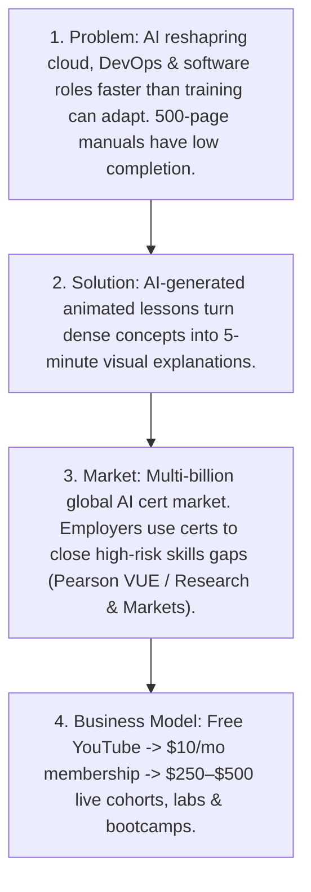

# ChatGPT Narrative & Investor Readiness Feedback Report — v1.0.0

**Date:** 2026-08-25  
**Source:** ChatGPT Web Version Review & Investor Validation Assessment  
**Review Object:** AI Certification Helper Master Narrative, 4 Core Cards, TAM/SAM/SOM Sizing, Pricing & Value Stack  
**Evaluator Scoring:**
- **Concept:** 8 / 10
- **Market Logic:** 8 / 10
- **Investor Readiness:** 6 / 10
- **Core Positioning:** *"Visual AI-powered technical education"*

---

## 1. Executive Summary & Core Thesis

ChatGPT reviewed the overall business plan narrative and confirmed strong alignment with current market trends around AI upskilling and certification demand:

> **Core Thesis:** *"AI is changing technical jobs faster than traditional training can adapt, and people need shorter, more visual, more practical learning formats."*

This core thesis is grounded in real enterprise trends and supported by prominent industry research:
1. **GOV.UK AI Labour Market Survey (2025):** Employers report major AI, cloud, and software skills gaps; certifications remain a key mechanism to validate capabilities.
2. **Pearson VUE 2026 Study:** *"Employers Use IT Certification to Close High Risk Skills Gaps and Gain Competitive Advantage, Pearson Study Finds."*
3. **Research and Markets Global Report:** *"Artificial Intelligence Certification Courses - Global Strategic Business Report"* documents a multi-billion dollar technical upskilling and AI certification market expanding rapidly.

---

## 2. What Works Well

| Dimension | Positive Signal | Real-World Grounding |
|---|---|---|
| **Problem** | 500-page manuals and 40-hour lecture courses cause severe cognitive fatigue. Fast-changing AI skills render static courses obsolete. Low completion rates plague legacy MOOCs. | Aligns with R.A.I.S.E. thesis (`raise.html`), B. and Jamal interview evidence, and enterprise survey data. |
| **Solution** | Animated, concise, visual training is strongly differentiated from monolithic text publishers and monotone webcam screencasts. | Proven by 68.5% and 66.3% view retention metrics (`comp-mvp.html`, `content-analysis.html`) and interactive storyboard MVP (`context-engineering`). |
| **Business Model** | Free YouTube content &rarr; paid Skool community &rarr; premium live cohort bootcamp is an established, proven creator-to-institution conversion funnel. | Keeps CAC at $0 while capturing top-of-funnel search intent and nurturing warm community relationships. |

---

## 3. Critical Gaps & Required Updates

### Gap 1: TAM / SAM / SOM Numbers Need Sources & Broader Definition
- **The Risk:** Stating unsourced figures like *"TAM ~25M developers, SAM ~3M cert seekers, SOM ~50k"* feels invented to investors and advisors.
- **The Fix:**
  - Broaden TAM beyond pure "software developers" to include **cloud engineers, DevOps/SREs, QA/test engineers, cybersecurity specialists, data engineers, and enterprise IT architects**.
  - Ground TAM in macroeconomic reports: Global technical upskilling and AI certification market is estimated at **several billion dollars and growing rapidly** ([Research and Markets](https://www.researchandmarkets.com/reports/6042665/artificial-intelligence-certification-courses)).
  - Anchor SAM in empirical enterprise adoption: Employers systematically using certifications to close high-risk skills gaps ([Pearson VUE 2026](https://www.pearsonvue.com/gb/en/about/news/2026/employers-use-it-certification-to-close-skills-gaps.html)) and Forward Deployed Engineer job postings surging 729% YoY (Indeed data).
  - Ground SOM as an operational execution target reachable via Rifat Erdem Sahin's compounding YouTube organic catalog and 30k professional network over 3 years.

### Gap 2: The Strongest Secret Insight Was Missing
- **The Weak Rationale:** "Videos + membership."
- **The Strong Secret:** 
  > **"AI-generated visual explanations reduce learning time for complex cloud and AI concepts by turning dense technical material into 5-minute animations."**
- **Strategic Impact:** Positioning the company around **visual AI-powered technical education** creates an authentic technological and instructional moat far superior to being "another cert-prep provider."

### Gap 3: Cohort Pricing & The 6-Step Value Stack
- **The Reality:** $250–$500 is reasonable for comprehensive certification prep, live screen-share workshops, personalized architecture unblocking, and career/recruiter support — but *not* for videos alone.
- **The Full Value Stack:**
  ```
  YouTube (Free Animated Lessons)
    └── Skool Community ($1/mo or $10/mo Peer Hub)
          └── Exam Roadmap & Digital Memory Cards ($29 Bundle)
                └── Hands-on Labs & Second Brain Presets
                      └── Live Problem-Solving Sessions (Sunday 21:00 UK)
                            └── Cohort ($250–$500 VIP / FDE Career Transformation)
  ```

---

## 4. The 4 Rewritten Core Cards



### Card 1 · Problem
> **AI is reshaping cloud, DevOps, data, and software roles faster than traditional training can keep pace. Existing certification content is long, text-heavy, and has notoriously low completion rates.**

### Card 2 · Solution
> **AI-generated animated lessons transform dense technical concepts into 5-minute visual explanations, helping professionals learn faster, retain architecture models, and prepare for high-stakes certifications.**

### Card 3 · Market
> **Rapid AI adoption is driving global demand for cloud, AI, and automation skills across a multi-billion dollar upskilling market. Employers increasingly value proctored certifications and practical proof of capability to close critical skills gaps.** *(Sources: Research and Markets, Pearson VUE 2026, GOV.UK AI Labour Market Survey 2025)*

### Card 4 · Business Model
> **Free YouTube content ($0 CAC) &rarr; $10/month Skool community membership &rarr; $29 entry exam prep bundles &rarr; $250–$500 live cohorts, hands-on labs, screen-share workshops, and FDE career accelerator bootcamps.**

---

## 5. System Implementation & Cross-Page Synchronizations

| Target File | Changes Implemented |
|---|---|
| `5_Symbols/product/vc-deck.html` | Updated Slides 1, 2, 3, 4 with the rewritten cards, secret insight, Research and Markets / Pearson VUE / GOV.UK citations, and the 6-step value stack. |
| `5_Symbols/product/idea.html` | Integrated the secret insight into the differentiation section, updated elevator pitch, and grounded TAM/SAM/SOM with external market studies. |
| `5_Symbols/product/one-pager.html` | Replaced plain-text copy-paste summary with the 4 rewritten cards, market citations, and value stack. |
| `5_Symbols/product/vc-feedback.html` | Documented ChatGPT assessment (8/10 concept, 8/10 market logic, 6/10 investor readiness) alongside VF1–VF8. |
| `5_Symbols/comp/comp-market.html` | Expanded TAM across all technical disciplines (DevOps, QA, Security, Cloud, Data, Grads) and added Research and Markets / Pearson VUE citations. |
| `5_Symbols/strategy/moat.html` | Documented "Visual AI-powered technical education" and the 5-minute animation pipeline as core defensibility. |
| `HYPOTHESIS.md` | Updated H1, H2, H5, and H6 with ChatGPT feedback citations and bumped version to **v1.240.0**. |
| `5_Symbols/product/chatgpt-investor-feedback.html` | Created dedicated interactive HTML showcase for ChatGPT review notes and actionable rubrics. |
