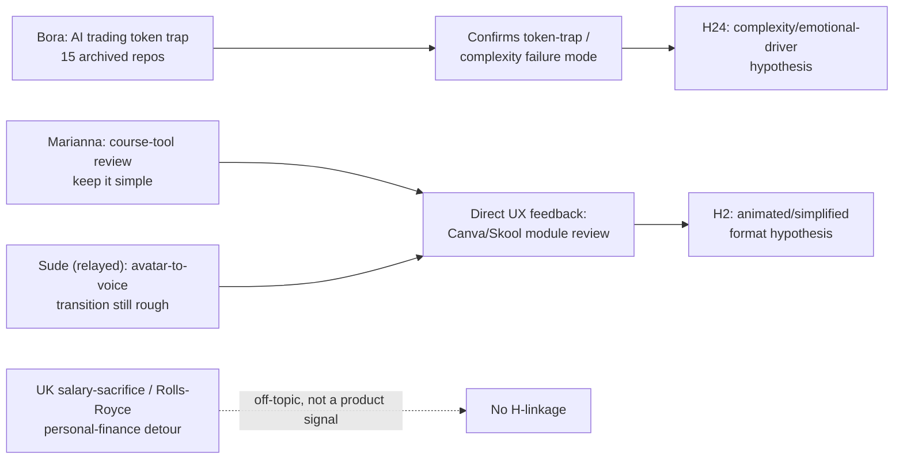

# 🎙️ AI Cohort Session 11: Edge Erosion, Salary Sacrifice, and the Token Trap

**Report Version:** 1.0.0
**Date:** 2026-09-06 (uploaded; call date as captured in source PDF)
**Source Artifact:** `3_Simulation/Cohorts/Cohort 11 - Google Docs.pdf`
**Participants:** Rifat Erdem Sahin (Founder/Host), Bora (returning member; Polymarket/prediction-market builder, UK contracting candidate), Marianna (returning member; enterprise value-perception voice)
**Mentioned off-call:** Sude (module-transition feedback), Murali (co-worker, used as a test account name only — not a participant)
**Related Hypotheses:** [H2](../5_Symbols/hypotheses/hyp-h2.html), [H24](../5_Symbols/hypotheses/hyp-h24.html), [H29](../5_Symbols/hypotheses/hyp-h29.html), [H30](../5_Symbols/hypotheses/hyp-h30.html)

Not a paid enrollment. $0 Peek / $1 Sit In do not count toward H5/H9.

---

## 1. Executive Summary

Session 11 was a three-person Sunday room (Bora, Marianna, founder) that drifted from AI-trading frustration into UK tax strategy into a live review of the collaborative course-production tool (Skool/GitHub/Canva). No new named prospect and no enrollment discussion — this session is **pure listening/product-feedback evidence**, not a funnel or revenue data point.

### Key Takeaways
1. **AI over-reliance and the "token trap" ([H24](../5_Symbols/hypotheses/hyp-h24.html)):** Bora described AI trading models that burn tokens for weeks, find no edge, and eventually advise *against* every trade because transaction fees erase the margin. Marianna named the mechanism: AI platforms are incentivized to keep users generating tokens/text rather than solving the problem directly — pen and paper gives clarity AI cannot.
2. **Founder used the confidence-score pattern as a personal tool, not just a site feature:** Rifat told Bora he runs a "business confidence score" on his own ideas to stop himself building aimlessly — the same instinct behind this repo's `business-model-sanity-check` skill and `reports/business-model-confidence-*.md` series.
3. **Collaborative course production got direct, specific feedback ([H2](../5_Symbols/hypotheses/hyp-h2.html)):** Marianna: the Canva feedback tool is clear but visual/textual density must stay low ("the human mind can only process so much at once"). Bora relayed **Sude's** standing note that the AI-avatar-to-live-voice module transition still needs to be smoother.
4. **Delivery Pilot / contractor thread continues ([H30](../5_Symbols/hypotheses/hyp-h30.html)):** Bora's stated goal is unchanged — get certified, build AI infrastructure skill, and land a Unix/AI systems contracting role in London. No new commitment beyond "continue studying."
5. **Founder listened, but the session ran mostly as a 1:1 with Bora until Marianna joined ([H29](../5_Symbols/hypotheses/hyp-h29.html)):** UK tax/salary-sacrifice detour (personal finance, not product) took roughly a third of the transcript — a scope-discipline note for future session summaries, not a business signal.

---

## 2. Participant Profiles & Discovery Signals

| Participant | Persona | Core friction | Signal for the business | Hypothesis |
| :--- | :--- | :--- | :--- | :--- |
| **Bora** | Returning member; builds AI prediction-market trading strategies; UK contracting candidate | AI models burn tokens for weeks, find no edge, then self-block every trade on fee risk; "15 private AI repos archived because they didn't make money" | Confirms the token-trap/complexity failure mode this product explicitly designs against; contracting goal unchanged | H24, H30 |
| **Marianna** | Returning member; enterprise value-perception voice | AI is not intrinsically valuable — value depends on market context; simplicity beats density | Direct, specific UX feedback on the Canva/Skool course-review tool: keep it simple | H2, H24 |
| **Rifat** | Founder / FDE contractor | Ran a live product walkthrough (Camba/Canva feedback tool) mid-session | Confirms founder already applies a "business confidence score" discipline to himself, matching the site's own sanity-check pattern | H24, H29 |

---

## 3. Verbatim Voice of Customer

**Bora — the token trap in practice**
> "The models run for weeks, burn through tokens, and then tell me to shelf the project because they can't overcome the maker/taker fees... whenever I receive a buy signal from a strategy, the AI analyzes it and says 'don't trade' because fee risks are too high. So it ends up blocking every trade!"

**Marianna — AI incentives vs. user outcomes**
> "AI platforms are incentivized to keep users consuming tokens and generating text rather than solving problems directly... Sometimes using pen and paper brings clarity that AI cannot give."

**Marianna — market value is contextual, not intrinsic**
> "Value depends on market perception. You can create tools all day, but if the market doesn't perceive or need that value right now, it won't yield results." (Bottle-of-water analogy: free at a tap, £1 in a cafe, £3 at the airport gate.)

**Marianna — course-feedback tool review**
> "The feedback tool is clear, but we need to keep the visual and textual information simple. The human mind can only process so much information at once."

**Bora — relaying Sude's feedback**
> "I saw Sude's comment on the module transition — the jump between the AI avatar and your live voice needs to be smoother. But overall, the collaborative format is great."

**Rifat — self-applied confidence score**
> "I use AI to calculate a 'business confidence score' on my ideas to stop me from building aimlessly."

**Bora — end goal unchanged**
> "My main goal is to get certified, improve my AI infrastructure skills, and land a solid Unix/AI systems contracting role in London."

---

## 4. What This Session Does and Does Not Validate

This session carries **no new named prospect, no enrollment discussion, and no revenue data**. It is qualitative product/UX feedback (course-review tool) plus a repeat confirmation of the AI-complexity friction this business's simplicity positioning is built against. Status on H2/H24/H29/H30 is unchanged — this is corroborating evidence, not a new validation event.

---

## 5. Master Action Items

Tracked on `5_Symbols/dashboard/todo.html`.

- [ ] **Course-tool simplicity pass:** Reduce visual/textual density in the Canva/Skool feedback review tool per Marianna's direct note (H2 / H24).
- [ ] **Smooth the avatar-to-live-voice module transition:** Standing item from Sude, re-raised by Bora this session (H2).
- [ ] **Keep Sunday sessions scoped to product/discovery:** Personal-finance tangents (salary sacrifice, stock picks) are fine as rapport-building but should not consume a third of a thin-room session; redirect faster next time.
- [ ] **No action needed on Bora's trading frustration** — off-thesis for this business, useful only as evidence of the token-trap pattern to design against in the certification product itself.

---

## 6. Hypothesis Linkages

- **H2:** Course-format feedback (simplicity, smoother avatar transition) is direct evidence for the animated/simplified-format hypothesis, not a new experiment result.
- **H24:** Bora's AI-trading token trap and Marianna's "AI keeps you consuming tokens" line both corroborate the emotional/complexity-driven friction premise — reinforces why the product must stay simple and outcome-focused, not feature-dense.
- **H29:** Founder ran mostly as a listener during the product walkthrough and let Marianna lead the UX critique; the personal-finance detour is a listen:speak scope note for future sessions, not a violation of the founder-as-listener premise itself.
- **H30:** Bora's contracting/certification goal is unchanged — no new commitment, no pivot.

Interactive page: `5_Symbols/cd/cohort-session-11-analysis.html`.
