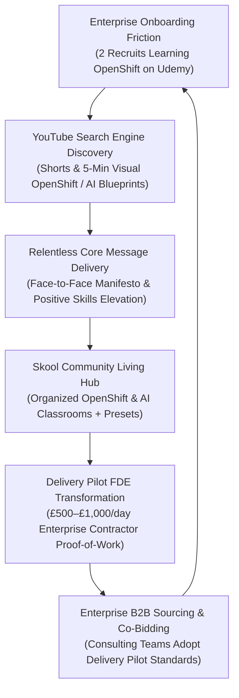

# Customer Discovery & Enterprise Training Report: OpenShift Onboarding & Findable Learning Engine v1.0.0

- **Date:** 2026-09-01
- **Authors:** AI Certification Helper Team & Founder Rifat Erdem Sahin (Pexabo Ltd)
- **Status:** Active Customer Discovery Synthesis & Strategic Engine Specification
- **Raw Discovery Record:** `3_Simulation/Interviews/interview_enterprise_onboarding_openshift_2026-09-01.md`
- **Related Pages:**
  - `5_Symbols/cd/enterprise-openshift-onboarding.html` (Enterprise OpenShift Onboarding & Content Engine)
  - `5_Symbols/growth/fast-conversion-shorts.html` (Fast-Conversion Shorts Tactic)
  - `5_Symbols/growth/face-to-face-core-message.html` (Face-to-Face Core Message)
  - `5_Symbols/strategy/positive-ai-skills-message.html` (Core Message: Positive AI Skills Elevation)
  - `5_Symbols/strategy/b2c2b-business-model.html` (B2C2B Enterprise Model)
  - `5_Symbols/growth/course-curriculum-learning-objectives.html` (5-Minute Video Curriculum & LOs)
  - `5_Symbols/product/skool-roadmap.html` (Skool Learning & Community Roadmap)
  - `HYPOTHESIS.md` (H1, H2, H4, H8, H10, H12, H14, H21, H24, H25, H29, H30)

---

## 1. Executive Summary & Workplace Discovery

On September 1, 2026, during founder **Rifat Erdem Sahin's** enterprise client contracting operations (Capgemini enterprise consulting context), two new starters / recruits shared vital feedback regarding how they navigate enterprise onboarding and upskill on enterprise container architectures (**Red Hat OpenShift / Kubernetes**).

When assigned to complex client systems, the new recruits disclosed that internal corporate documentation was insufficient to establish operational fluency. To "find their way", both recruits turned to **Udemy video courses**, specifically recommending industry-leading technical instructors:
- **Imran** (Imran Taufiq / KodeKloud & DevOps/OpenShift courses)
- **Coombes** (Richard Coombes / Enterprise Linux, Cloud & Infrastructure instructor)

This qualitative observation reveals a critical systemic truth across global IT consultancies and enterprise engineering teams: **enterprise onboarding has an acute practical vacuum**. Starters are hungry for clear, step-by-step, visual instruction that demystifies sprawling enterprise platforms without overwhelming them.

To capture this high-intent organic audience, **AI Certification Helper / Delivery Pilot** must execute a dual-engine publishing strategy:
1. **YouTube Search Engine Discoverability:** Produce bite-sized, visual OpenShift, Cloud Infrastructure, and AI Foundation shorts/videos optimized for high-volume onboarding search queries.
2. **Skool Community & Living Hubs:** Funnel viewers into an organized, easy-to-follow Skool sanctuary equipped with ready-to-run presets, architecture blueprints, and code repositories.
3. **Relentless Core Message Delivery:** Consistently communicate the **Core Message** (moving from syntax memorization to £500–£1,000+/day Forward Deployed Engineer proof-of-work, visual simplicity, and positive AI/cloud enablement) so learners stay anchored and convert naturally.

---

## 2. Structured Discovery Matrix: Workplace Verbatim vs. Strategic Execution

| Discovery Dimension | Verbatim Workplace Intel | Strategic Transformation & Platform Architecture |
| :--- | :--- | :--- |
| **Current Workaround (Watering Hole)** | *"We are learning OpenShift using Udemy courses. Everyone in the team recommended Imran and Coombes to find our way around."* | Validates that video-first, structured instructor courses are the default self-funding workaround for enterprise recruits (H4 / H24). |
| **Enterprise Onboarding Void** | New starters at tier-1 consultancies (Capgemini context) lack structured internal visual onboarding. | Opportunity for **B2C2B enterprise entry** (H12 / H21): individual recruits upskill via our content, bringing Delivery Pilot standards into enterprise client teams. |
| **Content Discoverability (Top-of-Funnel)** | Starters actively search for trusted walkthroughs when blocked. | Content **must be easily findable on YouTube** through search-optimized titles, high-retention shorts, and 5-minute modular videos (H2 / H10). |
| **Community & Learning Hub (Skool)** | Udemy provides one-way video without community collaboration or live feedback. | Bridge YouTube searchers into **Skool Living Hubs** where OpenShift & AI modules include downloadable presets, GitHub scaffolding, and peer support (H5 / H8). |
| **Core Message Alignment** | Recruits suffer from cognitive overload and tool fatigue. | Keep content **easy to follow** and relentlessly reinforce the **Core Message**: positive skills elevation, visual clarity, and verifiable proof-of-work (H24 / H30). |

---

## 3. The 3-Tier Enterprise Onboarding & Content Flywheel

### Tier 1: YouTube Search Discoverability (Top of Funnel)
- Target specific onboarding keywords: *"OpenShift Architecture Explained Simply"*, *"Kubernetes vs OpenShift for Beginners"*, *"Deploying Containerized AI Agents on OpenShift"*, *"Imran vs Real Enterprise DevOps"*.
- Use 60-second **Fast-Conversion Shorts (TzjDPMfsb3o pattern)** and 5-minute modular videos with visual animations (Roger Rabbit style / Nana visual clarity) to make complex enterprise concepts instantly understandable.

### Tier 2: Skool Living Hub & Structured Classrooms (Middle of Funnel)
- Organize video lessons into a unified **"Enterprise Cloud & OpenShift Starter Hub"** in Skool.
- Provide turnkey assets: Dockerfiles, OpenShift YAML manifests, Helm charts, and Model Context Protocol (MCP) server templates.
- Prevent fragmented forum sprawl by keeping discussion inside evergreen living hub threads.

### Tier 3: Core Message & Delivery Pilot Transformation (Bottom of Funnel)
- In every piece of media, deliver the unified **Core Message**:
  - *"We make enterprise platforms easy to follow."*
  - *"We turn syntax memorizers into £500–£1,000/day Forward Deployed Engineers with real proof-of-work."*
  - *"You don't need to struggle alone in enterprise onboarding; follow the visual roadmap."*

---

## 4. Business Model Hypothesis Mapping

- **H1 (Skills & Proof over Syntax):** Validated. Recruits need practical deployment skills on OpenShift rather than multiple-choice trivia.
- **H4 (Watering Holes & Funnel Conversion):** Strengthened. Udemy and YouTube search are the active watering holes where enterprise recruits search for answers.
- **H8 (MVP Curriculum Prioritization):** Expanded. Incorporating OpenShift containerization into the Delivery Pilot curriculum bridges enterprise cloud infrastructure with Claude/AI agent deployment.
- **H10 (MVP Video Quality & Retention):** Reinforced. Visual, high-clarity videos outperform dry enterprise documentation.
- **H12 (B2B Consulting & Enterprise Upskilling):** Progressed. Highlights organic bottom-up adoption (B2C2B) inside major consultancies like Capgemini.
- **H14 (Multi-Certification & Stack Expansion):** Validated. OpenShift and Kubernetes complement Anthropic, Microsoft, and Google AI architectures.
- **H24 (Emotional Drivers - Onboarding Anxiety):** Validated. Fear of failing probation or getting stuck on client projects drives self-directed learning.
- **H29 (Listen More Than Speak):** Practiced. Workplace observation directly informs production pipeline and content release schedule.
- **H30 (Delivery Pilot / FDE Roadmap):** Reinforced. Positions the contractor/FDE as the master practitioner who effortlessly navigates enterprise cloud platforms.

---

## 5. Immediate Action Plan

1. **Scaffold Web Page:** Create `5_Symbols/cd/enterprise-openshift-onboarding.html` detailing the discovery, content engine architecture, and OpenShift starter roadmap.
2. **Update Curriculum Blueprint:** Add OpenShift & Enterprise Container Deployment module into `5_Symbols/growth/course-curriculum-learning-objectives.html`.
3. **Register Discovery:** Update `5_Symbols/cd/archived-interview-transcripts.html`, `5_Symbols/cd/cd-interview-recording.html`, `nav.js`, and `HYPOTHESIS.md` (v1.292.0).

---
*Report published by AI Certification Helper — Customer Development Workspace*
