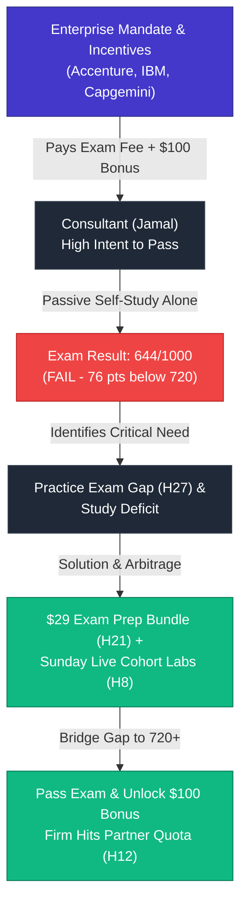

# Customer Discovery Report: Jamal Interview — Exam Failure (644/1000), Study Material Deficit & Enterprise Consulting Incentives

**Report Version:** v1.0.0  
**Date:** 2026-08-24  
**Interview Source:** `3_Simulation/Interviews/interview_jamal_2026-08-24.md`  
**Candidate:** Jamal (IT Consultant)  
**Channel:** Professional Network / Enterprise Discovery  
**Tracked Hypotheses Mapped:** [H12 (Consulting B2B Demand & Partner Incentives)](../5_Symbols/hypotheses/hyp-h12.html), [H27 (Practice Exam Gap & Failures)](../5_Symbols/hypotheses/hyp-h27.html), [H8 (Live Cohort PMF & Exam Readiness)](../5_Symbols/hypotheses/hyp-h8.html), [H21 ($29 Exam Prep Bundle Fit)](../5_Symbols/hypotheses/hyp-h21.html), [H25 (Certification Value Bifurcation)](../5_Symbols/hypotheses/hyp-h25.html), [H1 (AI Skills & Certification Demand)](../5_Symbols/hypotheses/hyp-h1.html), [H3 (Willingness to Pay / Bonus Arbitrage)](../5_Symbols/hypotheses/hyp-h3.html), [H30 (Delivery Pilot / Contractor Roadmap)](../5_Symbols/hypotheses/hyp-h30.html)

---

## 1. Executive Summary & Strategic Context

Customer discovery data captured from **Jamal**, an IT consultant at a professional services consulting firm, provides crucial empirical validation regarding exam difficulty, study deficits, and enterprise consulting incentives:

1. **Exam Difficulty & The "Studied but Not Enough" Deficit (H27 & H8):** Jamal studied for the **Claude Certified Architect Foundations exam**, but scored **644/1000** (pass threshold is 720/1000). Standard passive documentation and high-level studying are insufficient to pass Pearson VUE / Anthropic architecture exams. Candidates require realistic scenario mock exams and interactive problem-solving practice.
2. **Enterprise Consulting Sponsorship & Cash Incentives (H12):** Jamal's company paid his full exam entry fee and offers a **$100 cash bonus** upon passing. Big consulting firms (e.g., **Accenture, IBM, Capgemini**) actively incentivize staff to get certified with cash rewards and paid test vouchers to fulfill certified practitioner quota requirements in vendor partner networks (Claude Partner Network tiers).
3. **High-ROI Buyer Persona for the $29 Exam Prep Bundle (H21 & H3):** A candidate who scores 644 is in the "near-miss zone" (just 76 points short). With a guaranteed $100 employer bonus waiting upon passing, paying $29 for realistic mock exams and diagnostic review represents immediate positive ROI ($100 bonus - $29 prep = +$71 net gain).
4. **Validation of B2B Demand Channels (H12):** Proves that consulting companies are not merely passive employers; they are actively paying for exams and putting cash bounties on certifications to build firm-level capability badges.

---

## 2. Customer Discovery Qualitative Breakdown

### Profile & Intake Data
* **Candidate:** Jamal
* **Role / Background:** IT Consultant
* **Channel:** Enterprise Consulting Discovery
* **Exam Sat:** Claude Certified Architect Foundations
* **Score Result:** **644 / 1000** (Threshold: 720 / 1000 &rarr; Result: **FAIL**)
* **Employer Support:** 100% Paid Exam Entry Fee + **$100 Pass Bonus**
* **Tagged Hypotheses:** H12, H27, H8, H21, H25, H1, H3, H30

| Discovery Dimension | Verbatim / Captured Evidence | Practitioner & Business Reality |
| :--- | :--- | :--- |
| **1. Exam Failure & Study Deficit (H27 / H8)** | Scored 644/1000. *"Studied, but that was not enough to pass the Claude Certified Architect Foundations exam."* | High failure rates and near-misses occur because passive reading lacks rigorous scenario testing and question dissection. |
| **2. Employer Financial Incentives (H12 / H3)** | *"Company paid his entry exam as the company is giving $100 dollar bonus for the people who pass it."* | Enterprises create direct financial arbitrage for employees to get certified, fueling willingness to invest in prep. |
| **3. Enterprise Consulting Ecosystem (H12)** | *"Big consulting companies like Accenture, IBM, Capgemini give these incentives."* | Consulting firms systematically subsidize exams to hit partner tier quotas (Anthropic Claude Partner Network). |
| **4. Solution Gap & Willingness to Pay (H21)** | Needs targeted scenario training to bridge the 76-point gap between 644 and 720. | A $29 Exam Prep Bundle (mock questions + domain diagnostics) solves the exact pain point with positive financial ROI. |

---

## 3. Strategic Business & Hypothesis Alignment

### A. Grounding of H12 (Consulting B2B Demand & Partner Incentives)
* **Empirical Grounding:** H12 posits that IT consultancies have structural, revenue-linked incentives to pay for staff certifications. Jamal's experience directly verifies that consulting firms (Accenture, IBM, Capgemini) pay for exam vouchers and pay direct **$100 cash bonuses** to employees who pass.

### B. Validation of H27 (Practice Exam Gap) & H8 (Cohort PMF)
* **Empirical Grounding:** Jamal's 644 score provides undeniable quantitative proof that general studying is inadequate for vendor architecture tests. Candidates fail on specific domain nuances unless they have mock exams with detailed answer rationales and live scenario walkthroughs.

### C. Acceleration of H21 ($29 Exam Prep Bundle) & H3 (Willingness to Pay)
* **Empirical Grounding:** When an employer offers a $100 bonus, the employee has a frictionless ROI justification to spend $29 out-of-pocket on prep material. The prep bundle is effectively subsidized by the corporate bonus.

---

## 4. Operational Recommendations & Next Actions

1. **Incorporate 644-Near-Miss Case Study into Product Copy:**
   - Use Jamal's experience on `5_Symbols/product/exam-prep-product.html` to illustrate why general study materials fail and why domain-specific scenario questions are required.
2. **Promote the Employer Bonus Arbitrage in Marketing:**
   - Emphasize to consultants at Accenture, IBM, Capgemini, and boutique firms that investing $29 unlocks their corporate $100 bonus and voucher reimbursement.
3. **Synchronize Repository Evidence:**
   - Register Jamal interview in `5_Symbols/cd/archived-interview-transcripts.html`, `5_Symbols/cd/cd-interview-recording.html`, `5_Symbols/cd/cd-interview-pdf.html`, `5_Symbols/product/exam-performance-evidence.html`, `HYPOTHESIS.md`, and `nav.js`.

---
*Generated by AI Certification Helper — Customer Discovery Analysis Engine*
