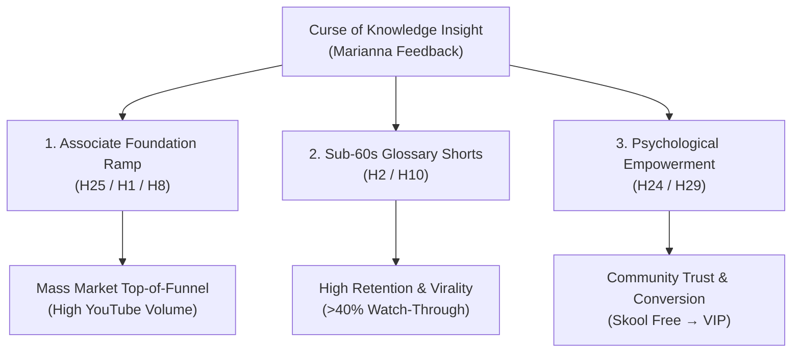

# Customer Discovery Report: Marianna Interview — Curse of Knowledge, Sub-60s First-Principles Glossary Shorts & Audience Empowerment

**Report Version:** v1.0.0  
**Date:** 2026-08-26  
**Interview Source:** `3_Simulation/Interviews/interview_marianna_2026-08-26_first_principles_glossary.md`  
**Candidate:** Marianna (Maria Testing Lead Compliance — Enterprise Testing & Compliance Lead / Skool Founding Member / H17 Corporate Collaborator)  
**Tracked Hypotheses Mapped:** [H2 (Animated & Visual Format)](../5_Symbols/hypotheses/hyp-h2.html), [H10 (Video Retention & Quality)](../5_Symbols/hypotheses/hyp-h10.html), [H24 (Emotional Drivers & Psychological Safety)](../5_Symbols/hypotheses/hyp-h24.html), [H25 (Associate vs Architect Progression)](../5_Symbols/hypotheses/hyp-h25.html), [H29 (Listen > Speak Customer Discovery Feedback)](../5_Symbols/hypotheses/hyp-h29.html), [H30 (Delivery Pilot / Contractor Toolchain)](../5_Symbols/hypotheses/hyp-h30.html), [H1 (Skills Demand)](../5_Symbols/hypotheses/hyp-h1.html), [H8 (Live Cohort PMF)](../5_Symbols/hypotheses/hyp-h8.html)

---

## 1. Executive Summary & Strategic Context

On August 26, 2026, enterprise testing and compliance lead **Marianna** provided a foundational pedagogical critique of the content strategy and audience experience:

1. **The "Curse of Knowledge" & Empathy Gap:** What sounds trivial, simple, and "like nothing" to a veteran contractor ($1.3M+ in enterprise contracts) represents a massive cognitive load for everyday learners. Content creators frequently fall into the trap of making content for themselves rather than solving what the audience is actually struggling to understand.
2. **Associate-First Entry Baseline:** The vast majority of candidates do not start at the advanced or architect level; they start with the **Associate level certification**. Content must provide a welcoming, accessible on-ramp.
3. **Sub-60s First-Principles Micro-Glossary Shorts:** Marianna recommended restructuring short-form video production into concise **glossary shorts** that deconstruct complex AI and cloud concepts down to **first principles** in **under 60 seconds**.
4. **The "Make Them Feel Smart" Psychological Standard:** Complex or condescending tutorials make learners feel unintelligent, triggering frustration, abandonment, and churn. Pedagogical success means the viewer completes the short video feeling empowered, clear-headed, and **smart**.

### Verbatim Feedback:
> **[26/08/2026, 18:15 BST] Marianna (Maria Testing Lead Compliance):**  
> *"Something that sounds simple and nothing to Rifat is a lot for the audience to capture. Most people start with the associate certificate, and Rifat should focus on making videos that are like a glossary and shorts format where he takes it to first principles and goes over them in less than a minute."*  
>  
> *"If he wants to make videos not for himself but for others, that is what the others are struggling to learn. It is not good to make them feel stupid — they should feel smart after watching the content."*

---

## 2. Customer Discovery Qualitative Synthesis

| Discovery Dimension | Verbatim / Captured Evidence | Practitioner & Pedagogical Reality |
| :--- | :--- | :--- |
| **1. The Curse of Knowledge** | *"Something that sounds simple and nothing to Rifat is a lot for the audience to capture."* | High enterprise expertise creates an invisible blind spot. Explanations must unpack hidden assumptions and basic terms before jumping to advanced orchestration. |
| **2. Target Certification Baseline** | *"Most people start with the associate certificate..."* | Product ladder must lead with Associate-level foundations (e.g. AWS Certified AI Practitioner, Claude Associate Foundations, Azure AI-900) before selling Architect Professional tiers. |
| **3. Format & Constraint** | *"...glossary and shorts format where he takes it to first principles and goes over them in less than a minute."* | Strict constraint: 1 concept &rarr; first principles reduction &rarr; visual Roger Rabbit demonstration &rarr; < 60 seconds duration. |
| **4. Audience-Centricity Mandate** | *"If he wants to make videos not for himself but for others, that is what the others are struggling to learn."* | Content topics must be driven entirely by audience search demand and beginner friction, not personal developer hobbies or niche edge cases. |
| **5. Psychological Safety & Empowerment** | *"It is not good to make them feel stupid — they should feel smart after watching the content."* | High retention and community loyalty are built when learners experience rapid dopamine hits from understanding complex ideas easily. |

---

## 3. Strategic Business & Hypothesis Alignment

### A. Major Signal for H24 (Emotional Drivers & Psychological Safety) & H29 (Listen > Speak)
- **Core Truth:** Fear of feeling inadequate or unintelligent is the primary emotional barrier stopping mid-level engineers from entering AI engineering.
- **Empirical Grounding:** Content that leaves the viewer feeling smart acts as an emotional catalyst, lowering anxiety and building trust with the founder and community.

### B. Structural Shift for H2 (Animated Format) & H10 (Video Quality & Retention)
- **Format Evolution:**
  - **Before:** Broad architectural overviews or live coding screens running 3–8 minutes.
  - **After:** 60-second micro-glossary shorts breaking down 1 term to first principles using Roger Rabbit animations and the Fal.ai ElevenLabs voice clone.

### C. Alignment with H25 (Bifurcation & Certification Progression)
- **Certification Progression:**
  1. **Level 1 (Top-of-Funnel):** Free YouTube Sub-60s Glossary Shorts covering Associate fundamentals (Tokens, Temperature, Context Windows, RAG, Embeddings, Latency).
  2. **Level 2 (Middle-of-Funnel):** 5-minute modular videos for Certified Associate Foundations.
  3. **Level 3 (High-Ticket / VIP):** Delivery Pilot live Sunday workshops and 1-on-1 presets for Forward Deployed Engineers and Architect Professional certifications.

---

## 4. The "Make Them Feel Smart" Production Playbook

### Standard 60-Second Micro-Glossary Script Structure:
1. **0:00 – 0:08 (The Hook / Common Misconception):** Call out the buzzword and dismantle the intimidating jargon ("You've heard everyone talk about *Vector Embeddings*, but what does it actually mean?").
2. **0:08 – 0:25 (The First Principle / Real-World Analogy):** Strip the math away and provide a tangible physical analogy (e.g., coordinates on a grocery store map).
3. **0:25 – 0:45 (The Technical Reality / Concrete Code/Screen):** Show the visual Roger Rabbit diagram of how LLMs use it in 2 lines of code.
4. **0:45 – 0:55 (The Empowerment Takeaway):** Summarize the core insight in one sentence so the viewer feels complete mastery ("Now when an enterprise architect asks about embeddings, you know it's just GPS coordinates for meaning").
5. **0:55 – 0:60 (Next Step / Skool Glossary Link):** "Master all 50 AI certification terms free in our Skool glossary."

---

## 5. Next Steps & Repository Implementation

1. **Update `5_Symbols/growth/content-format.html`:** Add Marianna's First-Principles Micro-Glossary Rule.
2. **Update `5_Symbols/product/dictionary.html`:** Cross-reference first-principle micro-definitions.
3. **Update `5_Symbols/cd/archived-interview-transcripts.html` and `5_Symbols/cd/cd-interview-recording.html`:** Embed discovery transcript and analysis link.
4. **Update `HYPOTHESIS.md` and `nav.js`:** Register report, bump version, and link across H2, H10, H24, H25, H29, H30.

---
*Generated by AI Certification Helper — Customer Discovery Analysis Engine*
