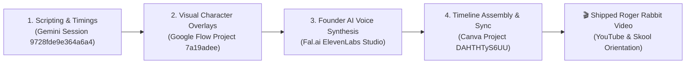

# Customer Discovery Report: Marianna Interview — AI Voice Clone, Dalinea Signature & Roger Rabbit Animation Engine

**Report Version:** v1.0.0  
**Date:** 2026-08-26  
**Interview Source:** `interview_marianna_2026-08-26.md`  
**Candidate:** Marianna (Maria Testing Lead Compliance — Enterprise Testing & Compliance Lead / Skool Founding Member / H17 Corporate Collaborator)  
**Tracked Hypotheses Mapped:** [H2 (Animated & Visual Format)](../5_Symbols/hypotheses/hyp-h2.html), [H10 (Video Retention & Format)](../5_Symbols/hypotheses/hyp-h10.html), [H17 (Corporate Pilot & Co-Design)](../5_Symbols/hypotheses/hyp-h17.html), [H28 (Creator Authority)](../5_Symbols/hypotheses/hyp-h28.html), [H29 (Listen > Speak Feedback Loop)](../5_Symbols/hypotheses/hyp-h29.html), [H30 (Delivery Pilot / Contractor Toolchain)](../5_Symbols/hypotheses/hyp-h30.html)

---

## 1. Executive Summary & Strategic Context

On August 26, 2026, enterprise testing lead and founding community collaborator **Marianna** provided a transformative customer discovery insight regarding content distinctiveness, audience retention, and brand memorability:

1. **The Audience Memorability Challenge:** In a crowded digital landscape of developer tutorials and generic AI summaries, technical content easily blends into the background. Viewers need an unmistakable signature to anchor brand recall and build long-term affinity.
2. **The Dual Signature Model (Voice + Animation):** Marianna recommended combining **Rifat Erdem Sahin's AI-cloned vocal persona** with the signature **"Dalinea" / Roger Rabbit mixed-reality animation style**.
3. **Immediate Founder Operationalization:** In direct response (upholding H29 Active Listening), the founder created and deployed a dedicated client-side voice generation repository: **`elevenlabs`** ([https://rifaterdemsahin.github.io/elevenlabs/](https://rifaterdemsahin.github.io/elevenlabs/)) powered by **fal.ai serverless GPU infrastructure** (`fal-ai/elevenlabs/tts/eleven-v3`, `turbo-v2.5`), with Azure Key Vault security and dot-acronym script formatting.

### Verbatim Feedback:
> **[26/08/2026, 10:35 BST] Marianna (Maria Testing Lead Compliance):**  
> *"Use your AI version of the voice with the signature of the dalinea as Roger Rabbit style to make it memorable for the audience."*

---

## 2. Customer Discovery Qualitative Synthesis

| Discovery Dimension | Verbatim / Captured Evidence | Practitioner & Brand Reality |
| :--- | :--- | :--- |
| **1. Audio Identity** | *"Use your AI version of the voice..."* | Generic TTS sounds sterile and breaks conversion trust; using founder's custom AI clone preserves personal vocal cadence, tone, and authority while enabling fast async production. |
| **2. Visual Signature** | *"...signature of the dalinea as Roger Rabbit style..."* | Mixed reality (real terminal / developer footage blended with kinetic cartoon/AI character animations) creates high visual contrast that stops the scroll. |
| **3. Audience Memorability** | *"...to make it memorable for the audience."* | Combining a distinct visual archetype with a distinct vocal identity makes 8-second and 60-second micro-lessons instantly recognizable across YouTube Shorts, LinkedIn, and Skool. |
| **4. Operational Toolchain** | Repository created: `elevenlabs` powered by `fal.ai` | Zero cash burn, serverless GPU synthesis with `[excited]`, `[pause]`, and `[firm]` emotion tags, integrated with Azure Key Vault (`dp-kv-deliverypilot`). |

---

## 3. Strategic Business & Hypothesis Alignment

### A. Major Signal for H2 (Animated Format) & H10 (Video Retention & Quality)
- **Empirical Grounding:** Validates that animation alone is not enough; pairing the Roger Rabbit mixed-reality animation style with the founder's distinct AI voice creates the "secret sauce" for high audience retention (>40% target under H10) and distinct channel branding.

### B. Synthesis of Founder Voice vs. Automated Voice (H5, H28, H29)
- **Resolving the Voice Paradox:** Earlier feedback (n=2, 2026-08-19) showed viewers reject generic automated TTS when selling Skool. Marianna's feedback provides the operational solution:
  - **Educational / Teaching Shorts:** Use Founder's AI Voice Clone via Fal.ai ElevenLabs + Roger Rabbit animation (high throughput, consistent energy, recognizable personality).
  - **Community Sell & Sunday Live:** 100% Raw Human Founder Voice (screen-shares, direct invites, VIP 1-1 workshops).

### C. Reinforcement of H30 (Delivery Pilot / Contractor Toolchain) & H29 (Listen > Speak)
- **Rapid Prototyping:** Demonstrates Forward Deployed Engineer agility by building and shipping `https://rifaterdemsahin.github.io/elevenlabs/` within hours of receiving customer feedback.

---

## 4. Operational Architecture: 4-Step Roger Rabbit + Fal.ai Pipeline

1. **Step 1 — Scripting:** 8-second scene pacing, teleprompter text, and emotional tags via Gemini.
2. **Step 2 — Visual Generation:** Mixed-reality character overlays and cockpit assets via Google Flow.
3. **Step 3 — Audio Synthesis:** High-expressiveness founder voice clone via **Fal.ai ElevenLabs Studio** ([https://rifaterdemsahin.github.io/elevenlabs/](https://rifaterdemsahin.github.io/elevenlabs/)).
4. **Step 4 — Assembly:** Full sync of visual assets, kinetic text, sound effects, and voiceover in Canva ([Project DAHTHTyS6UU](https://www.canva.com/design/DAHTHTyS6UU/7E3NP6xGLeudx8yntX5BNw/edit?ui=e30)).

---

## 5. Next Steps & Implementation

1. Update `5_Symbols/growth/roger-rabbit-animation.html` to document Marianna's feedback and link to the new Fal.ai ElevenLabs repo.
2. Update `5_Symbols/growth/founder-voice-skool-cta.html` to reflect the distinction between generic TTS, founder AI voice clone, and live human voice.
3. Update `HYPOTHESIS.md` and confidence scoring.
4. Record and assemble the updated Skool Orientation and pre-class tool primer videos using this pipeline.

---
*Generated by AI Certification Helper — Customer Discovery Analysis Engine*
