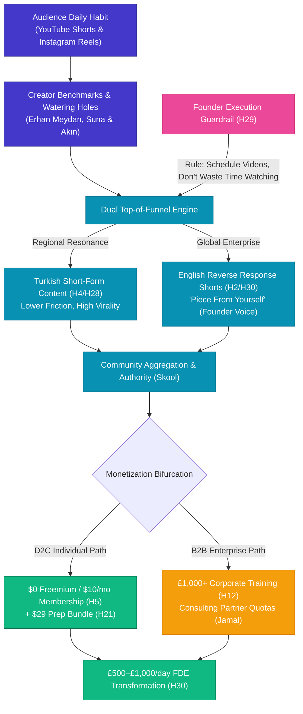

# Customer Discovery Report: Mehmet Interview — Short-Form Video Dominance, Creator Benchmarks, Reverse Response Marketing, Turkish Content Localization & Corporate vs. D2C Pricing Bifurcation

**Report Version:** v1.1.0  
**Date:** 2026-08-25  
**Interview Source:** `3_Simulation/Interviews/interview_mehmet_2026-08-25.md`  
**Candidate:** Mehmet (Founding Skool Member #1, Veteran Technical Peer & Content Strategy Critic)  
**Channel:** 1-on-1 Customer Discovery Session / Strategic Review  
**Tracked Hypotheses Mapped:** [H2 (Animated Video Micro-Format)](../5_Symbols/hypotheses/hyp-h2.html), [H3 (Willingness to Pay & Membership Model)](../5_Symbols/hypotheses/hyp-h3.html), [H4 (Community Network Retention)](../5_Symbols/hypotheses/hyp-h4.html), [H5 (Skool Freemium & Cohort Operations)](../5_Symbols/hypotheses/hyp-h5.html), [H10 (Video Quality & >40% Retention Floor)](../5_Symbols/hypotheses/hyp-h10.html), [H12 (Enterprise Consulting B2B Demand)](../5_Symbols/hypotheses/hyp-h12.html), [H21 ($29 Exam Prep Bundle Fit)](../5_Symbols/hypotheses/hyp-h21.html), [H24 (Attention Scarcity & Cognitive Load)](../5_Symbols/hypotheses/hyp-h24.html), [H28 (YouTube Engagement Rate Benchmark)](../5_Symbols/hypotheses/hyp-h28.html), [H29 (Listen > Speak & Production Guardrails)](../5_Symbols/hypotheses/hyp-h29.html), [H30 (Delivery Pilot FDE Roadmap & Reverse Marketing)](../5_Symbols/hypotheses/hyp-h30.html)

---

## 1. Executive Summary & Strategic Context

In an extensive customer discovery and strategic content review session, founding member **Mehmet** (the first organic sign-up on the Delivery Pilot Skool community and long-time observer of founder Rifat Erdem Sahin's $1.3M+ enterprise IT contracting track record) provided crucial feedback regarding content consumption formats, language strategy, creator benchmarks, pricing elasticity, and founder productivity:

1. **Short-Form & Micro-Content Supremacy ("1k Short vs. 3dk Course" — H2 / H10):**
   - Candidate is an active consumer of YouTube Shorts and Instagram Reels.
   - Contrasts **"1k short versus 3dk course"** (1-minute hook vs. 3-minute or multi-minute course module). Attention spans demand 30–60 second punchy, high-density hooks before learners commit to deep architectural modules.
   - Emphasizes that organic shorts must have **"a piece from yourself"** (authentic founder presence, personal voice, and lived contractor experience), confirming the Founder-Voice SOP.
2. **Turkish Language AI Content Strategy (H4 / H28 / H30):**
   - **Recommendation:** *"He mentioned I should do the content in Turkish."*
   - Explains that the Turkish developer and IT engineering community has an intense appetite for advanced AI, agentic systems, and cloud architecture, but is underserved by high-caliber native-language content.
   - Producing Turkish short-form videos and technical breakdowns captures high-velocity organic reach, creates immediate regional trust, and establishes an authoritative bridge into global enterprise contracting.
3. **Creator Benchmarks & Watering Holes (Erhan Meydan, Suna & Akın):**
   - Identifies active creator watering holes where target technical audiences consume AI news:
     - **Erhan Meydan:** Daily AI news, model breakthroughs, and real-time tooling analysis.
     - **Suna & Akın'ın AI Channels:** Practical Turkish AI tooling and application tutorials.
   - Validates that audience attention clusters around fast-moving AI news and practical workflow automation.
4. **Strategic Validation of Reverse Response Marketing (H30 / H28):**
   - Strongly endorses **Reverse Response Marketing** on popular and trending topics.
   - Strategy: Identify trending videos from high-traffic creators (Erhan Meydan, Suna & Akın, top global AI channels), reverse the conventional theoretical premise, inject enterprise Forward Deployed Engineer (FDE) realities, and publish high-retention animated breakdowns leading into Skool.
5. **Monetization Bifurcation: D2C Membership vs. £1,000 Corporate B2B (H3 / H5 / H12):**
   - **Critical Pushback on £1,000 D2C Pricing:** Mehmet explicitly warns that individual learners and engineers will balk at £1,000 upfront fees out-of-pocket.
   - **Corporate-Only £1,000+ Budget:** States definitively that a **£1,000 ticket size strictly belongs to the corporate/B2B side** (enterprise employers, IT consulting firms like Accenture/IBM/Capgemini subsidizing certification quotas).
   - **D2C Focus on Membership:** Recommends keeping individual retail access focused on low-friction **recurring membership** ($10/mo Skool subscription / $29 prep bundle).
6. **Founder Productivity & Video Scheduling Mandate (H29 / H18):**
   - Direct operational directive: **"Spend time to schedule more videos, do not watch videos and waste time."**
   - Warns against the passive media consumption trap: founder must dedicate calendar blocks to batch-producing, automating, and scheduling video releases rather than passively browsing social feeds.

---

## 2. Customer Discovery Qualitative Breakdown

### Profile & Intake Data
* **Candidate:** Mehmet
* **Role / Background:** Technical Veteran, Long-time Peer & Founding Community Member #1
* **Channel:** 1-on-1 Customer Discovery Call
* **Primary Media Habit:** YouTube Shorts, Instagram Reels, Daily AI News
* **Creator Benchmarks Cited:** Erhan Meydan, Suna & Akın
* **Tagged Hypotheses:** H2, H3, H4, H5, H10, H12, H21, H24, H28, H29, H30

| Discovery Dimension | Verbatim / Captured Evidence | Practitioner & Business Reality |
| :--- | :--- | :--- |
| **1. Micro-Content & Shorts Dominance (H2 / H10)** | *"Need to focus on shorts. He watches Suna ve Akın'ın AI focused channels. Mentions organic short videos are important — have a piece from yourself. 1k short versus 3dk course."* | Modern technical learners discover content through 60s Shorts/Reels; authentic founder presence ("piece from yourself") builds trust over sterile faceless AI reels. |
| **2. Turkish Content Strategy (H4 / H28 / H30)** | *"He mentioned I should do the content in Turkish."* | Turkish tech community represents an explosive, high-affinity top-of-funnel audience; localized content eliminates language friction and builds high creator loyalty. |
| **3. Reverse Response Marketing (H30 / H28)** | *"Focus on reverse response marketing with popular videos / sometimes long form."* | Validates the active MVP iteration pipeline (`aug-video-animation-2`): deconstruct high-ranking videos, reverse mainstream assumptions with FDE reality, and funnel to Skool. |
| **4. Creator Watering Holes & News (H28)** | *"He is watching shorts and instagram videos on youtube and instagram. Example channel he watches is Erhan Meydan as he watches the news in the AI space."* | AI practitioners stay current via agile daily news creators (Erhan Meydan) rather than waiting for annual textbook updates. |
| **5. Pricing Bifurcation: Membership vs Corporate (H3 / H12)** | *"Focus on membership. He is critical on 1000 pound payment — only that could work on the corporate side."* | D2C retail learners resist £1,000 upfront fees; recurring $10/mo membership maximizes adoption, while £1,000+ packages are reserved for B2B/consulting sponsorship. |
| **6. Founder Time Discipline (H29 / H18)** | *"Spend time to schedule more videos, do not watch videos and waste time."* | Operational imperative: replace passive browsing with disciplined batch production, automated scheduling, and multi-channel publishing. |

---

## 3. Strategic Business & Hypothesis Alignment

### A. Optimization of H2 (Animated Format) & H10 (Video Quality Floor)
* **The "1k Short vs. 3dk Course" Model:** Micro-shorts (30–60 seconds) act as the primary discovery hook. Once hooked, learners transition to 3–5 minute modular lessons on YouTube and live labs in Skool.
* **Authenticity Mandate ("Piece from Yourself"):** Matches the repository's Voice SOP (`5_Symbols/growth/founder-voice-skool-cta.html`). AI voiceover explains technical concepts, while founder face/voice delivers personal takes and calls to action.

### B. Turkish Content Localization & Dual-Funnel Architecture (H4 / H28 / H30)
* **The Turkish Opportunity:** Erhan Meydan and Suna & Akın demonstrate massive, highly engaged Turkish-speaking audiences hungry for actionable AI tooling. By releasing Turkish-language shorts and introductory modules, the platform captures rapid, high-retention top-of-funnel traffic.
* **Monetization Alignment:** While Turkish top-of-funnel drives volume and community vitality, core high-rate £500–£1,000/day contractor transformation frameworks and Pearson VUE certification prep operate bilingually, bridging regional talent to international consulting markets.

### C. Solidification of H3 (Willingness to Pay) & H12 (B2B Consulting Channel)
* **Resolving the £1,000 Ticket Ambiguity:** Confirms that £1,000+ price points must not be placed on individual D2C self-pay students. D2C converts on accessible recurring memberships ($10/mo) and stepping stone prep bundles ($29).
* **Corporate B2B Budget Alignment:** Validates findings from candidate Jamal (IT Consultant at Accenture/IBM/Capgemini ecosystem), where £1,000+ certification packages are covered by corporate L&D budgets and partner voucher programs.

### D. Grounding of H30 (Delivery Pilot Roadmap) & Reverse Response Marketing
* **Benchmark Integration:** Tracking Erhan Meydan and Suna & Akın provides real-time trend signals. When these channels cover a new AI model release or workflow, we immediately produce a 60-second Reverse Response Short contrasting consumer hype with enterprise architectural reality (security, cost, MCP protocols, deterministic JSON).

### E. Enforcement of H29 (Listening Loop) & Founder Bandwidth
* **Founder Productivity Rule:** Eliminate media consumption leakage. Founder time is allocated to content creation, batch rendering, and scheduling across YouTube, Instagram, and LinkedIn.

---

## 4. Ranked Value & Scoring of Mehmet's Recommendations

To provide clear operational prioritization for the single founder, all recommendations sourced from Mehmet across customer discovery iterations have been quantitatively scored using a standardized 4-dimension, 100-point rubric:

### Scoring Dimensions & Weightings
1. **Strategic Impact (30%):** Direct revenue contribution, business model robustness, and structural defensibility.
2. **Implementation Feasibility (25%):** Resource efficiency and ease of execution within single-founder bandwidth (~65h/wk).
3. **Audience Reach & Velocity (25%):** Top-of-funnel growth velocity, virality, and immediate engagement generation.
4. **Competitive Moat (20%):** Long-term asymmetry, barrier to entry, and differentiation against generic creators.

**Formula:**  
$$\text{Composite Score} = [(\text{Impact} \times 0.30) + (\text{Feasibility} \times 0.25) + (\text{Reach} \times 0.25) + (\text{Moat} \times 0.20)] \times 10$$

### Ranked Recommendations Scorecard

| Rank | Strategic Recommendation | Sourced Hypotheses | Strategic Impact (30%) | Feasibility (25%) | Reach / Velocity (25%) | Moat (20%) | Composite Score (/100) | Priority Tier | Operational Action & Execution Path |
| :---: | :--- | :---: | :---: | :---: | :---: | :---: | :---: | :---: | :--- |
| **#1** | **"1k Short vs. 3dk Course" & Authentic Founder Voice ("Piece from Yourself")** | H2, H10 | 9.5 | 9.0 | 9.5 | 9.0 | **92.75 / 100** | 🟢 **Tier 1 (Immediate)** | Standardize 60s vertical Shorts/Reels with 10s personal founder face/voice clips on every core topic. |
| **#2** | **Monetization Bifurcation ($10/mo D2C Skool vs. £1,000+ Corporate B2B)** | H3, H12 | 9.5 | 9.5 | 8.0 | 9.0 | **90.25 / 100** | 🟢 **Tier 1 (Immediate)** | Lock D2C at $0–$10/mo & $29 prep bundles; restrict £1,000–£2,500 exclusively to enterprise L&D budgets. |
| **#3** | **Batch Production & Automated Scheduling Mandate (No Passive Browsing)** | H29, H18 | 9.0 | 9.0 | 8.5 | 8.5 | **87.75 / 100** | 🟢 **Tier 1 (Immediate)** | Block 4h weekly calendar slots strictly for batch rendering & scheduling in Hootsuite/YouTube Studio. |
| **#4** | **Reverse Response Marketing on Benchmark Channels (Erhan Meydan, Suna & Akın)** | H30, H28 | 8.5 | 8.5 | 9.0 | 9.0 | **87.25 / 100** | 🟡 **Tier 2 (High Yield)** | Weekly trend tracking on top AI news; publish contrarian 60s FDE architecture breakdowns within 48h of trend spikes. |
| **#5** | **Turkish Language AI Content Strategy (Localized Video Funnels & Turkish Shorts)** | H4, H28, H30 | 7.5 | 8.5 | 9.5 | 8.5 | **84.50 / 100** | 🟡 **Tier 2 (High Yield)** | Deploy dual-track content: Turkish short-form hooks for regional viral reach + English core for global high-rate contracting. |
| **#6** | **Pedagogical Clarity & Rating Penalty Warning ("Eğitim veriyon...")** | H8, H29 (R-014) | 8.5 | 8.0 | 7.5 | 8.0 | **80.25 / 100** | 🟡 **Tier 2 (High Yield)** | Enforce Anna's 5-10-5 sprint pacing and "Check & Help" progress telemetry to eliminate comprehension drops. |
| **#7** | **$10,000 Institutional Course Free YouTube Release (Authority Arbitrage)** | H1, H5, H30 | 8.0 | 7.5 | 8.0 | 8.5 | **79.75 / 100** | ⚪ **Tier 3 (Planned)** | Publish complete unredacted course playlists on YouTube to create unmatched goodwill and brand authority. |
| **#8** | **Institutional Proctored Certification Vetting as Enterprise Hiring Filter** | H1, H12, H25 | 7.5 | 7.0 | 7.0 | 8.0 | **73.50 / 100** | ⚪ **Tier 3 (Planned)** | Frame exam badges as mandatory vetting filters for government MSPs and enterprise contractor tenders. |

---

## 5. Operational Next Actions

1. **Implement "1k Short vs 3dk Course" Content Pipeline:**
   - In `aug-video-animation-2`, produce 60-second vertical Shorts for every 5-minute modular course topic.
   - Always include a 10-second personal founder clip or recorded voiceover ("piece from yourself").
2. **Launch Turkish Short-Form Pilot:**
   - Script and render a 3-part Turkish short series on agentic engineering workflows, referencing common questions seen in Erhan Meydan / Suna & Akın communities.
3. **Setup Reverse Response Trend Watchlist:**
   - Monitor Erhan Meydan and Suna & Akın video releases weekly to extract contrarian engineering angles.
4. **Lock Pricing Architecture:**
   - D2C: Standard $0 / Premium $10/mo / VIP $250/yr (Freemium ramp) and $29 Exam Prep Bundle.
   - B2B / Enterprise: £1,000–£2,500 bespoke corporate cohorts and partner team upskilling.
5. **Publish Schedule Discipline in Weekly Cadence:**
   - Integrate batch video scheduling into `5_Symbols/dashboard/weekly-todos.html` and `5_Symbols/dashboard/content-kanban-release-schedule.html`.
6. **Synchronize Repository Hubs:**
   - Register Mehmet's session across `5_Symbols/cd/archived-interview-transcripts.html`, `5_Symbols/cd/cd-interview-recording.html`, `5_Symbols/cd/cd-interview-pdf.html`, `5_Symbols/growth/reverse-response-marketing.html`, `HYPOTHESIS.md`, and `nav.js`.

---
*Generated by AI Certification Helper — Customer Discovery Analysis Engine*
