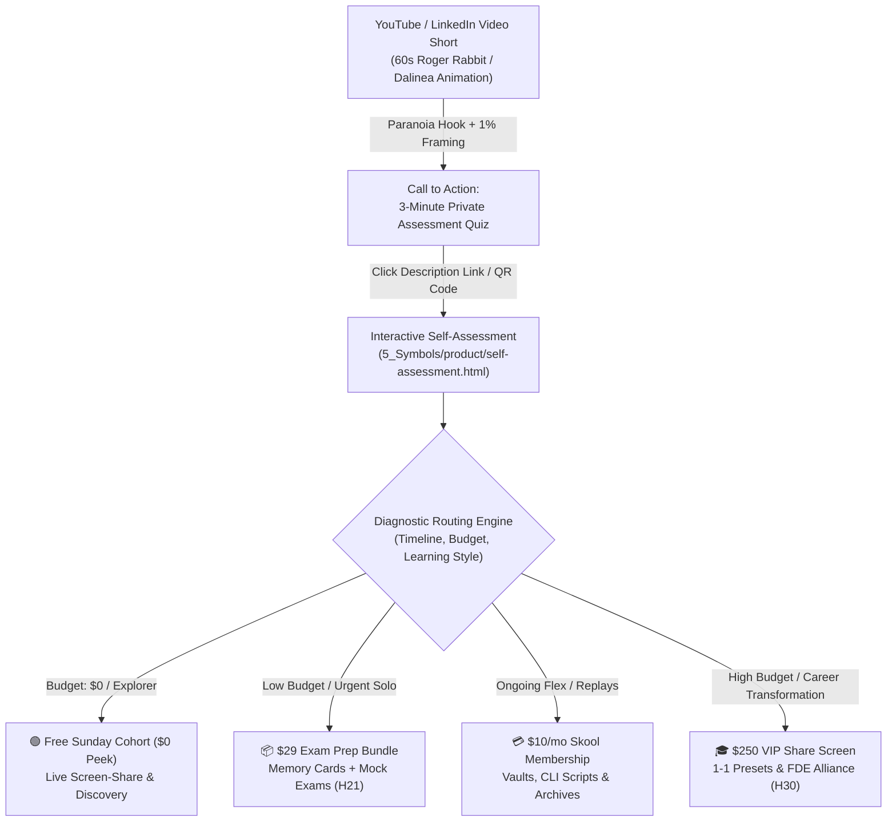

# Customer Discovery & Marketing Tactic Report: Private Quiz Assessment Lead Magnet — Psychological Persuasion Engineering, Video Hook Architecture & Diagnostic Routing

**Report Version:** v1.0.0  
**Date:** 2026-08-26  
**Source Discovery Data:** `3_Simulation/Interviews/interview_feedback_private_quiz_assessment_2026-08-26.md`  
**Candidates / Contributors:** Brian (Enterprise Systems Architect) & Marianna (Enterprise Testing & Compliance Lead)  
**Channel:** WhatsApp / Delivery Pilot Skool Founding Member Network  
**Benchmark Media:** `WhatsApp Video 2026-08-26 at 14.21.30.mp4` (CIA-Style Private Quiz Assessment Video Tactic)  
**Tracked Hypotheses Mapped:** [H2 (Animated Video & Micro-Format)](../5_Symbols/hypotheses/hyp-h2.html), [H4 (Acquisition Funnel & Conversion)](../5_Symbols/hypotheses/hyp-h4.html), [H5 (Skool Freemium & Cohort Operations)](../5_Symbols/hypotheses/hyp-h5.html), [H10 (Content Quality Floor & Retention)](../5_Symbols/hypotheses/hyp-h10.html), [H21 ($29 Exam Prep Bundle & Diagnostic Routing)](../5_Symbols/hypotheses/hyp-h21.html), [H24 (Cognitive Friction & Fear of Obsolescence)](../5_Symbols/hypotheses/hyp-h24.html), [H25 (Applied AI Judgment vs Rote Trivia)](../5_Symbols/hypotheses/hyp-h25.html), [H28 (Social Media Engagement & Lead Capture)](../5_Symbols/hypotheses/hyp-h28.html), [H29 (Listen > Speak & Customer Co-Creation)](../5_Symbols/hypotheses/hyp-h29.html), [H30 (Delivery Pilot FDE Contractor Roadmap)](../5_Symbols/hypotheses/hyp-h30.html)

---

## 1. Executive Summary & Synthesis

In ongoing Customer Discovery on top-of-funnel conversion mechanics and interactive onboarding, core community contributors **Brian** and **Marianna** delivered converging, actionable feedback:

1. **The Diagnostic Precondition (Brian's Insight):**
   - Engineers and technical professionals suffer from inertia. They do not enroll in cohorts or purchase prep products during passive browsing.
   - Action is triggered only when they hit an explicit benchmark or failure point (*"People enter the courses when audience fails"* — Brian v1.1 interview).
   - Providing a rapid, objective, and private diagnostic quiz establishes their baseline skill gap and creates the psychological readiness to seek structured guidance.

2. **The Engagement & Memorability Imperative (Marianna's Insight):**
   - In a crowded feed of generic AI tutorials, static advice gets ignored.
   - Videos must combine distinctive visual/auditory signatures with an immediate call to interactive participation (e.g., taking an instant diagnostic assessment) rather than passive viewing.

3. **Strategic Video Lead Magnet Mandate:**
   - **Create a dedicated video on a quiz for assessment** that serves as an ultra-high-converting lead magnet.
   - Deconstruct and deploy the persuasion engineering of top-performing assessment videos (such as the CIA Private Quiz Tactic benchmark) to route prospects into our interactive [Self-Assessment](../../5_Symbols/product/self-assessment.html) and the Delivery Pilot Skool ecosystem.

---

## 2. Benchmark Media Analysis: The "Private Quiz Tactic"

### 🎙️ Video Transcript (`WhatsApp Video 2026-08-26 at 14.21.30.mp4`)

> "...and that they are going off the script. If you haven't discovered your secret spy superpower, then somebody else might be using theirs against you. CIA teaches us that there are only three types of people in the world: those who motivate, those who manipulate, and those who are being controlled by one of the other two.
> 
> I created a 3-minute CIA-style quiz to help you unlock your secret psychological advantage and identify your hidden blind spot. All you have to do is click on the first link in the description below or scan the QR code on your screen, and you'll be taken directly to your private quiz.
> 
> This test was developed to help you weaponize your natural-born gifts and use them to get ahead of 99% of people in power, wealth, and purpose. It was also designed to make sure that you can protect yourself against those who would use their skills against you.
> 
> I want you to discover your secret spy superpower and use it for good before somebody else uses their power against you, and to get..."

---

## 3. Consumer Psychological Engineering Breakdown

The benchmark video script is a masterclass in **lead magnet persuasion engineering**. Below is the detailed breakdown of the seven core tactical levers and how each applies to AI Certification & Contractor Development:

| # | Tactical Mechanism | Psychological Mechanism & Consumer Driver | Application to AI Certification & Forward Deployed Engineers |
| :-: | :--- | :--- | :--- |
| **1** | **The Paranoia Hook & Loss Aversion** | *"If you haven't discovered your superpower, somebody else is using theirs against you."* Triggers intense loss aversion and competitive anxiety. Inaction is framed not merely as stagnation, but as active vulnerability. | *"If you haven't mastered enterprise AI swarm architecture, junior developers using agentic tools are already replacing your manual coding hours."* |
| **2** | **High-Authority Tradecraft Framing** | *"CIA teaches us..."* / *"CIA-style quiz"* / *"Secret spy superpower"*. Exploits the halo effect of elite institutional mastery. | Leverages $1.3M+ enterprise IT contractor pedigree (Pexabo Ltd), Tier-1 Anthropic partner standards, and production FDE architecture. |
| **3** | **Tri-Partite Identity Polarization** | Divides humanity into: (1) Motivate, (2) Manipulate, (3) Controlled victims. Forces an existential crisis where taking the quiz is the only way to avoid the victim category. | (1) Forward Deployed AI Architects (£1,000/day), (2) Prompt tinkerers running syntax scripts, (3) Displaced developers whose legacy code is automated. |
| **4** | **Low-Friction Micro-Commitment** | *"3-minute quiz"* / *"Click first link or scan QR code"*. Removes cognitive dread by establishing a minimal time investment. | 3-question diagnostic on [Self-Assessment](../../5_Symbols/product/self-assessment.html) with immediate recommendation without forced email walls. |
| **5** | **Exclusivity & Curiosity Labeling** | *"Private quiz"*, *"Secret psychological advantage"*, *"Hidden blind spot"*. Leverages the Barnum Effect; individuals crave private, customized self-knowledge. | Discover your **AI Architectural Superpower** and identify the **Cost Trap Blind Spot** holding your day rate back. |
| **6** | **The 1% Elite Outcome Promise** | *"Weaponize natural-born gifts to get ahead of 99% of people in power, wealth, and purpose."* Sells status, autonomy, and asymmetric leverage. | Transitioning from commoditized syntax memorization into the top 1% of autonomous Forward Deployed AI Engineers. |
| **7** | **Dual Justification (Shield + Sword)** | Offense (*"get ahead of 99%"*) + Defense (*"protect yourself against those using skills against you"*). Appeals simultaneously to risk-seeking maximizers and risk-averse protectors. | Offensive leverage (bidding £1,000/day enterprise AI tenders) and defensive protection (shielding your contract from corporate AI downsizing). |

---

## 4. End-to-End Funnel Architecture

---

## 5. Production Action Plan

1. **Deploy Dedicated Tactic Page:** Publish `5_Symbols/growth/private-quiz-lead-magnet-tactic.html` featuring full video storyboard, psychological analysis, and interactive assessment preview.
2. **Update Self-Assessment:** Re-align `5_Symbols/product/self-assessment.html` copy with the 3-minute diagnostic superpower/blind-spot framing.
3. **Produce Video Short (`aug-video-animation-2`):** Assemble 60-second video combining Dalinea visual animation, Fal.ai Founder Voiceover Clone, on-screen QR code, and description link.
4. **Update Repository Indices:** Synchronize `HYPOTHESIS.md` (H2, H4, H5, H10, H21, H24, H28, H29, H30), `5_Symbols/growth/marketing-tactics.html`, `5_Symbols/cd/archived-interview-transcripts.html`, and `nav.js`.

---
*Customer Development & Marketing Operations Report · AI Certification Helper*
