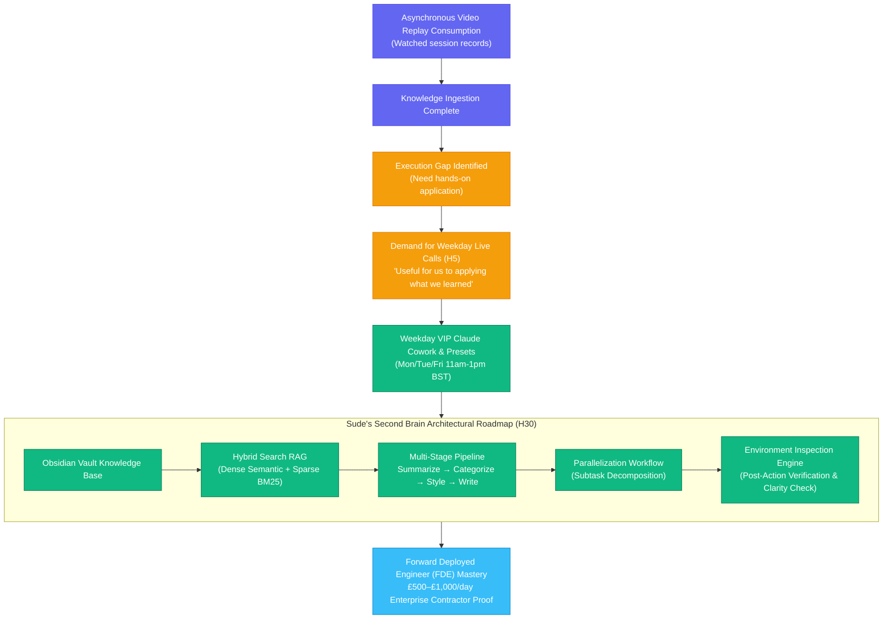

# Customer Discovery Report: Sude Interview — Weekday Cohort Application, Obsidian Second Brain Hybrid RAG & Parallelized Agent Workflows

> [!NOTE]
> **Superseded by [v1.1.0](customer-discovery-sude-unal-interview-v1.1.0.md)** (2026-08-31): Updated with Sude's academic lab feedback, demonstrating Second Brain / AI Agent thought leadership with university faculty and multi-user knowledge graph ontology analysis.

**Report Version:** v1.0.0 (Historical)  
**Date:** 2026-08-27  
**Interview Source:** `3_Simulation/Interviews/interview_sude_unal_2026-08-27.md`  
**Candidate:** Sude (Founding Cohort Member, AI & Software Practitioner)  
**Channel:** Skool Community / Direct Message Discovery Exchange  
**Tracked Hypotheses Mapped:** [H4 (Acquisition Funnel & Conversion)](../5_Symbols/hypotheses/hyp-h4.html), [H5 (Skool Freemium & Cohort Operations)](../5_Symbols/hypotheses/hyp-h5.html), [H8 (Exam-Ready PMF & Hands-on Labs)](../5_Symbols/hypotheses/hyp-h8.html), [H10 (Content Quality Floor & Architectural Depth)](../5_Symbols/hypotheses/hyp-h10.html), [H24 (Cognitive Load & Execution Gap)](../5_Symbols/hypotheses/hyp-h24.html), [H29 (Listen > Speak & Feedback Integration)](../5_Symbols/hypotheses/hyp-h29.html), [H30 (Delivery Pilot FDE Roadmap & Second Brain Toolchain)](../5_Symbols/hypotheses/hyp-h30.html)

---

## 1. Executive Summary & Strategic Context

On August 27, 2026 at 17:44 BST, founding cohort member **Sude** provided comprehensive qualitative customer discovery feedback after finishing the asynchronous session recordings. Her feedback delivers critical operational and technical validation across three core domains:

1. **Demand for Mid-Week Application Calls (H5 / H30 / H4):**
   - Sude highlighted an essential learning dynamic: watching session recordings asynchronously provides theoretical grounding, but **weekday live calls are critical for practical implementation** (*"I think that during the week calls would be useful for us to applying what we've learned from you... I will definetly schedule my time for next weeks into weekday sessions"*).
   - This directly validates the founder's recent calendar adjustment introducing dedicated **weekday VIP Claude Cowork / 1-on-1 application slots** alongside the Sunday master cohort.

2. **Obsidian Second Brain + Hybrid RAG Integration (H30):**
   - Sude actively maintains a personal Second Brain in Obsidian and is building an integrated Retrieval-Augmented Generation (RAG) system using **Hybrid Search** (combining dense vector semantic embeddings with sparse BM25/keyword indexing).
   - Validates the enterprise relevance of the **Second Brain Architectural Preset** (`5_Symbols/strategy/second-brain.html`) as a high-value tool for Forward Deployed Engineers (FDEs).

3. **Multi-Agent Parallelization & Environment Inspection Architecture (H10 / H30 / H29):**
   - Sude outlined her existing multi-stage processing pipeline:
     $$\text{Summarize} \longrightarrow \text{Categorize} \longrightarrow \text{Format to Proper Style} \longrightarrow \text{Write to File}$$
   - She identified two high-level architectural improvements:
     - **Parallelization Workflow:** Separating monolithic tasks into concurrent subtasks (fan-out / fan-in) to enhance AI insight depth and response quality.
     - **Environment Inspection & Post-Action Verification:** Adding an automated verification layer after tool actions (*"updating the files with respect to the last version of the chats and verify them if they are in the correct version in terms of clarity"*).

---

## 2. Customer Discovery Qualitative Breakdown

### Profile & Intake Data
* **Candidate:** Sude
* **Role / Persona:** Founding Cohort Member, AI & Software Practitioner (Persona 2 & 4: Practitioner & Forward Deployed Engineer)
* **Channel:** Skool Community Direct Message Exchange
* **Primary Media Habit:** Asynchronous video catch-up followed by active weekday hands-on coding
* **Tagged Hypotheses:** H4, H5, H8, H10, H24, H29, H30

| Discovery Dimension | Verbatim / Captured Evidence | Practitioner & Business Reality |
| :--- | :--- | :--- |
| **1. Asynchronous Consumption to Live Action (H5 / H24)** | *"Yess I've watched the session records it just finished. I think that during the week calls would be useful for us to applying what we've learned from you."* | High engagement with asynchronous recordings creates immediate demand for hands-on execution and live troubleshooting during the week. |
| **2. Weekday Commitment & Scheduling (H5 / H30)** | *"...I will definetly schedule my time for next weeks into weekday sessions😊🙏"* | Confirms that students will structure work schedules around mid-week co-working sessions to get unblocked by the founder. |
| **3. Second Brain Hybrid RAG (H30)** | *"Actually I have some todo list for my second brain in obsidian, I want to integrate RAG system into it with hibrit search."* | Validates student enthusiasm for enterprise-grade local knowledge retrieval (dense vector embeddings + BM25 keyword search) in Obsidian. |
| **4. Multi-Stage Pipeline & Parallelization (H10 / H30)** | *"Or I have a system for it like (summarize->categorize it-> turn them into proper style-> write to file) maybe I need to extend this with Parallellization Workflow for seperating tasks into subtasks for better ai insights and outcomes..."* | Moves beyond simple prompt chokepoints into agentic subtask decomposition and fan-out/fan-in parallel workflows. |
| **5. Environment Inspection & Post-Action Verification (H29 / H30)** | *"...and the other idea is integrating Environment Inspection for verification after the action \*after updating the files with respect to the last version of the chats and verify them if they are in the correct version in terms of clearity or ect.\*"* | Implements automated post-action testing and verification, eliminating hallucinations and ensuring deterministic codebase state. |

---

## 3. Strategic Business & Hypothesis Alignment

### A. Impact on H5 (Cohort Operations & Engagement) & H4 (Acquisition)
* **Replay-to-Live Funnel:** Validates that members who cannot make Sunday live sessions still derive massive value from recordings and use them as a springboard into weekday live sessions.
* **Weekday Retention Driver:** Offering structured mid-week implementation workshops increases active weekly retention and accelerates student project completion.

### B. Impact on H30 (Delivery Pilot Roadmap & FDE Toolchains)
* **Second Brain as Flagship Preset:** Sude's explicit focus on Obsidian, Hybrid RAG, and agent parallelization confirms that cohort members want to master real-world practitioner workflows rather than abstract exam trivia.
* **Verification & Safety Protocols:** Sude's suggestion for *Environment Inspection* mirrors enterprise agent safety patterns (e.g. Anthropic Model Context Protocol, git-based verification, diff checks), reinforcing the practical curriculum.

---

## 4. Concrete Action Items & Sunday/Weekday Cohort Curriculum Integration

1. **Incorporate Sude's Parallelization & Inspection Architecture into Weekday Presets:**
   - Add a concrete tutorial and code snippet for the **Sequential Multi-Stage Pipeline** (`summarize -> categorize -> format -> write`).
   - Demonstrate **Subtask Parallelization** using Python async / Anthropic Tool Calling.
   - Showcase **Environment Inspection** (reading updated files, verifying syntax and clarity before completing agent turns).
2. **Promote Weekday Co-Working Sessions in Skool:**
   - Highlight the upcoming weekday calendar blocks (e.g., Monday VIP Claude Cowork, AI Security & Environment workshops) as dedicated spaces to implement Second Brain RAG pipelines.
3. **Update Discovery Repositories & Transcripts:**
   - Link interview record `3_Simulation/Interviews/interview_sude_unal_2026-08-27.md` in `archived-interview-transcripts.html` and `cd-interview-recording.html`.
   - Cross-reference in `HYPOTHESIS.md` and bump tracker version.

---
*Report Generated by AI Certification Helper — Customer Discovery Workspace*
